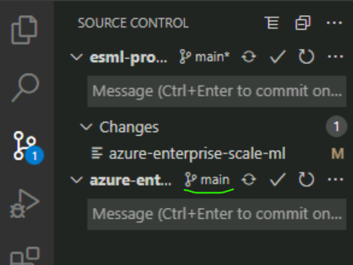
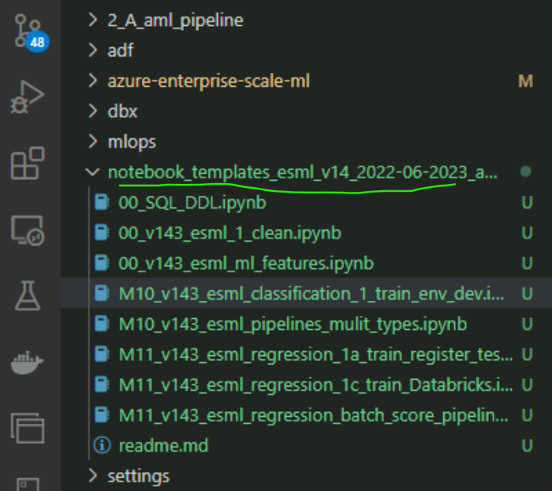
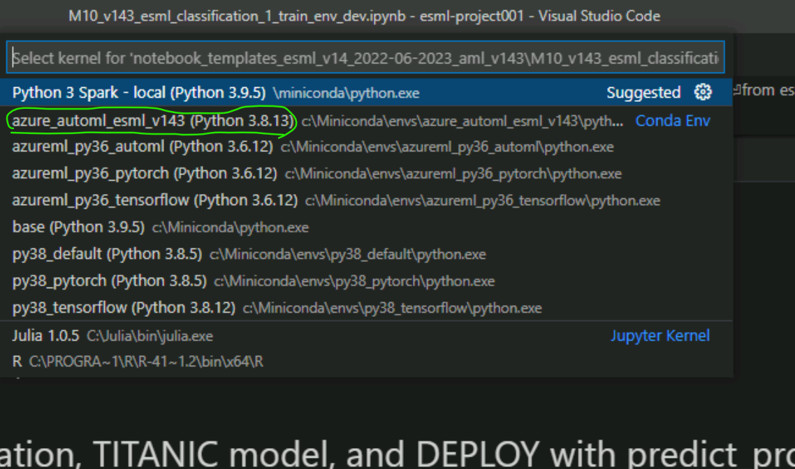
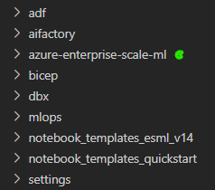

## Tip: Use the Azure Data science Virtual Machine, to install the ESML SDK on, "jump host & client - all at once" 
- You have an easy way of "governance" for onboarding consultants easy - all is preinstalled (comes with ESML bicep)
  - You can have AAD login (Virtual Machine Administrator Login or Virtual Machine User Login)
  - VM inside of vNet already (no point-2-site gateway setup needed, no personal laptops to join to AAD)
  - Bastion host avaialble in the `ESML bicep provisioining`, including native RDP.
# 1) Install ESML Python SDK that includes Azure ML with AutoML
- Install MiniConda (>v 4.7), and open the MiniConda command prompt on your computer
  - Windows computer:  [environment_setup/user_dev_env_install/AzureML_v1_43/automl_setup.cmd](./environment_setup/user_dev_env_install/AzureML_v1_43/automl_setup.cmd)
  - Mac computer:  [environment_setup/user_dev_env_install/AzureML_v1_43/automl_setup_mac.sh](./environment_setup/user_dev_env_install/AzureML_v1_43/automl_setup_mac.sh)
  - Linux computer [environment_setup/user_dev_env_install/AzureML_v1_43/automl_setup_linux.sh](./environment_setup/user_dev_env_install/AzureML_v1_43/automl_setup_linux.sh)
# 2 (Alt A) NEW Azure Devops project - "link" ESML (GIT subclassing)

-  Add ESML as a GIT Submodule "linked" to your GIT repo
- Creat a "project001" folder on local machine, open GIT command prompt there, then run:
> git config --system core.longpaths true

> git submodule add https://github.com/jostrm/azure-enterprise-scale-ml

- Use the PIPELINE mlops-templates, to quickly get your project working as the ESML template project
Located here:  [./esml/azure_provisioning/azure_devops_pipelines/](./esml/azure_provisioning/azure_devops_pipelines/)
# 2 (Alt B) EXISTING Azure Devops project - Import the Azure Devops project (template project)
- Project already hashas the `ESML as submodule`, and MLops template ready to run, but you need to run the following command to see the files (not just an empty folder)
- Open GIT command prompt, go to your `local root folder for the code` (you should see the folder `azure-enterprise-scale-ml` and `notebook_demos` with a `dir` in the GIT CMD)run below: 

> git submodule update --init --recursive

If you get ann errormessage about `too long paths` then you need to open the GIT CMD prompt as `Administrator` and run the below (then try again)
> git config --system core.longpaths true

3) After the CONDA is installed, and the ESML CODE is on your computer
- Then after the code is on your computer, or at the ESML generated DSVM, you need to "flip" to main branch, and when running notebooks, you need to select the correct CONDA-evironment. 
See images below: 

### 3a) Select correct BRANCH on the subclassed ESML library (only need to do this once)

### 3b) Open a notebook (note what level the folder is on)

### 3c) Select correct CONDA environment, when running notebooks (only need to do this once, per notebook)

# 3) Create the Azure Resources needed (ESML Bicep)
The usual way is to configure Azure Devops, as a release pipeline to provision ESML Projects via the ESML BICEP.
- Note: This should be done by a `ESML core team member`, supporting the projects. Not by projects themselves.

Alternatively: The button below will deploy Azure Machine Learning and its related resources, BUT you may want to tailor to YOUR `naming convention` 
 

# Almost done. Your codebase should look like below now: 
`Example:`: See here, for how these folders are use together with EMSL:  https://github.com/jostrm/azure-enterprise-scale-ml-usage 

# 4) Copy TEMPLATES to your GIT branch, your root, and configure ESML settings to target YOUR Azure resources, and templates
### 4a) First time only:Run the Notebook 
- [01_init_templates_ALL.ipynb](../azure-enterprise-scale-ml/copy_my_subfolders_to_my_grandparent/01_init_templates_ALL.ipynb) 
- NB If you want, you can copy & paste the TEMPLATES manyally, You should copy all (except `notebook_templates`, here you should take a subfolder) subfolders in `copy_my_subfolders_to_my_grandparent` to your root, next to the subclass`azure-enterprise-scale-ml`
### 4b) 2nd time, or when you want to UPDATE templates: Azure ML pipeline template, Notebook templates etc, run this notebook
 - [02_update_templates_QUICK.ipynb](../azure-enterprise-scale-ml/copy_my_subfolders_to_my_grandparent/02_update_templates_QUICK.ipynb)

### How will it look like?

  
### 5a) Create your new branch for `Project` and `Model`  and EDIT the SETTINGS

  - Branch-name: We recommend to include organization/bu, project, and model.
  - Ask your ESML-coreteam what project-number you have 001,...,123 and choose your model prefix M01...M34 
  - Important: projectXXX and MXX should be unique, and is a defined ESML naming convention
  - Example name: `project001_M01` or HR_Dept_project001_M01

##### EDIT the setting files, you copied to your root:
- Even if you did not edit the nanming convention, you still need to check the settings in at least the top 3 files below:
  - 1) [../settings/enterprise_specific/dev_test_prod_settings](../settings/enterprise_specific/dev_test_prod_settings.json) - Role: ESML coreteam/IT admin (`configure once`)
  - 2) [../settings/project_specific/security_config.json](../settings/project_specific/security_config.json)  - Role: ESML coreteam/IT admin (`configure once, per project`)
  - 3) [../settings/project_specific/model/lake_settings.json](../settings/project_specific/model/lake_settings.json)   - Role: Data scientist (Here you decide `dataset names` and model prefix `M01`)
  - 4) [../settings/active_dev_test_prod.json](../settings/active_dev_test_prod.json) Role: Data scientist, to set what environment to debug `dev,test,prod`
  - optional (adjust according to your policy): [../settings/enterprise_specific/*](../settings/enterprise_specific/*) - Role: ESML Coreteam - `defaults for all projects to start with`
  - optional (override enterprise policy, to fit the use case): [../settings/project_specific/*](../settings/project_specific/*)  Role: Data scientist `computes, automl performance settings` 

And - Clean these 3 files: [../settings/project_specific/model/dev_test_prod/automl/out/automl_active_model_dev.json](../settings/project_specific/model/dev_test_prod/train/automl/out/automl_active_model_dev.json)  
 > {
 >   "experiment_name": "",
 >   "model_name_automl": "",
 >   "run_id": -1,
 >   "dev_test_prod": "test",
 >   "registered_model_version": ""
 > }

## 5b) DONE - Let run some NOTEBOOKS!

### `notebook_templates_quickstart` (recommended to start here)
  - Notebook templates. Runnable. Full workflow. 
  - TIP: Copy the `notebook_templates_quickstart` FOLDER for your OWN model, and rename it like `notebooks_M20` if your model is M20

[1_R&D_phase_M10_M11.ipynb](../notebook_templates_quickstart/1_R&D_phase_M10_M11.ipynb)

[2_PRODUCTION_phase_TRAIN_Pipeline_M10_M11.ipynb](../notebook_templates_quickstart/2_PRODUCTION_phase_TRAIN_Pipeline_M10_M11.ipynb)

[3a_PRODUCTION_phase_BATCH_INFERENCE_Pipeline_M11.ipynb](../notebook_templates_quickstart/3a_PRODUCTION_phase_BATCH_INFERENCE_Pipeline_M11.ipynb)

[3b_PRODUCTION_phase_ONLINE_INFERENCE_Endpoint_M11.ipynb](../notebook_templates_quickstart/3b_PRODUCTION_phase_ONLINE_INFERENCE_Endpoint_M11.ipynb)

### `notebook_templates_v14` (advanced notebooks)
  - All notebook teamplates. Not guaranteed / maintained to work 100%, but shows concepts of ESML.

[notebook_templates_esml_v14/0_update_templates_QUICK.ipynb](../notebook_templates_esml_v14/0_update_templates_QUICK.ipynb)
 - This UPDATES some TEMPLATES, and the QUICKSTART folder,with new fresh notebooks from ESML.
 - Safe to run it will backup your lake_settings.json and model_settings.json (but only run once, and then manuallytake your lake_settings.bak.json model clause, and past to new lake_settings.json)

[notebook_templates_esml_v14/00_v143_esml_1_clean.ipynb](../notebook_templates_esml_v14/00_v143_esml_1_clean.ipynb)
- This will clean any cashed LOGIN information, and CLEAN temp files. Run this if needed. If having login problem to Azure ML Studio workspace.

[notebook_templates_esml_v14/00_v143_esml_controller_misc.ipynb](../notebook_templates_esml_v14/00_v143_esml_controller_misc.ipynb)
- This explaines INNER and OUTER loop with the ESMLController class. 

[notebook_templates_esml_v14/00_v143_esml_ml_features.ipynb](../notebook_templates_esml_v14/00_v143_esml_ml_features.ipynb)
- This explaines various ESML Features. The "Bible" notebook of ESML if you wish. If it isn't there, ping me and we'll add it.

# TROUBLE SHOOT - Tips

### Q1) I get a StreamAccessException error when running the Pipeline, it the first steps "IN_2_SILVER 
 - There is a folder path in the Error message "projects/project...1000/01/01/...
### A1) This is the most common error. It means it cannot find the data in the datalek folder structure
- Verify the path you see in the errormessage, that data exists in the datalake
- Usual cause: you probably have the wrong DATE utc, for it to point at wrong date folders such as `2010/01/01`
## If manual security setup: SP - Keyvault IAM and Azure ML Studio
- A)AML Studio You need to have your project SP (esml-project005-sp-id) be CONTRIBUTOR on the DEV, TEST, PROD workspaces, or else you will seee this: 
  - > ERROR:azureml._project._commands:get_workspace error using subscription_id...
    
    > You have no (or access to) Azure ML Studio Workspace in environment 'dev'
    > You need the below created/access: ....
- B) Keyvault: You need let your SP (esml-project005-sp-id) have READ Secret accesss on external Keyvault, and READ/WRITE secret on the Azure ML Workspace defauly keyvault
  - or else you will receive this rudint .init(ws): 

  > *HttpResponseError: (Forbidden) The user, group or application 'appid=sdfdsf;oid=8sdf;iss=https://sts.windows.net/5dfgg9f/' does not have secrets get permission on key vault 'my-external-keyvault;location=westeurope'.*

## Q: "AKS error - cannot create cluster"
- A: Ask your IT admin to create the cluster for you (this is also recommended to get private link support). 
- Why the error? 
  - Sometimes enterprises has Azure POLICY's not allowing you to create AKS cluster of certain VM SKU type for its nodes (e.g.Standard DS3 v2),
    - If so, change this setting:  "aks_vm_size": "Standard_DS3_v2"
  - Or there is a POLICY/RBAC that you are not allowed to create resource gruops. The resource group AKS will create automatically will give this error
> "ReconcileResourceGroupError","message": "Resource request failed due to RequestDisallowedByPolicy. Please see https://aka.ms/aks-requestdisallowedbypolicy for more details
  