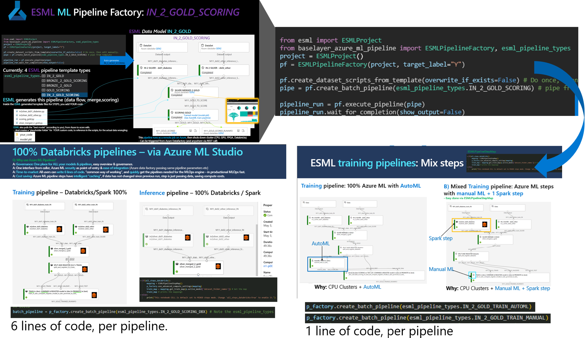
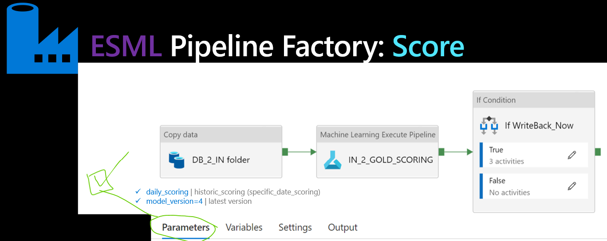
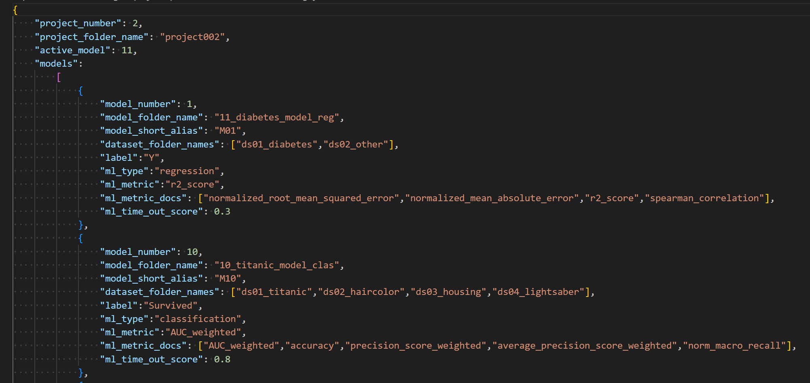

# AI factory for AI & ML - Use Case Scenarios AND "What to test out first"

Independent of seniority, the recommendation of "which order" to try out the USE CASE CATEGORIES is: A,B and then C,D

<b>TIP! Start with use case categories A,B then C,D</b>

- Start with category A,B then go for C,D (A,B,C,D)  
- <b>Purpose</b>: To be aware and learn about the TEMPLATES and ACCELERATOR BOOST first (category A, B), and secondly to working with the services "vanilla" without accelerator bost, category C. 
    - A benefit to start with A, B before going into C. This way you can also compare, the acceleration given. 

 <b></b> <i></i>

## Acceleration - Autogenerated pipelines IMAGE

## OVERVIEW - Use case categories: A, B, C, D - WHAT is accelerated, and what is NOT?

A) ESML project type: Classical ML - Working from <b>VS Code</b> with <b>Azure Machine Learning</b> 
- Code defined in Python (.py) files via VS code

- Acceleration:
    - `MLOps template`
    - `Autogenerated pipelines`: 3-line pipeline generation for `AutoML, ManualML` - How: Metadata code generation.
        - See [IMAGE above](#Acceleration-Autogenerated-pipelines-image)
        - IN Data for the pipeline needs to be either .csv or .parquet
    - `DataOps templates` works out-of-the-box in Datafactory, since auto-generated AzureML pipelines
        - DataOps template link (Datafactory): https://learn.microsoft.com/en-us/azure/data-factory/solution-templates-introduction
        - IN Data (.csv, .parquet, .delta) data to BRONZE (.parquet)- then the AzureML pipeline refined the BRONZE > SILVER -> GOLD
    - `Environment ESML managed`: Pipelines, BuildAgent/MLOps, User laptop: AzureML SDKv1.55 including AutoML.
    - `AutoML` for `classification, regression` - TestSet scoring / Model evaluation, is auto-calculated
        - AutoML link: https://learn.microsoft.com/en-us/azure/machine-learning/concept-automated-ml?view=azureml-api-1
    - `ManualML` for whatever scenario: `classification, regression, forecasting, computer vision (with or witout AutoML)`, with libraries for AzureML SDKv1 including AutoML v1.55
        - ManualML pipeline link: https://learn.microsoft.com/en-us/azure/machine-learning/how-to-create-machine-learning-pipelines?view=azureml-api-1
        - NB! Need to manually calculate TestSet scoring / Model evaluation, according to a template, for MLOps template to work.
            - DEMO model exists for this for regression, classification, including calculating testset-scoring
        - NB! No template notebook exists for forecasting or computer vision.

B) ESML project type: Classical ML - Working from <b>Azure Databricks</b> 
- Code defined in Pyspark in Databricks notebooks (ESML Databricks notebook templates)

- Acceleration
    - `MLOps template`
    - `Autogenerated pipelines`: 3-line pipeline generation for `ManualML`(both DatabricksSteps and PythonSteps supported) - How: Metadata code generation.
        - IN Data for the pipeline needs to be either .csv or .parquet
    - `DataOps templates` works out-of-the-box in Datafactory, since auto-generated AzureML pipelines
        - IN Data(.csv, .parquet, .delta) data to BRONZE(.parquet)- then the AzureML pipeline refined the BRONZE > SILVER -> GOLD
    - `Environment ESML managed`: Pipelines, BuildAgent/MLOps, Databricks workspace (AzureML SDKv1.55 including AutoML)
    - `ManualML` for whatever scenario: classification, regression, forecasting, computer vision (with or without AutoML)
        - NB! Need to manually calculate TestSet scoring / Model evaluation, according to a template, for MLOps template to work. 
            - DEMO model exists for this for regression, classification, including calculating testset-scoring

C) ESML project type: Classical ML - "Vanilla", e.g. not much acceleration (AzureML SDKv1 or SDKv2 vanilla)

 - Acceleration:
    - `MLOps template` works if interface is followed
        - NB! Need to create a pipeline with same IN/OUT result, according to specification i A & B
    - `DataOps template` works if interface is followed
        - NB! Need to create a pipeline that takes in-parameters according to specification i A & B
    - `Manual Pipelines` You need to construct your own pipeline strucutre:  with `steps` for: indata, processing, training, evaluation, passing data between steps etc.
        - https://learn.microsoft.com/en-us/azure/machine-learning/how-to-create-machine-learning-pipelines?view=azureml-api-1
        - https://learn.microsoft.com/en-us/azure/machine-learning/how-to-create-component-pipeline-python?view=azureml-api-2
    - `Environment NOT managed`: Pipelines, BuildAgent, User laptop need to be handled.
        - NB! Need to create your own Azure ML Environment, and add dependencies everywhere: Own laptop, buildagent for MLOps, Pipelines/Docker images.

*D) ESGenAI project type: Generative AI

*  Work in progress. ETA May 2024
    - `LLMOps template`
    - `RAG Chat scenario template`
    - `Promptflow`: With temlate to support RAG with AI search, and from CosmosDB
        
## A) How to select USE CASE category - Classical ML/DL? A, B or fallback: C
Here is information "how to pick category A,B,C", for your use case. 
- Example: If you have a use case where you want to try out: AutoML with Classification, then both A and B is accelerated. 

All use cases are supported. But use cases that falls into category C, are not ACCELERATED much.
- For maximum acceleration - choose A or B.

### MAPPING "Where do A, B, C, D accelerate?" - WHAT to CHOOSE?
-----
- Recommendation is to start with A,B supported use cases. The one in <b>bold</b>

|Use case | Accelerate with | Link   |
|---------|-----------------|--------|
|<b>AutoML: Classification</b> | A,B | https://learn.microsoft.com/en-us/azure/machine-learning/concept-automated-ml?view=azureml-api-1 |
|<b>AutoML: Regression</b> | A,B | https://learn.microsoft.com/en-us/azure/machine-learning/concept-automated-ml?view=azureml-api-1 |
|AutoML: Forecasting | B - ManualML | https://learn.microsoft.com/en-us/azure/machine-learning/concept-automated-ml?view=azureml-api-1 |
|AutoML: Computer Vision | B - ManualML | https://learn.microsoft.com/en-us/azure/machine-learning/concept-automated-ml?view=azureml-api-1 |
|-|-|-|
|<b>Manual: Classification</b> |A,B | https://learn.microsoft.com/en-us/azure/machine-learning/tutorial-pipeline-python-sdk?view=azureml-api-1 |
|<b>Manual: Regression</b> |A,B | https://learn.microsoft.com/en-us/azure/machine-learning/tutorial-pipeline-python-sdk?view=azureml-api-1 |
|Manual: Forecasting |B - ManualML | https://learn.microsoft.com/en-us/azure/machine-learning/tutorial-pipeline-python-sdk?view=azureml-api-1 |
|Manual: ComputerVision |B - ManualML | https://learn.microsoft.com/en-us/azure/machine-learning/tutorial-pipeline-python-sdk?view=azureml-api-1 |
|-|-|-|
|<b>DataEngineer/Analyst</b> |A,B | https://learn.microsoft.com/en-us/azure/machine-learning/tutorial-pipeline-python-sdk?view=azureml-api-1 |
|DataEngineer/Analyst |B,C | https://learn.microsoft.com/en-us/azure/machine-learning/tutorial-pipeline-python-sdk?view=azureml-api-1 |

<b>Note: Since many enterprises have requirements on PRIVATE ENDPOINTS (No public IP policy), also AzureML SDK v1 is supported (and highly prioritized to accelerate)</b>

# ROLES & SCENARIOS

## ROLE: ESML PROJECT TEAM (Data scientists) - "Refine data BRONZE-SILVER-GOLD and TRAIN a MODEL, and INFERENCE a MODEL"
- MLOps (DataFactory, Azure ML pipeline)
- TOOLS: Data Factory ESML template, to Azure ML Pipeline template, either with native steps, or mixed with Databricks Steps. 
    - 1) ESML PROJECT TEAM orders data from ESML Coreteam. 
        - Example scenario: Data from 1-4 source systems (SAP, database, external storage) and onboard to the MASTER lake structure, that already exists in the ESML datalake. 
            - MASTER/SAP/IN/data.csv
            - MASTER/SAP/OUT/BRONZE/bronze.parquet
        - PIPELINE OUTPUT: Data factory pipeline to feed data to MASTER folder
    - 2) ESML CORE TEAM / Data ingestion team, copies data from MASTER to PROJECT folder, via an ESML DataOps template (a Datafactory template)
        - TARGET: PROJECT002/.../SAP/IN/BRONZE/bronze.parquet
        - PIPELINE OUTPUT: Data factory pipeline to read data to PROJECT IN folder
    - 3) ESML PROJECT TEAM: Data scientist, starts from the IN-folder in their PROJECT FOLDER, and refines data via ESML pipeline templates, and build ML-training logic (or use AutoML)
        - PIPELINE OUTPUT:Azure ML pipelines: `IN_2_GOLD_TRAIN`, `IN_2_GOLD_SCORING`, is the output result here, with refined data, and a trained model
        - SOURCE: PROJECT002/.../TRAIN/SAP/IN/silver.parquet
        - TARGETS:
            - PROJECT002/.../TRAIN/SAP/OUT/GOLD/gold.parquet
            - PROJECT002/.../TRAIN/MODEL/model.pkl
    - 4) *Optionally DataMesh feature can be turned on, to shareback project specific SILVER.parquet from PROJECT002 data to MASTER
        - PROJECT002/.../SAP/OUT/silver.parquet
        - MASTER/.../SAP/OUT/SILVER/project002/silver.parquet
        - MASTER/.../SAP/OUT/SILVER/global_silver.parquet

## ROLE: ESML PROJECT TEAM (Data engineer/analyst) e.g. "Refine data BRONZE-SILVER-GOLD and TRAIN a MODEL, and INFERENCE a MODEL"
- DataOps (DataFactory): MASTER to PROJECT folder: `A,B` acceleration:
- TOOLS: Data Factory ESML template, to Azure ML Pipeline template, either with native steps, or mixed with Databricks Steps. 
    - 1) ESML PROJECT TEAM orders data from ESML Coreteam. 
        - Example scenario: Data from 1-4 source systems (SAP, database, external storage) and onboard to the MASTER lake structure, that already exists in the ESML datalake. 
            - MASTER/SAP/IN/data.csv
            - MASTER/SAP/OUT/BRONZE/bronze.parquet
    - 2) ESML CORE TEAM / Data ingestion team, copies data from MASTER to PROJECT folder, via an ESML DataOps template (a Datafactory template)
        - PROJECT002/.../SAP/IN/BRONZE/bronze.parquet
    - 3) ESML PROJECT TEAM: Data engineer/analyst, starts from the IN-folder in their PROJECT FOLDER, and refines data via ESML pipeline templates (Azure ML pipeline `IN_2_GOLD`)
        - PIPELINE OUTPUT: Azure ML pipeline: `IN_2_GOLD` is the output result here, with refined data (*optionally shared back from project to MASTER)
        - SOURCE: PROJECT002/.../SAP/IN/bronze.parquet
        - TARGET: PROJECT002/.../SAP/OUT/GOLD/data.parquet
    - 4) *Optionally DataMesh feature can be turned on, to shareback project specific SILVER.parquet from PROJECT002 data to MASTER
        - SOURCE: PROJECT002/.../SAP/OUT/silver.parquet
        - OUTPUTS: 
            - MASTER/.../SAP/OUT/SILVER/project002/silver.parquet
            - MASTER/.../SAP/OUT/SILVER/global_silver.parquet

## ROLE: ESML CORE TEAM - onboard DATA from external systemns to ESML lake
- TOOLS: Usually Data Factory only (Option 1) is sufficient enough
    - Option 1) Data Factory ESML template
    - Option 2) Data Factory ESML template, to Azure ML Pipeline template, either with native steps, or mixed with Databricks Steps.
- DataOps: IN to MASTER - Data Factory:`A,B`
     1) ESML PROJECT TEAM orders data from ESML Coreteam. 
        - Example scenario: Data from 1-4 source systems (SAP, database, external storage) and onboard to the MASTER lake structure, that already exists in the ESML datalake. 
            - Source: MASTER/SAP/IN/data.csv
            - Target: MASTER/SAP/OUT/BRONZE/bronze.parquet
- DataOps: MASTER to PROJECT folder: `A,B`
    - Source: MASTER/SAP/OUT/BRONZE/bronze.parquet
    - Target: PROJECT002/.../SAP/IN/BRONZE/bronze.parquet

## ROLE: ESML PROJECT TEAM - Build Promptflow, use GEnerativeAI such as GPT-4 with Azure OpenAI
- TOOLS: Azure OpenAI, Azure Machine Learning/promptflow, AI Search

# IMAGES - Appendix

End-2-End: DataOps+MLOps: IN_2_GOLD_SCORING pipeline:

-----
LESS configurations: Autosplit data, Auto-registers Datasets, Config per environment Dev,Test, Prod for AutoML

-----

LESS code to construct Azure ML Pipelines: 

-----

-----

LESS code - autocalculation of Testset scoring since 2019, based on Scikit-Learns Model Evaluation: https://scikit-learn.org/stable/modules/model_evaluation.html
- Similar as now exists since 2022 in Azure Machine Learning ModelEvaluation

-----
-----

LESS configuration. Turnkey datalake. Turnkey Dev, Test, Prod environments.

Project & Model based way of working:

Model evaluation - via configuration, you can set "weights", and choose metrics, to trigger "a promotion"

-----
