# azure-enterprise-scale-ml (ESML)
Enterprise Scale ML (ESML) - AI Factory on Azure
- A solution accelerator, for `Enterprise Scale Machine Learning` & `MLOps`, based on best & proven practices for organizational scale, across projects. 
- Read more about Enterprise Scale ML best practices here: https://docs.microsoft.com/en-us/azure/cloud-adoption-framework/ready/azure-best-practices/ai-machine-learning-mlops#mlops-at-organizational-scale-ai-factories
- ESML has a default scaling from 1-250 ESMLprojects for its `EMSL AI Factory`. 
    - That said, the scaling roof is on IP-plan, and ESML has its own IP-calculator (allocated IP-ranges for 250 is just the default)
- `Enterprise "cockpit"` over ALL your projects & models. 
    - See what `state` a project are in (Dev,Test,Prod states) with `cost dashboard` per project/environment

 Q:Looking for ESML *`AutoLake™ - (supports: Data Mesh/Featurestore/DeltaLake) @ Azure`* and `ESML AI Factory` with turnkey `MLOps` with `AutoML`?
 - This is the repo and solution accelerator for that.
 - ESML are using `Azure Datalake GEN 2` 100%. Also for Azure ML Pipelines/Datastore. No blob storage needed. 
 - `ESML supports DeltaLake` for MASTER data. (When ESML autogenerates Azure ML pipelines, a .parquet representation is used in the PROJECTS structure)
 - `Enterprise Datalake, with ADLS GEN2, and logical DataMesh`: Not physical DataMesh. Avoiding scattered Blob/GEN2 storage accounts with myriad/different security & micro services 
  - ESLM DataMesh avoids `the curese of security diversity`: Some have vNet & private endpoints..some have not. Different RBAC models on same data, multiple copies on MASTER DATA..event-sync nightmare)
 
 # ESML AI Factory "Oneslider": Dev,Test,Prod environments
- Easy to provision a new ESMLProject for Dev,Test,Prod with easy cost followup, since its own PROJECT resource groups for each `Project team` in the ESML `AI Factory`:
- Horisontally 3 COMMON environment (Dev,Test, Prod) and vertically ESMLProject 1-250
  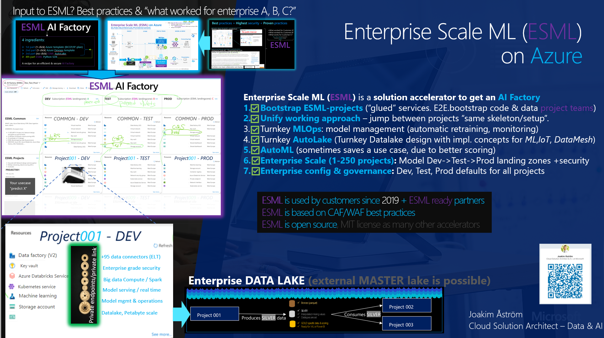

## ESML technically: The 4 ingrediences:
- `BICEP provisioning`: ESML Projects in the AI factory:same `setup`,`common toolbox` & `security` (private link)
- `Azure Devops templates`: MLOps (CI/CD). Kick off BICEP release pipeline (PM "order a ESMLProject" in 15min)
- `ESML DATALAKE`: Battle tested design supports DataMesh,IoT,ML concepts, BRONZE, SILVER, GOLD
- `ESML SDK & REPO`: SDK knows setup/preconfigured: knows datalake design (don't need to remember folderpaths) and can talk horisontally `across Dev, Test, Production` workspaces.
    - Has accelerator code such as the `ESML Azure ML Pipeline factory`, 2 lines of code to generate pipelines
    - Templates for Azure Datafactory, Azure Devops templates, BICEP templates
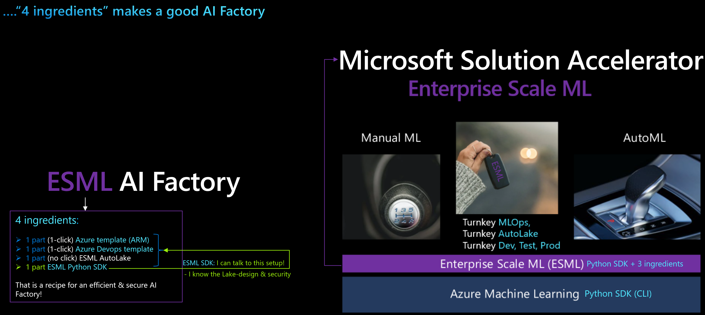

- Can optionally integrate with ITSM system as a "ticket" in ServiceNow/Remedy/JIRA Service Desk. The below info is needed for the ESML provisioning:
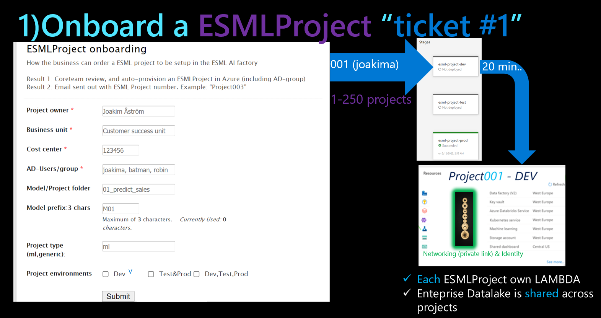
## ESML Architecture - "Modern data analytics platform"
Based on this reference architecture: https://docs.microsoft.com/en-us/azure/architecture/solution-ideas/articles/azure-databricks-modern-analytics-architecture

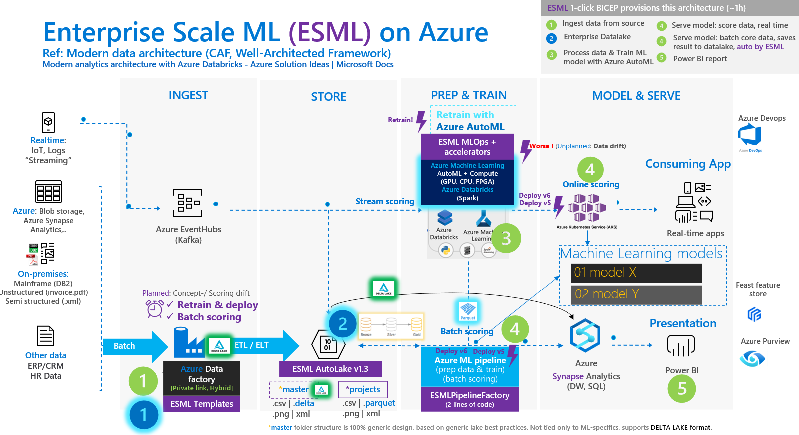

# INTRO - Is this for you? 
-ESML "marries" DataOps + MLOps, with `templates` for both Azure Data factory that calls `ESML autogenereated Azure ML Pipelines`
-ESML also autoprovisions the AI Factory, with 100% BICEP, where you can `1-click` a new ESMLProject in Azure Devops, serviecs glued together with `private endpoints` (network & identity)
-ESML can `talk across Dev,Test, Prod Azure ML workspaces`, comare scoring from model in DEV workspace with TEST, and register the model in an external workspace. See image
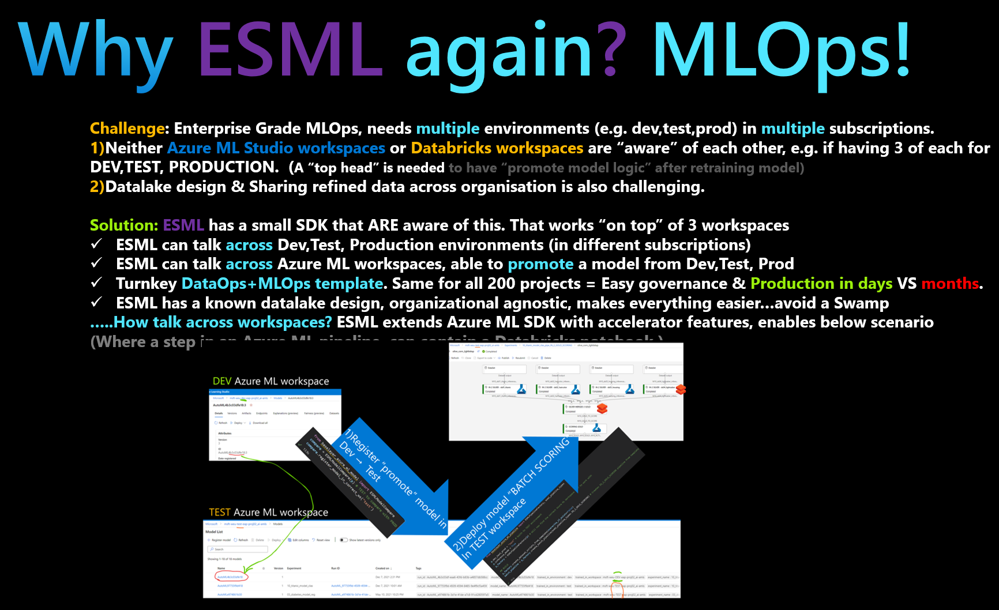

**Q1:I want to use Azure AutoML, with MLOps ready to be `turned ON`** , with datalake design automatically generated for me, including `BRONZE, SILVER, GOLD` concept
- A: Yes. ESML is AutoML first, and have married this with MLOps, and an `AutoLake™` for Azure ML Studio.
- There is `22 DEMO notebooks` End-2-End MLOps, with Azure ML Pipelines, `using Azure datalake GEN 2 all the way` - from Azure datafactory, in Azure ML Pipelines/Datasets.

**Q2:I want to do ML, but <ins>only R&D phase</ins>** - I don't need MLOps or DEV,TEST, PROD environments. Can I still get benefits of ESML - get a quick DEV env & AutoLake?
- A: Yes. ESML is meant for quick R&D ( and if successful PoC -> quickly turn ON, to full enterprise scale MLOps solution
    - `Quick setup:` You can setup ESML for 1 environment only (have same subscriptionID for all 3).
        - Copy the `settings` & `notebook_demo` folder (but no need to copy MLOPS folder)
    - `R&D Mode:` Run ESML SDK with `ESMLProject.rnd=True`, and dataset-versioning will be turned off, but you still get a `AutoLake` with bronze, silver, gold concept. 

**Q3:I want to do ML, but <ins> NOT `AutoML`</ins> - just scikit learn, <ins>my own model</ins>.** Can I still leverage ESML, besides training step?
- A: Yes, you can wrap your TRAIN-step code, in an Azure ML Pipeline, as a Python step, or Databricks step, and still leverage the `AutoLake` and other `ESML accelerators`.
    - You have multiple options for your steps in this pipeline, besides automl_step, you have python_script_step, Databricks_script_step, estimator_step, synapse_spark_step, ...
    - Full list: https://docs.microsoft.com/en-us/python/api/azureml-pipeline-steps/azureml.pipeline.steps?view=azure-ml-py
- A: With that said, ESML has a *`AutoML` first* approach.
    - Using this accelerates more, and enables easier & cheaper governance (unattended retraining with auto-hyperparameter tuning)
 
**Q: How was this accelerator born, and what is it based on? It this for me?**
 - A:Working with multiple enterprise customers (aviation, manufacturing, space, energy and retail industry), we noticed common `non-industry-specific` challenges, to scale across projects, that ESML solves - an organizational scalability.
 
    * [X] ESML `extends` Azure Machine Learning via accelerators, organizational agnostic - since the `project/teams` concept in ESML.
    * [X] It extends at specific purposes: `data refinement/datalake/machine learning` to build faster. 
    * [X] Also adds `enterprise grade solution design & scalability` (dev,test, prod environments) - across subscriptions. 
    * [X] `An Enterprise Datalake, with ADLS GEN2, and logical DataMesh`(not physical. No scattered Blob storage accounts with myriad/different security(sometimes vNet, sometimes private links, sometimes open)

Note: You can use this for any `enterprise grade` solution in need of single or multi-subscription solutions, with an `enterprise datalake` need, `DEV only` need, or `DEV->TEST->PROD` need.
- ESML was born out of these needs. Based on both Microsoft `best practices` and customer `proven practices`
- ESML accelerates common things a ML-solution from A-Z needs, and focus on `reusage of code and refined data` across projects, at an enterprise. To be more efficient. 
Contains both "must-have" infrastructure and bootstrapping, and other "efficiecy" accelerators.
- Disclaimer:Although this have accelerated others, there is no guarantee it will accelerate your situtation. Read the MIT LICENCE file & Happy coding.

**Q6 ESML AI Factory: Can I just use the Azure ML SDK directly? Instead of the ESML SDK?** 
- Yes, You can bypass ESML SDK 100%  (the 4th ingredience) and only take advantage of the 3 other ingredients: part: 1,2,3
    - part 1) `Azure services glued together securely` (BICEP Provisioing / Networking & Infra with RBAC and identity)
    - part 2) `Azure Devops template, for MLOps & 1-click provisioning of ESMLProject/BICEP` (BUILD and RELEASE pipelines / Networking / Security & Glue)
    - part 3) `The enterprise datalake design` (ADLS Gen2 storage account, with a folder structure)
    
- That said, to get the `accelerator power` - use the `EMSL SDK`. See benefits listed below ( and look at this full README feature list for all benefits)
    - `6 out of the 7 steps/pipelines of a ML application for REALTIME or BATCH scoring`: There is `always at least 6 steps you need to create`, step 7 is optional.
    - ESML gives you 6 of these productional steps/pipelines automatically. Not the asterix (*) ones, but the `bold ones` (2,3,4,5a,5b,6,7)
        - *1) Ingest Data from source to MASTER lake, and MASTER to project
            - Azure Data Factory: A COPY Activity from your source (DW/Database) to the IN-folder in ADLS Gen2, Datalake), you of course need to do the mapping
            - That said, `ESML Azure Datafactory templates` exists with paramenters to work with `ESML Datalake`: `IN_2_MASTER ingestion` and `MASTER_2_PROJECT` and to support `DataMesh`
        - `2) FeatureEngineering "IN_2_GOLD"` pipeline (Azure Data factory, Azure ML Pipeline)
            - `ESMLPipelineFactory` will genereate the actaul Azure ML Pipelines. But the content in the generated bootstrapped Python script files is of course too specific for ESML. 
                - *You need yo create your own `Data wrangling` code
        - `3) TrainModel` (AutoML pipeline - you can also create your own manual Training Azure ML Pipeline)
            - Inclusing TEST_SET scoring...which is not included in Azure ML Studio funcionality.
        - `4) CompareScoringDrift & DataDrift` - Should be promote & Deploy the newly trained model? Needed to refit model to real world changes.
        - `5a) ONLINE scoring: Deploy AKS Scoring endpoint - Online/Batch (Only up to 5min REST call for BATCH)`
            - ESML managed AKS clusters only requires 2-lines of code, and the AKS Cluster is secured with GA `private links` (no public internet used)
        - `5b) BATCH scoring: Create & Publish  Scoring endpoint`
            - Azure ML Pipeline: See `ESMLPipelineFactory` and also the `Azure Datafactory ESML templates` with parameters to work towards the ESML generated Azure ML pipelines.
        - `6) Scoring  & *Writeback`  (Azure Data Factory) - See `ESMLPipelineFactory`
            - To get data to score from SOURCE and *WriteBack* is of course specific for EMSL to automate, but 4 Azure datafactory TEMPLATE pipelines is given,with parameters, working end-to-end from SOURCE SQL Database:
                - Since ESML has already has created the Azure ML Pipline, it knows how to score and what parameters to set. 
                - Since ESML written the scored result data to the Datalake, it knows how to WriteBack from ADLS Gen2 to your `Target/DW/Database`)
                - ESML also provide - where you can `filter` scored data, on `datetime`, or `caller_id`, etc
        - `7)ShareBackPipeline` (Write back refined project SILVER data, to MASTER datalake, for others to use
            - ¤¤= This STEP/Pipeline, is of course NOT important if you don't need refined data, reused in your organization.

# WHAT is ESML?
`ESML` is an `accelerator` , 1 part is this `ESML SDK`- accelerator code and a auto-datalake to `code ML faster`, abstract away `Azure ML Studio` (datasets/versioning/experiments) - automated creation of artifacts.  

It `glues (networking, identity,security)` Azure services together, to get a more `product feel/ SaaS feel`. Glues together multiple PaaS (data factory, Azure ML Studio, Datalake GEN 2) across `subscriptions`. 

# EDUCATION & Prerequisites (good to have in the `backpack`)
- Learning by doing is probably the best thing, but below some `Azure certificates` are listed good to have in the `backpack`
 - DP 100 https://docs.microsoft.com/en-us/learn/certifications/exams/dp-100
- There are also 6 ESML videos (in editing room), about ~1h each, as can be seen below.
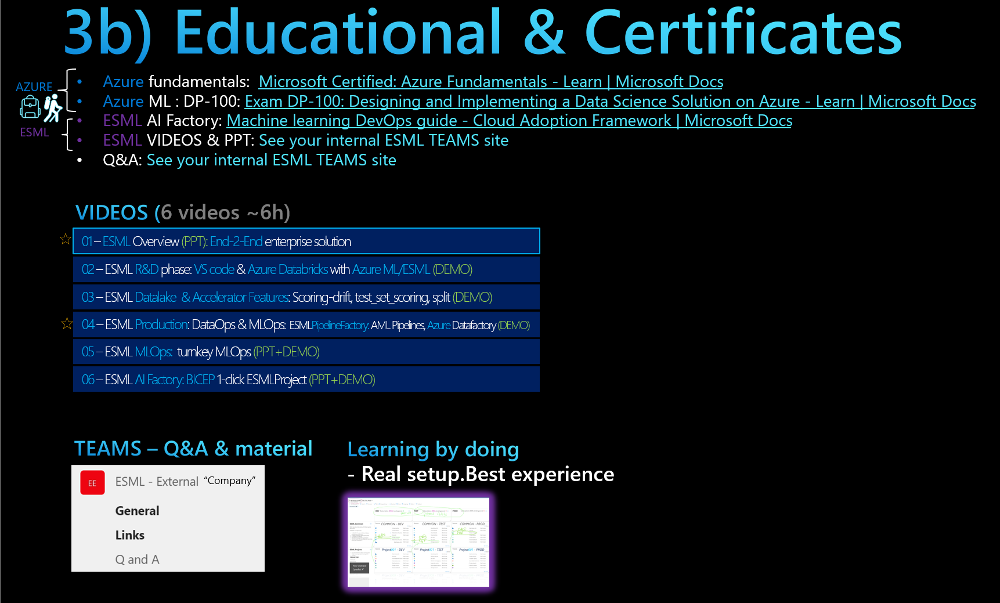

## ESML Accelerator benefits 
ESML has `MLOps embedded`, and adds `NEW` concepts to enrich Azure ML Studio: 
- EMSL enables `enterprise CONCEPTS` (Project/Model/Dev_Test_Prod)` - able to scale across Azure subscriptions in DEV, TEST, PROD for a model.
- ESML includes `accelerators for data refinement, with CONCEPTS`: Bronze, Silver, Gold, able to `share refined data ACROSS projects` & models
- ESML Pipeline factory `automatically` generates `Azure ML pipelines` of 3 types, with the data model `IN->Bronze->Silver-Gold` (we will refer to this as `IN_2_GOLD`)
- ESML includes *efficiency* `accelerators for ML CONCEPTS` such as `SCORE vs INFERENCE`,`ESMLPipelieFactory` (auto-creates pipeline), `Auto-Split to TRAIN,VALIDATE, TEST` (auto-register). 
    -Besides automation for *efficiency*, it also keeps the *must-have*  *lineage* of an ML model.
- ESML `marries` `MLOps` with `AutoML` - you get working MLOps template with support for Azure AutoML.
- Oh..and you `don't need to care about the Datalake design` (or HOWTO work with Azure ML Studio Datasets) for versioning data & track lineage - since ESML `Autolake`

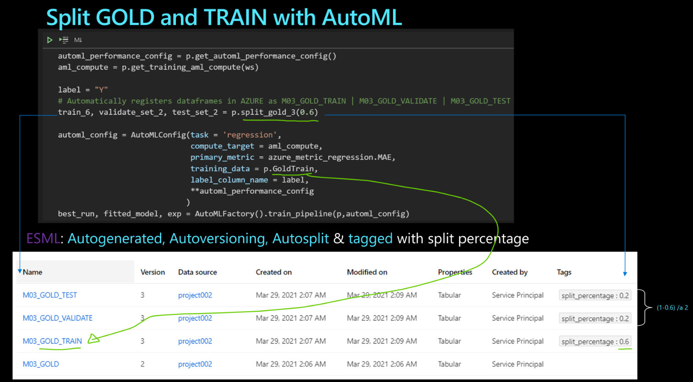
 - These datasets are automapped/autogenerated by ESML at `p.split_to_gold()` 
 - Same thing at feature engineering, at `esmldataset.Bronze.Save(dataframe_state)` - the Bronze dataset will be created, and a new version (if not p.rnd=True) is created for you.

# ESMLPipelineFactory
- This scoring pipeline is automatically ESML-generated, via only `2 lines of code`!! (This is possible due to the 4 ingrediences in ESML)
- If you have your data in IN in "GOLD" state, it will work `as-is`, but probably : ) you want to add your `data wrangling` per `IN_TO_SILVER` step, in the 1-M auto-generated `ds_name_by_config.py` scripts
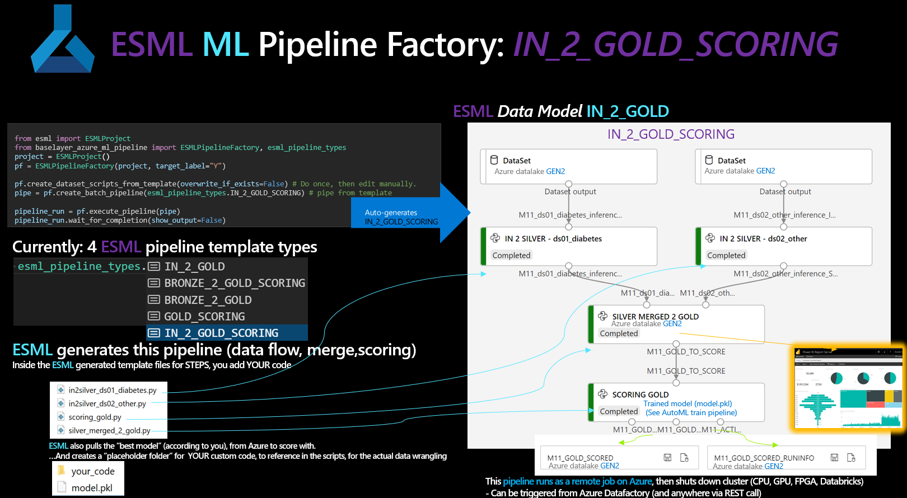

# WHAT is ESML Autolake™ ( Azure Datalake Storage GEN2 accelerator)
- It is based on Azure Datalake Storage GEN2, but includes a turnkey lake-design "skeleton" with concepts for ML (train, inference) and data refinement (Bronze, Silver, Gold), and enterprise scale concepts (incremental load, versioning, dev/test/prod). 
- It also has MASTER vs PROJECT concept, able to support both `DeltaLake` on Azure datalake GEN2 and `Azure ML pipelines with Azure Datalake GEN 2` Datastore.
- It is also automated for Azure ML Studio, to automatically register data as Azure ML Studio Datasets
    - Connected "per project & model". You see only your projects data.
- And it contains automated enterprise security ( uses Azure keyvault for secrets for you etc)
## "What you see, is what you get (Feature store & Catalog)" & `Data Mesh` embedded & Environment (DEV,TEST,PROD) aware
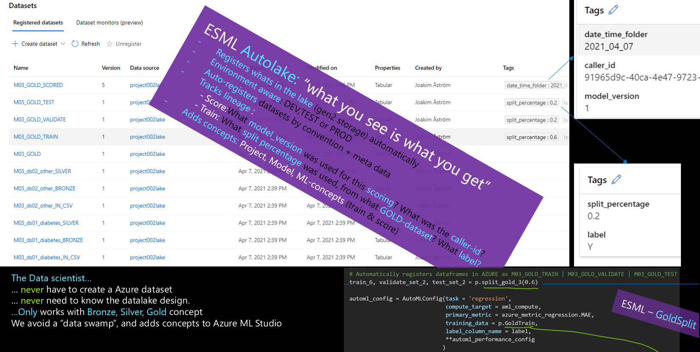

### CONCEPTUALLY
-ESML is based on BEST PRACTICE's combined with PROVEN practices. 
-In the `ESML AI Factory` all your ESML projects are provisioned automatically "glued" togehter, where `1 project team` can jump into an ESMLProject and start working.
 - `ESML PROJECT`: ESMLProject001 a project team from HR can use to build models, and ESMLProject002 can be used by an analytical. (`Recommended team size is 1-5 people`)
 - `ESML CORE TEAM`: An ESML Coreteam has at the roles of `goverance` of the ESML AI factory, both technically (helps provision new projects, update AKS-versions) and educationally to `onboard people`
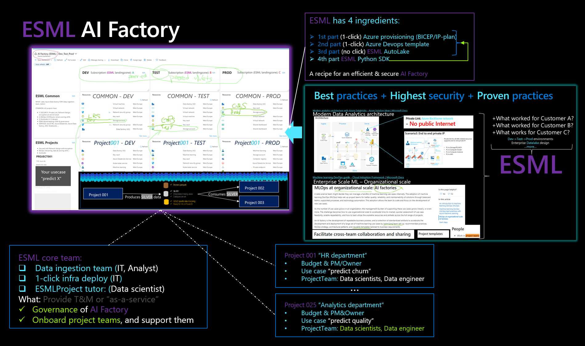

- `Data mesh support:` Not only support for monolitic centralized data ingestion pipelines/team, but `also SELF-SERVICE domain-driven/per project`
    - Each project has their own pipelines (and Azure Datafactory instance), but can get help from the centralized Data ingestion team.
        - To have ONLY a centralized team who owns and curates the data from all domains. It does not organizationally scale as we have learned.
    - Each `domain/project` is responsible for their datasets, which they onboard and `refine from BRONZE->GOLD`, with `support` of the centralized team.
- `Feature store`: ESML leverages Azure ML Datasets, adds a `extra layer`/FEATURE STORE with the Bronze,Silver, Gold concept, both for TRAIN and INFERENCE/SCORING
    - `Feature registration is automated`, when saving BRONZE, SILVER or GOLD. (No need to register version, datatypes, timestamp, etc like in other amazing feature store alternatives, than can be cloudy and a lot of work to maintain)
    - `Time travel`: "Go back in time for datasets (GOLD_TRAIN or GOLD_SCORED dataset) - just use Azure ML Studio and flip the VERSION combobox,inlcuding browsing data (or send "version" via code)
        - GOLD for training: 
            - > `gold_2 = p.get_gold_version(2)` which uses the Azure ML SDK, so you can also use that directly
                -  > ds = p.Gold.get_by_name(workspace = ws, name = p.Gold.Name, version =  "latest")
        - Get GOLD_SCORING dataset for specific schema and specific MODEL version=1 used at inference, with a date-filter
            - > `ds_list, df_all = p.get_scored(date_filter, "1")`
- `Bronze-Silver-GOLD`: Refinement process, lineage, and to talk about different `status`  of data. 
    - Project manager: How is the project going? I heard you are in data refinement mode now, how far gone?
    - Data engineer: We are in `SILVER` state now, believe we are in `GOLD` next week, ready to `TRAIN MODEL`
### Data scientists `NEVER have to create an Azure ML Dataset / register FEATURE STORE objects`
- But will implicitly take advantage of all the great features of Azure ML Datasets 'under the hood',to build its Feature store
### Data scientists `NEVER need to know the physical datalake design`
### Data scientists `ONLY` need to read/write to the `Bronze,Silver,Gold concept`
- Datasets/Feature store is automated. + `RBAC` is set to these Bronze/Silvver/Gold folders - avoids a dataswamp))
- And will implicitly work in a cost effective, performance effective .parquet format 'under the hood'

### PHYSICALLY
- 1 Azure storage account per environment (dev, test, prod)
- All varieties of formats in ”in”, but 1 common format in ”out” -> `.parquet`
- `Physical Lineage:` From `IN`-data to `GOLD`
    - IN->OUT/BRONZE, SILVER, GOLD (train, test, validate, score)
- `Self-describing` Both due to `Bronze-Silver-GOLD`, but also ”sample” in R&D mode. A meta `Data catalog` is also recommended as add-on, such as `Azure Purview`
- `1 lake-design`: Lake design do evolve. We need backward conpatibility and versioning 
    - Example: ”Upgrade my project to `lake v5` from `lake v2` (ADF is used)
- `Physical LINEAGE` from IN-data to GOLD
- `META: If I don't have a Data Catalog (Azure Purview)- what metadata does ESML & AutoLake provide?` 
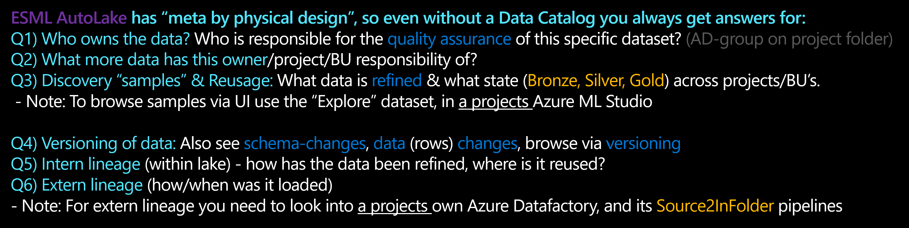
# `CONTEXT`: ESML is more than this SDK with mlops & autolake. Also...
## ESML is also architecture to scale across 1-1000 PROJECTS
- `Avoid Technical quota` roofs in Azure (IP ranges, compute cores).
- `Organizationally`: Cost followups per project, model governance etc
- `Share refined data, between projects` with the ESML `Auto-lake` sharing feature
- `Fill your LAKE day-by-day, CENTRALLY & as a MESH: `: Distributed responsibility between projects, but keep same `skeleton` design, same physical storage & auto-features.
    - Recommendation: 
        1) Use a centralized INGESTION team to `BOOTSTRAP` the projects with dataset-starting points. (they usually know WHERE and HOW to onboard operational data)
        2) Then the project takes over responsibility to refined data from `BRONZE 2 GOLD` and govern that process & pipelines.
        - Use the centralized team as a `help & qualtiy check point` if projects wants to share back refined data to `MASTER` data.
- `Avoid messiness`: both in the cloud, and in the datalake. Easy RBAC. 
- `Enterprise "ML cockpit"` over ALL your projects & models.
- `Project=Team` A group of people that should have same ACCESS (to specific data etc). A team that can create 1-M machine learning models. 
    - **Project example:** To create an ML model, its common to see a small TEAM of `both internal personal + external data scientists`, 3-5 people, creating 1 ML-model
    - **Common requirement:** They should `ONLY see their "USE CASE" and "DATA" in the lake`, but also `optionally` share back refined DATA, to MASTER-LAKE, where other projects can reuse - `if eligible via RBAC`
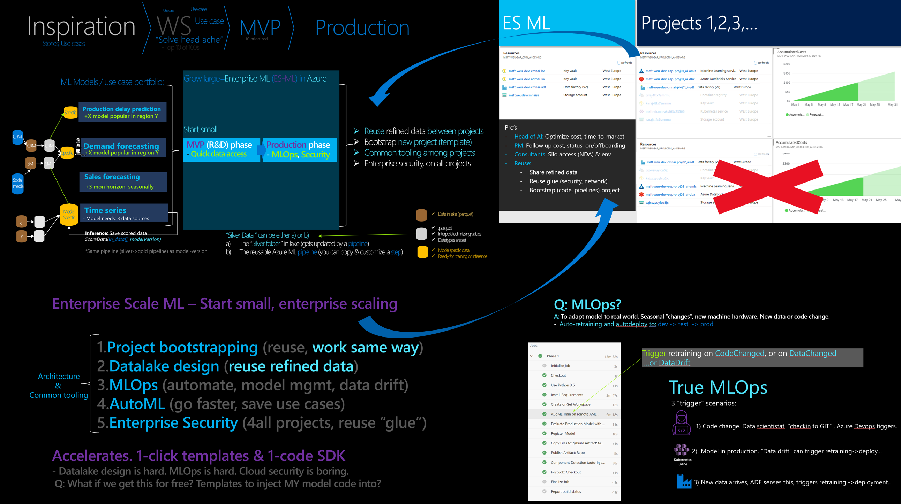

### That was the CONTEXT, But, that aside (thats infra/enterprise architect people stuff)...back to focus on this ESML SDK, and its value for YOUR project and model.
### Lets assume we have 1 project that IT has setup for you. You want to use this ESML SDK for 1 model, to get it from DEV, TEST, PROD:

# Folders (source code) explained
## `esml` folder
This is the `ESML accelerator SDK`. To work with Azure machine learning `faster`, and in an enterprise scale way (across multiple workspaces), includes and abstracts an enterprise datalake design. 
`Tip:` This is now just source code. Until this is packaged and PIP distributed, you can use this as a GIT sub-module
The `Azure ESML-accelerator SDK` (esml folder) includes as example: 
- `Factories`: Easier to prep data, get compute, Train model, Deploy models
- `Datalake AutoMapping` – Automaps the datalake to Azure ML datasets. 
- `Enterprise environments & “selfawareness”` - ESML knows what config to use, and where a model is to be promoted -  from DEV, TEST, PROD that is different Azure ML workspaces/subscriptions.
- ....and more - see feature list at the bottom of this Readme.
- `Dependency:` ESML has no dependencies to ESML folder. It has dependencies to other Azure SDK's (Azure Storage, Azure ML, Azure Keyvault)

## `mlops` and `settings` folders (TEMPLATE folders inside `copy_my_subfolders_to_my_grandparent`)
- You should copy all subfolders in `copy_my_subfolders_to_my_grandparent` to your root, next to the subclass `azure-enterprise-scale-ml`
    - `Example:`: See here, for how these folders are use together with EMSL:  https://github.com/jostrm/azure-enterprise-scale-ml-usage
- `mlops`: This is a template, a working `MLOps pipeline, using the ESML SDK, that can deploy a model `across environments where DEV, TEST, PROD` can be in different workspaces/different Azure subscriptions.
- `settings`: This is a template settings folder, for `dev,test,prod`.
- Tip: You can use this MLOps `template`, as-is to copy and edit for your projects and models. (Or you can just get inspired of it, see usage of ESML)
- `Dependency:` MLOPs folder has dependencies to ESML folder. 

## `environment_setup` folder
- This is the install-script of the full CONDA environment, for  Azure ML SDK with AutoML and ESML to work.
     - A) Dev-evironment: You can install it on your local computer for debugging, se `dev_env_attended`. 
     - B) MLOps: The `unattended` Linux setup script exists for the `MLOps unattended` mode, to be able to install on a `Linux build agent in Azure Devops` (Ubunti 18.04) with Azure ML & AutoML.
        - Note: This is a `CUSTOM setup-script`, based on the official Azure ML SDK for AutoML at GITHUB v 1.26.0 (which in future is also going to support unattended MLOps for Azure Devops build agents)
        - You `DON'T need to care about this`. (But its needed for MLOps to work)

## `azure_provisioning` folder
- Azure Devops template (build and release pipelines)
    - https://github.com/jostrm/azure-enterprise-scale-ml/tree/main/esml/azure_provisioning/azure_devops_pipelines
- Azure ARM (Azure blueprint | Bicep)
    - With a `naming convention generator`, to fit all resources needed for ESML to your enterprise naming convention.

# Getting started
### 1. See install
There is a 3 step process - goto this READMEN [./01-install_quickstart.md](./01-install_quickstart.md) 
- Tip: During install `Configure at least DEV`, of enterprise environments (DEV, TEST, PROD)
- Glance in the `SETTINGS` folder. The `green` circles is what YOU need to configure, at least. (see image, bottom at this README)
### 2. `Run Notebooks` - to get familiar with the MLops template & ESML SDK
    
# HOW TO run demo Notebooks:

- A:  Copy notebooks. From the linked `enterprise-scale-ml` folder, you can copyt the "notebook_demos" folder, to its grandparent folder, same level as auzure-enterprise-scale-ml repo.
    - Note: The won't work until you copied them, since having relative path's.
 ## `Q: How to EDIT the Notebooks, and have GIT to ignore them?`
A - You can have "DEBUG" notebooks. Just  **rename** it with suffix `_DEBUG`.ipynb - then gitignore will not hassle you about there
## Now - what NOTEBOOKS are we talking about? 
We'd recommend running `esml_howto_0_mini.ipynb` first, for a QUICK step demo. This does 3 things:
- 1) `AutoMap datalake` & init ESML project
- 2) `Train model & compare` scoring to existing active model in DEV, TEST, or PROD
- 3) `Deploy model & Test` AKS webservice

## 5 more notebooks 
- See folder `./copy_my_subfolders_to_my_grandparent/notebook_demos/` - copy them to its grandparent folder (usually the root)
    - Note: The won't work until you copied them to the correct place, since having relative path's.
- 1)Howto: [Work with ESMLDatasets - Bronze, Silver, Gold](./copy_my_subfolders_to_my_grandparent/notebook_demos/esml_howto_5_datasets.ipynb) and the `Gold_Train,Gold_Validate, Gold_Test` concept.
- 2)Howto: [Train a model](./copy_my_subfolders_to_my_grandparent/notebook_demos/esml_howto_2_train.ipynb) - accelerated with `ESML AutoMLFactory` and `ESML ComputeFactory`
- 3)Howto: [Compare scoring of a model across subscriptions (DEV to TEST) and register](./copy_my_subfolders_to_my_grandparent/notebook_demos/esml_howto_3_compare_and_register.ipynb) model to be deployed in TEST or PROD (in other subscriptions)
- 4)Howto: [Deploy and SCORE and GET Scored data via FILTERS in AutoLake](./copy_my_subfolders_to_my_grandparent/notebook_demos/esml_howto_3_deploy_score.ipynb) a model served as BATCH or ONLINE, and how the `scored data can be auto-saved` to datalake and save ONLINE caller-id.
- 5)Howto: See different AKS online webservices settings - 1 node VS `autoscaling` VS a/b testing with managed inference.

# More "Is this for me?" Q&A

**Q6: Is ESML something for me - elevator pitch?**
- A: ESML is organizationally agnostic, and supports use cases from `simple data refinement -> for Power BI` up to advanced `multi-timeseries machinea learning-forecasting`, with datadrift, interpretml with `MLOps`
- A: If you have been looking into `Datalake` & `Data mesh`, the `Autolake` includes a lake design with data mesh concepts, bootstrapped for you, also including the feature store concept.
- A: You can use Python machine learning algorithms such as (scikit learn, Keras, Pytorch, Tensorflow), or use Azure Machine learning and AutoML which includes +29 algorithms such as Prophet for forecasting.
    - **ML problems:** ESML and AutoML can be used for fast building of `regresssion`,`classification`, `forecasting` machine learning solutions. 
    - **Model serving:** ESML accelerates models to be served as: `batch scoring`,`online scoring`. 
    - **Spark clusters**:  You can also `use Azure Databricks` or `Synapse Spark` as a pipeline-step, e.g. to crunch big data from/to the ESML `Auto-lake` via `Bronze,Silver,Gold` concept.
        - You can ALSO work from Azure Databricks as IDE, via ESML SDK to get 100% of `AutoLake` features, or Spark directly to the `Bronze,Silver,Gold` mounted folders, only X% of `Autolake` features works.
        - Tip: For datasets to process above 10GB: If you like PANDAS - use `Pandas dataframes` with Ray, Dask via `Modin` or if you like Spark, use PySpark dataframes with `Spark clusters`
           [Data processing - optimization ](https://docs.microsoft.com/en-us/azure/machine-learning/concept-optimize-data-processing)
 
**Q8:I need DirectQuery from Power BI, Azure datalake does not support this. I guess I need a SQL Database, datalake just is not enough?**
- A: True. BUT - since you have versioning built in (both for data and changing schema) in `AutoLake`, you may utilize this: first save the scored data/analytics to the datalake, then to database as `cache`
    - The pro's of this is that you can use the build in versioning to create your Database tables from the dataset-version: A "version-table" in your DB, and use INFERENCE version in ESML and "GOLD_SCORED" schema.

**Q9: If I only want to REFINE DATA for a Power BI report?** 
`Besides the 6-step "ML application" process` above ↑ The ESML SDK gives a data engieer / Data scientists / Power BI ninja, also these benefits, on a `DETAILED level`
- `Datalake aware`: ESML knows the lake structure. You never need to rememeber any paths. Just work with BRONZE, SILVER, GOLD concept + ML Concepts (TRAIN vs INFERENCE)
- `Datasets`: Autoregisters Azure ML Datasets in correct workspace, with naming convention + tags of scoring, split, versioning, and a UI to browse data
    - Datasets does not need to be used for Machine learning. Seet this as a `feature store` for your project. The `model_folder` in the lake, can be `Power BI report datasets`
    - If you just want to `REFINE data for a Power BI report`, you can leverage the same BRONZE,SILVER, GOLD concept and the `AutoLake`
- `Deploy application/code` across 3 environments/3 subscriptions: Dev,Test, Prod
    - 1-liner DEPLOY a model to online AKS webservice in DEV or to TEST or PROD, but anything can be deployed...
    - What we deploy, can be a WebApplication, does not need to be a ML-model in the AKS Webservice.
- `Governance`: ENTERPRISE SPECIFIC settings, global for all projects, and `PROJECT SPECIFIC` settings
    - `DEV, TEST, PROD SETTINGS`: Settings for: Performance & Compute (Train, Inference), Training time, 
    - `DEV,TEST,PROD PROJECTS `: A project has a `set of Azure PaaS services` that can talk, due to ESML SDK glue:
        - `Azure Databricks` -> (can talk & read/write) to the `Datalake`, due to the ESML mount/mappings & built in security/Networking
        - `Azure Databricks` -> (can talk & read/write) to `Azure ML Studio` (and vice versa) due to the ESML settings & built security & built in security/Networking
        - `Azure Datafactory` -> (can talk) to `Datalake` and `Azure Databricks` and `Azure ML Studio` 
            - Due to ESML built in security/Networking (also bootstrap piplines for `WriteBackToMaster`)
        - `Azure Devops` can be used due to security/Networking
        - `Dev->Test->Prod`: `DEV` services can only talk to DEV (Networking/Security), and the neighbour TEST, but never jump `DEV` to talk or deploy directly to `PROD` services
- `Security`: Networking & Identity & Security (ESML SDK knows how to speak with vNets and Private link, and Keyvaults)
    - `Dev->Test->Prod`: `DEV` services can only talk to DEV (Networking/Security), and the neighbour TEST, but never jump `DEV` to talk or deploy directly to `PROD` services
    - `Private Link (Azure backbone)` is the default EMSL networking setup, when services talk to each other.
        - Exceptions of private link: Sometimes Azure DAtabricks is only vNet injected. (Azure Devops build agent is on same vNet only)
-  (Plus the ML parts in detail)
    - `ML`: Test_Set scoring with a 1-liner, registers this as TAGS on GOLD_TEST set in Azure ML Studio, and TAGS on best MODEL at run. (`once and only once` to calcuate scoring)
    - `Azure ML pipeline: Train`: AutoML training with a 2-liner
    - `MLOps pipline`: All 6 steps `for FREE` when using ESML, including `SCORING DRIFT` and Dev,Test,Prod aware when comparing `SCORING DRIFT`
    - `MLOps:Scoring drift` across 3 environments, a 1-liner, `promotes` the model to correct ENVIRONMENT (dev,test, prod) if `better` (gets promoted)

**Q: What are the limitations in ESML v0.2 ?**
- A: An accelerator has a purposed `edge` and `ease of use` - also purposely less flexible and more `standardized`.
    - All data is saves automatically as `.parquet` (no .orc support) in the datalake (Bronze, Silver, Gold). The MASTER `IN` data folder can be whatever format, that `Azure Data factory` have to transform to .parquet (or .csv) if TABULAR analysis.
    - Only TABULAR data is supported. No images as of now.
    - Saving / Reading data defaults to `Pandas dataframes` (as of now), and `Azure ML Dataset is always available` - use this to `convert to Spark dataframe` to run `Azure Databricks steps` etc.
    - Tips: Things ESML does not cover, you can always fall back to the Azure ML SDK & open source.
        - Use the ESML accelerator to `solve 80% of your use cases faster`. Example: The `Autolake feature` can be used for **whatever data-refinement/analytics projects**
    - Model serving: ESML right now accelerates only `batch scoring`and `online scoring`. If you have a `streaming` scenario, build as usual (EventHubs with Kafka) but you can use `ESML AutoLake`etc.
    - The DEMO examples: MLOps pipeline uses AML compute clusters and AKS clusters in v0.2. `Spark/Databricks DEMO` examples are coming in future ESML releases.
   
**Q:Does ESML support <ins>`BIG DATA` use cases? </ins>?** - Can I still get use ESML, which is Python focused, no PySpark?
- A: Yes, ESML are an accelerator to `DEFINE` Azure ML Pipelines, which can have a `Synapse Spark step` or `DataBricksStep`, where you can wrhite `PySpark`
- A: **But, first**. `What is BIG DATA?` I asked my collegeus on the Databricks team:

    - A: Well, If you have data below 8-10TB, Not really but this is a grey zone here:
    - A: If above 10GB-1TB, its not really BIG DATA, but Pandas datafram with `modin` or `PySpark` will bring you more fun.
    - A: Above 10TB - Yes. Here you need a spark cluster. Azure ML CPU clusters & Pandas dataframes are not a good tool here.
    - AND: Looking at my own recent experience (past 2-3 years) helping customers in +15 ML projects:
        - None of those ML-projects (models) was close to being BIG DATA (e.g. well below 10GB). (Often when training or scoring data with ML, we work with subsets of data)
        - A few was 100-500MB
        - Most was 50-100MB
        - Some was <15 MB
    - Hence, ESML has a `<1TB` first approach, you might call it: *Small->Large Data* first approach. 
        - This is per model. The `AutoLake` is `PETA byte` scalable.
- A: **Second**: `You CAN support BIG DATA in ESML`. The parts/step in the pipeline that do requires BIG DATA crunching performance, you can use an Synapse Spark step, or Azure Databricks notebook setp - Spark clusters, in the Azure ML Pipeline, in ESML. 
    - You will get mounted IN, BRONZE,SILVER per dateaset, and GOLD folder ablet to process data with Databricks - data will be automaticaly read & registered as Datasets by ESML in Azure ML Studio - ready for training.
    - With that said, ESML is Python first, and has no <ins>accelerators</ins> build on top of PySpark yet (but it would be a good feature)

**Q5:I <ins>DO NOT</ins> want to do ML** just `traditional data wrangling/analtyics` - Can I still use ESML, for just quick DEV & AutoLake for my project?
- A: Yes. ESML or Azure ML is not tied to machine learning. Its all about "crunching data with cloud compute, and saving results (into a datalake in this case)"
    - ESML even has predefined Azure ML Pipline templates to `ONLY` process data to `GOLD`, for you to use in your `Power BI` report, rather than having a `SCORE` step at the end.
        - See `ESMLPipelinefactory`
    - ESML puts a `project` , `enterprise`, `Autolake` concept on top of Azure compute power - the exact workload/analysis can be `ML, MILP, Multivariate`, or just a `Hello world counter`.
- A: With that said. ESML has a <ins>*ML first*</ins> approach, the most <ins>accelerators</ins> are ML-specific.
# ESML - Feature list (Currently: v 0.4)
- Curren version is built for `Azure ML SDK 1.26.0 (AutoML)`
### For Feature requests: 
- Feel free to email me feature requests at: `joakim.joakim@microsoft.com`
## Most POPULAR ESML Accelerator features right now (2021-12)
- DEMO : 1,2,3,4,5,6,7,8 → [esml_classification_1_train_env_dev.ipynb](copy_my_subfolders_to_my_grandparent/notebook_demos/esml_classification_1_train_env_dev.ipynb)
- DEMO 9a,9b → [esml_classification_1b_train_env_dev_2_test.ipynb](copy_my_subfolders_to_my_grandparent/notebook_demos/esml_classification_1b_train_env_dev_2_test.ipynb)

### 1) `AutoMapping Azure ML datasets:` Never need to remember how to register Azure ML datasets again

### 2)`AutoLake: BRONZE, SILVER, GOLD & ML concepts:` Out of the box datalake design: BRONZE, SILVER, GOLD & ML concepts
- lake_settings

### 3)`AutoSplit` & StratififedShuffledSplit – 1-liner: registers the splitted data as Azure ML Datasets w tags

### 4) `AutoMLFactory, ComputeFactory: 1-liners to get PERFORMANCE & Compute`
- project_settings: Dev,Test, Prod

### 5)`Test_Set_Scoring – 1-liner: Automatically calculated, and tagged` in Azure ML Studio on Dataset, Run and Model
- model_settings.json

### 6)`Scoring compare & promote WITHIN same environment`: 1-liner: Compare MODEL scoring (test_set) across Azure ML workspaces (Dev,Test, Prod)
- Compare across WITHIN same subscriptions/ML Studio (Promote new model in DEV, compare other in DEV)
- *See 9) for Compare ACROSS 3  subscriptions (DEV → TESt → PROD)

### 7)`2-lines: Deploy model Online (AKS) or Batch deployment (Azure ML Pipeline)`
- including predict_proba for classification/AutoML

### 8)`Networking & Security taken care of` out-of-the-box vNets, private links, secret scopes
….ALL services glued together. 
….Default “Clusters” (CPU, Spark) to train and to deploy to (AKS)…already “network secured”
….Autosaves “secrets” in your project-keyvault

### 9a)`Scoring compare & promote ACROSS (DEV → TESt → PROD) AML studios `: 1-liner: Compare MODEL scoring (test_set) across Azure ML workspaces (Dev,Test, Prod)
- Compare across 3  subscriptions (dev,test,prod)

### 9b)`Working Across Azure ML Studio workspaces (dev,test,prod) - TRANSFER model & productionalize in PROD from TEST` 
- Move model across from DEV to TEST after comparing. Model Trained in DEV, registered in TEST, if `promote`
- 2-lines to create Azure ML Pipelin in "externally registered model" `ESMLPipelineFactory`: 3 lines of code

### 10) `DataOps & DataMesh`: ShareBack data feature, WriteBack data feature, decentralised data refinement on ESMLProjects (IN_2_GOLD)
- End-2-end ESML templates, including Azure Datafactory ESML templates (IN_2_GOLD, IN_2_GOLD_SCORING, MASTER_2_PROJECT, ...) that as Azure ML activirty, to call ESML Azure ML pipelines with correct parameters
- Daily scoring, Weekly retraining, ScoringDrift, Writeback scored data to Y.
- Example: `Subscribe to a SILVER pipeline` from another project.
- Azure Datalake GEN 2 support 100% in ESML. 
- Supports delta

# FULL FEATURES LIST (and version history)

## v 0.1

* [X] Automapping & scanning of datalake to Azure Datasets
    - DS = p.DatasetByName("ds01_diabetes")
    - DS = p.`get_gold_version(1)`
    - df = ds.`Bronze`.to_pandas_dataframe() | ds.`Silver`.to_pandas_dataframe()
* [x] Enterprise environments: DEV, TEST, PROD across Azure ML Studio workspaces/subscriptions
    - `p.dev_test_prod = "test"`
* [x] Enterprise configuration - Project `self awareness` about environment & configuration
    - `Policy based default configuration` & project-specific
* [x] Embedded `Enterprise Security` - Azure keyvault is used under `the EMSL hood` when storing secrets to create artifacts, call websercices, etc
* [x] Model comparison `across DEV, TEST, PROD subscriptions`  - promote, m1_name, r1_id, m2_name, r2_run_id = `AutoMLFactory(p).compare_scoring_current_vs_new_model(target_env)`
    - Easy `promote` newly trained model, to target env IF it scores better - if(promote): `AutoMLFactory(p).register_active_model(target_env)`
* [X] Cost savings - R&D flag support vs Operationalization - `p.rnd=True`
    - `No dataset versioning` saving storage
    - [ ] `autofilter (20%)` data from IN folder - meaning `SMALL compute` can be used, debugging/building codebase.
* [X] Write to datalake `GEN2` Datastore & Azure Datasets - including `versioning` of IN and GOLD
* [X] `Online Deploy (AKS)`, with saving to DATALAKE inference - `service,api_uri, kv_aks_api_secret` = `p.deploy_automl_model_to_aks(model,inference_config)`
    - ESML saves API_key in Azure keyvault automatically
    - ESML solves 4 common 'errors/things': `correct compute name` and `valid replicas, valid agents, valid auto scaling`
    - AutoML support: Deploy "offline" old AutoML run for DEV/TEST/PROD environment
    - Support for → DEV, TEST or PROD environment
    - [X] `AKS-dev_test 1 node` for DEV & `Autoscalning` for TEST, PROD environments.
    - [ ] A/B deployment support, but not tested.
* [x] `Online scoring (AKS)` - `df = p.call_webservice(p.ws, X_test, caller_user_id, False) # Auto-fetch key from keyvault`
    - Fetches API url and key from keyvault
    - `1 codeline` to call webservice, get a pandas dataframe back, which also stored scoring:
        - `Auto-save scoring` to datalake INFERENCE, with support for `caller-tracking`, `unique calls per day`, `model versioning`
* [X] Auto-Split, with label saved as TAG with PERCENTAGE `train_6, validate_set_2, test_set_2` = `p.split_gold_3(0.6, label)`
* [x] Auto-GOLD_Xy split for GOLD_TEST, GOLD_VALIDATE - `X_test, y_test, tags` = `p.get_gold_validate_Xy() # Version is default latest`
    - Good for validate, test purposes. Test model/AKS-webservice
* [x] AutoMLFactory: `pipeline training` (AutoMLStep)  -  `best_run, fitted_model, exp` = `AutoMLFactory(p).train_pipeline(automl_config)`
    - dev,test, or prod
* [x] AutoMLFactory: `run training`(AutoMLRun) - `best_run, fitted_model, exp` = `AutoMLFactory(p).train(ws,automl_config, experiment_name, dev_test_prod)`
    - dev,test, or prod

(After above - 1st PUBLISH to Public GIT from private Azure Devops)

* [x] `MLOps+AutoML pipeline with ESML`
* [x] `1-click Azure Devops MLOps template`(subclassing ESML)
* [x] GITHUB - publish ESML public repo
### v 0.2
* [x] `SCORING DATASET` - M03_GOLD_SCORED with meta about `model_version`, `date_folder`, `caller_id`
    - Good for debugging and R&D
* [x] `SCORING FILTER` - Get scoring from datalake - FILTER (see image), for active environment `dev,test, prod`
* [x] Update AutoML.configs with new LOG-location: "debug_log": "./common/logs/azure_automl_debug_[dev_test_prod].log"
* [x] ESML get_config()  ESML notebooks and pipeline to use this, selfaware about location to read/write [dev_test_prod]_ws_config.json
* [x] PipelineFactory: 6 step example for `MLOPS` template with 2 build and 2 release pipelines:
    * [x] Train: `AutoMLStep`(1) 
    * [x] Deploy: `Deploy_2_AKS`(1) 
    * [x] Test: `Test_AKS`(1)
* [x] `ESMLProject provisioning`: Azure blueprint update
* [ ] `ESMLProject provisioning`: Azure blueprint + networking with private link for external AKS cluster, attached to Azure ML Studio
# 2019-01 - 2019-12

### v 0.3
* [x] TEST_SET Scoring - `ESMLTestScoringFactory:` 1-liner to calculate scoring on `TEST_SET` and `tag` the scoring to Azure ML Studio: Model, GOLD_TEST Azure ML Dataset 
    - `Motivation:` Data scientist request, both to support fully turnkey automated MLOps (no human intervention to create that code-snippet) and to avoid human error, and boilerplate work.
    - * [x] Update to use `GOLD_TEST_SET scoring` as `default` when comparing. If forgetting to run using Azure ML `AutoML` the fallback is to use the `Validation scoring`
* [x] Enterprise scale MLOps - `ESMLModelCompare: `  Can compare ML Model Scoring both WITHIN a `ESML AI Factory environment` but also `acrorr multiple` Azure ML Studio workspaces (Dev,Test,Prod)
- * [x] `Best model according to YOU` - using model_settings.json with metrics and weights
    - `Motivation:`: To have the MLOps process work across subscription boundries, for 3 Azure ML STudio workspaces. Fully automated enterprise scale approach

# 2019-12 - 2021-04
### v 0.4
* [x] `ESMLPipelineFactory`: ESML pipelinetypes that auomatically generates Azure ML Pipelines
    * [x] `3 Premade steps, using Dev,Test,Prod config for COMPUTE clusters`: IN_2_SILVER, SILVER_MERGED_2_GOLD, SCORE_GOLD
        - IN_2_SILVER to be used for 1 to many datasets
    * [x] `In_2_Gold_SCORING` for Machine learning BATCH SCORING
    * [x] `In_2_GOLD`  for traditional data refinement  / Power BI purpose
    * [x] `In_2_GOLD_TRAIN` for AutoML training, that automatically fetches both `BEST trained model according to you`, but also 100% automated `SCORE_GOLD steps`
    * [x] `In_2_GOLD_TRAIN_MANUAL` for manual ML training
# 2021-04 - ACTIVE
### v 0.5
* [x] `ESMLProject provisioning`: `BICEP` instead of Blueprint: All private links. Including private link for external AKS cluster, attached to Azure ML Studio
* [x] `Azure Datafactory ESML templates:`In_2_Gold_SCORING, In_2_GOLD, In_2_GOLD_TRAIN, MASTER_2_Project, ShareBack, WriteBack
* [x] `ESML Datalake:` Support .DELTA format. Now supported in MASTER ESML lake structure, whereof still .parquet in PROJECTS/OUT, since Azure ML Pipeline (did not support .delta)
* [ ] `ESMLProject provisioning`: `YAML` instead of Azure Devops pipeline templates.
* [ ] `ESMLPipelineFactory:` Automated Spark cluster support (now Azure ML compute is default, you need to edit manually)
* [x] `Educational ESML VIDEOS (3/6):` 3 Educational videos: 
    - [x] 01 `ESML Overview`: The Powerpoint video session.
    - [x] 02 `ESML R&D phase:`Codinf VS Code `&` Azure Databricks with Azure ML/ESML `(DEMO)`
    - [x] 03 `ESML Datalake & ESMLAccelerators:` AutoMap. Scoring-drift, Test_set Scoring, `(DEMO)`
* [ ] `Educational ESML VIDEOS (6/6)` 3 more Educational videos: 
    - [ ] 04 `ESML Production & DataOps:` ESML PipelineFactory: AML Pipelines, AKS ,Datafactory templates in ESML`(DEMO)`
    - [ ] 05 `ESML MLOps:` End-2-End turnkey MLOps `(PPT+DEMO)`
    - [ ] 06 `ESML AI Factory:` BICEP 1-click ESMLProject (PPT+DEMO)
    
# ROADMAP ideas
### v 0.6
* [ ] AutoMLFactory: Update DEMO examples for AutoML forecasting
* [ ] `ESML SDK:` Pyton wheel/Docker or PIP. Motivation: Easier to install on Azure Devops Build Agent and `Azure Compute Instance`
* [ ] `ESML SDK:` update Azure ML SDK version. 1.26.0 as of now.

# More IMAGES

## `Auto-lake` with Azure ML `automapping of Datasets`

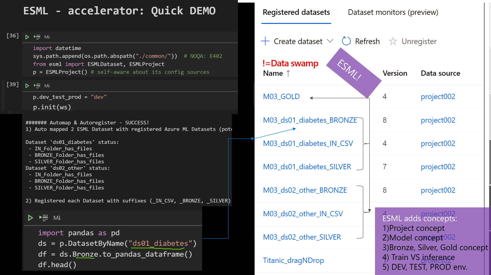

## `MLOps` - Example: compare model in DEV subscription with TEST subscription

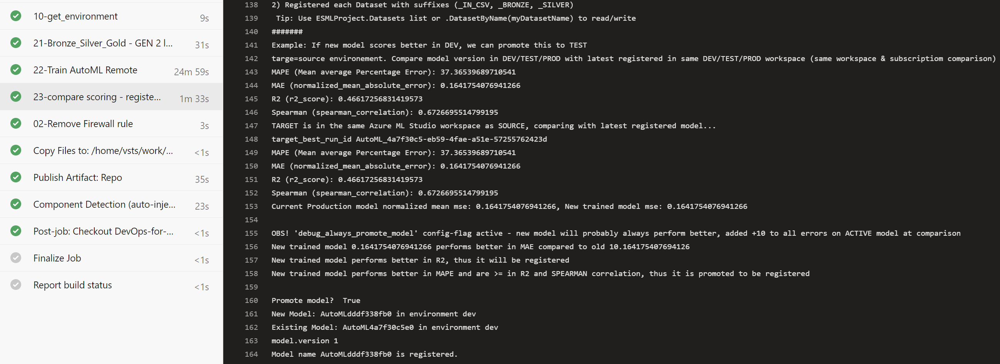

## `TEST_SET Scoring` to Azure ML Studio, as TAGS
- 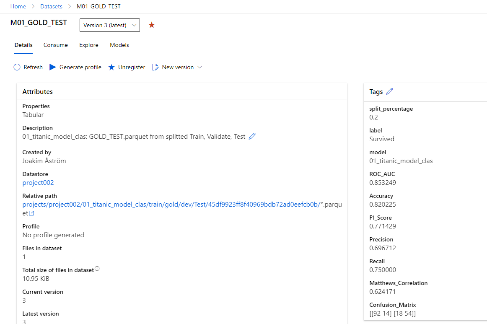
 
## `Scoring Drift / Concept Drift` to promote newly trained model (also as step in ESML MLOps pipeline)
- We can adjust WEIGHTS, and definition of what a BETTER model is, scoring wise.
- Example below, the newly trained model in DEV SCORED worse, than TARGET model in TEST environment, Promote=False.
- 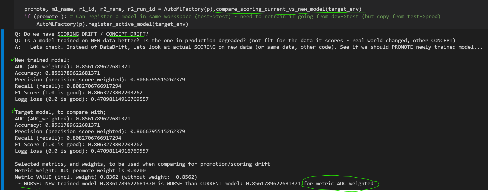

## `Settings`
- Besides there green circles, you have a config per environment (dev,test,prod) for COMPUTE power & and HYPERPARAMETER tuning needed (e.g. in DEV you might wanna have cheaper training runs)

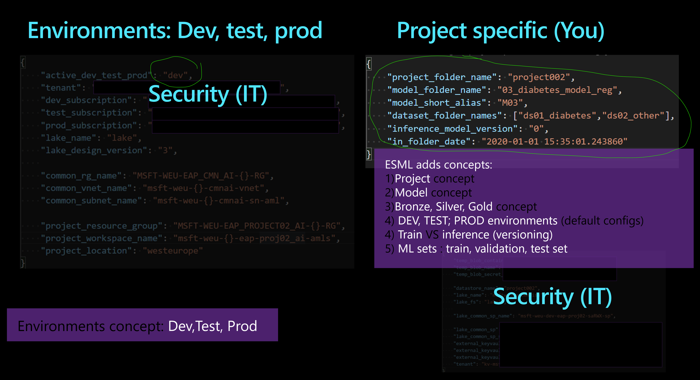
### Project/Model settings

#### Lake settings

- You switch model, or sub-project if you will with 1 line of code.
- To switch model `p.active_model = 10` to `p.active_model = 11` - and you are working towards other DATA, and other Azure ML Studio artifacts.

## "The BEST Model - according to YOU": Model_settings
- What: YOU define what "the best model" is. When ESML are comparing and promoting models, its based on YOUR `Model settings` with your `weights` that will decide `last registered model = best`
    - And, you can alwauys override this, to register an model of your choice manually - it'll become "the latest" and hence "the best" in the eyes of the ESML (when include in deployemnt for scoring pipleline )
- Purpose: For SCORING-DRIFT to know what metrics to use when COMPARING `compare_metrics` that YOU control, and can put `WEIGHTs` on also.
- See also the `"docs1"`, `"docs2"`,`"docs3"` text in image
- All else, you can set to 0.0 to have no `WEIGHTS` when comparing scoring for model A and B, to see if we want ot promote model A
- 

##### DATA: CONFIGURE `Date_Folder for DATA to use` (demo data is already configured)
- Per `ENVIRONMENT (dev,test,prod)` and per `TRAINING` and `INFERENCE` you can have different data, you can also `choose what MODEL_VERSION to score with`, at INFERENCE
- These .JSON files can be overridden by ESMLProject Constructor, and/or by putting these file in the ESML AutoLake's `active` folder
- 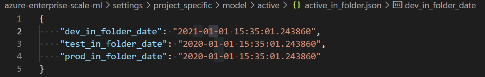
- 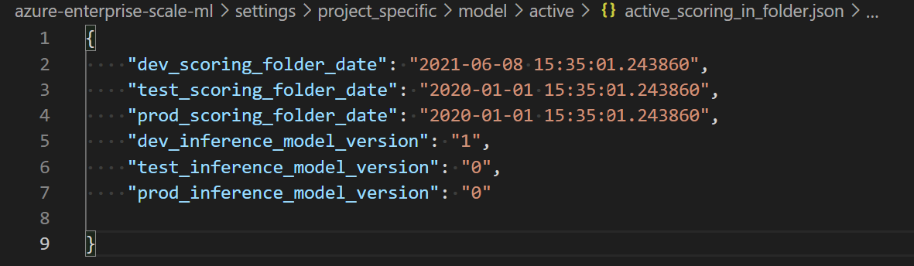

## DEPLOY to AKS - realtime & batch scoring
- You can deploy a model to AKS with 2 lines of code. 
- Then use this endpoint to inference, for a single row or batches of rows (that will be saved in the lake). See other inmages.
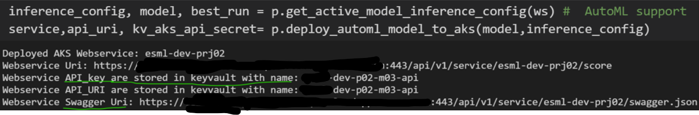

## Scoring - ONLINE or BATCH scoring, with same serving (AKS)
- `ONLINE/REALTIME`: Since you can deploy a model in ESML with 2 lines of code, it is easy to serve a model. Also it will use performance config for the environment you are targeting (DEV,TEST, PROD)
- `BATCH SCORING`: As an alternative of using an additional Azure ML pipeline to BATCH score, you can also use the AKS/Realtime endpoint for batch scoring
    - This, since ESML (defaults, but optionally) saves scored data to the datalake for you, as a GOLD_SCORED dataset, you can easily batch score data also
        - It saves scored data so you can retrieve it with FILTERs: `ByDate, ByCaller, By Model_version_used_that_day_for_scoring`

    - Note: Azure ML Pipelines are better for massive batchessince we can use PARALLELL RUNSTEP, to have 10 000 rows in 10 batches sored in parallell. It can also be more cost effective (since compute goes up & down to zero after scoring pipeline is done). 
        - Tip: BUT, If you want to achieve same principle of "parallell runstep" batches, you can of course as a caller just split the data into batches of 1000 rows each, and make 10 calls to the AKS online endpoint. AKS can handle parallell calls, and are great at auto-scaling. (But you need to handle the merge when getting the 10 results back)

- Here is an example how you can "BATCH SCORE", and tracking a CALLER_ID, using a specifi model_version to score with:

> 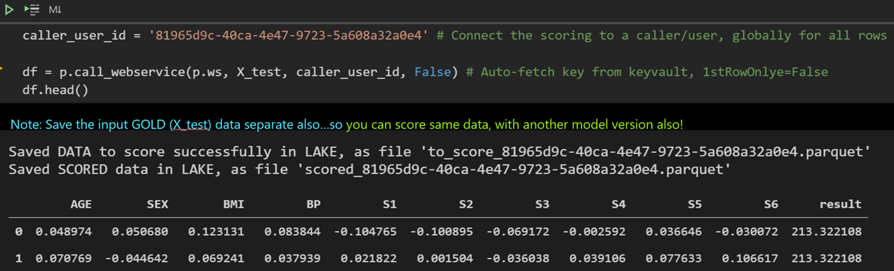

## `AutoLake - Inference Get scoring in Datalake`: FILTERS
- Get the data from `current environment (dev,test pr prod)`, p.dev_test_prod = "dev"

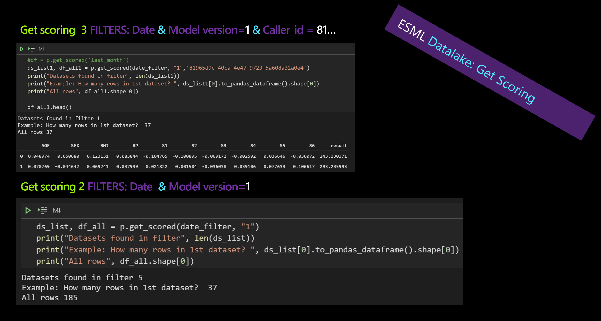

## `Datalake - Inference & lineage`: "under the hood"
- Q1:Where is the data saved automatically? 
- Q2: What do I need to fetch scored data? 
 - A: model_name + datatime_folder (and optionally a "caller_id" as filter)

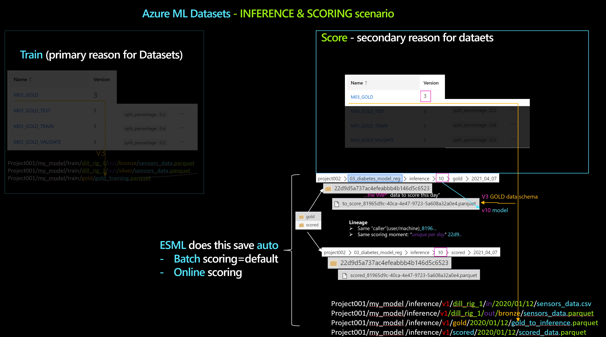
