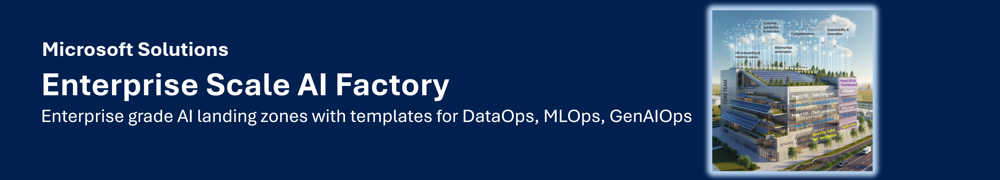
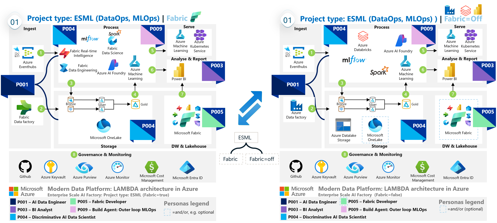
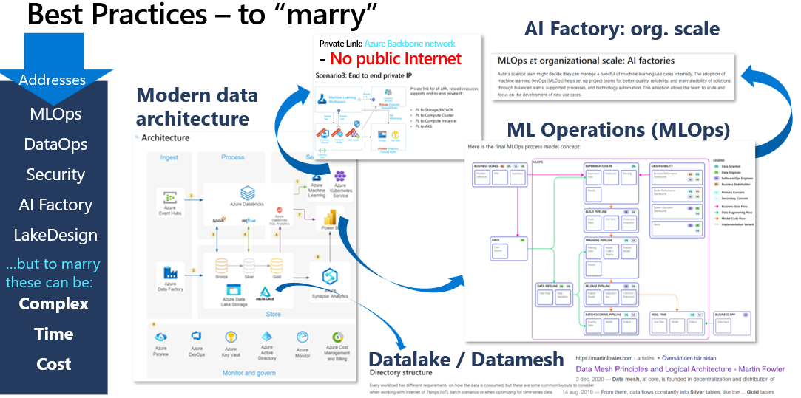
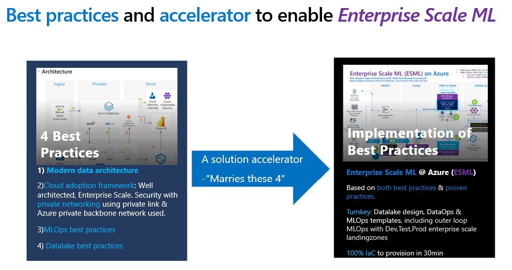
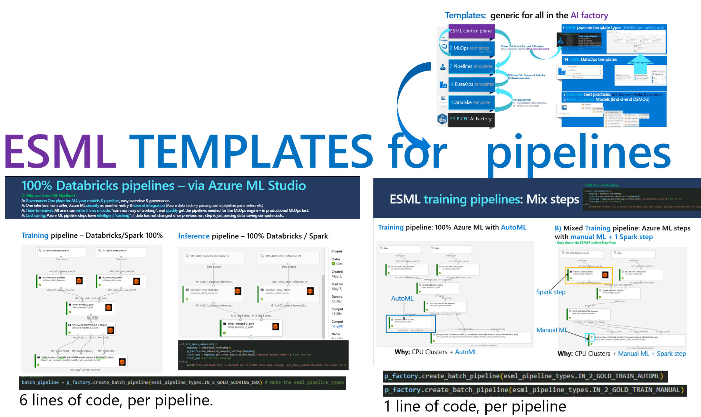

# Enterprise Scale AI Factory - submodule

Welcome to the official `Enterprise Scale AI Factory` repository.
This `Enterprise Scale AI Factory` repo is a plug and play solution that automates the provisioning, deployment, and management of AI projects on Azure with a template way of working.
- Plug and play accelerator for: AI ready landingzones with templates for DataOps, MLOps, GenAIOps to get an enterprise scale environment.

Usage: You can fork it, or use it as a submodule in your own repo.

> [!NOTE]
> **Tip**: Use the AIFactory Github Template repository to get a bootstrappd repo quickly (as a mirror repo, or "bring your own repo"). [AIFactory Template Repo](https://github.com/azure/enterprise-scale-aifactory). This bootstrap repo becomes your repo - using this as a sumobule repo.
>

[How-to SETUP](./documentation/v2/20-29/24-end-2-end-setup.md) 
[Documentation](./documentation/readme.md)

## This accelerator: Main purpose: 
1) `Marry multiple best practices & accelerators:` **Secure Enterprise Scale AI Landing Zones + Secure GenAIOps template**  ( since using a GenAIOps/LLMOps template based on unsecure infrastructure (no private endpoints/vNet) will not be compatible with secure infra )
    - It reuses multiple existing Microsoft accelerators/landingzone architecture and best practices such as CAF & WAF, and provides an end-2-end experience including Dev,Test, Prod environments.
    - All `PRIVATE` networking: Private endpoints for all services such as Azure Machine Learning, private AKS cluster, private Container registry, Storage, Azure data factory, Monitoring etc
        - Both for creating artifacts, training, and inference. To avoid data exfiltration, and have high network isolation
        - Docs: Securing Azure Machine Learning & its compute: https://learn.microsoft.com/en-us/azure/machine-learning/how-to-secure-training-vnet?view=azureml-api-1&tabs=instance%2Crequired
2) `Plug-and-play`: Dynamicallly create infra-resources per team, including networking dynamically, and RBAC dynamically
    - **IaC**: Multiple services `glued together` networkingwise and RBAC wise, in 2 secure baseline architectures (extendable/customizable) to cover all AI - both `Discriminative AI & Generative AI` including `DataOps`.
    - **Networking**: Dynamic Subnet/IP calculator, from vNet to Subnets, also with option to `BYOvNet`.
    - **Datalake design + Datamesh**: ACL permission on the datalake for a project team
    - **Role based access control**: The use of PERSONAS for access control, skilling. Read more: [https://learn.microsoft.com/en-us/azure/well-architected/ai/personas](https://aka.ms/wafai)
4) `Template way of working & Project way of working:` The AI Factory is `project based` (cost control, privacy, scalability per project) and provides <b>multiple templates</b> besides infrastructure template: `DataLake template, DataOps templates, MLOps templates`, with selectable project types.
    - `Same GenAIOps/MLOps` - if data scientists chooses to work from Azure Databricks, Microsoft Fabric or Azure Machine Learning - same template can be leveraged [Read more](#iac--mlops-templates-2019-templates-for-pipelines-in-project-type-esml)
    - `Common way of working, common toolbox, a flexible one`: A toolbox with a LAMBDA architecture with tools such as: Azure Datafactory, Azure Databricks, Azure Machine Learning, Eventhubs, AKS
5) `Enterprise scale & security & battle tested`: Used by customers and partners with MLOps since 2019 (see LINKS) to accelerate the development and delivery of AI solutions, with common tooling & marrying multiple best practices. Private networking (private endpoints), as default.

## Public links for more info
-	`AI factory - (Company: Epiroc)` - Microsoft Customer Story-Epiroc advances manufacturing innovation with AI Factory creating data heaven
    - [Microsoft Customer Story-Epiroc advances manufacturing innovation with AI Factory creating data heaven
    ](https://customers.microsoft.com/en-us/story/1653030140221000726-epiroc-manufacturing-azure-machine-learning)

-   `AI factory` - Technical BLOG
    - https://techcommunity.microsoft.com/t5/ai-machine-learning-blog/predict-steel-quality-with-azure-automl-in-manufacturing/ba-p/3616176

-	`Microsoft: AI Factory (CAF/MLOps)` documentation : Machine learning operations - Cloud Adoption Framework | Microsoft Learn
    - https://learn.microsoft.com/en-us/azure/cloud-adoption-framework/ready/azure-best-practices/ai-machine-learning-mlops#ai-factory-for-organization-machine-learning-operations

-	`Microsoft: AI Factory (Well-architected framework)` documentation : WAF AI workload - Well-architected Framework | Microsoft Learn
    - https://learn.microsoft.com/en-us/azure/well-architected/ai/personas
    
## Feature Roadmap

- **AdvancdePersonas**: Connect more `Personas` and `EntraID Security Groups` (within main personas: coreteam, project teams)
    - STATUS: Ongoing (2025-02)
- **BYOVnet**: Bring your own vNet in a separate resource group, instead of having the AI Factory create it.
    - STATUS: Completed (2024-05)
- **Shared Container Registry**: Optional flag, saving 30% run/idle cost per use case, by sharing container registry across Azure ML workspaces/Azure AI foundry
    - STATUS: Completed (2024-08)

 See [Feature list for all features](./documentation/v2/10-19/11-architecture-diagrams.md)

## AI Factory: Enterprise Scale Landing Zones Context (VWan option)
Currently there are 2 project types, template architectures (ESML, GenAI) that lives inside of the AIFactory landingzones. 
- There are 3 AIFactory AI landingzones: Dev, Stage, Production, where a project is represented.
- The AIFactory has a default scalabillity to automate the creation of ~200-300 AIFactory projects, in each environment. 
- One project is usually assigned to a team of 1-10 people with multiple use cases, but sometimes also to run an isolated use case.

## AI Factory project types: ESML, GenAI-1
These are the two 2 project types, template architectures (ESML, GenAI) that are automated (IaC) to be setup as AI Factory projects for a use case, team, or business unit.
-**ESML**: Enterprise Scale Machine Learning
-**GenAI**: Enteprise Scale GenAI

## ESML with FABRIC flavour
You can optionally setup the ESML project type with Microsoft Fabric, as below:

# Documentation: 
The [Documentation](./documentation/readme.md) is organized around ROLES via Doc series. 

| Doc series | Role | Focus | Details|
|------------|-----|--------|--------|
| 10-19 | `CoreTeam`|`Governance`| Setup of AI Factory. Governance. Infrastructure, networking. Permissions |
| 20-29 | `CoreTeam` | `Usage`| User onboarding & AI Factory usage. DataOps for the CoreTeam's data ingestion team |
| 30-39 | `ProjectTeam` | `Usage`| Dashboard, Available Tools & Services, DataOps, MLOps, Access options to the private AIFactory |
| 40-49 | `All`|`FAQ`| Various frequently asked questions. Please look here, before contacting an ESML AIFactory mentor. |

It is also organized via the four components of the ESML AIFactory: 

| Component | Role| Doc series
|-----------|--------|----|
| 1) Infra:AIFactory | CoreTeam | 10-19 |
| 2) Datalake template | All | 20-29,30-39 |
| 3) Templates for: DataOps, MLOps, *GenAIOps | All | 20-29, 30-39 |
| 4) Accelerators: ESML SDK (Python, PySpark), RAG Chatbot, etc  |ProjectTeam | 30-39 |

[LINK to Documentation](./documentation/readme.md)

## Best practices implemented & benefits
- Based on best & proven practices for organizational scale, across projects. 
    - Best practice: `CAF/AI Factory`: https://docs.microsoft.com/en-us/azure/cloud-adoption-framework/ready/azure-best-practices/ai-machine-learning-mlops#mlops-at-organizational-scale-ai-factories
    - Best practice: `Microsoft Intelligent Data Platform`: https://techcommunity.microsoft.com/t5/azure-data-blog/microsoft-and-databricks-deepen-partnership-for-modern-cloud/ba-p/3640280
        - `Modern data architecture with Azure Databricks and Azure Machine Learning`: https://docs.microsoft.com/en-us/azure/architecture/solution-ideas/articles/azure-databricks-modern-analytics-architecture
    - Best practice: `Datalake design`: https://docs.microsoft.com/en-us/azure/storage/blobs/data-lake-storage-best-practices
        - `Datamesh`: https://martinfowler.com/articles/data-mesh-principles.html
            - Credit to: Zhamak Dehghani
- ESML has a default scaling from 1-250 ESMLprojects for its `ESML AI Factory`. 
    - That said, the scaling roof is on IP-plan, and ESML has its own IP-calculator (allocated IP-ranges for 250 is just the default)
- `Enterprise "cockpit"` over ALL your projects & models. 
    - See what `state` a project are in (Dev,Test,Prod states) with `cost dashboard` per project/environment

# NEWS TABLE

|Date     |Category   | What   | Link   |
|------------|-----------|--------|--------|
|2025-03  |infra (IaC)|ADO YAML also supported for project type GenAI. Now GHA or ADO supports both ESML, GenAI-1 |[IaC orchestration](../azure-enterprise-scale-ml/environment_setup/aifactory/bicep/copy_to_local_settings/)|
|2024-10  |Best Practices| Well-Arhitected framework for AI| [WAF AI workload - AI Factory personas](./documentation/v2/20-29/25-personas.md)|
|2024-03  |Automation | Add project member & core team memeber| [Workflow diagram](./documentation/v2/10-19/13-flow-diagram-1.md)|
|2024-03  |Docs | New Docs v.2 | [Documentation](./documentation/v2/10_index.md)|
|2024-02  |infra (IaC) | NEW! ESGenAI project type: Azure AI Foundry+AI Search (RAG/Agentic) | [15-aifactory-overview.md](./documentation/v2/10-19/15-aifactory-overview.md) |
|2024-02  |Datalake - Onboarding |Auto-ACL on PROJECT folder in lakel|-|
|2023-03  |Networking|No Public IP: Virtual private cloud - updated networking rules| https://learn.microsoft.com/en-us/azure/machine-learning/v1/how-to-secure-workspace-vnet?view=azureml-api-1&preserve-view=true&tabs=required%2Cpe%2Ccli|
|2021-02  |ESML Pipeline templates|Azure Databricks: Training and Batch pipeline templates. 100% same support as AML pipeline templates (inner/outer loop MLOps)|-|
|2022-08  |infra (IaC)|ADO now support yaml for ESML|-|
|2022-10  |ESML MLOps |ESML MLOps v3 advanced mode, support for Spark steps ( Databricks notebooks / DatabrickStep )|-|

# BACKGROUND - How the accelerator started 2019
ESML stands for: Enterprise Scale ML. 

This accelerator was born 2019 due to a need to accelerated DataOps and MLOps. 

The accelerateor was then called ESML, We now only call this acceleration ESML, or project type=ESML, in the Entperise Scale AIFActory

## THE Challenge 2019
Innovating with AI and Machine Learning, multiple voices expressed the need to have an `Enterprise Scale AI & Machine Learning Platform` with `end-2-end` turnkey `DataOps` and `MLOps`.
Other requirements were to have an `enterprise datalake design`, able to `share refined data across the organization`, and `high security` and robustness: General available technology only, vNet support for pipelines & data with private endpoints. A secure platform, with a factory approach to build models. 

`Even if best practices exists, it can be time consuming and complex` to setup such a `AI Factory solution`, and when designing an analytical solution a private solution without public internet is often desired since working with productional data from day one is common, e.g. already in the R&D phase. Cyber security around this is important. 
-	`Challenge 1:` Marry multiple, 4, best practices
-	`Challenge 2:` Dev, Test, Prod Azure environments/Azure subscriptions
-	`Challenge 3:` Turnkey: Datalake, DataOps,  INNER & OUTER LOOP MLOps
Also, the full solution should be able to be provisioned 100% via `infrastructure-as-code`, to be recreated and scale across multiple Azure subscriptions, and `project-based` to scale up to 250 projects - all with their own set of services such as their own Azure machine learning workspace & compute clusters.

## THE Strategy 2019
To meet the requirements & challenge, multiple best practices needed to be married and implemented, such as: `CAF/WAF, MLOps, Datalake design, AI Factory, Microsoft Intelligent Data Platform / Modern Data Architecture.`

An open source initiative could help all at once, this open-source accelerator Enterprise Scale ML(ESML) -  `to get an AI Factory on Azure`

## THE Solution 2019 - TEMPLATES & Accelerator
`ESML` provides an `AI Factory` quicker (within 4-40 hours), with 1-250 ESMLProjects, an ESML Project is a set of Azure services glued together securely.
-	`Challenge 1 solved:` Marry multiple, 4, best practices
-	`Challenge 2 solved:` Dev, Test, Prod Azure environments/Azure subscriptions
-	`Challenge 3 solved:` Turnkey: Datalake, DataOps,  INNER & OUTER LOOP MLOps
`ESML marries multiple best practices` into one `solution accelerator`, with 100% infrastructure-as-code

### IaC & MLOps TEMPLATES 2019: Templates for PIPELINES in project type ESML
Same MLOps template can be used, since Azure Machine Learning pipelines supports DatabricksSteps, SynapseSparkStep/Fabric.

The below is how it looked like, when ESML automated both the infrastructure, and generating Azure machine learning pipelines, with 3 lines of code. 

TRAINING & INFERENCE pipeline templates types in ESML AIFactory that accelerates for the end-user. 
- 0.1% percentage of the code to write, to go from R&D process, to productional Pipelines: 

# Contributing to ESML AIFactory?
This repository is a push-only mirror. Ping Joakim Åström for contributions / ideas. 

Since "mirror-only" design, Pull requests are not possible, except for ESML admins. See LICENCE file (open source, MIT license) 
Speaking of open source, contributors:  
- Credit to `Sven Sowa` for contributing to the Powershells script to add all `private DNS zones to HUB` (essential automation when not running in standalone mode)
- Credit to `Sofara Zoentsoa` for contributing to the Github Actions translation from ADO pipeline for ESML-project type
- Credit to `Kim Berg` and `Ben Kooijman` for contributing! (kudos to the ESML IP calculator and Bicep additions for ESML-project type)
- Credit to `Christofer Högvall` for contributing! (kudos to the Powershell script, to enable Resource providers, if not exits)
    - `azure-enterprise-scale-ml\environment_setup\aifactory\bicep\esml-util\26-enable-resource-providers.ps1`
