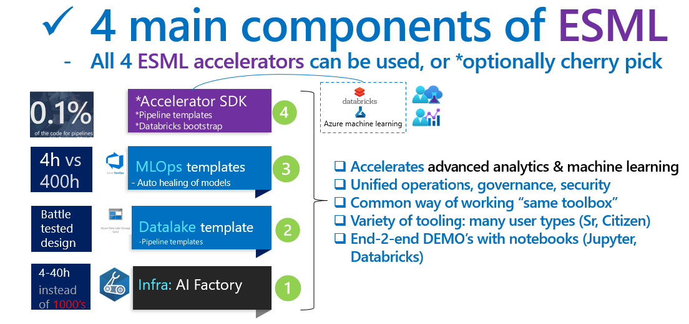
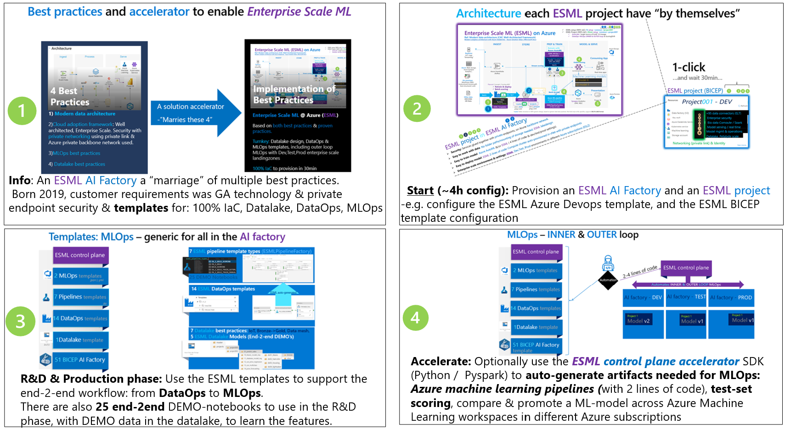
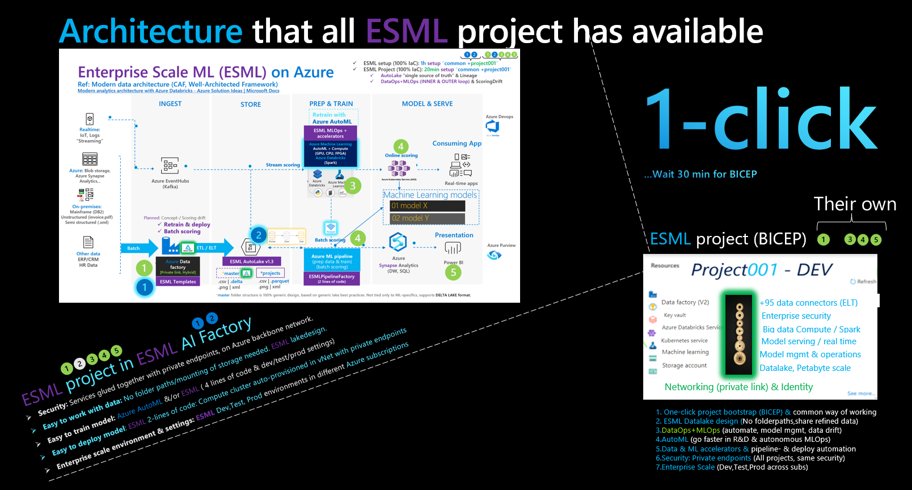

# Project: azure-enterprise-scale-ml (ESML) AI Factory 
The `Enterprise Scale AI Factory` is a plug and play solution that automates the provisioning, deployment, and management of AI projects on Azure with a template way of working.
- Plug and play accelerator for: DataOps, MLOps, LLMOps, enterprise scale environment.

## Main purpose: 
1) `Marry mutliple best practices & accelerators:` It reuses multiple existing Microsoft accelerators/landingzone architecture and best practices such as CAF & WAF, and provides an end-2-end experience including Dev,Test, Prod environments.
    - All `PRIVATE` networking: Private endpoints for all services such as Azure Machine Learning, private AKS cluster, private Container registry, Storage, Azure data factory, Monitoring etc
        - Both for creating artifacts, training, and inference. To avoid data exfiltration, and have high network isolation
        - Docs: Securing Azure Machine Learning & its compute: https://learn.microsoft.com/en-us/azure/machine-learning/how-to-secure-training-vnet?view=azureml-api-1&tabs=instance%2Crequired
2) `Plug-and-play`: Dynamicallly create infra-resources per team, including networking dynamically, and RBAC dynamically
    - Example of dynamicall: Subnet/IP calculator, ACL permission on the datalake for a project team, services "glued together"
4) `Template way of working & Project way of working:` The AI Factory is `project based` (cost control, privacy, scalability per project) and provides <b>multiple templates</b> besides infrastructure template: `DataLake template, DataOps templates, MLOps templates`, with selectable project types.
    - Sub-purpose: `Same MLOps` - weather data scientists chooses to work from Azure Databricks or Azure Machine Learning` - same MLOps template is used.
    - Sub-purpose: `Common way of working, common toolbox, a flexible one`: A toolbox with a LAMBDA architecture with tools such as: Azure Datafactory, Azure Databricks, Azure Machine Learning, Eventhubs, AKS
5) `Enterprise scale & security & battle tested`: Used by customers and partners with MLOps since 2019 (see LINKS) to accelerate the development and delivery of AI solutions, with common tooling & marrying multiple best practices. Private networking (private endpoints), as default.

## Public links for more info
-	`AI factory - setup in 60h (Company: Epiroc)` - End-2-End pipelines for use case: How-to
    - https://customers.microsoft.com/en-us/story/1653030140221000726-epiroc-manufacturing-azure-machine-learning

-   `AI factory` - Technical BLOG
    - https://techcommunity.microsoft.com/t5/ai-machine-learning-blog/predict-steel-quality-with-azure-automl-in-manufacturing/ba-p/3616176

-	`Microsoft: AI Factory (CAF/MLOps)` documentation : Machine learning operations - Cloud Adoption Framework | Microsoft Learn
    - https://learn.microsoft.com/en-us/azure/cloud-adoption-framework/ready/azure-best-practices/ai-machine-learning-mlops#ai-factory-for-organization-machine-learning-operations
    

# Documentation
The [Documentation](./documentation/v2/10_index.md) is organized around ROLES via Doc series. 

| Doc series | Role | Focus | Details|
|------------|-----|--------|--------|
| 10-19 | `CoreTeam`|`Governance`| Setup of AI Factory. Governance. Infrastructure, networking. Permissions |
| 20-29 | `CoreTeam` | `Usage`| User onboarding & AI Factory usage. DataOps for the CoreTeam's data ingestion team |
| 30-39 | `ProjectTeam` | `Usage`| Dashboard, Available Tools & Services, DataOps, MLOps, Access options to the private AIFactory |
| 40-49 | `All`|`FAQ`| Various frequently asked questions. Please look here, before contacting an ESML AIFactory mentor. |

It is also organized via the four components of the ESML AIFactory: 

| Component | Role| Doc series
|-----------|--------|----|
| 1) Infra:AIFactory | CoreTeam | 10-19 |
| 2) Datalake template | All | 20-29,30-39 |
| 3) Templates for: DataOps, MLOps, *LLMOps | All | 20-29, 30-39 |
| 4) Accelerators: ESML SDK (Python, PySpark), RAG Chatbot, etc  |ProjectTeam | 30-39 |

[LINK to Documentation](./documentation/v2/10_index.md)

## Best practices implemented & benefits
- Based on best & proven practices for organizational scale, across projects. 
    - Best practice: `CAF/AI Factory`: https://docs.microsoft.com/en-us/azure/cloud-adoption-framework/ready/azure-best-practices/ai-machine-learning-mlops#mlops-at-organizational-scale-ai-factories
    - Best practice: `Microsoft Intelligent Data Platform`: https://techcommunity.microsoft.com/t5/azure-data-blog/microsoft-and-databricks-deepen-partnership-for-modern-cloud/ba-p/3640280
        - `Modern data architecture with Azure Databricks and Azure Machine Learning`: https://docs.microsoft.com/en-us/azure/architecture/solution-ideas/articles/azure-databricks-modern-analytics-architecture
    - Best practice: `Datalake design`: https://docs.microsoft.com/en-us/azure/storage/blobs/data-lake-storage-best-practices
        - `Datamesh`: https://martinfowler.com/articles/data-mesh-principles.html
            - Credit to: Zhamak Dehghani
- ESML has a default scaling from 1-250 ESMLprojects for its `ESML AI Factory`. 
    - That said, the scaling roof is on IP-plan, and ESML has its own IP-calculator (allocated IP-ranges for 250 is just the default)
- `Enterprise "cockpit"` over ALL your projects & models. 
    - See what `state` a project are in (Dev,Test,Prod states) with `cost dashboard` per project/environment

# NEWS TABLE

|Date     |Category   | What   | Link   |
|------------|-----------|--------|--------|
|2024-03  |Automation | Add core team member| [26-add-esml-coreteam-member.ps1](./environment_setup/aifactory/bicep/esml-util/26-add-esml-coreteam-member.ps1)|
|2024-03  |Automation | Add project member| [26-add-esml-project-member.ps1](./environment_setup/aifactory/bicep/esml-util/26-add-esml-project-member.ps1)|
|2024-03  |Tutorial | Core-team tutorial  | [10-AIFactory-infra-subscription-resourceproviders.md](./documentation/10-AIFactory-infra-subscription-resourceproviders.md)|
|2024-03  |Tutorial | End-user tutorial  | [01-jumphost-vm-bastion-access.md](./documentation/01-jumphost-vm-bastion-access.md)|
|2024-03  |Tutorial | End-user tutorial  | [03-use_cases-where_to_start.md](./documentation/03-use_cases-where_to_start.md)|
|2024-02  |Tutorial | End-user installation Compute Instance | [R01-install-azureml-sdk-v1+v2.m](./documentation/01-install-azureml-sdk-v1+v2.md) |
|2024-02  |Datalake - Onboarding |Auto-ACL on PROJECT folder in lakel|-|
|2023-03  |Networking|No Public IP: Virtual private cloud - updated networking rules| https://learn.microsoft.com/en-us/azure/machine-learning/v1/how-to-secure-workspace-vnet?view=azureml-api-1&preserve-view=true&tabs=required%2Cpe%2Ccli|
|2023-02  |ESML Pipeline templates|Azure Databricks: Training and Batch  pipeline templates. 100% same support as AML pipeline templates (inner/outer loop MLOps)|-|
|2022-08  |ESML infra (IaC)|Bicep now support yaml as well|-|
|2022-10  |ESML MLOps |ESML MLOps v3 advanced mode, support for Spark steps ( Databricks notebooks / DatabrickStep )|-|

# TEMPLATES for PIPELINES
TRAINING & INFERENCE pipelines is 1 of 5 template types in ESML AIFactory that accelerates for the end-user. 
- 0.1% percentage of the code to write, to go from R&D process, to productional Pipelines: 

# THE Challenge
Innovating with AI and Machine Learning, multiple voices expressed the need to have an `Enterprise Scale AI & Machine Learning Platform` with `end-2-end` turnkey `DataOps` and `MLOps`.
Other requirements were to have an `enterprise datalake design`, able to `share refined data across the organization`, and `high security` and robustness: General available technology only, vNet support for pipelines & data with private endpoints. A secure platform, with a factory approach to build models. 

`Even if best practices exists, it can be time consuming and complex` to setup such a `AI Factory solution`, and when designing an analytical solution a private solution without public internet is often desired since working with productional data from day one is common, e.g. already in the R&D phase. Cyber security around this is important. 
-	`Challenge 1:` Marry multiple, 4, best practices
-	`Challenge 2:` Dev, Test, Prod Azure environments/Azure subscriptions
-	`Challenge 3:` Turnkey: Datalake, DataOps,  INNER & OUTER LOOP MLOps
Also, the full solution should be able to be provisioned 100% via `infrastructure-as-code`, to be recreated and scale across multiple Azure subscriptions, and `project-based` to scale up to 250 projects - all with their own set of services such as their own Azure machine learning workspace & compute clusters.

# THE Strategy
To meet the requirements & challenge, multiple best practices needed to be married and implemented, such as: `CAF/WAF, MLOps, Datalake design, AI Factory, Microsoft Intelligent Data Platform / Modern Data Architecture.`

An open source initiative could help all at once, this open-source accelerator Enterprise Scale ML(ESML) -  `to get an AI Factory on Azure`
# THE Solution - TEMPLATES & Accelerator
`ESML` provides an `AI Factory` quicker (within 4-40 hours), with 1-250 ESMLProjects, an ESML Project is a set of Azure services glued together securely.
-	`Challenge 1 solved:` Marry multiple, 4, best practices
-	`Challenge 2 solved:` Dev, Test, Prod Azure environments/Azure subscriptions
-	`Challenge 3 solved:` Turnkey: Datalake, DataOps,  INNER & OUTER LOOP MLOps
`ESML marries multiple best practices` into one `solution accelerator`, with 100% infrastructure-as-code

## ESML 4 main components:
  

## ESML AI Factory - 4 step process: 

 # ESML AI Factory "Oneslider": Dev,Test,Prod environments - Enterprise Scale LandingZones
- Easy to provision a new ESMLProject for Dev,Test,Prod with easy cost followup, since its own PROJECT resource groups for each `Project team` in the ESML `AI Factory`:
- Horisontally 3 COMMON environment (Dev,Test, Prod) and vertically ESMLProject 1-250
  

The Azure Devops/BICEP can optionally integrate with ITSM system as a "ticket" in ServiceNow/Remedy/JIRA Service Desk. The below info is needed for the ESML provisioning:

## ESML Architecture - "Modern data analytics platform"
Based on this reference architecture: https://docs.microsoft.com/en-us/azure/architecture/solution-ideas/articles/azure-databricks-modern-analytics-architecture

# Contributing to ESML AIFactory?
This repository is a push-only mirror. Ping Joakim Åström for contributions / ideas. 

Since "mirror-only" design, Pull requests are not possible, except for ESML admins. See LICENCE file (open source, MIT license) 
Speaking of open source, contributors:  
- Credit to `Kim Berg` and `Ben Kooijman` for contributing! (kudos to the ESML IP calculator and Bicep additions for esml-project type)
- Credit to `Christofer Högvall` for contributing! (kudos to the Powershell script, to enable Resource providers, if not exits)
    - `azure-enterprise-scale-ml\environment_setup\aifactory\bicep\esml-util\26-enable-resource-providers.ps1`

# Q: Is this for you? DataOps married with MLOps? Whats the benefits of the `ESML Controlplane SDK?`
- ESML "marries" DataOps + MLOps, with `templates` for both Azure Data factory and Azure machine learning pipeline templates - `ESML autogenereated Azure ML Pipelines`
- ESML Auto-provisions the AI Factory, with 100% BICEP, where you can `1-click` a new ESMLProject in Azure Devops, serviecs glued together with `private endpoints` (network & identity)
- ESML has MLOps: both `INNER` and `OUTER LOOP` (can `talk across Dev,Test, Prod Azure ML workspaces`)
- `ESML controlplane` can compare scoring from model in `DEV workspace` with `TEST workspace`, and register the model in an external workspace (this with also network security: vNets & private endpoints, NSG's, FW)
    - See image: 

# INTRO - Is this for you: refine data? AutoML or manual ML? R&D phase? 
**Q1:I want to use Azure AutoML, with MLOps ready to be `turned ON`** , with datalake design automatically generated for me, including `BRONZE, SILVER, GOLD` concept
- A: Yes. ESML is AutoML first, and have married this with MLOps, and an `AutoLake™` for Azure ML Studio.
- There is `22 DEMO notebooks` End-2-End MLOps, with Azure ML Pipelines, `using Azure datalake GEN 2 all the way` - from Azure datafactory, in Azure ML Pipelines/Datasets.

**Q2:I want to do ML, but <ins>only R&D phase</ins>** - I don't need MLOps or DEV,TEST, PROD environments. Can I still get benefits of ESML - get a quick DEV env & AutoLake?
- A: Yes. ESML is meant for quick R&D ( and if successful PoC -> quickly turn ON, to full enterprise scale MLOps solution
    - `Quick setup:` You can setup ESML for 1 environment only (have same subscriptionID for all 3).
        - Copy the `settings` & `notebook_demo` folder (but no need to copy MLOPS folder)
    - `R&D Mode:` Run ESML SDK with `ESMLProject.rnd=True`, and dataset-versioning will be turned off, but you still get a `AutoLake` with bronze, silver, gold concept. 

**Q3:I want to do ML, but <ins> NOT `AutoML`</ins> - just scikit learn, <ins>my own model</ins>.** Can I still leverage ESML, besides training step?
- A: Yes, you can wrap your TRAIN-step code, in an Azure ML Pipeline, as a Python step, or Databricks step, and still leverage the `AutoLake` and other `ESML accelerators`.
    - You have multiple options for your steps in this pipeline, besides automl_step, you have python_script_step, Databricks_script_step, estimator_step, synapse_spark_step, ...
    - Full list: https://docs.microsoft.com/en-us/python/api/azureml-pipeline-steps/azureml.pipeline.steps?view=azure-ml-py
- A: With that said, ESML has a *`AutoML` first* approach.
    - Using this accelerates more, and enables easier & cheaper governance (unattended retraining with auto-hyperparameter tuning)
 
**Q: How was this accelerator born, and what is it based on? It this for me?**
 - A:Working with multiple enterprise customers (aviation, manufacturing, space, energy and retail industry), we noticed common `non-industry-specific` challenges, to scale across projects, that ESML solves - an organizational scalability.
 
    * [X] ESML `extends` Azure Machine Learning via accelerators, organizational agnostic - since the `project/teams` concept in ESML.
    * [X] It extends at specific purposes: `data refinement/datalake/machine learning` to build faster. 
    * [X] Also adds `enterprise grade solution design & scalability` (dev,test, prod environments) - across subscriptions. 
    * [X] `An Enterprise Datalake, with ADLS GEN2, and logical evendriven DataMesh, with private endpoints security

Note: You can use this for any `enterprise grade` solution in need of single or multi-subscription solutions, with an `enterprise datalake` need, `DEV only` need, or `DEV->TEST->PROD` need.
- ESML was born out of these needs. Based on both Microsoft and open source `best practices` and customer `proven practices`
- Disclaimer:Although this have accelerated others, there is no guarantee it will accelerate your situtation. Read the MIT LICENCE file & Happy coding.

**Q6 ESML AI Factory: Can I just use the Azure ML SDK directly? Instead of the ESML SDK?** 
- Yes, You can bypass ESML SDK 100%  (the 5th ingredience) and only take advantage of the other ingredients (See ) the templates
# EDUCATION & Prerequisites (good to have in the `backpack`)
- Learning by doing is probably the best thing, but below some `Azure certificates` are listed good to have in the `backpack`
 - DP 100 https://docs.microsoft.com/en-us/learn/certifications/exams/dp-100
- There are also 6 ESML videos (in editing room), about ~1h each, hopefully up soon.
## ESML Accelerator benefits 
ESML has `MLOps embedded`, and adds `NEW` concepts to enrich Azure ML Studio: 
- EMSL enables `enterprise CONCEPTS` (Project/Model/Dev_Test_Prod)` - able to scale across Azure subscriptions in DEV, TEST, PROD for a model.
- ESML includes `accelerators for data refinement, with CONCEPTS`: Bronze, Silver, Gold, able to `share refined data ACROSS projects` & models
- ESML Pipeline factory `automatically` generates `Azure ML pipelines` of 7 types, with the data model `IN->Bronze->Silver-Gold` (we will refer to this as `IN_2_GOLD`)
- ESML includes *efficiency* `accelerators for ML CONCEPTS` such as `SCORE vs INFERENCE`,`ESMLPipelieFactory` (auto-creates pipeline), `Auto-Split to TRAIN,VALIDATE, TEST` (auto-register).
- ESML `marries` `MLOps` with `AutoML` - you get working MLOps template with support for Azure AutoML.
- You `don't need to remember folder paths` - since the ESML Datalake design and `automapping` of Azure ML Datasets, if you work with the `ESML SDK` (Python, Pyspark)

 - These datasets are automapped/autogenerated by ESML at `p.split_to_gold()` 
 - Same thing at feature engineering, at `esmldataset.Bronze.Save(dataframe_state)` - the Bronze dataset will be created, and a new version (if not p.rnd=True) is created for you.

# ESMLPipelineFactory
- This scoring pipeline is automatically ESML-generated, via only `2 lines of code`!! (This is possible due to the 4 ingrediences in ESML)
- If you have your data in IN in "GOLD" state, it will work `as-is`, but probably : ) you want to add your `data wrangling` per `IN_TO_SILVER` step, in the 1-M auto-generated `ds_name_by_config.py` scripts

Azure ML is great, it improves pipeline creation with 90% fewer lines of code to [https://azure.microsoft.com/en-us/services/machine-learning/#features](https://azure.microsoft.com/en-us/services/machine-learning/#features)

I love when I get asked to push the boundries, and asks where dropping in from multiple places: 
- Q: Azure Machine learning is great, but can ESML accelerate that even more? to make it even easier, less code, to create Azure mahcine learning pipelines? 
- A: Hm, lets try. Below is the result: (0.1% of the code, of the already 90% acceleration, to get the same `batch scoring pipeline`)
    - Currently in ESML there are 7 Azure ML pipeline types, that can be generated in the same manner - with 2 lines of code, for scoring, retraining, or just refine data, etc.
    

# WHAT is ESML Autolake™ ( Azure Datalake Storage GEN2 accelerator)
- It is based on Azure Datalake Storage GEN2, but includes a turnkey lake-design "skeleton" with concepts for ML (train, inference) and data refinement (Bronze, Silver, Gold), and enterprise scale concepts (incremental load, versioning, dev/test/prod). 
- It also has MASTER vs PROJECT concept, able to support both `DeltaLake` on Azure datalake GEN2 and `Azure ML pipelines with Azure Datalake GEN 2` Datastore.
- It is also automated for Azure ML Studio, to automatically register data as Azure ML Studio Datasets
    - Connected "per project & model". You see only your projects data.
- And it contains automated enterprise security ( uses Azure keyvault for secrets for you etc)
## `Automapping` Data to Azure ML Datasets - only possible due to the `ESML datalake`

## `MLOps` - Example: compare model in DEV subscription with TEST subscription

## `TEST_SET Scoring` to Azure ML Studio, as TAGS
- You can use ESML to `automatically calculate TEST-SET scoring`, 1 line of code (works for classification or regression), and this will be TAGGED on the Azure ML Dataset `GOLD_TEST` and also on the `Model`
- 
- 
 
## `Scoring Drift / Concept Drift` to promote newly trained model (also as step in ESML MLOps pipeline)
- We can adjust WEIGHTS, and definition of what a BETTER model is, scoring wise.
- Example below, the newly trained model in DEV SCORED worse, than TARGET model in TEST environment, Promote=False.
- 

## `Settings`
- Besides there green circles, you have a config per environment (dev,test,prod) for COMPUTE power & and HYPERPARAMETER tuning needed (e.g. in DEV you might wanna have cheaper training runs)
    - Defaults `enteprise settings` (dev,test,prod), is usually set & decided once, by an `enterprise architect`, and all `ESML Projects` inherits these, but can `override` them also, if use case needs that.
        - To override default `enteprise settings`, a projects sets the `project specific` settings.

### Project/Model settings

## The BEST Model - according to YOU": Model_settings
- What: YOU define what "the best model" is. When ESML are comparing and promoting models, its based on YOUR `Model settings` with your `weights` that will decide `last registered model = best`
    - And, you can alwauys override this, to register an model of your choice manually - it'll become "the latest" and hence "the best" in the eyes of the ESML (when include in deployemnt for scoring pipleline )
- Purpose: For SCORING-DRIFT to know what metrics to use when COMPARING `compare_metrics` that YOU control, and can put `WEIGHTs` on also.
- See also the `"docs1"`, `"docs2"`,`"docs3"` text in image
- All else, you can set to 0.0 to have no `WEIGHTS` when comparing scoring for model A and B, to see if we want ot promote model A
- 

## DEPLOY to AKS - realtime scoring
- You can deploy a model to AKS with 2 lines of code. All ESML projects has their own `private attached AKS cluster to Azure ML (BICEP)`
- ESML will also save the credentials & url directly `to the ESML Projects keuvault.`
- ESML environments: If you are in DEV environment, the default `enteprise settings` is a Dev_Test (1 node AKS-cluster), if TEST or PROD environment an `autoscale cluster` decided by `ESML core team`
    - Defaults `enteprise settings` settings, is usually set & decided once, by an `enterprise architect` in the ESML core team, and all `ESML Projects` inherits these, but can `override` them also, if use case needs that.

