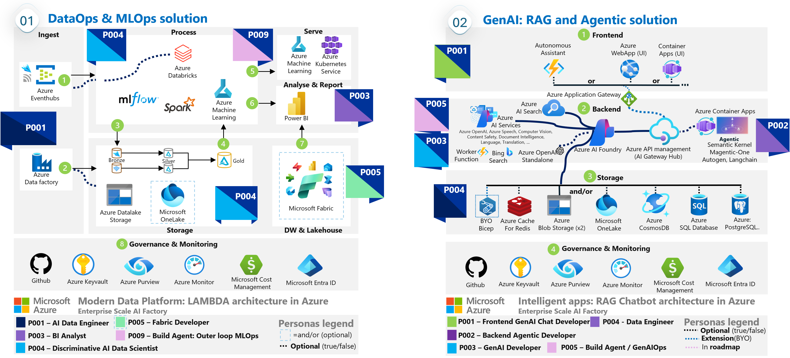

# Enterprise Scale AI Factory - submodule

Welcome to the official `Enterprise Scale AI Factory` repository. 
This AI landing zone, est 2019, and is WAF aligned. It has been designed and used since 2019 for Azure Public Cloud but can be leveraged in the Azure Government and Sovereign Cloud, by configuration. This is an application landingzone that works both with VWAN Hub or a traditional Hub/Spoke 

It is an enterprise scale solution for deploying AI Foundry with related services to create End-2-End agentic scenarios, into multiple isolated environments (Dev,Stage,Prod) with private networking in Azure. You may optionally add/remove services such as Azure Machine learning, AI Search or other services.

This `Enterprise Scale AI Factory` repo is a plug and play solution that automates the provisioning, deployment, and management of AI projects on Azure with a template way of working.
- AI ready landingzones with templates for DataOps, MLOps, GenAIOps to get an enterprise scale environment.

The deployed features follow [Microsoft's Well-Architected Framework WAF](https://learn.microsoft.com/en-us/azure/well-architected/ai/personas) to establish an isolated infrastructure intended to assist in moving from a Proof of Concept state to a production-ready application. It also includes templates for DataOps, MLOps and GenAIOps, compatible with the secure infra setup.

> [!NOTE]
> Since *Well-architected Framework* does not recommend using the Azure Developer CLI (`AZD`) for production purposes (or other dev/preview technology such as Azure Verified Module(`AVM`), we removed those, to only use GA `Azure CLI` with orchestrator pipelines in `Github Actions`or `Azure Devops pipelines`.
> Also both a Managed Identity and Service principal is created for your team, to be able to automate the full **GenAIOps process** (via the GenAIOps template)

The *AI Factory project* can have 1 or many resources *ENABLED=True* to get a *GenAI* baseline architecture automated in 10 minutes with resources: **AI Foundry, AI Services, AI Search** + 2 Storage accounts, Keyvault, Monitoring, Dashboards, Private networking - optionally hybrid mode with public user access.  
Via *AI Factory feature flags* you can add optional resources, re-run the Github action workflow (or Azure Devops pipeline) - to incrementally build your solution (e.g start without front-end in PoC). 

The resources that can be added in packages of configs, such as **ARCHITECTURES** seen in the image below: 
- **AI related**: Azure OpenAI (standalone), Azure Machine Learning, Bing Grounding, AI Search (on/off), Azure Speech, Azure Vision
- **Front end/Backend hosting**: Azure ContainerApps, Azure Webapp/function, AKS (fully private, and Azure Arc enabled)
- **Data & Databases**: Azure Cosmos DB, MongoDB, Azure SQL Database, PostgreSQL Flexible server, Azure cache for Redis
- **Integration & ELT/ETL/Streaming**: Logic Apps, Azure Datafactory, Databricks, EventHubs, APIM - AI Gateway Hub(integration & IaC), Microsoft Onelake (integration: Snowflake, S3, etc)

[How-to SETUP AI Factory](./documentation/v2/20-29/24-end-2-end-setup.md) 
- **Includes two setup modes:** *Fully private AI factory* or *Standalone AI Factory* (VPN, IP whitelist, Bastion, or Hybrid access)
- **Supports both Github Actions or Azure Devops** as orchestrator to kick-off network calculation and the IaC (BICEP)
- **AI Factory Configuration Wizard** Setup in minutes, intelligent workflow-drivern setup Wizard 

[How-to UPDATE AI factory](./documentation/v2/20-29/26-update-AIFactory.md) - When a new feature arrives, or fix for breaking changes in a product?
- See RELEASES - for Latest, recommended version.

[Quickstart Documentation](https://jostrm.github.io/azure-enterprise-scale-ml/)

[Full Documentation](./documentation/readme.md) 

*Figure*: Each team in the AI Factory, have their own *floor* with either architecture 01 or 02, and each team can own multiple floors. You may *turn ON/OFF* services, and add them later via feature flags & re-run pipeline.

> [!TIP]
> **Tip**: Use the AIFactory Github Template repository to get a bootstrapped repo quickly (as a mirror repo, or "bring your own repo"). [AIFactory Template Repo](https://github.com/azure/enterprise-scale-aifactory). This bootstrap repo becomes your repo - using this as a submodule repo.
>

  
<b>This accelerator: Main purpose</b>

## This accelerator: Main purpose: 
1) `Marry multiple best practices & accelerators:` **Secure Enterprise Scale AI Landing Zones + Secure GenAIOps template**  ( since using a GenAIOps/LLMOps template based on unsecure infrastructure (no private endpoints/vNet) will not be compatible with secure infra )
    - It reuses multiple existing Microsoft accelerators/landingzone architecture and best practices such as CAF & WAF, and provides an end-2-end experience including Dev,Test, Prod environments.
    - All `PRIVATE` networking: Private endpoints for all services such as Azure Machine Learning, private AKS cluster, private Container registry, Storage, Azure data factory, Monitoring etc
        - Both for creating artifacts, training, and inference. To avoid data exfiltration, and have high network isolation
        - Docs: Securing Azure Machine Learning & its compute: https://learn.microsoft.com/en-us/azure/machine-learning/how-to-secure-training-vnet?view=azureml-api-1&tabs=instance%2Crequired
2) `Plug-and-play`: Dynamically create infra-resources per team, including networking dynamically, and RBAC dynamically
    - **IaC**: Multiple services `glued together` networkingwise and RBAC wise, in 2 secure baseline architectures (extendable/customizable) to cover all AI - both `Discriminative AI & Generative AI` including `DataOps`.
    - **Networking**: Dynamic Subnet/IP calculator, from vNet to Subnets, also with option to `BYOvNet`.
    - **Datalake design + Datamesh**: ACL permission on the datalake for a project team
    - **Role based access control**: The use of PERSONAS for access control, skilling. Read more: [https://learn.microsoft.com/en-us/azure/well-architected/ai/personas](https://aka.ms/wafai)
4) `Template way of working & Project way of working:` The AI Factory is `project based` (cost control, privacy, scalability per project) and provides <b>multiple templates</b> besides infrastructure template: `DataLake template, DataOps templates, MLOps templates`, with selectable architectures.
    - `Same GenAIOps/MLOps` - if data scientists chooses to work from Azure Databricks, Microsoft Fabric or Azure Machine Learning - same template can be leveraged [Read more](#iac--mlops-templates-2019-templates-for-pipelines-in-project-type-esml)
    - `Common way of working, common toolbox, a flexible one`: A toolbox with a LAMBDA architecture with tools such as: Azure Datafactory, Azure Databricks, Azure Machine Learning, Eventhubs, AKS
5) `Enterprise scale & security & battle tested`: Used by customers and partners with MLOps since 2019 (see LINKS) to accelerate the development and delivery of AI solutions, with common tooling & marrying multiple best practices. Private networking (private endpoints), as default.

## Public links - AI Factory in CAF, WAF and customer examples
-	`AI factory - (Company: Epiroc)` - Microsoft Customer Story-Epiroc advances manufacturing innovation with AI Factory creating data heaven
    - [Microsoft Customer Story-Epiroc advances manufacturing innovation with AI Factory creating data heaven
    ](https://customers.microsoft.com/en-us/story/1653030140221000726-epiroc-manufacturing-azure-machine-learning)

-	`Microsoft: AI Factory (CAF/MLOps)` documentation : Machine learning operations - Cloud Adoption Framework | Microsoft Learn
    - https://learn.microsoft.com/en-us/azure/cloud-adoption-framework/ready/azure-best-practices/ai-machine-learning-mlops#ai-factory-for-organization-machine-learning-operations

-	`Microsoft: AI Factory (Well-architected framework, AI workload)` WAF AI workload - Well-architected Framework | Microsoft Learn
    - https://learn.microsoft.com/en-us/azure/well-architected/ai/personas

-   `AI factory` - Technical BLOG
    - https://techcommunity.microsoft.com/t5/ai-machine-learning-blog/predict-steel-quality-with-azure-automl-in-manufacturing/ba-p/3616176

## AI Factory: Enterprise Scale Landing Zones Context (VWan option)
There are **3 AIFactory AI landingzones: Dev, Stage, Production**, depicted in the image below, where AI Factory projects are deployed.
- **AI Factory architectures**: Currently there are 2 architectures, template architectures (ESML, GenAI) that lives inside of the AIFactory landingzones. 
- **Scale**: The AIFactory has a default scalability to automate the creation of ~200-300 AIFactory projects, in each environment, with **AI Factory scale sets**
    - Example: One project is usually assigned to a team of 1-10 people with 1 isolated use case, or multiple use cases.

## AI Factory architectures: ESML, GenAI-1
These are the two 2 architectures, template architectures (ESML, GenAI) optionally automated partly or fully (IaC) as AI Factory projects (AI Landingzone with 1 or both) for a use case, team, or business unit, on its own Azure Subscription.
- **ESML**: Enterprise Scale Machine Learning
- **GenAI**: Enterprise Scale GenAI
    - Baseline: **AI Foundry, AI Services, AI Search** (Storage, Keyvault, Monitoring, Dashboards, Private networking)
        - **AI Foundry**: It deploys Azure AI Foundry (hub and default project) into a virtual network with all dependent services connected via private endpoints (optionally Private DNS Zones centralized or standalone)
        -  **WAF AI:** It configures AI Foundry adhering to the best practices outlined in the Well Architected Framework - WAF([WAF AI - Enterprise Scale AI Factory](https://learn.microsoft.com/en-us/azure/well-architected/ai/personas)) and pre-connects to other services and tools.
    - Provides the ability to add additional Azure services **both during initial deployment and after**, configured to connect via isolation to enrich your AI project.
        - You may *turn ON/OFF* services, and add them later, meaning you may start in a PoC without front end services to setup your RAG scenario, and later add ContainerApps simply by configuring 1 feature flag: **enableContainerApps=true**, and re-run the pipeline.

The services that can be added on top of the **BASELINE** can be seen in the image 
- **AI related**: Azure OpenAI (standalone), Azure Machine Learning, Bing Grounding, AI Search (on/off), Azure Speech, Azure Vision
- **Front end/Backend hosting**: Azure ContainerApps, Azure Webapp/function, AKS
- **Data & Databases**: Azure Cosmos DB, MongoDB, Azure SQL Database, PostgreSQL Flexible server, Azure cache for Redis
- **Integration & ELT/ETL/Streaming**: Azure Datafactory, Databricks, EventHubs, APIM - AI Gateway Hub(integration & IaC), Microsoft Onelake (integration: Snowflake, S3, etc)
        

## ESML with FABRIC flavour
You can optionally setup the ESML project type with Microsoft Fabric, as below:

  
<b>Documentation</b>

# Documentation: 
The [Documentation](./documentation/readme.md) is organized around ROLES via Doc series. 

| Doc series | Role | Focus | Details|
|------------|-----|--------|--------|
| 10-19 | `CoreTeam`|`Governance`| Setup of AI Factory. Governance. Infrastructure, networking. Permissions |
| 20-29 | `CoreTeam` | `Usage`| User onboarding & AI Factory usage. DataOps for the CoreTeam's data ingestion team |
| 30-39 | `ProjectTeam` | `Usage`| Dashboard, Available Tools & Services, DataOps, MLOps, Access options to the private AIFactory |
| 40-49 | `All`|`FAQ`| Various frequently asked questions. Please look here, before contacting an ESML AIFactory mentor. |

It is also organized via the four components of the ESML AIFactory: 

| Component | Role| Doc series
|-----------|--------|----|
| 1) Infra:AIFactory | CoreTeam | 10-19 |
| 2) Datalake template | All | 20-29,30-39 |
| 3) Templates for: DataOps, MLOps, *GenAIOps | All | 20-29, 30-39 |
| 4) Accelerators: ESML SDK (Python, PySpark), RAG Chatbot, etc  |ProjectTeam | 30-39 |

[LINK to Documentation](./documentation/readme.md)

## Best practices implemented & benefits
- Based on best & proven practices for organizational scale, across projects. 
    - Best practice: `CAF/AI Factory`: https://docs.microsoft.com/en-us/azure/cloud-adoption-framework/ready/azure-best-practices/ai-machine-learning-mlops#mlops-at-organizational-scale-ai-factories
    - Best practice: `Microsoft Intelligent Data Platform`: https://techcommunity.microsoft.com/t5/azure-data-blog/microsoft-and-databricks-deepen-partnership-for-modern-cloud/ba-p/3640280
        - `Modern data architecture with Azure Databricks and Azure Machine Learning`: https://docs.microsoft.com/en-us/azure/architecture/solution-ideas/articles/azure-databricks-modern-analytics-architecture
    - Best practice: `Datalake design`: https://docs.microsoft.com/en-us/azure/storage/blobs/data-lake-storage-best-practices
        - `Datamesh`: https://martinfowler.com/articles/data-mesh-principles.html
            - Credit to: Zhamak Dehghani
- Enterprise Scale AI Factory has a default scaling from 1-250 projects, but scales with "Azure subscription" called "Scale sets" in the AI Factory 
    - That said, the default scaling roof is on IP-plan, the AI Factory has its own IP-calculator (allocated IP-ranges for 250 is just the default)
- `Enterprise "cockpit"` over ALL your projects & models. 
    - See what `state` a project are in (Dev,Test,Prod states) with `cost dashboard` per project/environment

  
<b>Background: How the accelerator started 2019</b>

# BACKGROUND - How the accelerator started 2019
ESML stands for: Enterprise Scale ML. 

This accelerator was born 2019 due to a need to accelerate DataOps and MLOps. 

The accelerator was then called ESML. We now only call this acceleration ESML, or project type=ESML, in the Enterprise Scale AIFactory

## THE Challenge 2019
Innovating with AI and Machine Learning, multiple voices expressed the need to have an `Enterprise Scale AI & Machine Learning Platform` with `end-2-end` turnkey `DataOps` and `MLOps`.
Other requirements were to have an `enterprise datalake design`, able to `share refined data across the organization`, and `high security` and robustness: General available technology only, vNet support for pipelines & data with private endpoints. A secure platform, with a factory approach to build models. 

`Even if best practices exists, it can be time consuming and complex` to setup such a `AI Factory solution`, and when designing an analytical solution a private solution without public internet is often desired since working with productional data from day one is common, e.g. already in the R&D phase. Cyber security around this is important. 
-	`Challenge 1:` Marry multiple, 4, best practices
-	`Challenge 2:` Dev, Test, Prod Azure environments/Azure subscriptions
-	`Challenge 3:` Turnkey: Datalake, DataOps,  INNER & OUTER LOOP MLOps
Also, the full solution should be able to be provisioned 100% via `infrastructure-as-code`, to be recreated and scale across multiple Azure subscriptions, and `project-based` to scale up to 250 projects - all with their own set of services such as their own Azure machine learning workspace & compute clusters.

## THE Strategy 2019
To meet the requirements & challenge, multiple best practices needed to be married and implemented, such as: `CAF/WAF, MLOps, Datalake design, AI Factory, Microsoft Intelligent Data Platform / Modern Data Architecture.`

An open source initiative could help all at once, this open-source accelerator Enterprise Scale ML(ESML) -  `to get an AI Factory on Azure`

## THE Solution 2019 - TEMPLATES & Accelerator
`ESML` provides an `AI Factory` quicker (within 4-40 hours), with 1-250 ESMLProjects, an ESML Project is a set of Azure services glued together securely.
-	`Challenge 1 solved:` Marry multiple, 4, best practices
-	`Challenge 2 solved:` Dev, Test, Prod Azure environments/Azure subscriptions
-	`Challenge 3 solved:` Turnkey: Datalake, DataOps,  INNER & OUTER LOOP MLOps
`ESML marries multiple best practices` into one `solution accelerator`, with 100% infrastructure-as-code

### IaC & MLOps TEMPLATES 2019: Templates for PIPELINES in project type ESML
Same MLOps template can be used, since Azure Machine Learning pipelines supports DatabricksSteps, SynapseSparkStep/Fabric.

The below is how it looked like, when ESML automated both the infrastructure, and generating Azure machine learning pipelines, with 3 lines of code. 

TRAINING & INFERENCE pipeline templates types in ESML AIFactory that accelerates for the end-user. 
- 0.1% percentage of the code to write, to go from R&D process, to productional Pipelines: 

# Contributing to ESML AIFactory?
This repository is a push-only mirror. Ping Joakim Åström for contributions / ideas. 

Since "mirror-only" design, Pull requests are not possible, except for ESML admins. See LICENCE file (open source, MIT license) 
Speaking of open source, contributors:  
- Credit to `Marta Boryczko` for contributing with testing and designing extensions such as BYOSubnets, BYOAse. 
- Credit to `Sven Sowa` for contributing to the Powershells script to add all `private DNS zones to HUB` (essential automation when not running in standalone mode)
- Credit to `Christofer Högvall` for contributing! (kudos to the Powershell script, to enable Resource providers, if not exists)
    - `azure-enterprise-scale-ml\environment_setup\aifactory\bicep\esml-util\26-enable-resource-providers.ps1`
- Credit to `Sofara Zoentsoa` for contributing to the Github Actions translation from ADO pipeline for ESML-project type
- Credit to `Kim Berg` and `Ben Kooijman` for contributing! (kudos to the ESML IP calculator and Bicep additions for ESML-project type)
