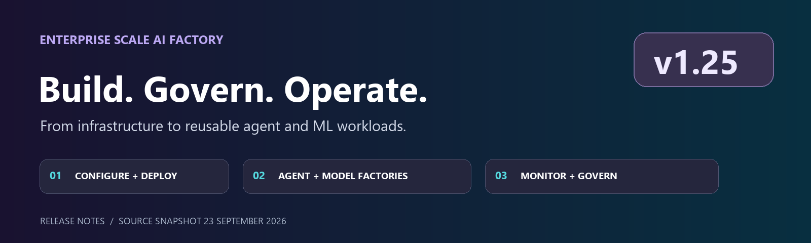
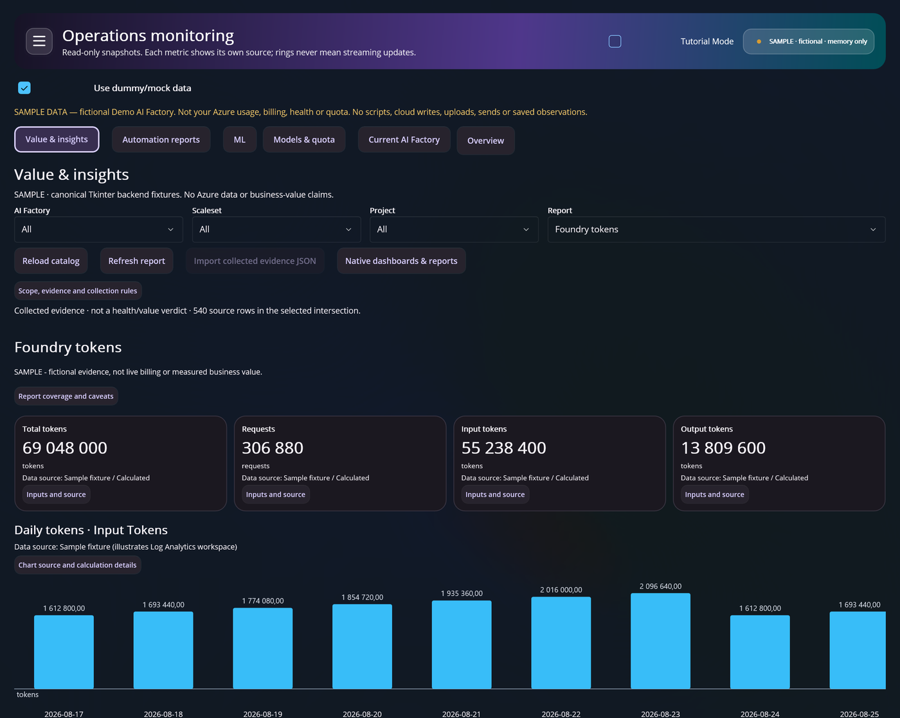
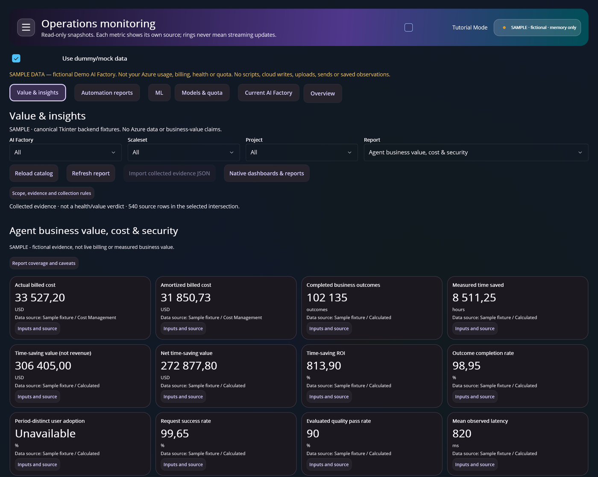

# AI Factory v1.25

### Build, govern and operate reusable AI workloads



**Release notes** &nbsp; | &nbsp; **23 September 2026 source snapshot** &nbsp; | &nbsp; [Compare with main](ROADMAP_MAIN.md)

v1.25 brings the platform and the workload closer together. Configure your factory through JSON, desktop or API; start from reusable agent and ML code; and operate with clearer usage, cost and monitoring evidence.

This release builds on v1.24 and its v1.24.1 patch. It adds new application patterns and operating workflows while extending the private-networking, identity and FinOps foundation you already have.

| Reviewed source | Baseline | Publication status |
|---|---|---|
| [`release/v1.25` at `1bd9020e`](https://github.com/jostrm/azure-enterprise-scale-ml/tree/1bd9020e009036427763a0f66b2b2449ca38f288) | [v1.24 notes, including v1.24.1](RELEASE_124.md) | Branch snapshot; no release date or GA designation inferred |

> [!IMPORTANT]
> **Choose your target explicitly.** Some version defaults still point to v1.24. Source availability does not imply deployment in your tenant. Review the [upgrade checklist](#upgrade-checklist-and-compatibility-caveats) before adopting.

**Explore:** [At a glance](#at-a-glance) · [Documentation](#start-here-new-and-updated-documentation) · [Setup and lifecycle](#configure-and-deploy-with-more-control) · [Desktop and API](#operate-from-desktop-cli-or-api) · [Agents](#build-with-agent-factory) · [ML and data](#build-with-ml-model-factory) · [Monitoring](#see-usage-cost-and-model-health-in-context) · [Gateway and fixes](#strengthen-gateway-and-private-platform-operations) · [Upgrade](#upgrade-checklist-and-compatibility-caveats)

## At a glance

| For your team | What changes | Why it matters |
|---|---|---|
| **Platform engineering** | JSON-first setup, end-to-end bootstrap and registered factory layouts | Make configuration, identity and lifecycle decisions explicit |
| **Application developers** | Agent Factory, source-bound RAG and private read-only MCP | Start from reusable code with defined data and tool boundaries |
| **Data scientists and ML engineers** | Model Factory, versioned lake, Delta/ESML v2 and model-selection gates | Connect reproducible data inputs to evidence-based model decisions |
| **Platform operations** | Native token/workbook views, scoped monitoring and dashboard-only refresh | Understand the source and scope of each metric without redeploying the whole platform |
| **Automation owners** | MAUI preview, Python CLI/SDK and runnable API examples | Use a supported interaction model rather than hand-editing every workflow |

---

## Start here: new and updated documentation

**[Set up AI Factory][setup]** &nbsp; / &nbsp; **[Update AI Factory][update]** &nbsp; / &nbsp; **[Agent use-case code][agents]** &nbsp; / &nbsp; **[ML use-case code][models]**

Start with the task you want to complete. Every link is pinned to the reviewed commit, so the guidance stays attached to this release.

<details>
<summary><strong>Browse all new and updated guides</strong> - installation, APIs, use cases and operations</summary>

**New/updated** describes the documentation change since the baseline-note revision, not necessarily the age of the underlying concept.

| What you want to do | Documentation | Change |
|---|---|---|
| Set up AI Factory | [End-to-end setup][setup] | Updated: prerequisites, bootstrap, registered/legacy layouts and private-access hub |
| Update AI Factory | [Update an existing AI Factory][update] | Updated: feature refresh, project-only execution, version selection and environment promotion |
| Install the desktop application | [Windows 11 MAUI installer][maui] | New: installer, three companion `.bin` files, checksums and prerequisites |
| Automate operations | [CLI/API overview][cli-overview], [CLI/SDK reference][cli], [runnable API examples][api] | New: Python, PowerShell, HTTP and Node.js usage |
| Understand configuration and identity | [JSON pipeline configuration][json] | New: canonical configuration, runtime projection and provider identity boundaries |
| Start with agent use-case code | [Agent Factory code and quickstart][agents], [agents/tools reference][agent-reference] | New: prompt, hosted and multi-agent patterns |
| Build private RAG and tool access | [RAG example][rag], [private Azure MCP example][mcp] | New: pinned sources, retrieval provenance and scoped tools |
| Start with ML use-case code | [ML Model Factory code and quickstart][models] | New: Azure ML v2 and Databricks scenarios |
| Onboard data and operate ML | [Versioned lake][lake] -> [DataOps][dataops] -> [MLOps / ESML v2][mlops] | Updated: immutable inputs, Delta, shareback and selection gates |
| Monitor usage, cost and models | [Dashboards and monitoring][dashboards], [Foundry usage PDF report][usage] | Updated dashboards; new project usage-report guide |
| Configure AI Gateway policies | [APIM Azure OpenAI pool][apim], [optional Kong edge][kong] | New: backend pools, token controls and edge integration |
| Follow the UX walkthrough | [Tutorial manuscript][tutorial] | New: explicitly distinguishes implemented, proposed and blocked scenes |

The tutorial is a manuscript, not a completed training film. Some linked guides contain downloads targeting mutable `main`; use an approved matching commit/version for the actual installation.

</details>

---

## Configure and deploy with more control

**IMPROVED: configuration and pipelines** &nbsp; | &nbsp; **NEW: bootstrap and registered lifecycle**

Reduce the distance between the configuration you review and the environment you intend to deploy. v1.25 makes factory structure, provider identity and lifecycle scope more explicit.

### JSON-first configuration and pipeline alignment

`environment_setup/aifactory/variables.json` becomes the central configuration source for common/project settings and runtime projections. Azure DevOps and GitHub Actions gain synchronized project-pipeline behavior and safer configuration-update flows.

Identity routing is explicit: GitHub Actions resolves the relevant identity before OIDC login; the Azure DevOps service connection is selected before runtime and still needs separate authorization for each applicable scale set. Configuration review is not a substitute for provider permissions.

**Documentation:** [JSON configuration and identity isolation][json], [update workflow][update].  
**Representative commits:** `90b0e53c`, `6c704c32`, `8810505b`.

### End-to-end bootstrap and private access

Bootstrap workflows coordinate provider registration, federated identity, seeding Key Vault, team group, provider configuration, common infrastructure and a first project. Private-access hub support includes integrated/external hub options, private DNS, Entra-authenticated point-to-site VPN, DNS Private Resolver and peering.

Cross-tenant Azure DevOps bootstrap separates Azure and ADO tenant contexts. Graph-free reruns can reuse known identity IDs. Windows/Git Bash handling, Azure PowerShell compatibility, VPN-import idempotency and peerable network templates receive reliability fixes.

These are explicit deployment operations and can create billable Azure resources. Cross-tenant bootstrap support does not imply that every API deployment route supports cross-tenant ADO.

**Documentation:** [Set up AI Factory end-to-end][setup].  
**Representative commits:** `16bbface`, `e56f1564`, `e3a7b6ca`, `1ca3aa3f`.

### Registered factories and guarded lifecycle operations

Registered layout adds `azurefactory/register.json` and explicit factory/scale-set/project projections while retaining the legacy `aifactory` layout. Lifecycle workflows use reviewed provider targets, exact published commits, protected manifests and receipts.

Enrollment and configuration-editing flows add plan/ensure operations, approved role scopes, federation and coordination enrollment, plus separately reviewed binding publication. Enrollment does **not** itself create runners, networks or workloads, and does not automatically publish provider bindings.

An empty register is configuration, not a deployed factory. Changing a version does not migrate directories. Robot/web/app factory types are extension points, not implemented deployment engines.

**Documentation:** [Setup and layout migration][setup], [CLI operations and blockers][cli], [API examples][api].  
**Representative commits:** `c6bca510`, `7550981d`, `c32e7224`, `55a4ac92`.

---

## Operate from desktop, CLI or API

**NEW: Windows desktop distribution, CLI/SDK and integration examples**

Choose a guided desktop experience for interactive work or script the same operational concepts into your own tooling.

The Windows 11 x64 MAUI installer packages the desktop experience and Python API. This is an **unsigned preview**, distributed as an installer rather than a maintained MAUI source snapshot in the release tree. Obtain the installer and all three companion `.bin` files together.

The Python 3.10+ CLI/SDK is standard-library-only and exposes review/confirm/poll flows. API examples demonstrate configuration, catalog and lifecycle integration from HTTP, Python, PowerShell and Node.js. Use capability discovery/`doctor` because an installed desktop API can lag source documentation.

**Documentation:** [MAUI installation][maui], [CLI/API overview][cli-overview], [CLI reference][cli], [runnable examples][api].  
**Representative commits:** `95763595`, `1f64c384`, `cb5b9c4a`.

---

## Build with Agent Factory

**NEW: reusable agent code, source-bound RAG and private MCP**

Start with a concrete application pattern instead of an empty Foundry project. The examples define how agents run, where grounding data comes from and which tools they may call.

### Reusable prompt, hosted and multi-agent patterns

Agent Factory introduces persistent Foundry prompt agents, hosted runtime examples for Microsoft Agent Framework, LangGraph, OpenAI Agents SDK, Copilot SDK and custom runtimes, plus a knowledge/reviewer multi-agent pattern.

Private Foundry IQ grounding and the RAG example use explicit source/storage contracts, pinned source bytes/manifests, isolated retrieval copies and provenance checks. This is not arbitrary PDF/image/audio ingestion or automatic per-user document ACL enforcement. The Anthropic template requires an explicitly compatible model and is not part of the reference deployed inventory.

**Documentation and code:** [Agent Factory quickstart][agents], [agents and tools][agent-reference], [source-bound RAG][rag].  
**Representative commits:** `b19359aa`, `b00334a0`, `7550981d`.

### Private, read-only Azure MCP

Opt-in Azure MCP runs on private Container Apps infrastructure with a dedicated Reader-only hosting identity, project-managed-identity authentication and a narrow initial tool allowlist: **`group_resource_list`**.

The repository includes an MCP-only Azure DevOps rollout and integration with the regular ADO/GHA Foundry phase. DNS, connectivity, authentication and actual tool output still need environment-specific validation. The initial contract does not provide arbitrary shell execution, secret retrieval or resource mutation.

**Documentation and code:** [Private Azure MCP example][mcp], [agent tool profiles][agent-reference].  
**Representative commits:** `394825ae`, `db30ede8`, `49c3c187`.

---

## Build with ML Model Factory

**NEW: scenario catalog, ESML v2 and model-selection policies**

Make the path from data to model decisions reproducible: version the inputs, keep lineage visible and compare candidates using compatible evidence.

### Model Factory and versioned lake

The ML Model Factory adds Azure ML SDK/CLI v2 custom-training and AutoML workflows, Databricks examples, and a catalog of 11 scenarios/22 notebooks. The versioned lake separates source versions, training snapshots, inference runs, feedback, quarantine and checkpoints; model identity and lineage are carried across lake and MLOps artifacts.

Templates are starting points, not a claim that every scenario/engine combination has completed cloud training and deployment.

**Documentation and code:** [Model Factory quickstart][models], [versioned lake][lake], [DataOps][dataops], [MLOps][mlops].  
**Representative commits:** `28f57710`, `9e46a142`, `4cc7c99a`, `f9eef94c`.

### ESML v2, Delta medallion and silver shareback

`esml-v2` introduces distribution name `azure-esml-sdk` and import namespace `azure_esml`. It is a **new API**, not a drop-in compatibility layer for v1.

The new paths support original-byte bronze, real Delta silver/gold, pinned MLTable versions, gold-derived dataset splits and explicit Parquet compatibility. Producer/variation/version-bound silver shareback uses references or explicit copies rather than implicit cross-project mutation. Existing legacy paths remain available.

**Documentation:** [DataOps][dataops], [MLOps and ESML v2][mlops].  
**Representative commit:** `fc27fc28`.

### Evidence-based winning-model policies

JSON policies specify per-task metrics, optimization direction, absolute/relative comparisons and signed deltas. Shared Azure DevOps/GitHub Actions v2 selection gates compare compatible held-out evidence before allowing registry writes.

The gate is opt-in for compatibility. A winning candidate is not deployment approval and does not automatically promote a model into production. AutoML vision evaluation/promotion and packaged end-to-end Databricks vision training remain incomplete.

**Documentation:** [Model Factory][models], [MLOps policy and promotion boundaries][mlops].  
**Representative commit:** `251affb1`.

### Explicit common or project storage

Agent and Model Factory examples share `use_common_datalake_storage`:

| Value | Meaning |
|---|---|
| `true` | Use the configured common data-lake storage profile |
| `false` | Use the configured project resource group's data account |
| Omitted in an existing configuration | Preserve the legacy resolution behavior |

New examples use `false`. Project storage is not local disk or Azure ML artifact storage. Changing this setting does not move data, provision storage or grant access. Re-render jobs and reconfigure grounding after a switch; confirm hierarchical-namespace/checkpoint prerequisites for the selected workload.

**Documentation:** [Agent Factory storage selection][agents], [Model Factory storage selection][models], [lake layout][lake].  
**Representative commit:** `e3a36bb3`.

---

## See usage, cost and model health in context

**IMPROVED: FinOps and dashboards** &nbsp; | &nbsp; **NEW: scoped monitoring and dashboard-only refresh**

Read the metric and its evidence together. The new views distinguish token consumption, billed cost, modeled value and unavailable data rather than blending them into a single success signal.



*Foundry tokens in the desktop reporting experience. Recorded demonstration with fictional sample data, not live usage or billing. The capture illustrates the workflow; it is not certification of the exact release binary.*

Scoped model monitoring adds data-distribution and missingness shifts, labeled performance degradation, freshness-aware results, shared report contracts and opt-in Azure ML v2 jobs/schedules. Missing labels or insufficient evidence remain **unknown**, not a successful health result. Agent monitoring reports recorded aggregates; it is not an agent "concept drift" detector.

Native My Project workbooks and token reporting add Usage/Cost views, Retail/Booking/Support templates, model/deployment breakdowns, cache-aware counters and separate platform-metric versus request-log evidence. Business-outcome reporting requires application instrumentation.

Manual ADO/GHA dashboard-only workflows are **plan-by-default** and can refresh dashboard/workbook resources independently of general infrastructure deployment. They do not create missing resource groups, identities, RBAC assignments or diagnostic pipelines.

This extends the token reports, showback, consumption throttling and dashboards already described in v1.24.1. It does not introduce FinOps for the first time.

**Documentation:** [Dashboards, monitoring and dashboard-only refresh][dashboards], [Foundry usage PDF report][usage], [ML monitoring][models].  
**Representative commits:** `506c0583`, `d2abd866`, `684fa74e`, `26496876`.

<details>
<summary><strong>See the agent-value reporting example</strong> - modeled value alongside cost, quality and security</summary>



*Illustrative desktop capture. All displayed figures are fictional sample data, not measured customer outcomes, savings or revenue. Actual reporting requires approved outcome definitions, evidence sources and cost allocation.*

</details>

> [!NOTE]
> **Newer on main:** commit `76727432` fixes workbook defaults and restores native resource-group cost charts. It is not part of this release snapshot. [Read the precise main-only delta](ROADMAP_MAIN.md#2-what-is-genuinely-main-only).

---

## Strengthen gateway and private-platform operations

**NEW: APIM pool policies** &nbsp; | &nbsp; **IMPROVED / FIXED: private provisioning and runner reliability**

Apply explicit traffic-management policies and handle known deployment constraints without presenting retries or regional alternatives as a guarantee of capacity.

### APIM backend pools and optional Kong edge

Beyond baseline BYO APIM connectivity, the release contains weighted Azure OpenAI backend pools, 429/Retry-After circuit-breaker handling, aggregate/per-caller token limits, managed-identity backend authentication and buffered retry policies, with opt-in ADO/GHA deployment workflows.

Backend deployment names, network reachability, managed-identity roles and APIM SKU capabilities must match the selected design. APIM Consumption does not support the backend circuit-breaker capability described here. Optional private Kong acts as an authentication/proxy edge forwarding to APIM, not as a second independent OpenAI quota controller.

**Documentation:** [APIM Azure OpenAI pool][apim], [optional Kong edge][kong]. Prefer these specific guides over the older top-level gateway overview.  
**Representative commit:** `09696052`.

### Search capacity and capability-host reconciliation

Private Foundry setup gains more explicit effective capability-host dependencies on storage, Search and Cosmos DB. AI Search uses a Basic baseline and supports a Search-region override for capacity constraints while keeping the private endpoint in the project VNet region.

Existing-project capability-host reconciliation, effective Search shared-private-link approval and supported polling APIs improve repeatability. A regional override is a deployment option, not a reservation or guarantee of available regional capacity.

**Documentation:** [Setup and prerequisites][setup], [updating existing projects][update].  
**Representative commits:** `4458ce65`, `1c16782f`, `d277a596`, `fc0b487a`, `1010ba85`, `8b260c2d`.

### Reliability fixes

| Fixed or hardened | Practical impact | Commit |
|---|---|---|
| Workbook coverage JSON during ARM copy expansion | Corrects generated workbook configuration | `26496876` |
| Capability-host polling API | Uses the supported polling contract | `8b260c2d` |
| Effective Foundry shared private links | Reconciles the links used by the selected deployment | `1010ba85` |
| Cross-platform infrastructure tests and Linux runner behavior | Improves consistency of the validation paths | `78e5aa0c`, `661e877d` |
| Wrapped PowerShell CLIXML errors | Handles wrapped error output correctly | `1bd9020e` |

---

## What was already in v1.24 / v1.24.1?

<details>
<summary><strong>Baseline capabilities and the previous roadmap</strong> - what is new, extended or still incomplete</summary>

Do not treat the following as new v1.25 capabilities: MI-only/SP-optional configuration; per-environment SKUs; project delete modes; the original cross-platform wizard; disable-local-auth defaults; standalone AKS; preflight and test infrastructure; token/showback reports and consumption throttling; three-job ADO deployment; BYO Contributor role; Entra group personas; CMEK; private capability hosts; BYO APIM connectivity; Search shared private links; retries; existing service integrations; BYO subnets/ASE; and the original dashboards.

| Promise in the old v1.24 roadmap | Evidence at this v1.25 snapshot |
|---|---|
| GitHub Actions parity | Substantial pipeline/configuration alignment; not universal parity across registered-runtime operations |
| Enhanced dashboards | New monitoring/workbook/token assets and dashboard-only refresh; environment prerequisites still apply |
| Persona re-enablement | Personas/Entra groups were already in the v1.24.1 notes; no separate blanket re-enablement claim |
| Email integration | **Not completed:** showback documentation says email is out of scope and the notification script simulates sending |
| Enhanced security | Concrete scoped-identity, private-networking and read-only-tool improvements; no certification claim |

Report dispatch can start reporting runbooks, and throttle alerts can use Action Group email recipients. Neither is authenticated delivery of cross-charge report attachments. See the [showback runbook][showback] and [notification implementation][email-script].

</details>

> [!WARNING]
> **Report-email delivery is not complete.** Generating a report or sending a throttle alert does not mean cross-charge report attachments are emailed. The MAUI installer is an unsigned preview, and some registered-runtime operations remain unsupported.

---

## Upgrade checklist and compatibility caveats

1. **Choose an explicit approved version/commit.** The reviewed implementation maps `--aifactory-version 125` to `release/v1.25`. Do not confuse it with the separate `release/v.1.25` branch.
2. **Do not assume the defaults became 1.25.** At this snapshot `bootstrap/lib/release_version.py` still has `DEFAULT_VERSION = "124"`; canonical JSON, ADO variables and the GHA environment template still contain minor version `24`. Some Bicep fallback minors are older. Review generated/effective configuration rather than copying an invented version-25 default block.
3. **Preserve version and layout intent.** Legacy create defaults to 124; an existing update normally inherits the saved version and blocks if it cannot resolve it. Registered operations freeze their reviewed branch/commit. Version selection and directory migration are separate operations.
4. **Update matching components together.** Keep launcher, helpers, provider templates, CLI/API and application contracts compatible. A marker-file update alone is insufficient. Replace removed `useAdminVMBuildAgent` with `useSelfHostedBuildAgent`.
5. **Review the plan before execution.** Enforce approved scopes and exclusive-writer governance. Enrollment and configuration receipts do not prove Azure deployment. Stage needs a matching real Dev project resource group; Prod needs Dev or Stage.
6. **Check documented runtime blockers.** Registered catalog documentation retains unsupported common-only deployment, missing GHA atomic dispatch and unsupported shared-remote deployment paths. Do not generalize working legacy paths to every registered/API path.
7. **Validate workload prerequisites.** Confirm private DNS, capacity, identity/RBAC, monitoring sources, storage selection and instrumentation for the selected environment. Package publication and universal live/cloud compatibility are not established merely by the source tree.

The [update guide][update] contains older "defaults to main" wording as well as later compatibility guidance; the version behavior above follows the audited implementation. The MAUI package is unsigned preview software, and ESML v2 requires an intentional API migration.

## Comparison method and audit coverage

<details>
<summary><strong>Source provenance, commit coverage and reproducible comparison</strong></summary>

All **2,662 reachable commit messages**, including their bodies, were reviewed for the exact requested release tip. The commit containing the baseline note revision, `05ebd82b2d08ac69afb63ffc29fb56e7401b3251`, has **2,526** reachable commits; the remaining ancestry delta contains **136 commits** and changes **771 files**.

The baseline-note commit was authored on 6 July but committed on 9 September 2026. Ancestry, not an author-date cutoff, defines the review. Generic `update` commits were inspected through changed paths and relevant diffs; feature claims were checked against committed documentation/code rather than inferred solely from subjects.

The current `release/v1.24` branch includes later backports, so subtracting that branch would misclassify changes. Novelty here is relative to the supplied document, including its patch section. Differently named `release/v.1.25`, local-only `main` commits and uncommitted work are excluded.

Reproduce the history scope without changing branches:

```powershell
git log --format=fuller 1bd9020e009036427763a0f66b2b2449ca38f288
git log --format=fuller 05ebd82b2d08ac69afb63ffc29fb56e7401b3251..1bd9020e009036427763a0f66b2b2449ca38f288
git diff --stat 05ebd82b2d08ac69afb63ffc29fb56e7401b3251 1bd9020e009036427763a0f66b2b2449ca38f288
```

For cumulative main-branch changes versus v1.24 and the smaller post-v1.25 delta, see [ROADMAP_MAIN.md](ROADMAP_MAIN.md).

</details>

<details>
<summary><strong>About the screenshots</strong></summary>

The two desktop screenshots come from the supplied 17 September 2026 demonstration capture set. Its manifest identifies them as actual MAUI captures using fictional sample data. Empty side margins and window chrome were cropped; the remaining figures, labels and sample-data warnings were not altered. The source build is not independently tied to the release commit, so the images illustrate the experience rather than prove exact binary parity. Live-tenant, billing and customer screenshots were not included.

File hashes and transformation details are recorded in [visual provenance](documentation/images/releases/1.25/visual-provenance.json). The release banner is original editorial artwork.

</details>

---

**Ready to explore?** [Set up a factory][setup] · [Plan an upgrade][update] · [Build an agent][agents] · [Build an ML workload][models] · [Review what is next](ROADMAP_MAIN.md)

[setup]: https://github.com/jostrm/azure-enterprise-scale-ml/blob/1bd9020e009036427763a0f66b2b2449ca38f288/documentation/v2/20-29/24-end-2-end-setup.md
[update]: https://github.com/jostrm/azure-enterprise-scale-ml/blob/1bd9020e009036427763a0f66b2b2449ca38f288/documentation/v2/20-29/26-update-AIFactory.md
[maui]: https://github.com/jostrm/azure-enterprise-scale-ml/blob/1bd9020e009036427763a0f66b2b2449ca38f288/environment_setup/install_config_wizard/maui/readme.md
[cli-overview]: https://github.com/jostrm/azure-enterprise-scale-ml/blob/1bd9020e009036427763a0f66b2b2449ca38f288/documentation/v2/10-19/17-cli-and-api-and-usage.md
[cli]: https://github.com/jostrm/azure-enterprise-scale-ml/blob/1bd9020e009036427763a0f66b2b2449ca38f288/environment_setup/azurefactory-cli/readme.md
[api]: https://github.com/jostrm/azure-enterprise-scale-ml/blob/1bd9020e009036427763a0f66b2b2449ca38f288/environment_setup/install_config_wizard/api-usage-examples/readme.md
[json]: https://github.com/jostrm/azure-enterprise-scale-ml/blob/1bd9020e009036427763a0f66b2b2449ca38f288/environment_setup/aifactory/bicep/copy_to_local_settings/pipeline-config/readme.md
[agents]: https://github.com/jostrm/azure-enterprise-scale-ml/blob/1bd9020e009036427763a0f66b2b2449ca38f288/usecase_code/40-agent-factory/readme.md
[agent-reference]: https://github.com/jostrm/azure-enterprise-scale-ml/blob/1bd9020e009036427763a0f66b2b2449ca38f288/documentation/v2/30-39/agent-factory.md
[rag]: https://github.com/jostrm/azure-enterprise-scale-ml/blob/1bd9020e009036427763a0f66b2b2449ca38f288/usecase_code/40-agent-factory/45-rag-agent/readme.md
[mcp]: https://github.com/jostrm/azure-enterprise-scale-ml/blob/1bd9020e009036427763a0f66b2b2449ca38f288/usecase_code/40-agent-factory/44-azure-mcp/readme.md
[models]: https://github.com/jostrm/azure-enterprise-scale-ml/blob/1bd9020e009036427763a0f66b2b2449ca38f288/usecase_code/50-ml-model-factory/readme.md
[lake]: https://github.com/jostrm/azure-enterprise-scale-ml/blob/1bd9020e009036427763a0f66b2b2449ca38f288/documentation/v2/30-39/34-datalake-onboard-data.md
[dataops]: https://github.com/jostrm/azure-enterprise-scale-ml/blob/1bd9020e009036427763a0f66b2b2449ca38f288/documentation/v2/30-39/36-dataops.md
[mlops]: https://github.com/jostrm/azure-enterprise-scale-ml/blob/1bd9020e009036427763a0f66b2b2449ca38f288/documentation/v2/30-39/37-mlops.md
[dashboards]: https://github.com/jostrm/azure-enterprise-scale-ml/blob/1bd9020e009036427763a0f66b2b2449ca38f288/documentation/v2/30-39/32-dashboards.md
[usage]: https://github.com/jostrm/azure-enterprise-scale-ml/blob/1bd9020e009036427763a0f66b2b2449ca38f288/environment_setup/aifactory/bicep/copy_to_local_settings/automation/projectteam/foundry-usage/readme.md
[apim]: https://github.com/jostrm/azure-enterprise-scale-ml/blob/1bd9020e009036427763a0f66b2b2449ca38f288/environment_setup/aifactory/bicep/esml-common/ai-gateway/apim/README.md
[kong]: https://github.com/jostrm/azure-enterprise-scale-ml/blob/1bd9020e009036427763a0f66b2b2449ca38f288/environment_setup/aigateway/kong/readme.md
[tutorial]: https://github.com/jostrm/azure-enterprise-scale-ml/blob/1bd9020e009036427763a0f66b2b2449ca38f288/documentation/v2/20-29/28-tutorial-walkthrough.md
[showback]: https://github.com/jostrm/azure-enterprise-scale-ml/blob/1bd9020e009036427763a0f66b2b2449ca38f288/environment_setup/aifactory/bicep/copy_to_local_settings/automation/coreteam/finops/runbooks/showback/RUNBOOK.md
[email-script]: https://github.com/jostrm/azure-enterprise-scale-ml/blob/1bd9020e009036427763a0f66b2b2449ca38f288/environment_setup/aifactory/bicep/scripts/ado/124_send_email_notifications.sh
