# How to jump into the secure AIFactory network - using Bastion and a VM

## GOAL & INFO
- Each project has its own VM, called `dsvm-prj001-weu-dev-001` or similar, in its projects resouce group, per environment.
    - NB! If you are a big team in need - you may have multiple VM's. Do not use more than 2-3 users per VM. 
    - Example: Below 4 VM's supports 8 users. You need to decide which 2 users to use what VM.
        - `dsvm-prj001-weu-dev-001` 
        - `dsvm-prj001-weu-dev-002` 
        - `dsvm-prj001-weu-dev-003` 
        - `dsvm-prj001-weu-dev-004` 
- Each core team has its own VM, called `dsvm-prj001-weu-dev-001` or similar, in the common resource group, per environment
    - To login to that VM we use BASTION.
    - To use BASTION, you need to first whitelist your IP adress. This README below

### GOAL: To START VM and login to BASTION, Create a local user
- 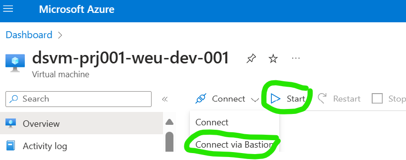

## TODO 1 (one-timer/when your IP changes): Whitelist IP address

1) Find the Network Security Group (NSG on the DASHBOARD) and click on the shortcut, to go into that
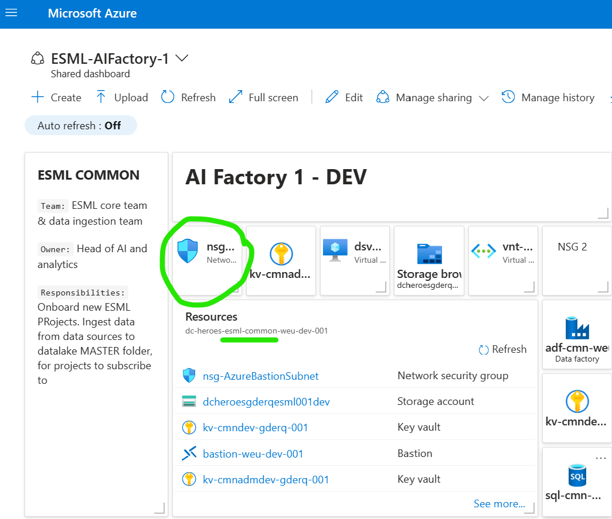

2) Open the RULE called `Bastion_AllowHttpsInbound` - click on it
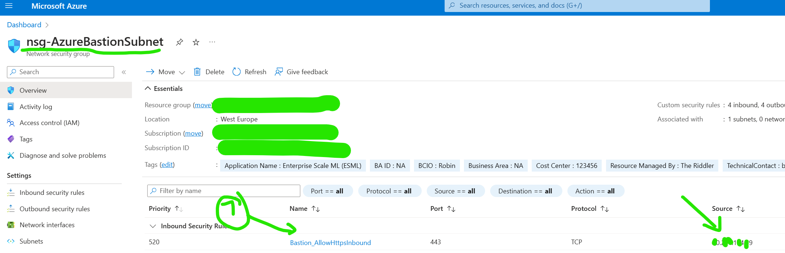

3) Take a screenshot of the RULE information - to have this temporary at hand.
- If you are on Windows, use `Snipping tool`

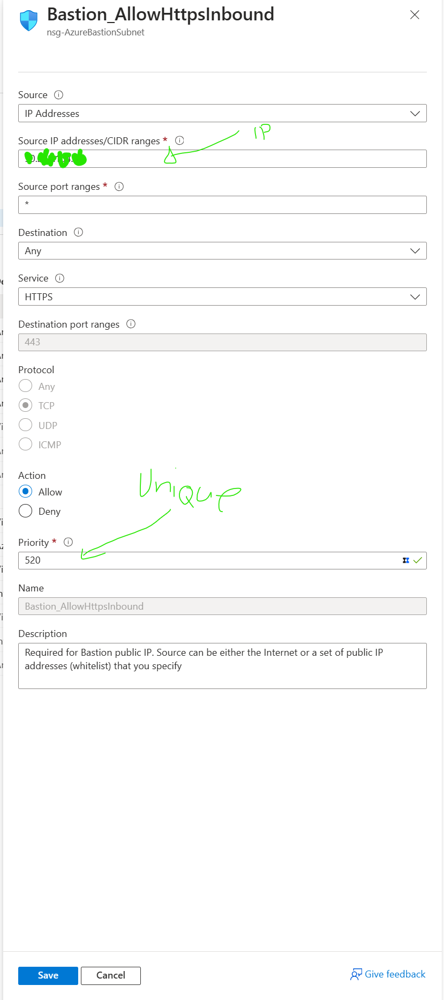

4) Create a NEW inbound rule
- Reproduce all settings from the earlier screenshot, except `Source IP-adresses` (which will be YOUR IP adress) and except `priority` - needs to be uniqut
    - `Source IP-adresses`: Set this to your public IP adress (see QA below, for example how to get that)
    - `Priority`: 530 If it says 520, 540 if 530 is taken, e.g. you need to find an availabe number
    - `Name`: Bastion_AllowHttpsInbound_YOURNAME_or_ALIAS example  `Bastion_AllowHttpsInbound_joakim_astrom` 

Q: How to get your PUBLIC IP ADDRESS: 
A: Open EDGE web browser, and search for "My IP". The copy the output that Microsoft Edge provides for you (you do not need to enter any website)
"network security group

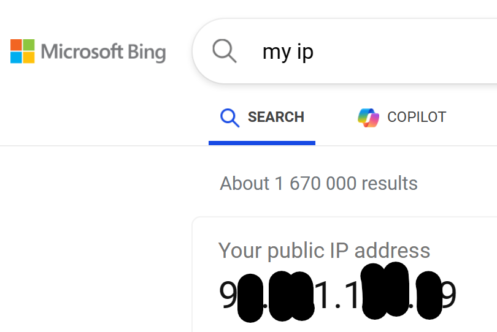

## TODO 2 (every time) - LOGIN via BASTION to VM with `admin` user

1) GET CREDENTIALS directly from KEYVAULT
- The credentials for this exists in your AZURE KEYVAULT, as SECRETS called `esml-dsvm-username-001` and `esml-dsvm-password-001`
- Which keuvault?
    - If you are a PROJECT team member, itis in your project specific keyuvalt. 
        - Tip: Use the shortcut on the AIFactory dashboard
        -   Example keyvault name: `kv-p001-weu-dev-abcde01`
    - If you are a CORE TEAM team member, itis in your common-admin specific keyuvault. 
        - Tip: Use the shortcut on the AIFactory dashboard
        - Example: `kv-cmnadmdev-gderq-001`

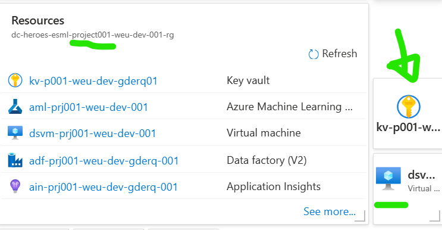

- Which secrets?
    - If you are a PROJECT team member, itis in your project specific keyuvalt. 
        - Go to keyvault: `kv-p001-weu-dev-abcde01`
        - Click SECRETS
        - Click "Read more" at the bottom of the secrets
            - You should see the secrets: `esml-dsvm-username-001`  and `esml-dsvm-password-001`
        - Click on the secret name
        - Click on "CURRENT VERSION" (a strange long id)
        - Click on copy icon
            - 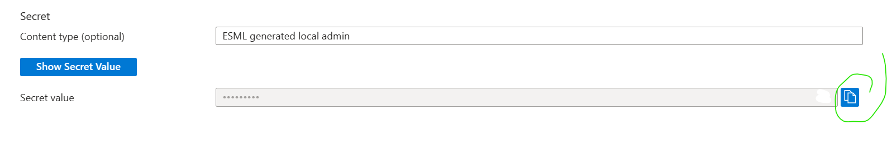

- Secrets overview: 
    - 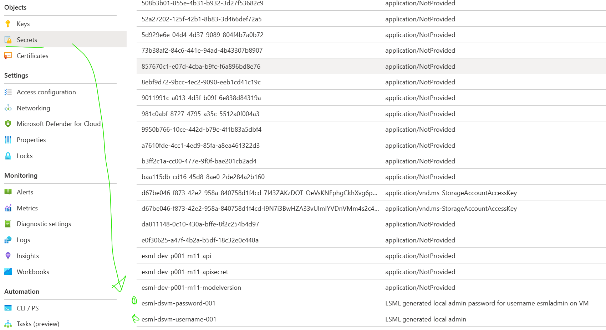

2) START VM (if not already started) and LOGIN via BASTION

- 

- Select your preffered keyboard language
- Login - Use the credetials from earlier step, e.g. from keyvault - the values from `esml-dsvm-username-001`  and `esml-dsvm-password-001` secrets.
- 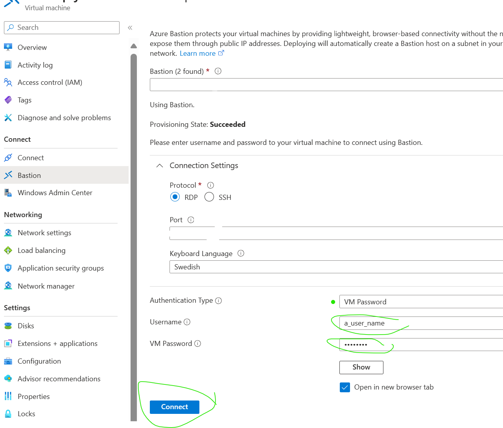

## TODO 3 (one-timer) INSIDE the VM: CREATE LOCAL user account

1) Open Add other users
- Click WINDOWS icon i left corner, inside of the VM and type `lusrmgr.msc`
- 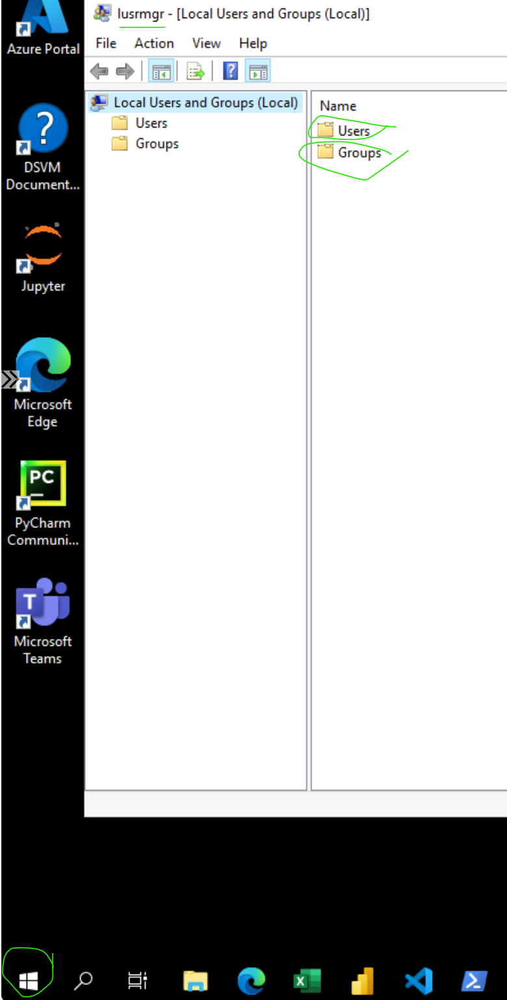

2) Right-click on USERS folder, click on `New user`
- Select username and password of your choice
- 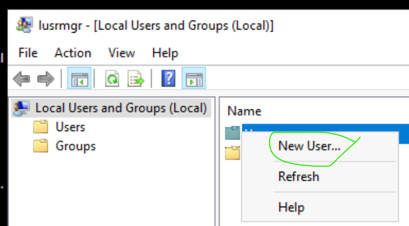

- 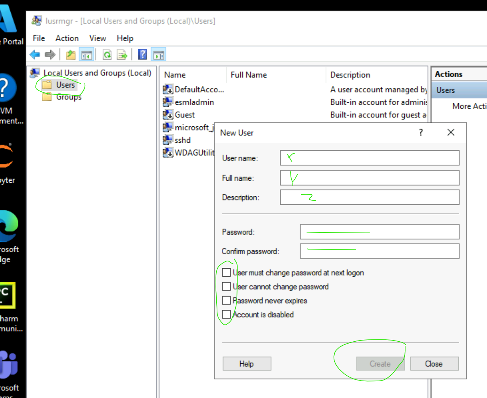

3) Double-click GROUPS folder, and locale Administrators group 
- 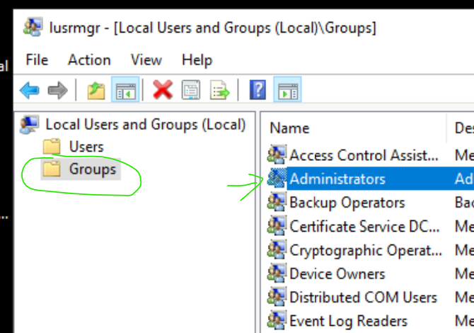

4) Add user to Administrator group

- 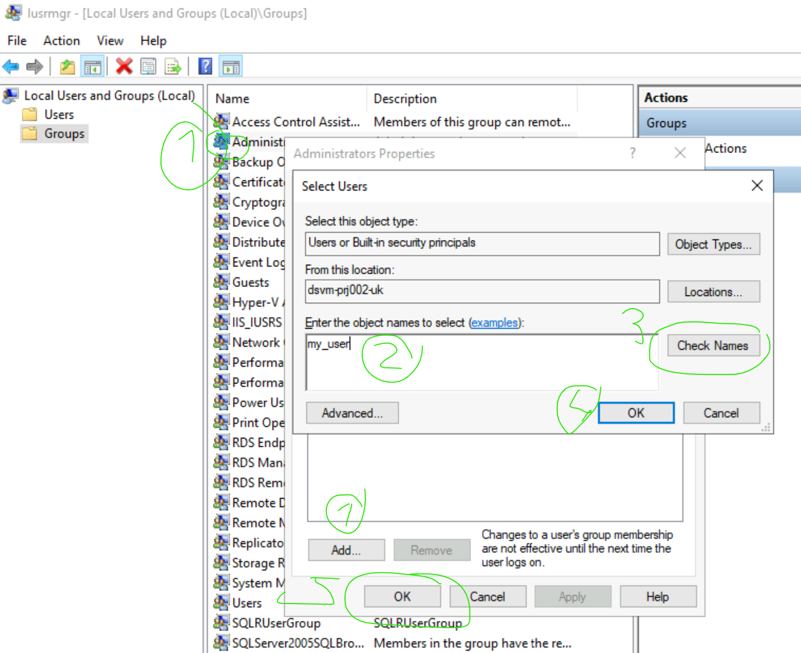

5) Then LOGOUT from the VM, login again with your NEW USER
- See step `START VM (if not already started) and LOGIN via BASTION`

6) When iside the VM again, open EDGE, and to to portal.azure.com - login with your AD user as usual.
- Find your AIFactory dashboard
- Open your Azure Machine Learning workspace - and everything should work. 
- This, since the VM and your EDGE browser is inside the secure networkl
