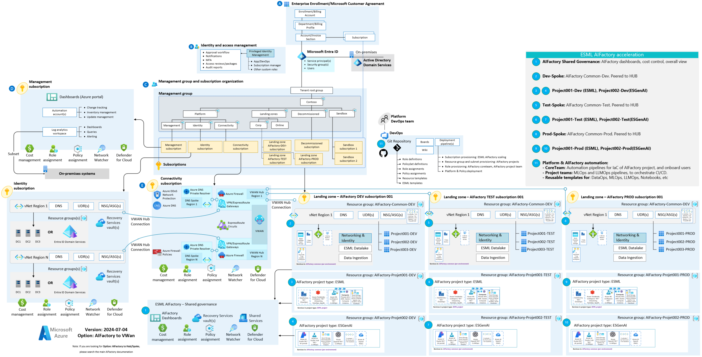
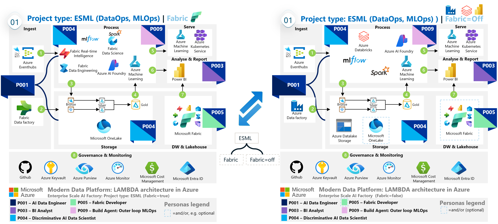

# Automated Architectures

The AI Factory currently provides two automated template architectures — **ESML** and **GenAI-1** — that are deployed as AI Factory projects inside your AI landing zones.

---

## Architecture Overview

Each team in the AI Factory gets their own **floor**: an isolated project with either Architecture 1 (ESML) or Architecture 2 (GenAI-1), or both. Services can be turned ON/OFF at any time via feature flags without disrupting other projects.

---

## Architecture 1 — ESML (Enterprise Scale Machine Learning)

Designed for **discriminative AI** workloads: model training, batch inference, and online scoring.

**Baseline services:**
- Azure Machine Learning (private workspace)
- Azure Container Registry (Premium, private)
- Azure Storage (Data Lake)
- Key Vault, Application Insights
- Private networking (VNet, subnets, private endpoints)

**Optional services:**
- AKS (private cluster, Arc-enabled) for online scoring
- Azure Data Factory for pipeline orchestration
- Azure Databricks for large-scale feature engineering
- Microsoft Fabric / OneLake integration

---

## Architecture 2 — GenAI-1 (Enterprise Scale GenAI)

Designed for **generative AI** workloads: RAG, agentic pipelines, LLM-based applications.

**Baseline services:**
- AI Foundry Hub + default project (private)
- AI Search (private, with shared private link support)
- Azure OpenAI (via AI Foundry)
- 2× Storage accounts, Key Vault, Application Insights, Monitoring dashboards
- Private networking

**Optional services (feature flags):**
- Cosmos DB (required for AI Foundry Capacity Host)
- Container Apps, Web App, Function App, AKS
- Logic Apps, Event Hubs, APIM AI Gateway
- Bing Grounding, Azure Vision, Speech, Content Safety, Document Intelligence
- PostgreSQL, Redis Cache, Azure SQL

---

## Enterprise Landing Zone Context

The AI Factory projects live inside **3 AI landing zones** (Dev, Stage, Prod), which can be connected to an existing enterprise network using:

| Topology | Description |
|---|---|
| **Hub/Spoke** | Traditional hub VNet with peered spoke VNets per environment |
| **VWAN Hub** | Azure Virtual WAN for global, managed connectivity |

---

## ESML With Fabric Flavour

