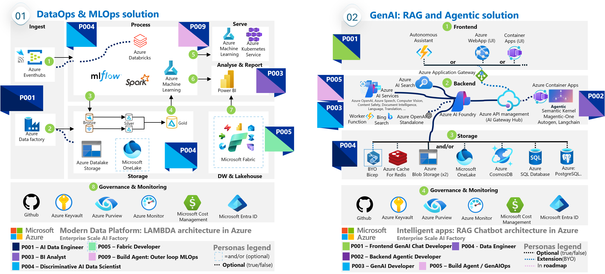
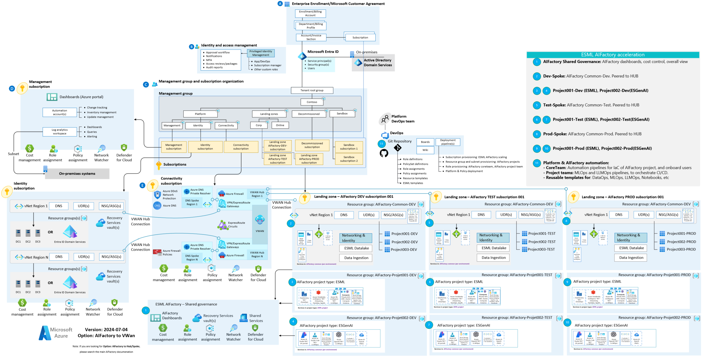
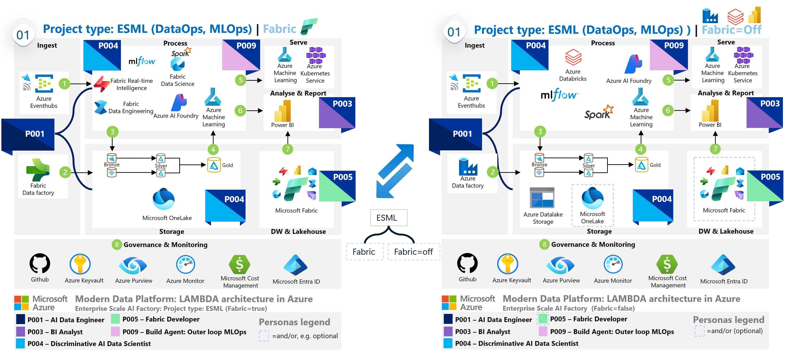

# Choose an architecture

AI Factory provides two main infrastructure families. Choose the workload first,
then review the services, networking and environment you need.

| Family | Choose it for | Typical building blocks |
| --- | --- | --- |
| **ESML** | Machine-learning training, batch scoring and online serving | Azure Machine Learning, data storage, Key Vault, monitoring and selected compute; optional Databricks, Data Factory or AKS. |
| **GenAI-1** | Foundry agents, RAG and generative applications | Foundry, storage, Key Vault, monitoring and the selected private-agent dependencies, such as Search and Cosmos DB. |

Service switches and dependencies vary by route. Do not assume every possible
GenAI project requires the same model or that all optional services are deployed.
The older Foundry Hub flags are not the recommended current Foundry path.

## Build on a shared foundation

A factory can share common network and platform services while projects have
their own resources and settings. A project can have explicit placements in Dev,
Stage and Prod; configuration does not automatically provision all three.

See [factory, scale-set and project concepts](concepts/index.md),
[environment planning](concepts/enterprise-scale.md), and the
[Parameters checklist](parameters/standard.md).

!!! important "Plan changes before applying them"
    Feature flags are inputs to reviewed deployment. They are not a guarantee
    that existing resources remain untouched, or that disabled services are
    deleted automatically.

## Connect to your enterprise environment

Existing hub/spoke, central DNS and BYO network designs require the correct
resource references, permissions, routes and private connectivity. A topology
diagram is not a substitute for checking that setup.

### Watch the hub options

Compare the configuration wizard's three illustrative network designs. These
lessons do not provision connectivity or discover your existing network.
Choose a tab; reduced-motion preferences show still images.

=== "External hub"

    Reuse a separately owned enterprise hub with explicit connectivity and
    ownership checks.

    <picture>
      <source media="(prefers-reduced-motion: reduce)" srcset="../assets/animations/factory-topology-external-hub.png">
      
    </picture>

    [Animated SVG](assets/animations/factory-topology-external-hub.svg) |
    [GIF](assets/animations/factory-topology-external-hub.gif) |
    [Still image](assets/animations/factory-topology-external-hub.png)

=== "Standalone - no hub"

    Keep the factory standalone without assuming access through a central hub.

    <picture>
      <source media="(prefers-reduced-motion: reduce)" srcset="../assets/animations/factory-topology-standalone.png">
      
    </picture>

    [Animated SVG](assets/animations/factory-topology-standalone.svg) |
    [GIF](assets/animations/factory-topology-standalone.gif) |
    [Still image](assets/animations/factory-topology-standalone.png)

=== "Standalone - own hub"

    Include a factory-owned hub and review its networking and access dependencies.

    <picture>
      <source media="(prefers-reduced-motion: reduce)" srcset="../assets/animations/factory-topology-own-hub.png">
      
    </picture>

    [Animated SVG](assets/animations/factory-topology-own-hub.svg) |
    [GIF](assets/animations/factory-topology-own-hub.gif) |
    [Still image](assets/animations/factory-topology-own-hub.png)

## Continue with your workload

- [Agent and GenAIOps templates](concepts/templates/genaiops.md)
- [ML Model Factory and MLOps](concepts/templates/mlops.md)
- [DataOps and storage choices](concepts/templates/dataops.md)
- [Create or update through CLI, SDK or REST](factory-tools/19-cli-and-api-and-usage.md)

More info

Fabric/OneLake and other existing services can be integration targets, not
automatic additions to every factory. Check the selected workload's documented
storage and authentication contract.

Source families are
[`esml-project`](https://github.com/jostrm/azure-enterprise-scale-ml/tree/main/environment_setup/aifactory/bicep/esml-project)
and [`esml-genai-1`](https://github.com/jostrm/azure-enterprise-scale-ml/tree/main/environment_setup/aifactory/bicep/esml-genai-1),
with shared common infrastructure. Template availability is not proof of
capacity, regional service availability or a successful deployment.

