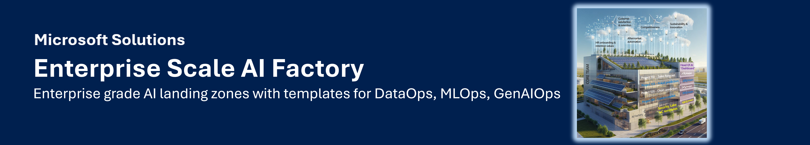

# Enterprise Scale AI Factory

Build and operate AI workloads on Azure using a shared foundation, reusable
templates and tools for reviewed changes. Start small, choose the services you
need, and add projects without rebuilding every part of the platform.

## Start with what you want to do

| Your task | Start here |
| --- | --- |
| Core team: configure and administer | [Get started - CLI, SDK, API: Core team](factory-tools/18-cli-and-api-and-usage.md) — choose one linked tab for the whole tutorial |
| Project team: build workload code | [Get started - Agent & ML Factory SDK: Project team](project-team/index.md) — native Python and CLI examples, offline first |
| Configure a new factory or add a project | [Add and update](factory-tools/19-cli-and-api-and-usage.md) |
| Find a setting or default | [Parameters](parameters/index.md), [required inputs](parameters/standard.md), [complete reference](parameters/advanced.md) |
| Understand factories, scale sets and projects | [Core concepts](concepts/index.md) |
| Build an agent, model or data workflow | [Agent SDK](project-team/agent-factory.md), [ML SDK](project-team/ml-model-factory.md), [DataOps](concepts/templates/dataops.md) |
| Monitor usage, cost and health | [Monitor and operate](intelligence.md) |
| Remove a draft or Azure resources | [Remove and recover](factory-tools/20-cli-and-api-and-usage.md) |
| Choose a version or see recent changes | [News and releases](news.md) |

!!! important "Save settings first; deploy separately"
    Creating a factory or project through the configuration tools saves its
    settings. Deployment is a separate reviewed action. Turning a service flag
    off is not a general instruction to delete its Azure resources.

## One platform, several layers

| Layer | What it provides |
| --- | --- |
| Azure foundation | Common networking, identity and project resource groups, with explicit environment and subscription choices. |
| Infrastructure templates | [Bicep](iac/bicep.md), provider pipelines and supported [bring-your-own integration](iac/terraform.md). |
| Workload accelerators | Agent, RAG, machine-learning and data-processing examples with their own configuration and prerequisites. |
| Operator and application tools | The Factory CLI, Python SDK and REST clients of the shared administration API; desktop tools can package the same backend. |
| Operations | Dashboards, usage/cost reports, recorded run status and separately configured health tooling. |

These layers are not different Azure commercial SKUs. Use the interface that
suits your task: terminal commands, Python code or HTTP requests.

## What you can configure

The source includes project options for Foundry, Azure Machine Learning, AI
Search, Databricks, storage, Key Vault, databases, containers, integration services
and monitoring. Availability depends on the chosen template, version and region.

| Area | Examples and guidance |
| --- | --- |
| AI and models | Foundry and private-agent dependencies, model deployments, Azure ML and supported Kubernetes integration. |
| Applications and data | Container Apps, AKS, Functions, Web Apps, SQL, PostgreSQL, Cosmos DB and other supported template services. |
| Integration | Data Factory, Event Hubs, Logic Apps, APIM and optional gateway components. |
| Private access | VNet/subnets, private endpoints, DNS and optional hub/VPN paths. |

Choose [ESML or GenAI architecture](architectures.md) and review the
[service dependencies](parameters/standard.md#network-and-service-dependencies).
Enabling a parameter is not a capacity reservation or proof that all prerequisites
are ready.

## Safe changes, explicit targets

- Select the exact factory, scale set, project and environment.
- Preview changes, review them, then approve the matching operation.
- Observe the returned run; do not repeat an uncertain deployment or deletion.
- Keep resources that other projects depend on. Deletion has separate retention
  choices and can be blocked when those choices cannot be honored.

An **AI Factory scale set is not an Azure VM Scale Set**. It groups an
environment, subscription and networking choice. Dev, Stage and Prod are
explicit targets; they are not automatically created by every command.

## Development and stable releases

**`main` is the shared development branch.** Release branches provide stable
adoption points. This site follows published `main`; the
[v1.25 release notes](https://github.com/jostrm/azure-enterprise-scale-ml/blob/main/RELEASE_125.md)
describe an earlier, identified source snapshot. Check installed API/client
compatibility before using a newer command.

More info

The site is built from this repository's existing `documentation/gh-io` directory.
Factory tutorials are maintained in `documentation/v2/10-19`; the build displays
those same Markdown sources with linked tool tabs rather than maintaining a
second set of instructions.
Project-team SDK pages likewise reuse the marked onboarding sections from
`usecase_code/40-agent-factory` and `usecase_code/50-ml-model-factory`.

The project aligns with the [Cloud Adoption Framework](https://learn.microsoft.com/en-us/azure/cloud-adoption-framework/ready/azure-best-practices/ai-machine-learning-mlops#ai-factory)
and [Well-Architected AI guidance](https://learn.microsoft.com/en-us/azure/well-architected/ai/personas).
That is design guidance, not a blanket compliance certification or a guarantee
that every service is available in Government or Sovereign clouds.

Existing published stories include
[Epiroc](https://customers.microsoft.com/en-us/story/1653030140221000726-epiroc-manufacturing-azure-machine-learning)
and [manufacturing model workflows](https://techcommunity.microsoft.com/t5/ai-machine-learning-blog/predict-steel-quality-with-azure-automl-in-manufacturing/ba-p/3616176).
Historical examples do not certify the current version in another tenant.

