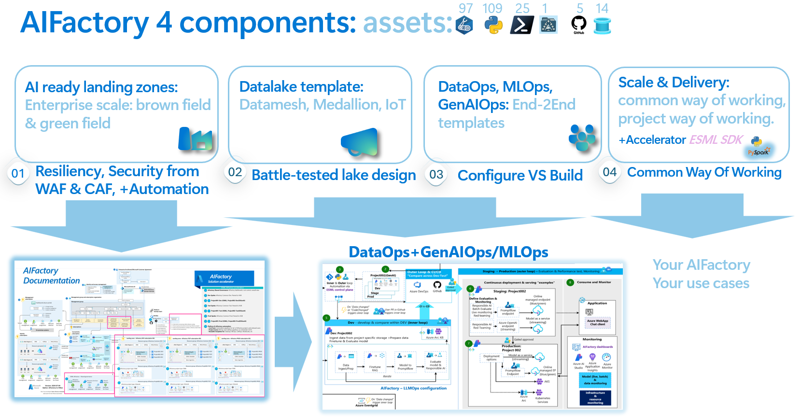
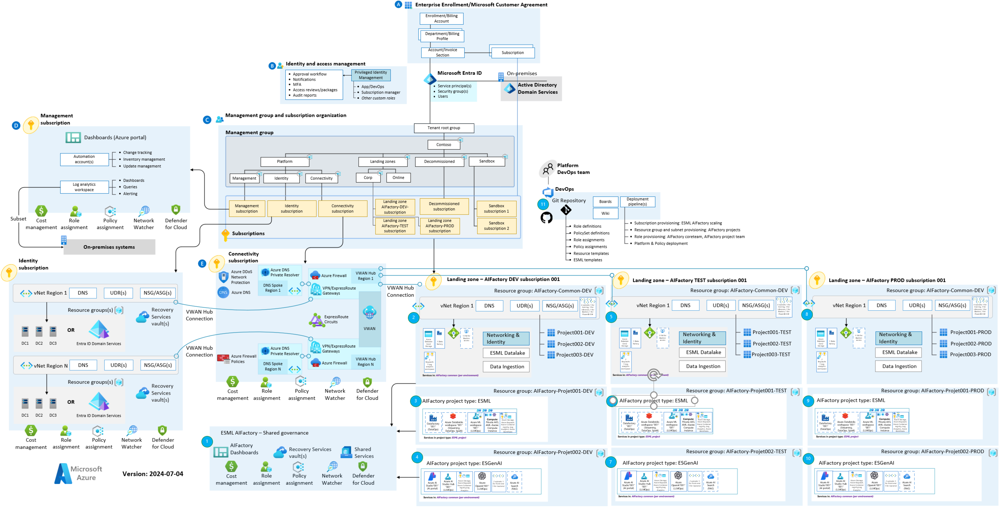
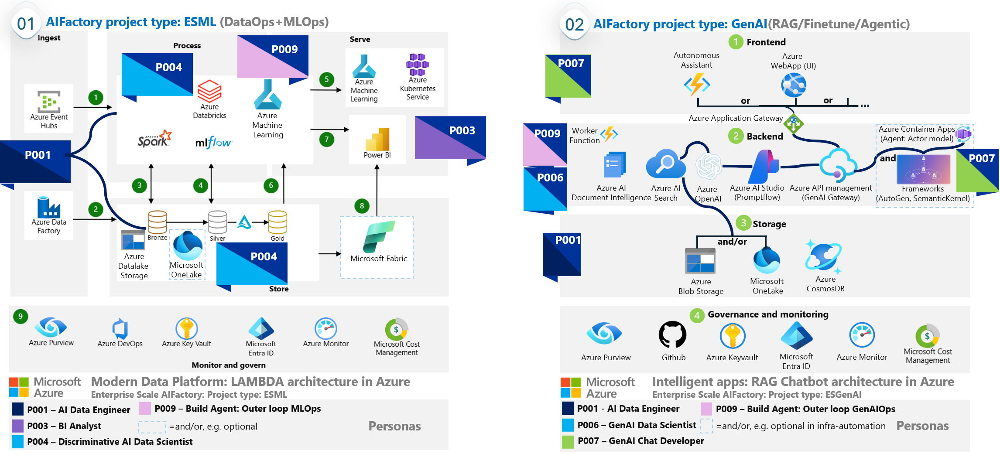
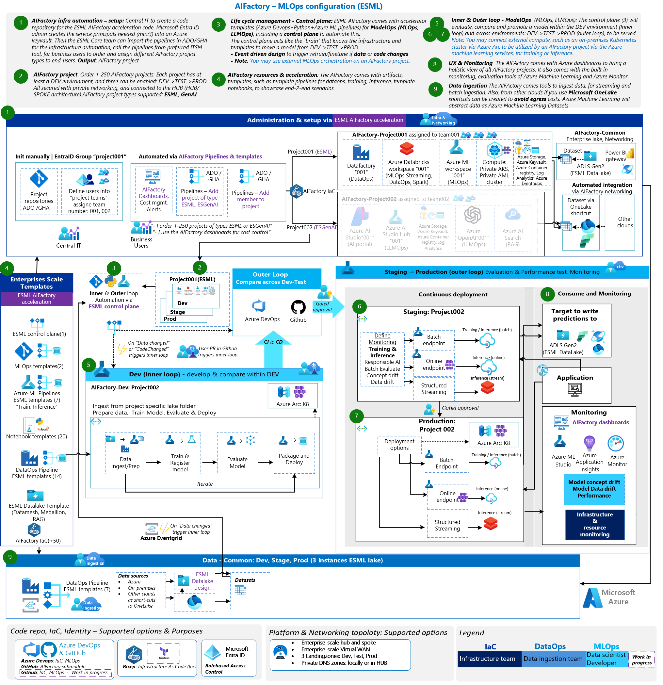
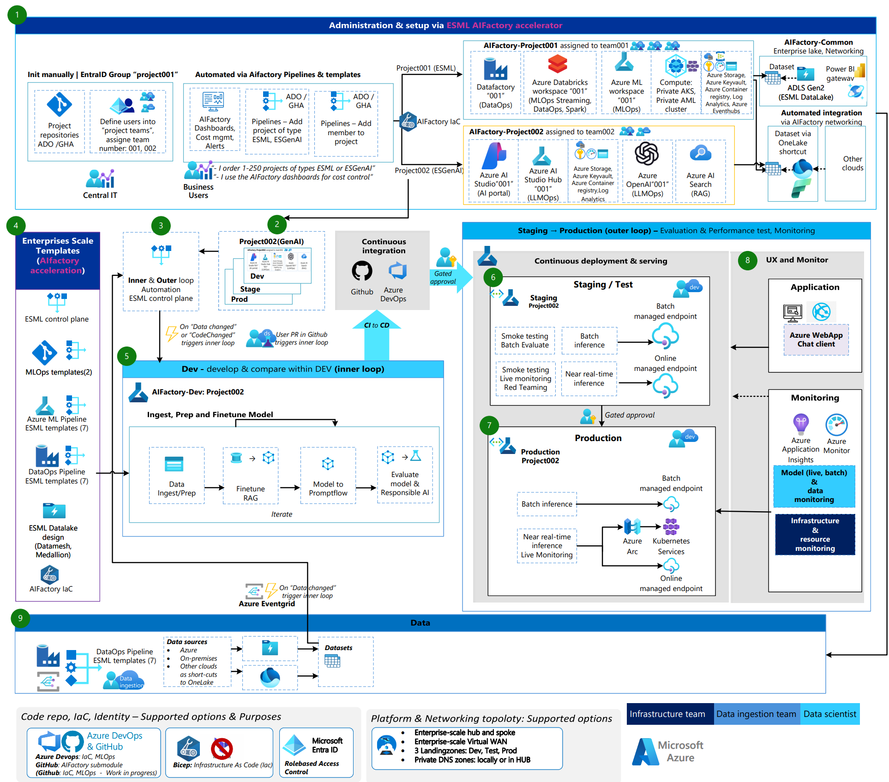

# About Documentation - Views explained

The full [Documentation](./v2/10_index.md) is organized around ROLES via Doc series. 

| Doc series | Role | Focus | Details|
|------------|-----|--------|--------|
| 10-19 | `CoreTeam`|`Governance`| Setup of AI Factory. Governance. Infrastructure, networking. Permissions |
| 20-29 | `CoreTeam` | `Usage`| User onboarding & AI Factory usage. DataOps for the CoreTeam's data ingestion team |
| 30-39 | `ProjectTeam` | `Usage`| Dashboard, Available Tools & Services, DataOps, MLOps, Access options to the private AIFactory |
| 40-49 | `All`|`FAQ`| Various frequently asked questions. Please look here, before contacting an ESML AIFactory mentor. |

It is also organized via the four components of the ESML AIFactory: 

| Component | In section | Focus in section | Role| Doc series
|-----------|------------|----------------|-------|----|
| 1) Infra:AIFactory | Y | - | CoreTeam | 10-19 |
| 2) Datalake template | Y | - | All | 20-29,30-39 |
| 3) Templates for: DataOps, MLOps, *GenAIOps | Y | - | All | 20-29, 30-39 |
| 4) Accelerators: ESML SDK (Python, PySpark), RAG Chatbot, etc  | Y | - |ProjectTeam | 30-39 |

# Documentation Executive Summary VS Full documentation
The current page is only an *executive summary* of the documentation. 
- Go here for the [Quick Documentation - parameter search tool](https://jostrm.github.io/azure-enterprise-scale-ml/parameters/) and where the *AI Factory Configuration Wizard* can be downloaded.
- Go here for the [Full Documentation](./v2/10_index.md)

## ESML AIFactory: The 4 components of acceleration

## ESML AIFactory: Enterprise Scale Landing Zones Context (VWan option)

<!-- 
## ESML AIFactory: The 2 project types and the AIFactory Personas
Technically, The AIFactory has automation to setup 2 project types, a set of services glued together with private networking & RBAC, a team gets access to (automation process takes 35min), with templates for DataOps, MLOps or GenAIOps.

Personas is a tool the AIFactory uses to map *tools, processes and people*, to scale AI **organizationally** as well. Personas is used to: 

1) **Find resource gaps, define responsibility, or find redesign needs:** If you do not have people in your organization that fit a persona description needed to support a process step, you either need to redesign the architecture, change the process, or onboard new people with that persona. Personas is a good tool to define scope of **responsibility**
2) **Education:** Mapping personas to specific **Azure services** in the architecture provides the benefits of offering **educational** sessions and online courses to upskill within.
3) **Security & Access:** Personas mapped to **processes, architectures and services** can be used to define which services they need access to in a process.
4) **Project planning & Interactions** Personas mapped to each other can be used see which personas that primarily interacts with each other, to be used to setup sync meetings and project planning.

[Read more about *personas* ](./v2/20-29/25-personas.md)

-->

## ESML AIFactory: MLOps Context

## ESML AIFactory: GenAIOps Context

# Full Documentation
[LINK to full Documentation](./v2/10_index.md)

