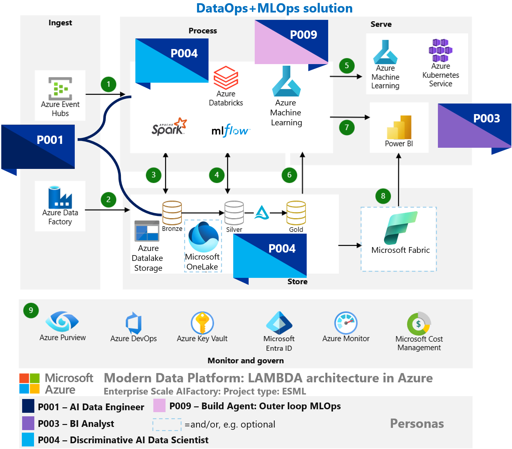
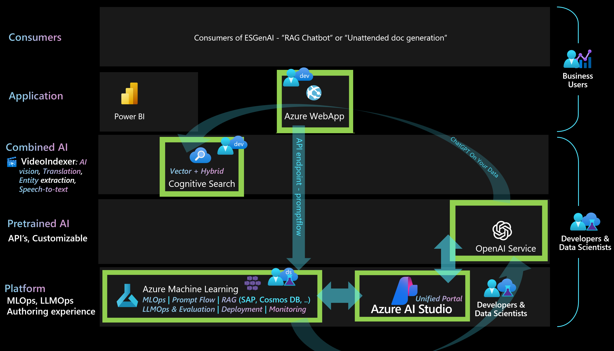
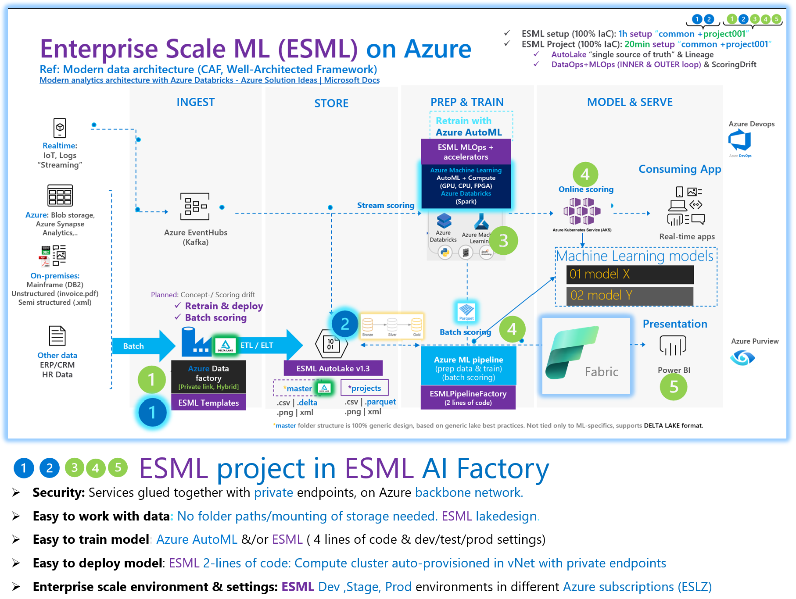

# Infra:AIFactory: Static documentation (CoreTeam)

# High level diagrams - Architecture & Capabilities

## AI factory - 4 componentes & acceleration 

## AI factory - ESML project: Overview

## AI factory - ESGenAI project: Overview

# High level diagram - Services integration: ESML project

## Low level diagram - LLMOps (ESGenAI)

### Design patterns supported (ESGenAI)
#### AIFactory scaling: Loadbalancing - RAG chat

## Low level diagram - MLOps (ESML)

