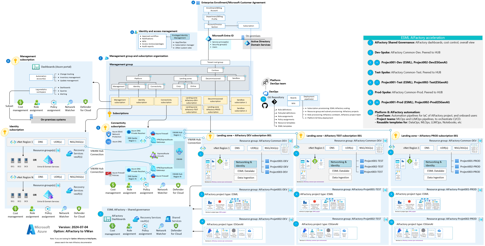
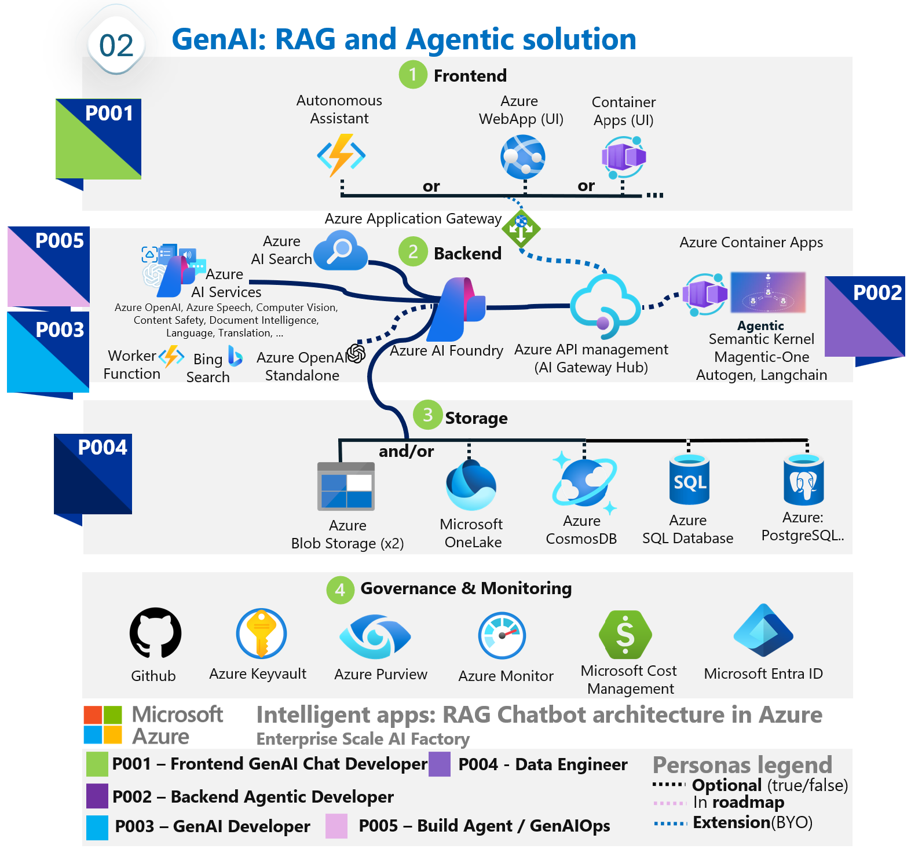

# AI factory - 4 componentes & acceleration

# Enterprise Scale AIFactory: ESLZ Context (VWan option)
- ESLZ VWAN platform architecture + AIFactory application AI landing zones (Dev, Stage, Prod)

# Infra:AIFactory: Static documentation (CoreTeam)
List of services in AIFActory common, AIFactory ESML project, and AIFactory GenAI project:

# High level diagrams - DataOps, MLOps, GenAIOps

# High level diagrams - Architecture & Capabilities

## AI factory - 2 project types (ESML, GenAI)

## AI factory - ESML project: Overview (ESML)

### ESML project type: two flavours: Fabric ON/OFF

# High level diagram - Services integration (ESML)

## Low level diagram - MLOps (ESML)

## AI factory - ESGenAI project: Overview (ESGenAI)

## Low level diagram - GenAI (ESGenAI)

### Design patterns supported (ESGenAI)
#### AIFactory scaling: Loadbalancing - RAG chat

