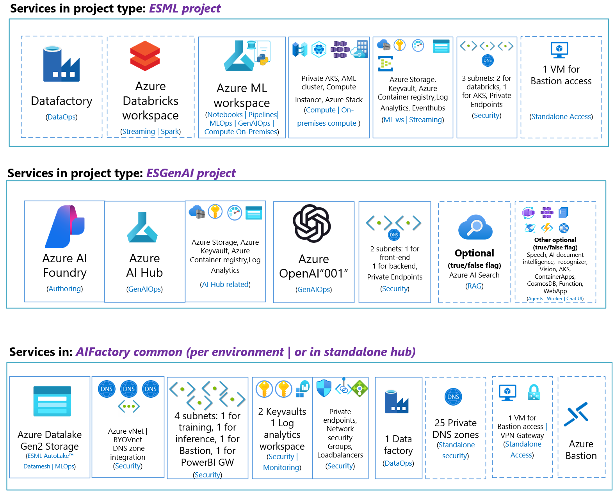
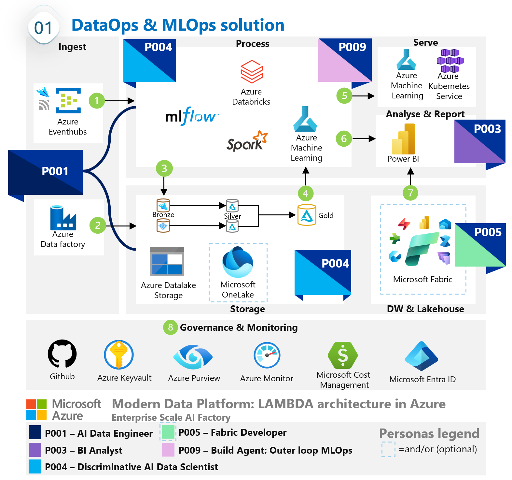
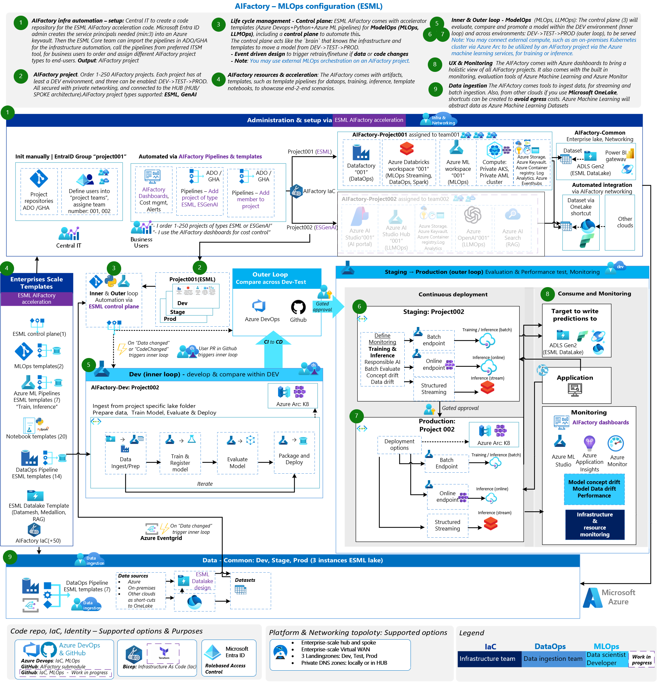
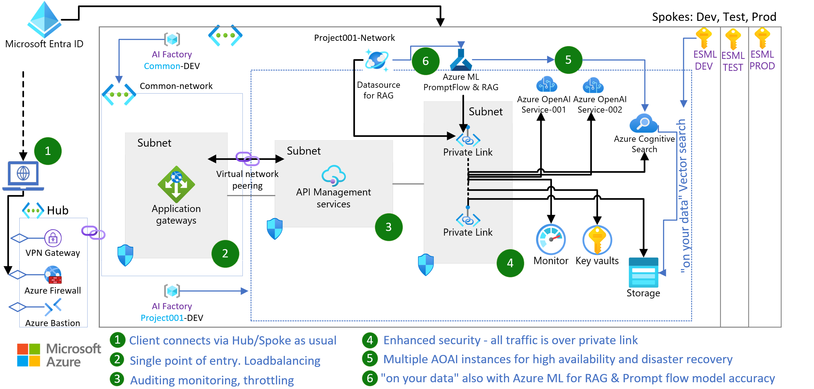

# Infra:AIFactory: Static documentation (CoreTeam)

List of services in AIFActory common, AIFactory ESML project, and AIFactory GenAI project

# High level diagrams - Architecture & Capabilities

## AI factory - 4 componentes & acceleration 

## AI factory - ESML project: Overview (ESML)

# High level diagram - Services integration (ESML)

## Low level diagram - MLOps (ESML)

## AI factory - ESGenAI project: Overview (ESGenAI)

## Low level diagram - LLMOps (ESGenAI)

### Design patterns supported (ESGenAI)
#### AIFactory scaling: Loadbalancing - RAG chat

