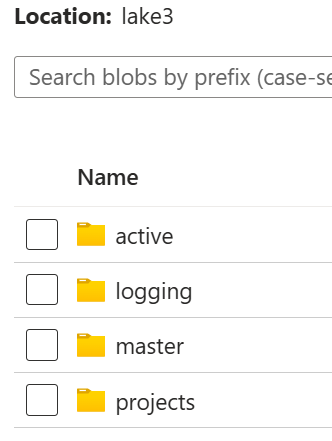
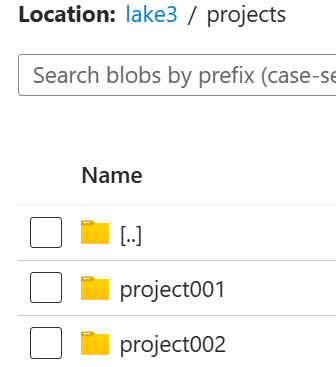
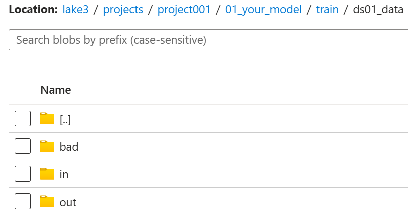
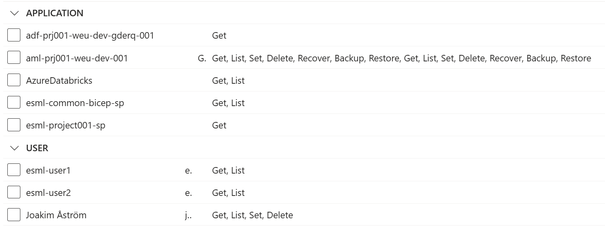

# `Infra:AIFactory`: Roles & Permissions for users, service principals, AD groups
Detailed information about Roles and permission, such as Microsoft Entra ID: Service Principals (Automation & Ops purpose) & Permissions for Users, AD groups. 

## SERVICE PRINICPALS - Minimum 3 
The `AIFactory IaC pipeline` has has its own Service Principal, for unattended Automation of IaC purpose.

The `CoreTeam` has has its own Service Principal, for unattended Automation & DataOps (source to lake) purpose. 
- Example: For elevated access to sources and datalake, compared to project teams limited access.

Each `ProjectTeam` has its own Service Principal, for unatteded Automation & DataOps (lake only) and MLOps purpose. 
- Example: For running its DataOps or MLOps pipelines unattended. Reading & Writing to their limited space in the datalake.

### AFactory IaC Service Principal (1st)
    - Name: esml-common-bicep-sp
    - Permissons: For the ESML AIFactory CoreTeam and its data ingestion team, for DataOps pipelines unattended
### Role: CoreTeam Service Principal (2nd)
    - Name: esml-common-sp
    - Permissons: For the ESML AIFactory CoreTeam and its data ingestion team, for DataOps pipelines unattended
### Role: ProjectTeam Service Principal (3rd)
    - Name: esml-project001-sp
    - Permissons: For the ESML AIFactory project teams, to be able to run their MLOps and LLMOps pipelines unattended

### Keyvaults: Storing the Service principal information - Keyvault & Secret names

- The core team has its own 2 keyvaults: `kv-cmnadmdev-*, kv-cmndev-*`, and the secrets will be copied to the latter
    - More info: The keyvault, `kv-cmndev-*` resisdes in the COMMON resource group of the AIFactory, one per environment (Dev, Test, Prod). 
        - The secret names will be the same as the seeding keyvault default names
        - [More info: Seeding keyvault](./12-seeding-keyvault.md)
- Each project teams has its own keyvalt: `kv-p00*` such as: `kv-p001-weu-dev-abcd01`
    - More info: This keyvault resides in the PROJECT resource group of the AIFactory, one per environment (Dev, Test, Prod). 
        - The secret names will be the same as the seeding keyvault default names
        - [More info: Seeding keyvault](./12-seeding-keyvault.md)
- The Microsoft Entra ID administrator, has its own keyuvalt. A seeding keyvault. 
    - [More info: Seeding keyvault](./12-seeding-keyvault.md)

## AD-GROUPS & USERS
The users object-ids (or AD groups object id) is used to set permissions on
- **Specific datalake folder (ACL):** Execute, Read, Write
- **Keyvault access policys**: GET, SET, DELETE LIST is the highest permissions
- **Azure services**

### Datalake folder access - project
Below you can ses what access users, service principals, ad groups, are assigned. 
- **MASTER folder** (core team only)
- **PROJECTS folder** (project team specific, and core team can read from some folders, and write to some folders )
    - **IN/OUT/BAD** folders
        - **Project team** can **READ** the IN-folder, and **WRITE** to the OUT folder
        - **Core team** can **WRITE** to the IN-folder, and **READ** the OUT folder (to share data back to MASTER / to support Datamesh)

#### Datalake RBAC - core team
- **Datalake:** STORAGE BLOB DATA OWNER to STORAGE account

#### IMAGES folders

#### Folder permissions
- **Users: All:** 
    - **E** on datalake container "lake3"
- **Users Project team:** 
    - **RW**E on PROJECT folder
    - **R** on projects IN folder
    - **W** on projects OUT and BAD folder
- **Users: Core team**
    - **RWE** on MASTER folder
    - **R** on projects OUT folder
    - **W** on projects IN and BAD folder

[Details - See script here](../../../environment_setup/aifactory/bicep/esml-util/25-add-users-to-datalake-acl-rbac.ps1)

#### IMAGES
### Keyvault access - project team's keyvault
Users in a project team gets the below: 
- **(Get, List)** for PROJECT Keyvault (example: kv-p002-weu-dev-abcde01)

Explanation of image example: 

- **Users -  Project team:** There are 2 project team users, esml-user1 and esml-user2
- **Users - Core team:** There are 1 core team user, assigned to this project, Joakim Åström
- **Azure services:**
    - **adf-project001**: Azure data factory
    - **aml-project001** :  Azure Machine Learning
    - **AzureDatabricks** : Azure Databricks
- **Service principals**
    - **esml-project001-sp** : Project specific 
    - **esml-common-sp** : Core team specific

[Details - See script here](../../../environment_setup/aifactory/bicep/esml-util/26-add-esml-project-member.ps1)

### Keyvault access - core team 
Users in a core team gets the below, on the core team's own keyvault
- **(Get, List, Set)** for COMMON Keyvault (example: kv-cmndev-abcde01)
- **(Get, List, Set)** for COMMON ADMIN Keyvault (example: kv-cmnadmdev-abcde01)

Users in a core team, can also get permission on a project team's own keyvault
- **(Get, List, Set)** for PROJECT Keyvault (example: kv-p001-weu-dev-abcde01)

[Details - See script here](../../../environment_setup/aifactory/bicep/esml-util/26-add-esml-coreteam-member.ps1)

### Azure services - project team resource group

| User/Service principal/Managed Identity | Role | Scope | Example Name |
|--------------------------|--------------------------|--------------------------| --------------------------|
| SP - IaC core team | Owner | Subscription | esml-common-bicep-sp |
| MI - Azure Machine Learning  | Contributor | Resource Group | aml-prj001-weu-dev-001 |
| User - project team | Contributor | Resource Group | - |
| User - project team | Virtual Machine Administrator Login | Resource Group | - |
| User - core team | Virtual Machine Administrator Login | Resource Group | - |

### Azure services - core team resource group

| User/Service principal/Managed Identity | Role | Scope | Example Name |
|--------------------------|--------------------------|--------------------------| --------------------------|
| SP - IaC core team | Owner | Subscription | esml-common-bicep-sp |
| User - core team | Owner | Resource Group | - |
| User - core team | Virtual Machine Administrator Login | Resource Group | - |

## USERS, AD-GROUPS, SERVICE PRINCIPALS - all together
What you see is what you get. 

Below is the actual code comment, of what permissions is given when adding a core team member, or project member

### Adding core team member - what permissions do they get?

[Details - See powershell script here](../../../environment_setup/aifactory/bicep/esml-util/26-add-esml-coreteam-member.ps1)

[Details - See BICEP script here](../../../environment_setup/aifactory/bicep/modules/addUserAsCoreteam.bicep)

Access for project members: 

- CONTRIBUTOR to PROJECT RG(aml, dsvm, kv, adf)
- CONTRIBUTOR to DASHBOARD RG
- READER on Bastion (in COMMON RG)
- READER on Keyvault (in PROJECT RG)
- CONTRIBUTOR on Bastion NSG
- networkContributorRoleDefinition on vNET
- Separate powershell: ACL on Datalake: 25-add-users-to-datalake-acl-rbac.ps1
- Separete powershell: AccessPolicy on Keyvault: 25-add-users-to-kv-get-list-access-policy.ps1

### Adding project team member - what permissions do they get?

[Details - See powershell script here](../../../environment_setup/aifactory/bicep/esml-util/26-add-esml-project-member.ps1)

[Details - See BICEP script here](../../../environment_setup/aifactory/bicep/modules/addUserAsProjectMember.bicep)

Access for core team members: 
- Datalake: STORAGE BLOB DATA OWNER to STORAGE account, Datalake in common
- OWNER to COMMON RG(aml, dsvm, kv, adf)
- OWNER to DASHBOARD RG
- AccessPolicy on COMMON Keyvault: 25-add-users-to-kv-get-list-access-policy.ps1

Optional project access: 

- OPTIONAL: OWNER to a PROJECT RG(aml, dsvm, kv, adf)
- OPTIONAL: AccessPolicy on PROJECT Keyvault: 25-add-users-to-kv-get-list-access-policy.ps1

