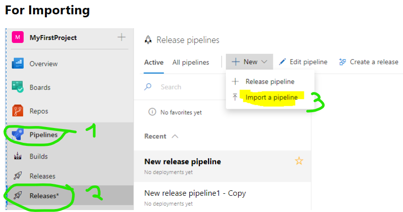
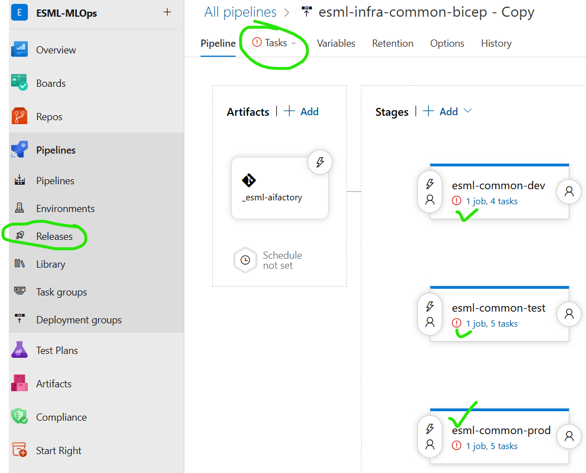
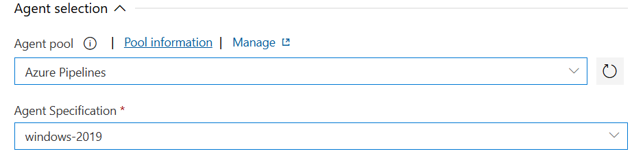

# Azure Devops: Create service connection + Import IaC pipelines + Set service connection to pipeline steps
- **Purpose:** Since only an Azure Devops admin have permission to create service connection and select that on a pipeline. 
    - E.g. the `AIFactory setup mentor` will not have permission with role: Stakeholder
- **Role needed:**: Azure Devops admin
- **Mandatory:** Yes
- **TODO**:
    - 0) Choose option A [Azure Devops - YAML](../../../environment_setup/aifactory/bicep/copy_to_local_settings/azure-devops/esml-yaml-pipelines/readme.md) or option B [Azure Devops - Classic](../../../environment_setup/aifactory/bicep/copy_to_local_settings/azure-devops/esml-ado-pipelines/readme.md), where we recommend Option A (yaml)
    - 1) Azure Devops: Create a service connection, based on the service principal  `esml-common-bicep-sp` [created in the Prerequsite, step 5](./12-prerequisites-setup.md#step-5-create-3-service-principals-and-store-infoappid-objectid-secret-in-the-seeding-keyvault-see-step-3)
        - [How-to](https://learn.microsoft.com/en-us/azure/devops/pipelines/library/service-endpoints?view=azure-devops&tabs=yaml#create-a-service-connection): create a service connection
    - 2) 2A (yaml) and 2B (classic)
        - Option 2A - Azure Devops (yaml)
            - Configure [base parameters](../../../../aifactory/parameters/) This link will not work if you have not done the [Prerequisites](./12-prerequisites-setup.md)
                - All files, such as [10-esml-globals-1.json](../../../../aifactory/parameters/10-esml-globals-1.json)
            - Configure [variables](../../../environment_setup/aifactory/bicep/copy_to_local_settings/azure-devops/esml-yaml-pipelines/variables/variables.yaml)
            - Templates:
                - [esml-infra-common.yaml](../../../environment_setup/aifactory/bicep/copy_to_local_settings/azure-devops/esml-yaml-pipelines/esml-infra-common/infra-aifactory-common.yaml)
                - [esml-infra-project-esml.yaml](../../../environment_setup/aifactory/bicep/copy_to_local_settings/azure-devops/esml-yaml-pipelines/esml-infra-project/infra-project-esml.yaml)
                - [esml-infra-project-genai.yaml](../../../environment_setup/aifactory/bicep/copy_to_local_settings/azure-devops/esml-yaml-pipelines/esml-infra-project/infra-project-genai.yaml)
                - esml-add-coreteam-member.yaml - WIP
                - esml-add-project-member-esml.yaml - WIP
                - esml-add-project-member-genai.yaml - WIP
        - Option 2B) - Azure Devops (classic json)
            - Download templates from this ESML AIFactory GITHUB repo to your computer. There are 4 templates to download
                - Azure Devops (classic) - 5 templates: 
                    - [esml-infra-common.json](../../../environment_setup/aifactory/bicep/copy_to_local_settings/azure-devops/esml-ado-pipelines/infra-aifactory-common.json)
                    - [esml-infra-project-esml.json](../../../environment_setup/aifactory/bicep/copy_to_local_settings/azure-devops/esml-ado-pipelines/infra-project-esml.json)
                    - [esml-infra-project-genai.json](../../../environment_setup/aifactory/bicep/copy_to_local_settings/azure-devops/esml-ado-pipelines/infra-project-genai.json)
                    - [esml-add-coreteam-member.json](../../../environment_setup/aifactory/bicep/copy_to_local_settings/azure-devops/esml-ado-pipelines/add-coreteam-member.json)
                    - [esml-add-project-member-esml.json](../../../environment_setup/aifactory/bicep/copy_to_local_settings/azure-devops/esml-ado-pipelines/infra-project-esml.json)
                    - [esml-add-project-member-genai.json](../../../environment_setup/aifactory/bicep/copy_to_local_settings/azure-devops/esml-ado-pipelines/infra-project-genai.json)
            - Import pipelines (all 5, but do it one by one)
                - Option A) Azure Devops
                    - [Azure Devops - YAML](../../../environment_setup/aifactory/bicep/copy_to_local_settings/azure-devops/esml-yaml-pipelines/readme.md)
                    - [Azure Devops - Classic](../../../environment_setup/aifactory/bicep/copy_to_local_settings/azure-devops/esml-ado-pipelines/readme.md)
                - Option B) Github Actions
                    -  [Github Actions](../../../environment_setup/aifactory/bicep/copy_to_local_settings/github-actions/readme.md)
            - Select the service connection for each step in pipeline, and SAVE
                - Click the EDIT button, on the release pipeline
                - Click TASKS  [See IMAGE 2B](#image---2b---azure-devops-classic-import-pipeline) - we need to fix the red markings.
                - Click Agent job [See IMAGE 2C](#image---2b---azure-devops-classic-select-agent), and select Azure Pipelines, and windows-2019
                - Click the first step in the pipeline. This would be an Azure CLI type step called `11-Common RG and RBAC`, if you selected the `esml-infra-common.json`
                - Select the Azure Resource Manager Connection (ARM Connection) you created earlier [See IMAGE](#image---2b---azure-devops-classic-select-agent)
                - **Repeat this for all the steps in the pipeline**
            - **Repeat step 2-3** for all .json files from step 1

### IMAGE - 2B (Azure Devops Classic) IMPORT PIPELINE

### IMAGE - 2B - (Azure Devops Classic) IMPORT PIPELINE

### IMAGE - 2B - (Azure Devops Classic) Select Agent

