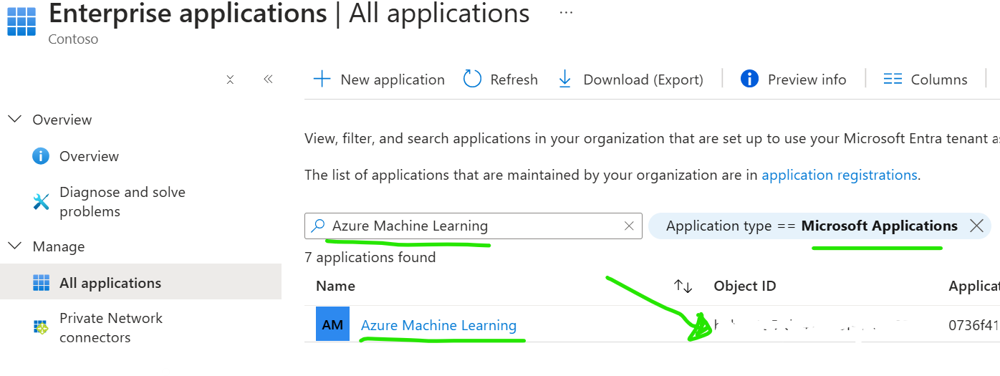

# Prerequisites - Before setting up an AIFactory

> [!IMPORTANT]
> See the new bootstrap template repository - even more automated way to setup Enterprise Scale AIFactory's. (This section is still valid and good to read)
> [Enterprise Scale AIFactory - Template repo, using the AI Factory as submodule](https://github.com/jostrm/azure-enterprise-scale-ml-usage)

## Summary of what is needed
- **Github / Azure Devops**
    - Steps: 1
        - Github: Write access, to create Github Action workflows
            - Github administrator
        - Azure Devops: to create service connection and Build/Release pipelines
            - Who: Azure Devops administrator
- **Azure:** 
    - Steps: 2,3,4
    - Who: 
        - Step 2 and 3: Azure Owner on at least 1 Azure subscription (if only setting up DEV environment)
        - *Step 4: Networking team. That has the IP-plan, to see that vNet ranges are not conflicting. This is not needed if running the AI Factory standalone mode
- **Entra ID**
    - Steps: 5
    - What: 
        - **3 service principles** (ObjectID, AppId, Secret)
        - **Object ID's** and **EMAIL-addressess**, for all end-users to be onboarded to the AI Factory project
            - Format: Comma-separated list
        - **IP-addresses** for all end-users to be onboarded to the AI Factory project
            - Format: Comma-separated list
        - **Object ID** for the global Azure Machine Learning application
    - Who: Central IT with admininstrator access to EntraID

# Scripts

>[!NOTE]
> Note: `Local-repo-link` only works, after you have finished step 1. `Docs-link` will work relative from this Github documentation, useful to browser the file, wherof `Local-repo-link` is 
the filed you may edit.
> 

0) Add the submodule to your repo (to get the bootstrap files)

    Run from your repo root location: 

    ```
    git submodule add https://github.com/jostrm/azure-enterprise-scale-ml
    ```

1) Run `00-start.sh` that will copy bootstrap files, for either Github or Azure Devops
    You will be prompted if you want to use Azure Devops or Github. Then relevant bash bootstrap files will be copied to your root directory.
    
    If you first select Azuure Devops and want to change your mind, just run this again, and it will clean up all Azure Devops files, and create bootstrap files for Github.

    ```bash
    bash ./azure-enterprise-scale-ml/00-start.sh
    ```
    
2) Copy templates and scripts: Copies scripts to root

    [Docs-link: 01-aif-copy-aifactory-templates.sh](../../../bootstrap/01-aif-copy-aifactory-templates.sh)

    Run from your repo root location (e.g. dir/ls should list the `azure-enterprise-scale-ml` submodule folder)

    ```bash
    bash ./01-aif-copy-aifactory-templates.sh
    ```

>[!NOTE]
> This will copy all template files to a folder at root called `aifactory-templates`. You need to rename that folder to `aifactory`, then you can edit parameters and variables. After this `Local-repo-link` and the code examples will work.
>  

3) `HOWTO: Refresh IaC pipelines`, without updating/overwriting the Variable files? 
    Purpose: To refresh the IaC pipelines (get new features, added AI Facotry project types etc). 
    
    If you have chosen Azure Devops in step 1, you will see the following files, at your root. It is safe to run the ones starting with `03` without overwriting your configuration. 
         
    ```bash
    bash ./02-ADO-YAML-bootstrap-files.sh
    bash ./03-ADO-YAML-bootstrap-files-no-var-overwrite.sh
    ```

    If you have chosen Github in step 1, you will see the following files, at your root:
    ```bash
    bash ./02-GH-bootstrap-files.sh
    bash ./03-GH-bootstrap-files-no-env-overwrite.sh
    ```
>[!IMPORTANT]
>The files starting with `02`, you run only one time or if you want a clean slate including variables you may have configured will be overwritten. The files starting with `03 will NOT` overwrite your configured variables but will refresh your .github/workflows or Azure Devops YAML pipelines.
>
   
    Note that if a pipeline (to support a new feature) needs a NEW variable, you need to look at the variable template file in the `aifactory-template` folder (Do step 2 to refresh that folder), and compare which variable to add under your `aifactory` folder.

4) `VERIFY, BEFORE running any pipelines:` Ensure Azure providers are enabled (create if not exists)

    [Docs-link: 26-enable-resource-providers.ps1](../../../environment_setup/aifactory/bicep/esml-util/26-enable-resource-providers.ps1) | [Local-repo-link](../../../../aifactory/esml-util/26-enable-resource-providers.ps1)

    How to run from root: 
    ```bash
    pwsh ./aifactory/esml-util/26-enable-resource-providers.ps1 -SubscriptionName 'TODO' -Readonly $false


5) `Optional:Nice-to-have script`: Creates one or many service principles and adds the information in the Seeding Keyvault.
   
    [Docs-link: 29-create-sp-or-update-oid-for-project.sh](../../../environment_setup/aifactory/bicep/esml-util/29-create-sp-or-update-oid-for-project.sh) | [Local-repo-link](../../../../aifactory/esml-util/29-create-sp-or-update-oid-for-project.sh)
    
    Manually edit the variables (`Local-repo-link`) at the top at the script, then run from root:
    ```bash
        bash ./aifactory/esml-util/29-create-sp-or-update-oid-for-project.sh
    ```

6) `Optional:Nice-to-have script` GET AKS version, in your region, to set variable values
    - Project type: ESML
        - **Variable: AKS version** supported in your region
            - **Example:** `admin_aks_version_override: "1.30.3"` 
        ```bash
            az aks get-versions --location eastus --output table
        ```    ``` 
**Below scripts are relevant for centralized/peered AI Factory only. Not Standalone mode**

5) `VERIFY, BEFORE running any pipelines:`Ensure Private DNS zones exists in "hub", if flag is set to true

    [Docs-link: 27-create-private-dns-zones.ps1](../../../environment_setup/aifactory/bicep/esml-util/esml-util/27-create-private-dns-zones.ps1) | [Local-repo-link](./aifactory/esml-util/esml-util/27-create-private-dns-zones.ps1)

    How to run from root: 

    ```bash
    pwsh ./aifactory/esml-util/27-create-private-dns-zones.ps1 -spID TODO -tenantID TODO -subscriptionID TODO8d1 -resourceGroupName TODO -location 'swedencentral'
    ``` 

6) `BEFORE running any pipelines:`Ensure policies are created on Subscription level (Note: Need to be manually edited for region/location)

    [Docs-link: 28-Initiatives.bicep](../../../environment_setup/aifactory/bicep/esml-util/28-Initiatives.bicep) | [Local-repo-link](./aifactory/esml-util/esml-util/28-Initiatives.bicep)

# MANDATORY: 1-5

## Step 1) Create Azure Devops (or Github) projects
- **Purpose:** Where the AIFactory acceleration code resides
- **Role needed:** Central IT. Microsoft EntraID administrator. Azure Devops administrator
- **Mandatory:** Yes.
- **What:** CODE repository: Create your Azure Devops project to store the AIFactory acceleration code (IaC, and templates) and Azure Devops Service Connections, based on Service principal "esml-common-bicep" (see step 3-7)
- **TODO**: 
    1) Create a new Azure Devops project (or reuse an existing). GOAL & REASON: Admin to Create a Service Connection, based on a Service Principal (step 5) with OWNER permisson on subscription, and GET,LIST, SET access policys on seeding keyvault (step 3). The Service Connection should have access to "all pipelines" in Azure Devops (at crestion step there is a checkbox for this)
        - [How-to guide](https://learn.microsoft.com/en-us/azure/devops/organizations/projects/create-project?view=azure-devops&tabs=browser): Create Azure Devops project
    2) Create 2 GIT repositories, in your Azure Devops
        - ESML-AIFactory-Common
        - ESML-AIFactory-Project001
        - [How-to guide](https://learn.microsoft.com/en-us/azure/devops/repos/git/creatingrepo?view=azure-devops&tabs=visual-studio-2022) : Create GIT repos

## Step 2) - Create Azure subscriptions (Enterprise Scale landing zone: Application landingzones)
- **Purpose:** To have the AIFactory DEV, TEST, PROD environments
- **Role needed:** Central IT / Cloud Team
- **Mandatory:** DEV is mandatory. 1 Subscription
- A) Create Subscriptions
    - Option A (Recommended to try out the AIFactory): Create 1 Azure subscription to act as the Dev environment. The AIFactory can simulate Test, Prod workflows (MLOps, LLMOps) with only a Dev
    - Option B (Recommended for productional use): For full AIFactory, create 3 Azure subscriptions (Dev, Stage, Prod)
    - [How-to guide](https://learn.microsoft.com/en-us/azure/cloud-adoption-framework/ready/azure-best-practices/initial-subscriptions): Create Azure subscriptions
    - [Read more](./14-networking-privateDNS.md) about AIFactory Enterprise Scale Landing Zones
- B) Enable resource providers: Enable the resource providers as [specified here](./12-resourceproviders.md)
    - [Tip: You can use the Powershell script to automate this](../../../environment_setup/aifactory/bicep/esml-util/26-enable-resource-providers.ps1)

## Step 3) Create an Azure keyvault for the admin of Microsoft Entra ID: The so called `seeding keyvault` (IaC purpose), and created Service principals
- **Purpose:** For the admin (usually Central IT), who has access to Microsoft Entra ID to created service principals, to store information, to be consumed by AIFactory IaC pipeline.
- **Role needed:** Central IT / Cloud Team
- **Mandatory: Yes**
- [How-to guide: Create & Use the AIFactory seeding keyvault](./12-seeding-keyvault.md)

## Step 4) Networking: Allocate vNet ranges in your IP-plan: 3 vNets with /16 CIDR size (at least /20)
- **Purpose:** To be able to peer the AIFactory later. 
- **Role needed:** Network team within Central IT / Cloud Team
- **Mandatory:** No. We can setup an AIFactory standalone mode. There is still access modes you can use: 1) Bastion & VM  2) Azure VPN Gatway 3) IP-whitelisting (service endpoints). 
- **Mandatory with /16 size:** No. 16 is optimal, but a size /18 will also work (10 0000 IP adresses or more), but not recommended for productional use (not even for DEV environment)
- **TODO**: Alloate at 1 or 3 vNet ranges, of size /16

> [!NOTE]
> **AI Factory Standalone mode** has been used, when an organization cannot use private endpoints, or cannot peer anything to the HUB that has Private DNS Zones.
> But, the recommendation is to peer it to the HUB, to have 4 access modes instead of 3, where the 4th is seamless and most cost effective.
> [Read more about networking here](14-networking-privateDNS.md)


## Step 5) EntraID: Create 3 service principals, and store info(appid, ObjectId, Secret) in the seeding keyvault [(see step 3)](#step-3-create-an-azure-keyvault-for-the-admin-of-microsoft-entra-id-the-so-called-seeding-keyvault-iac-purpose-and-created-service-principals)
- **Purpose:** To be used to setup the AIFactory. The information of the service principals: ObjectID, ApplicationID, Secret needs to be stored in the seeding keyvault
    - **SP1: `esml-common-bicep-sp`:** IaC purpose. This service principal will be used as a Service connection in Azure Devops. Used in a pipeline to create the AIFactory.
        - Store the info in the seeding keyvault.
        - Secret names example: `esml-common-bicep-sp-id`, `esml-common-bicep-sp-oid`,`esml-common-bicep-sp-secret`
    - **SP2: `esml-common-sp`:**: DataOps automation purpose. This SP be delegated access by SP1 to AIFactory resources in the Common area of the AIFactory
    - **SP3: `esml-project001-sp`:** MLOps automation purpose. This SP be delegated access by SP1 to AIFactory resources to a proejct specific area of the AIFactory
        - Tip: Create 5 or 10 in one go, and store the seeding keuyvault, to have for later. 
            - Example: `esml-project001-sp,esml-project002-sp,esml-project003-sp`
- **Role needed:** Microsoft EntraID administrator: Central IT / Cloud Team
- **Mandatory:** Yes
- **TODO**: Create the 3 service principals below
### AFactory IaC Service Principal (1st)
    - Name: esml-common-bicep-sp
    - Permissons: OWNER on Subscriptions created in step 2
    - Purpose: For the ESML AIFactory CoreTeam and its data ingestion team, for DataOps pipelines unattended
### Role: CoreTeam Service Principal (2nd)
    - Name: esml-common-sp
    - Permissions: None
    - Purpose: For the ESML AIFactory CoreTeam and its data ingestion team, for DataOps pipelines unattended
### Role: ProjectTeam Service Principal (3rd)
    - Name: esml-project001-sp
    - Permissions: None
    - Purpose: For the ESML AIFactory project teams, to be able to run their MLOps and LLMOps pipelines unattended

[Read more](./12-permissions-users-ad-sps.md) here aobut the permisssions and service principals


- **Users: Loookup Object ID's**
    - **Object ID's** and **EMAIL-addressess**, for all end-users to be onboarded to the AI Factory project
        - Format: Comma-separated list
    - **IP-addresses** for all end-users to be onboarded to the AI Factory project
        - Format: Comma-separated list
    - **Object ID** for the global Azure Machine Learning application. 
    - See image: 


# OPTIONAL 6-8

## *Step 6) Delegate User Access: Onboard a Microsoft EntraID user, with access to the Azure Devops created in step 1, and with OWNER permission on the Subscriptions created in Step 2, 
- **Purpose:** Efficiency. To be able to troubleshoot, manually login to Azure for `the AIFactory setup mentor`
- **Role needed:** Microsoft EntraID administrator: Central IT / Cloud Team
- **Mandatory:** No, optional but recommended. Very hard to troubleshoot if no insights that permission is set correctly. Need to have read access in EntraID to see the servic principal and keyvault permissions. Someone needs to verify that the Azure Devops Service connection works, that service principal (SP) esml-common-bicep has Get, List, Set to seeding keyvault. That the SP is OWNER on the subscriptions.
- **TODO**: 
    1) Create user in Microsoft EntraID
        - [How-to guide](https://learn.microsoft.com/en-us/entra/fundamentals/how-to-create-delete-users) : Create user
    2) Azure DevOps: Delegate access to Azure Devops project for user, with role BASIC. (Not role: STAKEHOLDER)
        - Access to GIT in that Azure Devops project is required.
        - [How-to guide](https://learn.microsoft.com/en-us/azure/devops/organizations/security/add-users-team-project?view=azure-devops&tabs=preview-page) : Delegate user access
    3) Azure: Delegate either permission as option A or B to user. (A downside with option B is lower means to trouble shoot during the setup phase)
        - Option A) Delegate OWNER permission on the Subscriptions created in [Step 2](#step-2---created-azure-subscriptions--enterprise-scale-landing-zones)
        - Option B) Delegate OWNER permission on the Resource Groups created by the AIFactory via the service principal `esml-common-bicep-sp` [created in step 5](#step-5-create-3-service-principals-where-1-of-them-has-owner-permission-on-the-subscriptions-created-in-step-2-and-store-informamtion-in-the-seeding-keyvault-see-step-3)
            - Note: To delegate a user access to the resource groups, you need to have [SETUP the AIFactory first](./13-setup-aifactory.md)
                - Resource groups that will be created looks similar as this: `dc-heroes-esml-project001-weu-dev-001-rg`, `dc-heroes-esml-project001-weu-test-001-rg`, `dc-heroes-esml-project001-weu-prod-001-rg` 

## *Step 7) Delgate Service Principal Access in Azure Devops + Import IaC pipelines + Set service connection to pipeline steps
- **Purpose:** Since only an Azure Devops admin have permission to create service connection and select that on a pipeline. 
    - E.g. the `AIFactory setup mentor` will not have permission with role: Stakeholder
- **Role needed:**: Azure Devops admin
- **Mandatory:** Not for Github. Only for Azure Devops.
- **TODO**: [Azure Devops: Create service connection + Import IaC pipelines + Set service connection to pipeline steps](./12-prereq-ado-create-servicecon-import-ado-pipelines.md)

## *Step 8) If you want to have Private DNS zones centrally in HUB (recommended) = centralDnsZoneByPolicyInHub=true
- **Mandatory:** No.
- **Role needed:**: Central IT, that have access to the central Hub (Hub/Spoke or VWAN)
1) Create the Private DNS Zones in the HUB as specified: 
    - [How-to - networking](./14-networking-privateDNS.md) 
2) Apply the policy to add A-records for all PaaS services that creates a private endpoint to have an A-record added to the central Private DNS zones
    - [How-to - networking](./14-networking-privateDNS.md)
        - Action: A Policy can be assigned on MGMT group (or subscription) that for every type or private DNS zones (for PaaS) will create records, in the DNS Zone.				
            - [Link: Create Azure Policy that adds private link records to centralized private DNZ zones automatically](https://www.azadvertizer.net/azpolicyinitiativesadvertizer/Deploy-Private-DNS-Zones.html)

# MORE INFO: Service principals & permissions explained: 

- [Read more](./12-permissions-users-ad-sps.md) here aobut the permisssions and service principals.
- [Read more](./12-seeding-keyvault.md) abou the *Seeding Keyvault* in the AIFactory

# MORE INFO: Network topology - Hub & Spoke & DNS Zones

[Read more](./14-networking-privateDNS.md) here about networking


    


