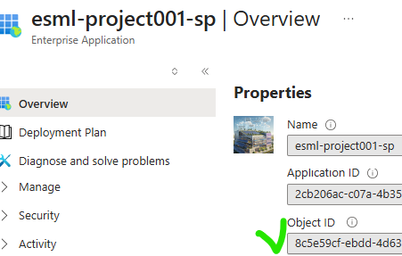
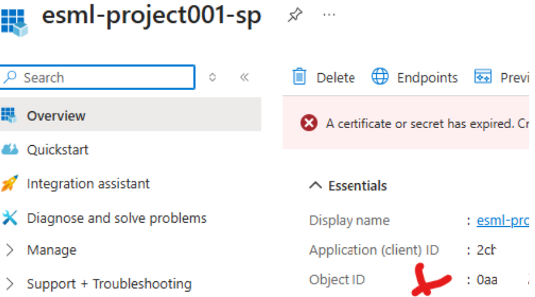

# Prerequisites - Before setting up an AIFactory

> [!IMPORTANT]
> See the new bootstrap template repository - even more automated way to setup Enterprise Scale AIFactory's. (This section is still valid and good to read)
> [Enterprise Scale AIFactory - Template repo, using the AI Factory as submodule](https://github.com/azure/enterprise-scale-aifactory)

## 📋 Summary of what is needed (Steps 1-6 covers the details)
- 🗂️ **Github / Azure Devops**
    - **Steps: 1**
    - **Who**
        - Github: Write access, to create Github Action workflows
            - Github administrator
        - Azure Devops: to create service connection and Build/Release pipelines
            - Who: Azure Devops administrator
- ☁️ **Azure:**
    - **Steps: 2,3,4**
    - **Who:** 
        - Step 2 and 3: A persona with Azure Owner on at least 1 Azure subscription (if only setting up DEV environment)
        - *Step 4: Networking team. That has the IP-plan, to see that vNet ranges are not conflicting. This is not needed if running the AI Factory standalone mode
- 🔐 **Entra ID**
    - **Steps: 5**
    - Who: Central IT with administrator access to EntraID
    - **What:** 
        - **3 service principles** (ObjectID, AppId, Secret)
            - **Why**: MI is not supported from all Azure Services. Project-specific service principle is needed to:
                - Projects: Enable Authentication on WebApp (only possible via SP), see [config-webapp-post-deplpoyment-of-webapp](../20-29/24-end-2-end-setup.md#config-webapp-post-deplpoyment-of-webapp)
                - Projects: Enable unattended CI/CD with unattended Evaluation.
                - Projects: ACL on Datalake for project folders, to run pipelines that reads/writes data.
                - Core team: Connect from Azure Data factory to certain services.
                - Core team: Github workflows, needs Service principle information.
        - **Object ID's** for Entra ID Security groups for team (or for end-users to be onboarded to the AI Factory project)
            - Format: Comma-separated list "asd234234f,asdf4525" is object id's for users. Usually 1 object ID per AI Factory project if Entra ID security group.
        - **IP-addresses** for all end-users to be onboarded to the AI Factory project. 
            - Format: Comma-separated list
            - Note: Only Needed for AI Factory standalone mode. And only if not using VPN in Standalone mode.
        - **Object ID** for the global Azure Machine Learning Enterprise application, called `Azure Machine Learning` in Entra ID
        - **Object ID** for the global `AzureDatabricks` Enterprise Application (Same manouver like finding the Azure Machine Learning), in Entra ID
- ✅ **Verify E2E**
    - Step 6) Verify before running any pipelines, that all configuration and artifacts exists, such as Azure Resource providers.

After all pre-requisites are verified - [go to the SETUP page and choose your preferred orchestrator: Azure Devops - YAML or Github Actions](../20-29/24-end-2-end-setup.md)

# 🔴 MANDATORY: Steps 1-6

>[!NOTE]
> If you want to learn how to configure the AI Factory in `standalone mode` versus `Hub-connected centralized private DNS zones` with `BYOVnet`- [ SETUP STARTING PAGE](../20-29/24-end-2-end-setup.md)
>


## 🗂️ Step 1) Create Azure Devops (or Github) projects
- **Purpose:** Where the AIFactory acceleration code resides
- **Role needed:** Central IT. Microsoft EntraID administrator. Azure Devops administrator
- **Mandatory:** Yes.
- **What:** CODE repository: Create your Azure Devops project to store the AIFactory acceleration code (IaC, and templates) and Azure Devops Service Connections, based on Service principal "esml-common-bicep" (see step 3-7)
- **TODO**: 
    1) Create a new Azure Devops project (or reuse an existing). GOAL & REASON: Admin to Create a Service Connection, based on a Service Principal (step 5) with OWNER permission on subscription, and GET,LIST, SET access policies on seeding keyvault (step 3). The Service Connection should have access to "all pipelines" in Azure Devops (at creation step there is a checkbox for this)
        - [How-to guide](https://learn.microsoft.com/en-us/azure/devops/organizations/projects/create-project?view=azure-devops&tabs=browser): Create Azure Devops project
    2) Create 2 GIT repositories, in your Azure Devops
        - ESML-AIFactory-Common
        - ESML-AIFactory-Project001
        - [How-to guide](https://learn.microsoft.com/en-us/azure/devops/repos/git/creatingrepo?view=azure-devops&tabs=visual-studio-2022) : Create GIT repos

## ☁️ Step 2) Create Azure subscriptions (Enterprise Scale landing zone: Application landing zones)
- **Purpose:** To have the AIFactory DEV, TEST, PROD environments
- **Role needed:** Central IT / Cloud Team
- **Mandatory:** DEV is mandatory. 1 Subscription
- A) Create Subscriptions
    - Option A (Recommended to try out the AIFactory): Create 1 Azure subscription to act as the Dev environment. The AIFactory can simulate Test, Prod workflows (MLOps, LLMOps) with only a Dev
    - Option B (Recommended for productional use): For full AIFactory, create 3 Azure subscriptions (Dev, Stage, Prod)
    - [How-to guide](https://learn.microsoft.com/en-us/azure/cloud-adoption-framework/ready/azure-best-practices/initial-subscriptions): Create Azure subscriptions
    - [Read more](./14-networking-privateDNS.md) about AIFactory Enterprise Scale Landing Zones
- B) Enable resource providers: Enable the resource providers as [specified here](./12-resourceproviders.md)
    - [Tip: You can use the Powershell script to automate this](../../../environment_setup/aifactory/bicep/esml-util/26-enable-resource-providers.ps1)

## 🔑 Step 3) Create an Azure keyvault for the admin of Microsoft Entra ID: The so called `seeding keyvault` (IaC purpose), and created Service principals
- **Purpose:** For the admin (usually Central IT), who has access to Microsoft Entra ID to created service principals, to store information, to be consumed by AIFactory IaC pipeline.
- **Role needed:** Central IT / Cloud Team
- **Mandatory: Yes**
- [How-to guide: Create & Use the AIFactory seeding keyvault](./12-seeding-keyvault.md)

## 🌐 Step 4) Networking: Allocate vNet ranges in your IP-plan: 3 vNets with /16 CIDR size (at least /20)
- **Purpose:** To be able to peer the AIFactory later. 
- **Role needed:** Network team within Central IT / Cloud Team
- **Mandatory:** No. We can setup an AIFactory standalone mode. There is still access modes you can use: 1) Bastion & VM  2) Azure VPN Gateway 3) IP-whitelisting (service endpoints).
- **Mandatory with /16 size:** No. 16 is optimal, but a size /18 will also work (10 0000 IP addresses or more), but not recommended for productional use (not even for DEV environment)
- **TODO**: Allocate at 1 or 3 vNet ranges, of size /16

> [!NOTE]
> **AI Factory Standalone mode** has been used, when an organization cannot use private endpoints, or cannot peer anything to the HUB that has Private DNS Zones.
> But, the recommendation is to peer it to the HUB, to have 4 access modes instead of 3, where the 4th is seamless and most cost effective.
> [Read more about networking here](14-networking-privateDNS.md)


## 👤 Step 5) EntraID: Create 3 service principals, and store info(appid, ObjectId, Secret) in the seeding keyvault [(see step 3)](#step-3-create-an-azure-keyvault-for-the-admin-of-microsoft-entra-id-the-so-called-seeding-keyvault-iac-purpose-and-created-service-principals)
- **Purpose:** To be used to setup the AIFactory. The information of the service principals: ObjectID, ApplicationID, Secret needs to be stored in the seeding keyvault
    - **SP1: `esml-common-bicep-sp`:** IaC purpose. This service principal will be used as a Service connection in Azure Devops. Used in a pipeline to create the AIFactory.
        - Store the info in the seeding keyvault.
        - Secret names example: `esml-common-bicep-sp-id`, `esml-common-bicep-sp-oid`,`esml-common-bicep-sp-secret`
    - **SP2: `esml-common-sp`:**: DataOps automation purpose. This SP be delegated access by SP1 to AIFactory resources in the Common area of the AIFactory
    - **SP3: `esml-project001-sp`:** MLOps automation purpose. This SP be delegated access by SP1 to AIFactory resources to a project specific area of the AIFactory
        - Tip: Create 5 or 10 in one go, and store the seeding keyvault, to have for later.
            - Example: `esml-project001-sp,esml-project002-sp,esml-project003-sp`
- **Role needed:** Microsoft EntraID administrator: Central IT / Cloud Team
- **Mandatory:** Yes
- **TODO**: Create the 3 service principals below
### AIFactory IaC Service Principal (1st)
    - Name: esml-common-bicep-sp
    - Permissions: OWNER on Subscriptions created in step 2
    - Purpose: For the ESML AIFactory CoreTeam and its data ingestion team, for DataOps pipelines unattended
### Role: CoreTeam Service Principal (2nd)
    - Name: esml-common-sp
    - Permissions: None
    - Purpose: For the ESML AIFactory CoreTeam and its data ingestion team, for DataOps pipelines unattended
### Role: ProjectTeam Service Principal (3rd)
    - Name: esml-project001-sp
    - Permissions: None
    - Purpose: For the ESML AIFactory project teams, to be able to run their MLOps and LLMOps pipelines unattended

[Read more](./12-permissions-users-ad-sps.md) here about the permissions and service principals


- **Users: Lookup Object ID's**
    - **Object ID's** and **EMAIL-addresses**, for all end-users to be onboarded to the AI Factory project
        - Format: Comma-separated list
    - **IP-addresses** for all end-users to be onboarded to the AI Factory project
        - Format: Comma-separated list
    - **Object ID** for the global Azure Machine Learning application. (same for `AzureDatabricks`)
        - 1) Go to: Enterprise applications
        - 2) Filter on Microsoft applications
        - 3) Search "Azure Machine Learning"
        - 4) Copy the ObjectID that the green arrow points at
    - See image: 
    - **Object ID** for the Service principals
        - 1) Go to: Enterprise applications
        - 2) Filter on Enterprise applications
        - 3) Search service principal name you created "esml-project-001-sp"
        - 4) Click in it and Copy the ObjectID with green checkbox
        - See image, Correct Object ID: 
    - Note: If you see this view below, you see another Object ID, the wrong one. You probably clicked on "App registrations" in Entra ID, instead of step 1
        - See image of Wrong Object ID: 
    - NB! We have created a SCRIPT, that automatically created service principals, and adds the triplet of information (oid, secret, app id) to the seeding keyvault. If you use that, it is fetching correct info, and it creates SP's for 1 or 100 projects automatically:
        - BASH Script: [Docs-link: 29-create-sp-or-update-oid-for-project.sh](../../../environment_setup/aifactory/bicep/esml-util/29-create-sp-or-update-oid-for-project.sh) | [Local-repo-link](../../../../aifactory/esml-util/29-create-sp-or-update-oid-for-project.sh)


## ✅ Step 6: Verify: Resource Providers, Private DNS zones (if not standalone)
VERIFY, BEFORE running any pipelines. See [Scripts to run to verify/create if not exists](#scripts)
- Ensure Azure `Resource providers` are enabled (create if not exists)
    - [Script: E](#e-verify-before-running-any-pipelines-ensure-azure-resource-providers-are-enabled-create-if-not-exists)
- Ensure `Private DNS zones` exists in "hub", if flag is set to true
    - Note: Not needed for `Standalone AI Factory`
    - [Script: H](#h-verify-before-running-any-pipelinesensure-private-dns-zones-exists-in-hub-if-flag-is-set-to-true)
- Ensure policies are created on Subscription level (Note: Need to be manually edited for region/location)
    - Note: Not needed for `Standalone AI Factory`
    - [Script: I](#i-before-running-any-pipelines-ensure-policies-are-created-on-subscription-level-note-need-to-be-manually-edited-for-regionlocation)

After all pre-requisites are verified - [go to the SETUP page and choose your preferred orchestrator: Azure Devops - YAML or Github Actions](../20-29/24-end-2-end-setup.md)


# 🔵 OPTIONAL: Steps 7-9

## 👥 Step 7) Delegate User Access: Onboard a Microsoft EntraID user, with access to the Azure Devops created in step 1, and with OWNER permission on the Subscriptions created in Step 2, 
- **Purpose:** Efficiency. To be able to troubleshoot, manually login to Azure for `the AIFactory setup mentor`
- **Role needed:** Microsoft EntraID administrator: Central IT / Cloud Team
- **Mandatory:** No, optional but recommended. Very hard to troubleshoot if no insights that permission is set correctly. Need to have read access in EntraID to see the service principal and keyvault permissions. Someone needs to verify that the Azure Devops Service connection works, that service principal (SP) esml-common-bicep has Get, List, Set to seeding keyvault. That the SP is OWNER on the subscriptions.
- **TODO**: 
    1) Create user in Microsoft EntraID
        - [How-to guide](https://learn.microsoft.com/en-us/entra/fundamentals/how-to-create-delete-users) : Create user
    2) Azure DevOps: Delegate access to Azure Devops project for user, with role BASIC. (Not role: STAKEHOLDER)
        - Access to GIT in that Azure Devops project is required.
        - [How-to guide](https://learn.microsoft.com/en-us/azure/devops/organizations/security/add-users-team-project?view=azure-devops&tabs=preview-page) : Delegate user access
    3) Azure: Delegate either permission as option A or B to user. (A downside with option B is lower means to trouble shoot during the setup phase)
        - Option A) Delegate OWNER permission on the Subscriptions created in [Step 2](#step-2---created-azure-subscriptions--enterprise-scale-landing-zones)
        - Option B) Delegate OWNER permission on the Resource Groups created by the AIFactory via the service principal `esml-common-bicep-sp` [created in step 5](#step-5-create-3-service-principals-where-1-of-them-has-owner-permission-on-the-subscriptions-created-in-step-2-and-store-information-in-the-seeding-keyvault-see-step-3)
            - Note: To delegate a user access to the resource groups, you need to have [SETUP the AIFactory first](./13-setup-aifactory.md)
                - Resource groups that will be created looks similar as this: `dc-heroes-esml-project001-weu-dev-001-rg`, `dc-heroes-esml-project001-weu-test-001-rg`, `dc-heroes-esml-project001-weu-prod-001-rg` 

## ⚙️ Step 8) Delegate Service Principal Access in Azure Devops + Import IaC pipelines + Set service connection to pipeline steps
- **Purpose:** Since only an Azure Devops admin have permission to create service connection and select that on a pipeline. 
    - E.g. the `AIFactory setup mentor` will not have permission with role: Stakeholder
- **Role needed:**: Azure Devops admin
- **Mandatory:** Not for Github. Only for Azure Devops.
- **TODO**: [Azure Devops: Create service connection + Import IaC pipelines + Set service connection to pipeline steps](./12-prereq-ado-create-servicecon-import-ado-pipelines.md)

## 🔒 Step 9) If you want to have Private DNS zones centrally in HUB (recommended) = centralDnsZoneByPolicyInHub=true
- **Mandatory:** No.
- **Role needed:**: Central IT, that have access to the central Hub (Hub/Spoke or VWAN)
1) Create the Private DNS Zones in the HUB as specified: 
    - [How-to - networking](./14-networking-privateDNS.md) 
2) Apply the policy to add A-records for all PaaS services that creates a private endpoint to have an A-record added to the central Private DNS zones
    - [How-to - networking](./14-networking-privateDNS.md)
        - Action: A Policy can be assigned on MGMT group (or subscription) that for every type or private DNS zones (for PaaS) will create records, in the DNS Zone.				
            - [Link: Create Azure Policy that adds private link records to centralized private DNZ zones automatically](https://www.azadvertizer.net/azpolicyinitiativesadvertizer/Deploy-Private-DNS-Zones.html)

# ℹ️ MORE INFO: Service principals & permissions explained:

- [Read more](./12-permissions-users-ad-sps.md) here about the permissions and service principals.
- [Read more](./12-seeding-keyvault.md) about the *Seeding Keyvault* in the AIFactory

# ℹ️ MORE INFO: Network topology - Hub & Spoke & DNS Zones

[Read more](./14-networking-privateDNS.md) here about networking

# ℹ️ MORE INFO: Add or Refresh Submodule

**Add - with long path**

```sh
git config --system core.longpaths true
```

**Add**

```sh
git submodule add https://github.com/jostrm/azure-enterprise-scale-ml
```

**Refresh**

```sh
git submodule update --init --recursive
```

```sh
git submodule foreach 'git checkout main || git checkout -b main origin/main'
```

>[!NOTE]
> Note: Local-repo-link only works, after you have finished step 1. Docs-link will work relative from this Github documentation, useful to browse the file where Local-repo-link is the file you may edit.
> 

# 📜 SCRIPTS

## 🛠️ Pre-requisite to run scripts in BASH, Powershell, Azure CLI
### 🖥️ Install BASH (Windows | GNU bash version 5.2.37 or higher)
Most scripts (starting with bash) is bash script has been tested with Git bash on Windows (GNU bash version 5.2.37 or higher). 

[Download & Install BASH, via Git Bash here](https://git-scm.com/downloads)

- Note: It has been tested in UBUNTU and on Mac OS, where it does not work straight of the box (extra bash libraries needs to be installed)

### 🔷 Install Powershell: Version 7.5.1 or higher
Scripts starting with pwsh,is POWERSHELL commands, such as [Verify resource providers](#e-verify-before-running-any-pipelines-ensure-azure-resource-providers-are-enabled-create-if-not-exists)

- [Download & Install Powershell](https://learn.microsoft.com/en-us/powershell/scripting/install/installing-powershell-on-windows?view=powershell-7.5)

### ☁️ Install Azure CLI: Version 2.71 or higher

- [Download & Install Azure CLI](https://learn.microsoft.com/en-us/cli/azure/install-azure-cli?view=azure-cli-latest)

## 📦 A) Add the submodule to your repo (to get the bootstrap files)
Run from your repo root location:

```sh
bash git submodule add https://github.com/jostrm/azure-enterprise-scale-ml
```

This will add a folder in your repo at root (a GIT submodule) called **azure-enterprise-scale-ml** that contains accelerator code (bootstrap scripts, templates)

## 🚀 B) Run 00-start.sh that will copy bootstrap files, for either Github or Azure Devops

You will be prompted if you want to use Azure Devops or Github. Then relevant bash bootstrap files will be copied to your root directory.
If you first select Azure Devops and want to change your mind, just run this again, and it will clean up all Azure Devops files, and create bootstrap files for Github.

```sh
bash ./azure-enterprise-scale-ml/00-start.sh
```
    
## 📋 C) Copy templates and scripts: Copies scripts to root
Run from your repo root location (e.g. dir/ls should list the **azure-enterprise-scale-ml** submodule folder): 

```sh
bash ./01-aif-copy-aifactory-templates.sh
```

>[!IMPORTANT]
> This will copy all template files to a folder at root called **aifactory-template**. You need to rename that folder to **aifactory**, then you can edit parameters and variables. After this **Local-repo-link** and the code examples will work.

## 🔄 D) `HOWTO: Refresh IaC pipelines`, without updating/overwriting the Variable files? 
Purpose: To refresh the IaC pipelines (get new features, added AI Factory project types etc).
Info: If you have chosen Azure Devops in step 1, you will see the following files, at your root. 

It is safe to run the ones starting with `03` without overwriting your configuration:

1st time - Run this, if it is your initial setup of the AI Factory: 
```sh
bash ./02-ADO-YAML-bootstrap-files.sh
```

2nd time and further - Run this, if you already have setup the AI Factory, and want to refresh the Azure Devops pipelines.
```sh
bash ./03-ADO-YAML-bootstrap-files-no-var-overwrite.sh
```

If you have chosen Github in step 1, you will see the following files, at your root

- bash ./02-GH-bootstrap-files.sh
- bash ./03-GH-bootstrap-files-no-env-overwrite.sh

>[!IMPORTANT]
>The files starting with `02`, you run only one time or if you want a clean slate including variables you may have configured will be overwritten. The files starting with **03-...** will not overwrite your configured variables but will refresh your .github/workflows or Azure Devops YAML pipelines.
>
   
Note that if a pipeline (to support a new feature) needs a NEW variable, you need to look at the variable template file in the **aifactory-template** folder (Do step 2 to refresh that folder), and compare which variable to add under your **aifactory** folder.

## ✅ E) VERIFY, BEFORE running any pipelines: Ensure Azure resource providers are enabled (create if not exists)

[Docs-link: 26-enable-resource-providers.ps1](../../../environment_setup/aifactory/bicep/esml-util/26-enable-resource-providers.ps1) | [Local-repo-link](../../../../aifactory/esml-util/26-enable-resource-providers.ps1)

How to run from root:

```sh
pwsh ./aifactory/esml-util/26-enable-resource-providers.ps1 -SubscriptionName 'TODO' -Readonly $false
```

## 💡 F) Optional: Nice-to-have script: Creates one or many service principles and adds the information in the Seeding Keyvault.
Best practice is to have **1 seeding keyvault per environment** (Dev, Stage, Production, e.g. per subscription. Benefits: 
- The secret names in keyvaults, can stay the same across the environments (you don't need to reconfigure Variables)
- The same service environment-specific **Azure Devops service connection** can be used for seeding keyvault as for the actual resources, without needing to assign the **esml-common-bicep-sp** service principle access to further subscriptions, e.g. in the case the seeding keyvault resides in another subscription.

    [Docs-link: 29-create-sp-or-update-oid-for-project.sh](../../../environment_setup/aifactory/bicep/esml-util/29-create-sp-or-update-oid-for-project.sh) | [Local-repo-link](../../../../aifactory/esml-util/29-create-sp-or-update-oid-for-project.sh)
    
How-to: Manually edit the variables (`Local-repo-link`) at the top at the script, then run from root:

```sh
bash ./aifactory/esml-util/29-create-sp-or-update-oid-for-project.sh
```

## 💡 G) Optional: Nice-to-have script: GET AKS version, in your region, to set variable values
Project type: ESML
**Variable: AKS version** supported in your region
- **Example:** admin_aks_version_override: 1.30.3

```sh
az aks get-versions --location eastus --output table
```

**Below scripts are relevant for centralized/peered AI Factory only. Not Standalone mode**

## ✅ H) VERIFY, BEFORE running any pipelines: Ensure Private DNS zones exists in "hub", if flag is set to true

[Docs-link: 27-create-private-dns-zones.ps1](../../../environment_setup/aifactory/bicep/esml-util/27-create-private-dns-zones.ps1) | [Local-repo-link](./aifactory/esml-util/esml-util/27-create-private-dns-zones.ps1)

How to run from root: 

```sh
pwsh ./aifactory/esml-util/27-create-private-dns-zones.ps1 -spID TODO -tenantID TODO -subscriptionID TODO -resourceGroupName TODO -location 'swedencentral'
``` 

## ✅ I) BEFORE running any pipelines: Ensure policies are created on Subscription level (Note: Need to be manually edited for region/location)

[Docs-link: 28-Initiatives.bicep](../../../environment_setup/aifactory/bicep/esml-util/28-Initiatives.bicep) | [Local-repo-link](./aifactory/esml-util/esml-util/28-Initiatives.bicep)

# 📰 FEATURE NEWS UPDATE

<details>
  <summary><b>NEWS (2026-02 | v.1.24)</b></summary>

## V 1.24: Configuration Wizard - update: Import variable file
✅ Now supports importing a variable file, to get started from "backups" etc

## V 1.24: BYO Contributor role: 
✅ Now you can set a variable, Role ID, of your own custom contributor role

## V 1.24: CRUD update instead of BICEP INCREMENTAL (or ARM, Terraform) bring an intelligent & riskfree "Complete mode"
The AI Factory automation supports intelligent CRUD: Create Update Delete of resources, with a dependency graph over architectures, and over Foundry and its related resources (CosmosDB, AI Search), and over SKU's that Azure needs to have correct if using CMK or Private Networking. 

⚠️ **Background: BICEP has the default mode of INCREMENTAL**, meaning that it will never delete any resources in the Resources group, but it also have COMPLETE mode, which deletes the resources not defined in the BICEP file. COMPLETE mode may end up in "unwanted deletes, e.g. scenario A
- Scenario A) e.g. a traditional LZ IaC (BIPEP or TERRAFORM) sets up resources, then the use case team, create their own bicep to add other resources, if the LZ IaC runs again, it will remove the extra resources.

✅ **Solution** - This is solved in the AI Factory IaC, due to an extra layer of logic, where it uses BICEP Incremental mode, but still supports DELETE, you simply need to set "enableAISearch=false", and 
- It will delete AI Search (but only if no dependency exists to it)
- It will never delete any other extra resources that the AI Factory IaC has not created.
- It will do a proper cleaning, remove related private endpoints etc
- The AI Factory IaC will also consider that correct SKU's are set in the configuration, when CREATING resources.

</details> <br>


## Feature Roadmap & Next Release: 1.23
- **Next Release: 1.23** will include below up until 2024-10
- **Current release 1.20** includes all Done up until 2024-04

### [Release 1.23](https://github.com/jostrm/azure-enterprise-scale-ml/releases/tag/release_120) <br>
- **ESML + GenAI merged into GenAI. enableServiceX=true, for all services. See [Variables.yaml file, lines: 178-240](./environment_setup/aifactory/bicep/copy_to_local_settings/azure-devops/esml-yaml-pipelines/variables/variables.yaml)
    - STATUS: Done (2025-08)
- **New services: LogicApps **: Added as a service
    - STATUS: Done (2025-10)
- **OnlyCreateIfNotExists & more feature flags**: Dynamically adds services, via feature flags (workaround to avoid Bicep/ARM errors for private endpoints etc)
    - STATUS: Done (2025-05)
- **BYOAppServiceEnv**: Deploy Azure function, Azure WebApp as usual via AIFactory, but connect to your own App services environment
    - STATUS: Done (2025-05)
- **PostgreSQL (flexible servers), SQL Database, Redis Cache**: Add more Database engines, optionally to choose from
    - STATUS: Done (2025-05)
- **Advanced Personas**: Connect more `Personas` and `EntraID Security Groups` (within main personas: coreteam, project teams)
    - STATUS: Ongoing (2025-05)

<details>
  <summary><b>Earlier features & Releases: 1.20</b></summary>

### [Release 1.20](https://github.com/jostrm/azure-enterprise-scale-ml/releases/tag/release_120)
- **AI Gateway**: Integrate AI Gateway (AI Hub gateway, with advancede cross-charging reports) including networking, to AI Factory common area.
    - STATUS: Done (2025-04)
        - https://github.com/Azure-Samples/ai-hub-gateway-solution-accelerator/blob/main/guides/bring-your-own-network.md
- **Networking Access modes**: Adding a new mode for GenAI project type called `enablePublicAccessWithPerimeter`
    - With the new mode, the total is 5 ways for user access:
        - 1) `private-peered` (top recommendation)
        - 2) `private-standalone with Azure VPN` (recommended. If you cannot do: Hub-peering)
        - 3) `private-standalone with public IP-whitelisting` (DEMO option, or if you cannot to Hub-peering, or cannot use VPN)
        - 4) `private-standalone/peered with Azure Bastion` (only for admin, a few users, trouble shooting. Not recommended for end-users)
        - 5) `public-secure perimeter with conditional-access`(If you cannot do: Hub-peering, VPN, cannot work with IP-whitelisting due to split-tunneling/dynamic IP)
    - STATUS: Done (2025-04)
- **Exposing on/off for more services in GENAI type**: Base parameter file `31-esgenai-default.json` to include more true/false flags if to create the following services: `Container Apps, App Service/WebApp, Function App, Bing, CosmosDB, Azure Dashboard for Apps`.
    - [Go here for full list of services and on/off](./documentation/v2/20-29/24-configure-AIfactory-project.md)
    - STATUS: Completed (2025-03)
- **BYOVnet + BYOsubnets**: Bring your own vNet in a separate resource group,  instead of having the AI Factory create it. Also BYOsubnets.
    - STATUS: Completed (2024-05)
- **Shared Container Registry**: Optional flag, saving 30% run/idle cost per use case, by sharing container registry across Azure ML workspaces/Azure AI foundry
    - STATUS: Completed (2024-08)
- **Azure ContainerApps (with Env), Bing Search, CosmosDB, Azure OpenAI standalone**: Added. All are optional with feature flags (true/false)
    - STATUS: Completed (2024-08)

 See [See Arhicteture diagrames - for all features](./documentation/v2/10-19/11-architecture-diagrams.md)

</details>


<details>
  <summary><b>Feature history</b></summary>

# Feature history

|Date     |Category   | What   | Link   |
|------------|-----------|--------|--------|
|2025-03  |infra (IaC)|ADO YAML also supported for project type GenAI. Now GHA or ADO supports both ESML, GenAI-1 |[IaC orchestration](../azure-enterprise-scale-ml/environment_setup/aifactory/bicep/copy_to_local_settings/)|
|2024-10  |Best Practices| Well-Arhitected framework for AI| [WAF AI workload - AI Factory personas](./documentation/v2/20-29/25-personas.md)|
|2024-03  |Automation | Add project member & core team memeber| [Workflow diagram](./documentation/v2/10-19/13-flow-diagram-1.md)|
|2024-03  |Docs | New Docs v.2 | [Documentation](./documentation/v2/10_index.md)|
|2024-02  |infra (IaC) | NEW! ESGenAI project type: Azure AI Foundry+AI Search (RAG/Agentic) | [15-aifactory-overview.md](./documentation/v2/10-19/15-aifactory-overview.md) |
|2024-02  |Datalake - Onboarding |Auto-ACL on PROJECT folder in lakel|-|
|2023-03  |Networking|No Public IP: Virtual private cloud - updated networking rules| https://learn.microsoft.com/en-us/azure/machine-learning/v1/how-to-secure-workspace-vnet?view=azureml-api-1&preserve-view=true&tabs=required%2Cpe%2Ccli|
|2021-02  |ESML Pipeline templates|Azure Databricks: Training and Batch pipeline templates. 100% same support as AML pipeline templates (inner/outer loop MLOps)|-|
|2022-08  |infra (IaC)|ADO now support yaml for ESML|-|
|2022-10  |ESML MLOps |ESML MLOps v3 advanced mode, support for Spark steps ( Databricks notebooks / DatabrickStep )|-|

</details>


