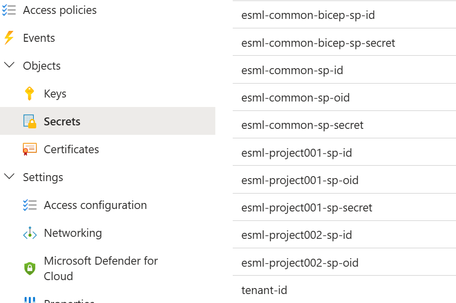

# How to add an AIFactory project - setup & use the `AIFactory seeding Keyvault`
Purpose: We want to split the responsibility of who to create articfacts in Microsoft Entra ID, versus the AIFactory pipeline in Azure Devops / GHA - who reads information about service principals and sets permissions.
- Example: An admininstrator can create 10 service principals, January 1st, that will be stored in a `seeding Keyvault`, and used whenever a project manager wants to order a new AIFactory project during the year, up to 10 projects.

## Step 1) Create the keyvault and enable BICEP to use is

1) Create an Azure Keyvult, in the AIFactory DEV Azure subscription, in a resource group that ESML Core team administrators has access to.
2) Enable the Keyvault to be used by BICEP, by running below command: 
The below is needed for ADO and BICEP able to use this keyvault: 

 `az keyvault update  --name kv-esml-seeding-001 --enabled-for-template-deployment true
 `
 - Purpose: For AAD ADMIN to add 1-250 project service principles. 2022 we can reuse the SP's from the old projects 1-12.   External keyvault: `kv-esml-common-ext`

## Step 2) Setup & Use the `Seeding keyvault`: Add information

### Add new AIFactory PROJECT service principal information: Steps: 1-3 (ex:005)
- 1) An ADMIN creates a new service principle in Microsoft Entra ID, and saves in EXTERNAL keyvault `'kv-esml-common-ext'` the 3 values
 	- esml-project005-sp-id
 	- esml-project005-sp-oid
 	- esml-project005-sp-secret
 
- 2) ESML ADMIN, configures the Azure Devope "esml-project" RELEASE pipeline, 4 VARIABLES need to be set. /Edit release/ Note that 2 valus is copied from external keuvaylt. Then run the RELEASE pipeline.

	`project_number_000 = 005`

	`project_service_principal_AppID` = ref001

	`project_service_principal_OID` =  ref002

	`technical_admins_ad_object_id` = ref003

	- ref001= esml-project005-sp-id
	- ref002= esml-project005-sp-id
	- ref003= AD user Object Id's for all project members, in a comma-separeted list: `asdf123,asd24,234f3`

	#### Click "deploy"...wait 30min..DONE!
## DONE!

## Seeding keyvault - service principals & secrects explained
Secret names is flexible. But if chosen the below names, no variable configuration is needed in the IaC pipeline in Azure Devops.

Service principals: Below the secret information about the service principals used in the AIFactory is explained.

| Secret name | Purpose
|--------------------------|-------------------------------------------------------|
|esml-common-bicep-sp-id   | `Purpose: Provision ESMLAI Factory and projects`|
| esml-common-bicep-sp-secret | `- Example: The Azure Devops service connection for AIFactory infra (esml-common, esml-project, add-members-to-project, add-members-to-coreteam), will be based on this`|
| esml-common-sp-id | `Purpose: For ESML AIFactory CoreTeam and its data ingestion team, for DataOps pipelines unattended`|
| esml-common-sp-oid | `-`|
| esml-common-sp-secret | `-`|
| esml-project001-sp-id | `Purpose: For ESML AIFactory project teams, to be able to run their MLOps and LLMOps pipelines unattended`|
| esml-project001-sp-oid | `- Example: Will have ACL permissions on project specific datalake folders, GET accesspolicy on keyvault, Contributor on Azure ML workspace`|
| esml-project001-sp-secret | `-`|
| ... | `Admin of Microsoft EntraID can create multiple service principals, at one go (e.g. spend an hour), and then there is no dependency to that Admin when adding AIFactory projects`|
| esml-project012-sp-id | `-`|
| esml-project012-sp-oid | `-`|
| esml-project012-sp-secret | `-`|

## Service principals - purpose and permissions exaplained
### SP AIFactory specific (IaC purpose): 
Used for AIFactory orchestration service principal: Create 1 service principal with OWNER permission to the subscriptions: Dev, Test, Prod.
- Purpose: For Azure Devops / Github Action to be able to provision the AIFactory, and AIFactory projects, and set permissions for users and services (RBAC, ACL, Keyvault Access Policys) to services, datalake folders, keyvaults.

### SP project specific (Permission purpose): 
One to many project specific service principals, one per AIFactory project, add add its information to the AIFactory seeding keuvalt.
Tip is to create 5 or 10 in one go, to have for later. 

- Purpose: The seeding keyvault will be read, by the AIFactory specific service principal. This will be as low permissions that MLOps, LLMOps, and end-users needs.
    - Datalake permissions: It only has access to the project specific datalake folder. 
    - Services: It only has access to the project specific services, under the projects resource groups, such as resource groups for project001 in DEV, TEST, PROD environments
    - Example: `dc-heroes-esml-project001-weu-dev-001-rg`, `dc-heroes-esml-project001-weu-test-001-rg`, `dc-heroes-esml-project001-weu-prod-001-rg` 