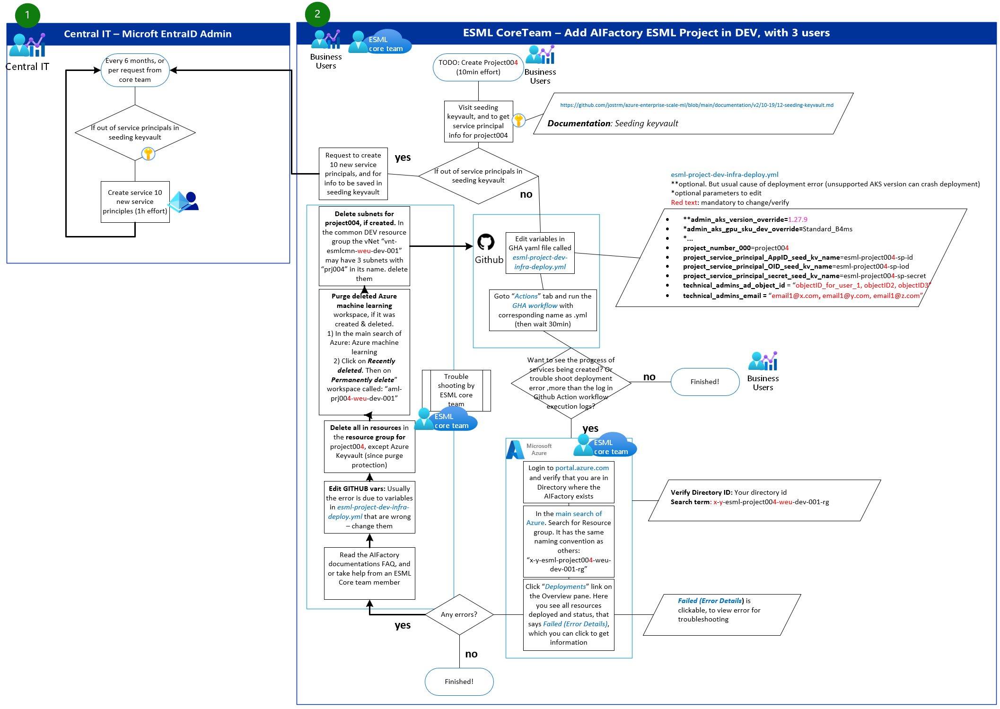

# `Infra:AIFactory`: Flow diagrams - Add AIFactory project, Add users (CoreTeam)

## How to get Object ID of user? 
- Option A) If read access in Microosft EntraID you can see your own user. Adminitrators can see all users.
- Option B) Contact the adminisistrator in your IT department, and ask for ObjectID's for users in Microsoft EntraID. Prove the admin a list of email adresses of users, to use for lookup the ObjectID.
- Option C) Powershell. Get it by using *Get-AzADUser* or *Get-AzADServicePrincipal* cmdlet

### Option C) Get user by User Principal Name (UPN)
```Powershell
$user = Get-AzADUser -UserPrincipalName "user@example.com"
$objectId = $user.Id
Write-Output $objectId
```
### Option C) Get service principal by Display Name
```Powershell
$servicePrincipal = Get-AzADServicePrincipal -DisplayName "MyServicePrincipal"
$objectId = $servicePrincipal.Id
Write-Output $objectId
```

## Flow: Add AIFactory ESML Project in DEV, with 3 users


## Flow: Add project team users, to existing AIFactory project in DEV, with 3 users
