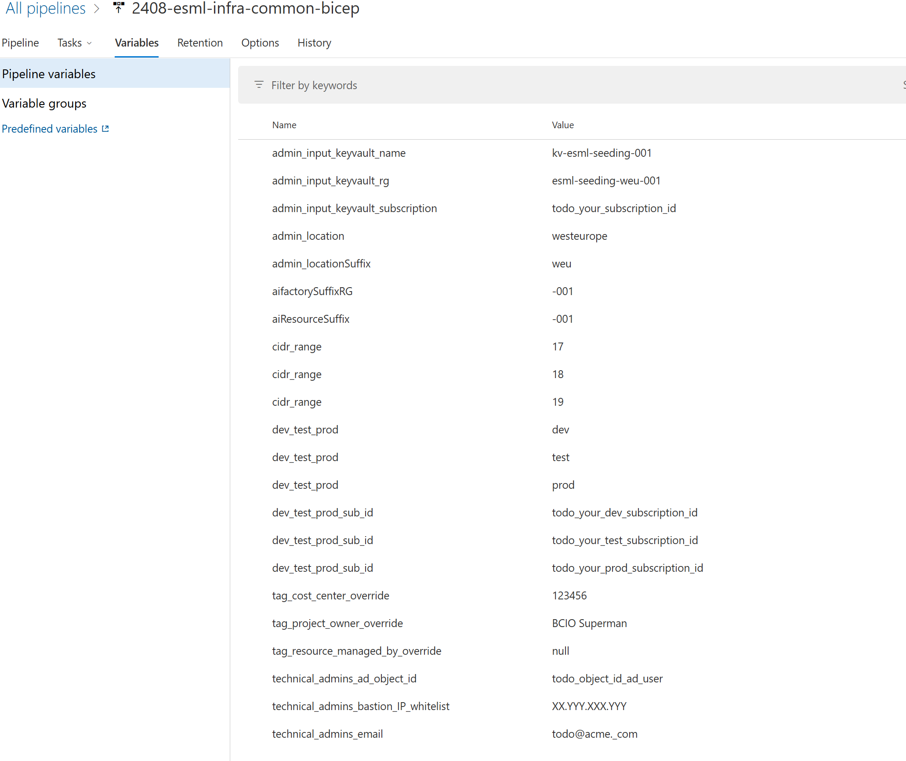
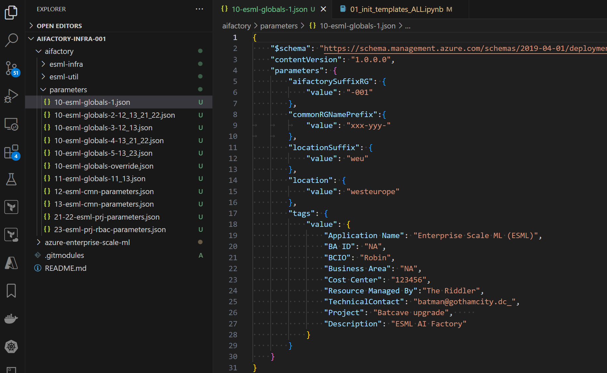

# Variables & Baseline parameters
In Azure Devops, or GITHUB, you can edit variables (.yaml), to override the baseline parameters (.json)
The variables overrides some of the baseline parameters (.json). 
- **Baseline parameters** is **extremely rare** to change after initial setup
- **Variables** has some variables that is **rare to change** after initial setup, and some that **needs** to change for every new AIFactory project.

The below shows Variables in Azure Devops, for the Common part of the AIFactory

## Variables:Common environment (Azure Devops/Github) that overrides baseline parameters, explained

|Variable|Purpose|1-time-setup only|Description|
|---|---|---|---|
|**admin_input_keyvault_name** |**Keyvaultname of seeding keyvault resides** |Yes|The seeding keyvault is used by the pipeline to read from, to assign service principles to AIFactory projects internal keyvaults. It copies information from seeding keyvaults,to project or coreteam keyvaults.  &#9642; [Link - Seeding keyvault](../10-19/12-seeding-keyvault.md)|
|**admin_input_keyvault_rg** |**Resourcegroup where seeding keyvault resides** |Yes|Azure Resourcegroup name  &#9642; [Link - Seeding keyvault](../10-19/12-seeding-keyvault.md)|
|**admin_input_keyvault_subscription** |**Subscription ID where seeding keyvault resides** |Yes|This can be the same subscription ID as the DEV environment, or and exteranl subscription.   &#9642; [More info - Special variables section](#admin_input_keyvault_subscriptiondev_test_prod_sub_id---subscription-id-variables)|
|**admin_location** |**Location of the AIFactory** |Yes|Change Azure region of your choice such as: westeurope, swedencentral  &#9642; [Link - More info](../10-19/14-networking-privateDNS.md)|
|**admin_locationSuffix** |**Purpose** |Yes|Description  &#9642; [Link - More info](../10-19/14-networking-privateDNS.md)|
|**aifactorySuffixRG** |**Resourcegoup suffix** |Yes|Leave as default. Only if you want more AIFactory's than 1 you need to change this. Example: If you want to have two AIFactorys in same region.  &#9642; [Link - More info](../10-19/14-networking-privateDNS.md)|
|**aiResourceSuffix** |**Resources sufffix within a Resourcegroup** |Yes|Leave as default. Only if you would want to have more than 1 AIFactory's in same region this is needed to be changed. &#9642; [Link - More info](../10-19/14-networking-privateDNS.md)|
|**cidr_range** |**Network address ranges for each environment** |Yes|Only YY needs to be set, looking at the following: XX.YY.X.X/16 Important! Contact central IT and ensure this is a unique and avaialable IP-range, that is then added to your central IT's IP-plan. To be able to peer the AIFactory to the Hub.  &#9642; [More info - Special variables section](#cidr_range---variables)|
|**dev_test_prod** |**Do not change** |Yes|Meta data, for the pipeline to know current environment  &#9642; [Link - More info](../10-19/14-networking-privateDNS.md)|
|**dev_test_prod_sub_id** |**Subscription ID of Dev, Stage, Prod** |Yes|Description  &#9642; [More info - Special variables section](#admin_input_keyvault_subscriptiondev_test_prod_sub_id---subscription-id-variables)|
|**technical_admins_ad_object_id** |**Provide access to team** |No.| Comma separated string wihtout spaces, of ObjectIds for users to get access. Update for every new aifactory project team.  Example: a12345-1233r-c23g-2df3-asdfasdf32b,bg123214-123r-12g-sdf3-asdfasdf32b   &#9642; [Link - Permissions users and RBAC, ACL's](../10-19/12-permissions-users-ad-sps.md)|
|**technical_admins_bastion_IP_whitelist** |**Whitelist IP address for Bastion access. Find template NSG rule to add other IP's**|No.| Only 1 IP is supported. Your public IP address from your client that you want to whitelist to Bastion. If Windows client you can open a command prompt and run: _nslookup myip.opendns.com resolver1.opendns.com_ where the last non-authoritative answer of address would be your public IP address.You may also use your web browser and search for "my IP". Example: 85.123.124.12  &#9642; [Link - Networking](../10-19/14-networking-privateDNS.md)|
|**technical_admins_email** |**Provide access to team**|No.|Comma separated string wihtout spaces, of Emails mapping for users in parameter _technical_admins_ad_object_id_. Update for every new aifactory project team.  Example: batman@gothamcity.com,robin@gothamcity.com   &#9642; [Link - Permissions users and RBAC, ACL's](../10-19/12-permissions-users-ad-sps.md)|

## Special variables further explained

#### **admin_input_keyvault_subscription**,**dev_test_prod_sub_id** - Subscription ID variables

Note: If you have your [seeding keyvault](../10-19/12-seeding-keyvault.md) in different subscriptions, you need to have your service principal that your ARM connection is based on, to be delegated with RBAC acccess READER to that Keyvault in the external subscription, and to be assiged Access policy Secrets READ. 

Variables, where subscription ID's are set, where seeding keyvault, may reside in another subscription
- admin_input_keyvault_subscription: 
- dev_test_prod_sub_id (scope:dev)
- dev_test_prod_sub_id (scope:test)
- dev_test_prod_sub_id (scope:prod)

Q: Where to create your seeding keyvault? 
A: Usually in the DEV subscription of the AIFactory, but it may be in a subscription isolated from the AIFactory also.

### **cidr_range** - variables
You only need to set the mid-part of the CIDR IP range definition to end up in address spaces.
This, since there is a template for this, in this file [12-esml-cmn-parameters.json](../../../environment_setup/aifactory/parameters/12-esml-cmn-parameters.json) with he parameter **common_vnet_cidr**

Important! Contact central IT and ensure this is a unique and avaialable IP-range, that is then added to your central IT's IP-plan. To be able to peer the AIFactory to the Hub.

#### Example A) 
- cidr_range (scope:dev): 10
- cidr_range (scope:dev): 11
- cidr_range (scope:dev): 12

Will use the template, 10.XX.0.0/16, from the [baseline configurationfile](../../../environment_setup/aifactory/parameters/12-esml-cmn-parameters.json)
That will end up in the three vNets with address spaces as below:  
- address space (scope:dev): 10.10.0.0/16
- address space (scope:test): 10.11.0.0/16
- address space (scope:prod): 10.12.0.0/16

#### Example B)
- cidr_range (scope:dev): 10
- cidr_range (scope:dev): 11
- cidr_range (scope:dev): 12

Will use the template, 10.XX.0.0/16, from the [baseline configurationfile](../../../environment_setup/aifactory/parameters/12-esml-cmn-parameters.json)
That will end up in the three vNets with address spaces as below:  
- address space (scope:dev): 10.10.0.0/16
- address space (scope:test): 10.11.0.0/16
- address space (scope:prod): 10.12.0.0/16

## Variables:Project environments (Azure Devops/Github) that overrides baseline parameters, explained

|Variable|Purpose|1-time-setup only|Description|
|---|---|---|---|
|**admin_aifactorySuffixRG** |**AIFactory instance that this AIFactory project should connect to** |Yes| Check the common resource grup. If -002 if the AIFactory's common resource group ends with -002.   &#9642;Example: dc-batcave-esml-common-sdc-dev-002 |
|**admin_aks_gpu_sku_dev_override** |**SKU override on AKS cluster attached to Azure ML workspace in DEV** |Yes|For DEV environment. Example: Standard_B4ms   &#9642; |
|**admin_aks_gpu_sku_test_prod_override** |**SKU override on AKS cluster attached to Azure ML workspace** |Yes|For STAGE and PROD environments   &#9642; |
|**admin_aks_nodes_dev_override** |**Number of nodes override on AKS cluster attached to Azure ML workspace in DEV** |Yes| integer. Default is 1 node   &#9642; |
|**admin_aks_nodes_testProd_override** |**Number of nodes override on AKS cluster attached to Azure ML workspace** |Yes|For STAGE and PROD environments. Default is 3 nodes   &#9642; |
|**admin_aks_version_override** |**kubernetesVersion on managed AKS cluster** |Yes Default:20240905:`1.30.3` (`1.27.9`)| kubernetesVersion on BICEP `Microsoft.ContainerService/managedClusters@2021-03-01`   Verify if supported by running command: `az aks get-versions --location westeurope --output table)` to verify that the version `1.30.3` is not too low/high version for your region.Login first: `az login --scope https://management.core.windows.net//.default`   &#9642; [Link - More info](https://learn.microsoft.com/en-us/azure/aks/supported-kubernetes-versions?tabs=azure-cli)|
|**admin_commonResourceSuffix** |**The suffix of the resources in the common resource group** |Yes| Check the common resource grup. If the resources, such as the Aure Keyvault `kv-cmnadmdev-abcdf-001` ends with -001, it should be -001 here also  &#9642; |
|**admin_ip_fw** |**Placeholder that is set automatically from pipeline code. Leave blank** |Yes|Leave blank. Do not need to be set. Will be overwritten  &#9642; |
|**project_IP_whitelist** |**Set the default IP that will be whitelisted in the NSG for Bastion access** |Yes| Only 1 IP is supported. Your public IP address from your client that you want to whitelist to Bastion. If Windows client you can open a command prompt and run: _nslookup myip.opendns.com resolver1.opendns.com_ where the last non-authoritative answer of address would be your public IP address.You may also use your web browser and search for "my IP". Example: 85.123.124.12  &#9642; [Link - Networking](../10-19/14-networking-privateDNS.md)|

## Parameters (.json) - Baseline parameters explained

The [Parameter files is located here](../../../../aifactory/parameters/) locally when you have copied them locally from [here](../../../environment_setup/aifactory/parameters/), that can be dones automatically via a script, by following the instructiins of [setup - aifactory](./13-setup-aifactory.md)

These **baseline parameters** is **extremely rare** to change after initial setup. 
These can be overriden by variables in Azure Devops or Github.

### Overview and location of the baseline parameter files:
There are currently 10 baseline parameter json files. Each pipeline-step will then read from one or multiple json files. 

Why so many files? We have designed it as such, due to split out the parameters for the reason to avoid duplicating same parameters in multiple files - we applied the designe pattern _one and only once_ all over the ESML AIFactory. 

- **ESML AIFActory common** have the pipeline steps 10-13 and 21-23, where we have one multiple files for step 10, but only 1 file for step 11
- **ESML AIFActory project** have the pipeline steps 10-13 and 21-23, where we have one multiple files for step 10, but only 1 file for step 11

Below you can see an example of files you should have, locally in your own code repository.

If not, please revisit [setup - aifactory](./13-setup-aifactory.md) and see if you forgot the step _Copy template files (pipelines, workflows, parameter templates) locally_

### Parameters explained - ESML AIFactory common

### File: 10-esml-globals-1.json

|Filename|Variable name|Purpose|Description|Max chars|
|---|---|---|---|---|
|**10-esml-globals-1.json** |**aifactorySuffixRG** |Resourcegoup suffix| Leave as default. Only if you want more AIFactory's than 1 you need to change this. Example: If you want to have two AIFactorys in same region.  &#9642; [Link - More info](../10-19/14-networking-privateDNS.md) | Max chars:4 |
|**10-esml-globals-1.json** |**commonRGNamePrefix** |Max 8 characeters. Your suffix to the AIFactory|Choose a prefix that has some uniqueness to it. You can have two or more AIFactory with the same prefix, since the suffix can be -001, -002,-003 Example:  Replace _xxx-yyy-_  _mrvel-1-_ (which is 8 characters).   &#9642; [Link - More info](../10-19/14-networking-privateDNS.md) |Max chars:8 |
|**10-esml-globals-1.json** |**locationSuffix** |location suffix| Such as weu, sdc for swedencentral. This will be used in resourcegroup names and resource names   &#9642; [Link - More info](../10-19/14-networking-privateDNS.md) |Max chars:3 |
|**10-esml-globals-1.json** |**location** |Location of the AIFactory such as westeurope, swedencentral| Change this if you want to setup another AIFActory in another region.  &#9642; [Link - More info](../10-19/14-networking-privateDNS.md) |Max chars: as azure definition |
|**10-esml-globals-1.json** |**tags** |optional, but cost center and owner may be useful| Meta data to add TAGS to resurce groups and resources, such as who is going to pay for the common parts (networking, coreteam) of the AIFactory. Similar as you can have different cost centers for each project in the AIFactory| - |

### File: 10-esml-globals-2-12_13_21_22.json

|Filename|Variable name|Purpose|Description|Max chars|
|---|---|---|---|---|
|**10-esml-globals-2-12_13_21_22.json** |**commonResourceSuffix** |Re-provision safely| Resource suffix for the resources in the common resourcegroup in the AIFactory. Leave as default. Only if you want to re-provision all services, since the purge protection on keyvault kicked in, and you don't have permission to purge it  &#9642; |Max chars:4 |
|**10-esml-globals-2-12_13_21_22.json** |**vnetNameBase** |start of vNet name to buildl dev,stage, prod on | optional. leave default, or change the name _vnt-esmlcmn_ to your preffered name for the vNet to start with.  &#9642;|Max chars:11 |

TODO jostrm

##### File: 10-esml-globals-3-12_13.json
##### File: 10-esml-globals-4-13_21_22.json
##### File: 10-esml-globals-5-13_23.json
##### File: 10-esml-globals-4-13_21_22.json
##### File: 10-esml-globals-5-13_23.json
##### File: 10-esml-globals-override.json
##### File: 11-esml-globals-11_13.json
##### File: 12-esml-cmn-parameters.json
##### File: 13-esml-cmn-parameters.json
##### File: 21-22-esml-prj-parameters.json
##### File: 23-esml-prj-rbac-parameters.json
- In the file _23-esml-prj-rbac-parameters.json_ and for the parameters: projectOwnerId,technicalContactId it may be the same as in the file _11-esml-globals-11_13.json_ for _technicalContactId_. Where you can find the OID, ObjectID. 

