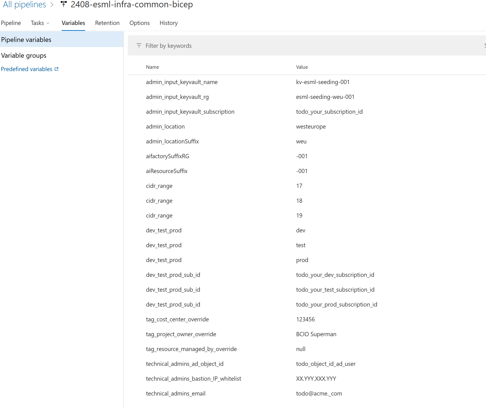

# Setup AIFactory - Infra Automation
To configura the infra automation the first time takes ~4h. 

After this is done, you can setup as many AIFactory's you want, with configuration time 2-15min per AIFactory.

## 1) Azure Devops (or Github): Create an empty repo, _aifactory-infra-001_
This _aifactory-infra-001_ will be your repo, where you have your configuration is overwriting the AIfactory config-template files.

## 2) Add the Enteprise Scale AIFactory repo as a GIT submodule, to your repo _aifactory-infra-001_
### FAQ: How-to clone repo with submodule to local computer? 

- Open GIT command prompt, go to your `local root folder for the code` (you should see the folder `azure-enterprise-scale-ml` and `notebook_demos` with a `dir` in the GIT CMD)run below: 

    > git config --system core.longpaths true

    > git submodule add https://github.com/jostrm/azure-enterprise-scale-ml

- Note: If the sumodule is already added by another team member in your project, the above command, git submodule add, will not work. Then you need to run the below instead: 

    > git submodule update --init --recursive

## 3) Copy template files (pipelines, workflows, parameter templates) locally
- Open the notebook [01_init_templates_ALL.ipynb](../../../copy_my_subfolders_to_my_grandparent/01_init_templates_ALL.ipynb) 
- Run all cells. 
    - Note: When you run the first cell, VS code will ask you to choose a _kernel_ - choose _Python environment. Recommended Python version is _3.12.5_ but any Python version above 3.7 should work.
- After you executed all cells in the notebook, you will have a new folder called _ai factory_ with sub-folders, that includes templates.
- Verify that it looks as the screenshot below, that you have an _aifactory_ folder at the top. 

## 4) Import pipelines/workflows to Azure Devops (or Github)
For Azure Devops classic pipelines: 
- Browse to the folder [aifactory/esml-infra/azure-devops/bicep/classic](../../../../aifactory/esml-infra/azure-devops/bicep/classic) where you should have 5 or more .json files, to import into Azure Devops. 

Import all, but start to imort two of them and execute them in the following order: 
1) esml-infra-common-bicep.json
2) esml-infra-project-bicep-adv.json

Thess two are the Azure Devops Release pipelines we need for an AIFactory, and its first project (and upcoming projects):

Start with the 1st file _esml-infra-common-bicep.json_
1) Open the Azure Devops portal, and browse to your org and project, to click the main menue to the left on Pipelines/Releases

2) Click the New button, to find the Import release pipeline button

After import, it should look like this: 

- Click on the red marking at _Tasks_ where there are three task stages: esml-common-dev,esml-common-test,esml-common-prod, you need to configure all of them. 

## 4) Configure the pipeline
- Click on the red marking at _Tasks_ where there are three tasks stages: esml-common-dev,esml-common-test,esml-common-prod, you need to configure all of them, start with the task stage _esml-common-dev_
- Click on Agent job, where it says _Some settings need attention_

- Select Agent pool
    - Option A) Choose Hosted/Azure Pipelines, with the Agent Specification _windows-2022 (windows-latest usually works also)
    - Option B) You may also use your own self-hosted Windows server (Windows 2019 or Windows 2022)

### Creating 3 ARM connections:
1) Click the Azure CLI task called _11-Common RG and RBAC_, and then cliick the _Manage link_ to get to the Azure Resource Manager connection page, where you can create connections. A new browers tab will open.
- Click the New service connection button, and select Azure Resource Manager radio button, click NEXT.

- Select _Service principal (manual) in the dialog, click NEXT

- Use the service principal information for _esml-common-bicep-sp_, you created in the seeding keuyvault in the [prerequisites-steup](../10-19/12-prerequisites-setup.md) to configure it. 
- That service principal should have the priviledged role ONWEr on the subscription, and be able to assigne other priviledged roles, such as CONTRIBUTOR and OWNER on Resource groups scope, as image: 

- Verify the ARM connection, and also checl the box _Grant access permission to all pipelines_

2) Create all 3: You need to create three Azure Resource Manager Connections (ARM connections). The ARM connections should be created with a service principle that has OWNER permissions to the subscription we want to work with in the AIFactory, as eithe DEV, TEST, or PROD environment. 

You may create all 3 ARM connections at once, either based on same service principle from the seeding keyvault called _esml-common-bicep-sp_ that in that case are owner on all three subscriptions, or you may have three service principals. 

- **ARM connection names**: _esml-aifactory-infra-dev_, _esml-aifactory-infra-test_, _esml-aifactory-infra-prod_
- **Service principal info**
    - **Role**: OWNER (able to assign other idnetities priviledged roles)
        - **Scope**: Subscription (DEV if Task is _esml-common-dev_, TEST subscription if _esml-common-test_)
    - **If external vNet (BYO vNet):** 
            - **CONTRIBUTOR** the Resourcegroup where the external vNet resides for Dev, Test, Prod subscriptions/spokes
                - Reason: To be able to create Network sercurity groups
            - **Network Contributor** to the vNet
                Reason: To be able to create subnets, and to be able to assigne network security groups to the subnets.
 [Read more about: Permissions for the service principle](./12-permissions-users-ad-sps.md)

TODO: Support federated ARM connections https://learn.microsoft.com/en-us/azure/devops/pipelines/release/configure-workload-identity?view=azure-devops

### Configure the tasks, with ARM connections: 
1) Go back to the other TAB, where you have the RELEASE pipeline open, at the TASK view with task _esml-common-dev_ 
2) Click the Azure CLI task called _11-Common RG and RBAC_ to configure it, and select the ARM connection you created earlier, called _esml-aifactory-infra-dev_
    - Note: You may need to click the refresh icon, for the combobox to re-load the newly created ARM connections to be selectable.
3) Repeat this process, 1 and 2, for all steps _12-Common Networking_, _13-Deploy resources_
4) Repeat 1-3 for all task stages - also for esml-common-test,esml-common-prod_ where you select the other respective ARM connections
    - **esml-common-test** stage using the ARM connection: _esml-aifactory-infra-test_
    - **esml-common-prod** stage using the ARM connection: _esml-aifactory-infra-prod_
5) SAVE the release pipeline.

## 5) Edit the Azure Devops Variables

[More information about variables can bee seen here](./13-parameters-ado.md)

## 6) Edit the Base parameters 

[More information about variables can bee seen here](./13-parameters-ado.md)

### NB! Azure Databricks Object ID (OID) may not exist, is global in your tenant
The AzureDatabricks application in your Microsoft EntraID is global, and does not exist if not anyone have created it before. 
It is a global application, same ObjectID (OID) for all Azure Databricks instances. 

This is about the parameter: _databricksOID_ in the file _10-esml-globals-5-13_23.json_
- **Problem:** If you have a new tenant, without any subscriptions yet to have created an Azure Databricks services, then you will not have any Object ID for the AzureDatabricks enterprise application
- **Solution:**  Create a dummy Azure databricks service. For example in the seeding keyvault. Then the ObjectID will be created. 

Before, if not AzureDatabricks application: 

After, when Azure Databricks dummy is created, and application exists: 

### BYOVnet - Brin your own vNet: Externally injected vNet to spoke
If you cannot allow the AIFactory orchestration to create it own vNets, you can configure your precreated vNet in the parameter file _10-esml-globals-override.json_

Example, of what you need to override: 

If you want to BYOVnets for Dev, Stage, Prod, you need to pre-created them, and match some parameters more such as
- Your vNet: _vnet-spoke-aifactory-sdc-dev-001_
    - Your addressspace: _10._11_.0.0/_18_
    - Parameter file that need to match the CIDR: _12-esml-cmn-parameters.json_ 
        - **Parameter** that needs to be matching:  _12-esml-cmn-parameters.json_ "10.XX.0.0/18"
        - **Variable (Azure Devops, Github)**  that needs to be matching: _cidr_range_ "11"

### Seeding keyvault = inputKeyvault parameter
NB! **seeding keyvault = inputKeyvault** when speaking of variables and parameters in the AIFActory. 
- This, due to legacy reason (ESML AIFactory was established 2019), but will be synced in the future as seeding keyvault

## 7) Check in your code, and add artifact to point at your sources code in Azure Devops Release pipeline

1) Check in your code
2) Click EDIT button 

3) Remove the artifact with source alias name: _esml-aifactory

- Click on the artifact box, a dialog opens
    - Copy the source alias name at the bottom. You will need to add a new artifact with same source alias name
- Click the DELETE button

4) Add artifact with name _esml-aifactory

Clich _Add artifact_

Configure as below, and keep everything else as default

- **Source Type** 
    - _Azure repository_ (If classic ADO)
    - _BUILD_ (if .yaml ADO)
- **Project**: Select your Azure Devops project (e.g. where you have the parameter files and azure-enterprise-scale-ml submodule)
- **Respository**: Select your repo (e.g. where you have the parameter files and azure-enterprise-scale-ml submodule)
- **Branch:** main (e.g. where you have the parameter files and azure-enterprise-scale-ml submodule)
- **Default version:** latest
- **Checkbox**: "Checkout submodules" needs to be checked.
- **Source alias name:** _esml-aifactory

Cick SAVE button.

## CHECKLIST

This is a checkpoint to see if all [prerequisites setup](./12-prerequisites-setup.md) have been done, before you run the pipeline.

#### 1a) PrivateDNS in HUB, and not locally Private DNS zones

**Q: Have you created all Private DNS zones in the hub, manually?**

E.g. if you want to have your Private DNS zones in your HUB, as recommended, e.g. that you have the flag _centralDnsZoneByPolicyInHub=true_ in the file _10-esml-globals-4-13_21_22.json_ and that you have specified parameters: privDnsSubscription_param, privDnsResourceGroup_param

TODO: 
- **Ensure you have all Private DNS zones**, pre-created in the HUB, manually (util-script are work in in TODO list)
- **Ensure you have created vNet Link to the Hub vNet, for all Private DNS Zones**
- **Ensure you have the Azure Policy and Azure Initiative assigned** [How-To: Networking: peering-of-spookes-to-hub](./14-networking-privateDNS.md#infraaifactory-networking-private-dns-zones-hubspoke-etc-coreteam)
- **Ensure you have peered the spoke vNets to the Hub** [How-To: Networking: peering-of-spookes-to-hub](./14-networking-privateDNS.md#peering-of-spookes-to-hub)
- **Ensure you have all settings set in the parameter file** _10-esml-globals-4-13_21_22.json_
    - The parameters: privDnsSubscription_param, privDnsResourceGroup_param, centralDnsZoneByPolicyInHub

Private DNS zones, when created: 

Azure Policy's, when created: 

#### 1b) PrivateDNS locally _centralDnsZoneByPolicyInHub=false_
E.g. if you want to have your Private DNS zones locally in each AIfactory spoke, in common resource group, only recommended if you do not want to peer th AIFactory to your hub, e.g DMEO mode - You have the flag _centralDnsZoneByPolicyInHub=false_ in the file _10-esml-globals-4-13_21_22.json_

TODO: You do not need to do anything. 
- Note: But you cannot peer it either in an efficient way. Usuallu this is only done when testing the AIFactory isolated, via Bastion-only access mode.

#### 2) Have you enabled all resource providers?

If you don't know. Please go back to this step [12-resourceproviders.md](./12-resourceproviders.md) where you have an automationscript to do this.

#### 3) Have checked in your code? 

The parameters you edited, do they look as you configured them locally in Azure Devops also?

#### 4) Is all permissions set for the Service Principle? 
- The BICEP will have to create artifact under 1 or many subscriptions.
- Note: If you have an external vNet (BYO vNet) in another subscription than its AIFactory environment subscription, it needs Contributor on ResourceGroup to create NSG's, and Network Contributor on the vNet to be able to assign the NSG's. [Read more about: Permissions for the service principle](./12-permissions-users-ad-sps.md)

#### DONE! Ready to Run the pipeline
Now you can go ahead and run the pipeline in Azure Devops. 

The process for this is described here in a [process flow diagram - Add AIFactory project](./13-flow-diagram-1.md)

### TROUBLE SHOOTING

For more trouble shooting, [Visit the FAQ](../40-49/41-FAQ-01.md)

