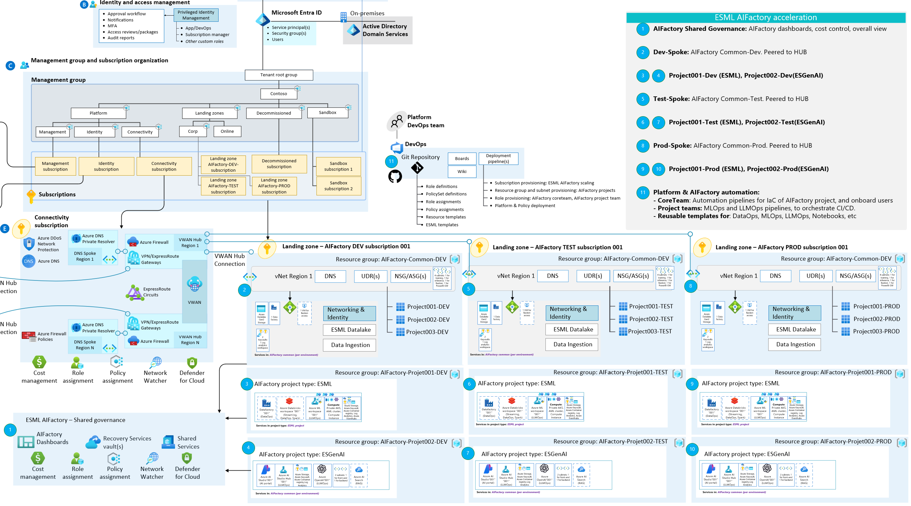
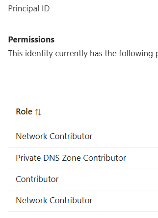

# `Infra:AIFactory`: Networking: Private DNS zones, Hub/Spoke etc (CoreTeam)

## Prerequisite

The ESML AIFactory will work both if you have [Hub-spoke with Azure Virtual WAN](https://learn.microsoft.com/en-us/azure/architecture/networking/architecture/hub-spoke-vwan-architecture) or [traditional Hub-Spoke](https://learn.microsoft.com/en-us/azure/architecture/networking/architecture/hub-spoke?tabs=cli)

The prerequisite knowledge to gain value of this readme page: foundational knowledge exist about: Hub-spoke, DNS zones, DNS forwarding, Private Link, Private endpoints, Virtual network peering.

## Network topology - Hub & Spoke & DNS Zones

You can choose to have Private DNS Zones Centrally in HUB (recommended) or in the AIFactory spoke, in its common resource group (default):
- Option A (Recommended to try out the AIFactory):  Run the AI Factory standalone with its own Private DNS Zone. Default behaviour, no change needed
- Option B (Recommended for productional use): Create a policy to create the private DNS zones in your HUB, and set the AIFactory config flag `centralDnsZoneByPolicyInHub` to `true`
    - The flag `centralDnsZoneByPolicyInHub` can be seen in [this AIFactory config file:e](../../../environment_setup/aifactory/parameters/10-esml-globals-4-13_21_22.json)

## AIFactory - 4 Access modes (Hub-connected VS Standalone)

The AI Factory has 4 access modes. Only 1-3 is enables when the AI Factory is setup in standalone mode.
Stanalone mode, meaning the AIFactory has its own "hub" with own private DNS zones, e.g. it is not peered to your central hub.

1. **Azure VPN** (either to a Windows 11 DevBox or from client computer)
2. **Bastion and private VM**with private IP-adress (client computer IP needs to be whitelisted for Bastion subnet)
3. **Service endpoints & IP-address whitelisting** whitelist client IP's (service endpoints) to access UI such as AI Foundry UI, Azure Machine Learning UI
4. **Peering** with central hub (client has direct line of sight if on corp network, and can use regular VPN from home)

> [!NOTE]
> **AI Factory Standalone mode** has been used, when an organization cannot use private endpoints, or cannot peer anything to the HUB that has Private DNS Zones.
> But, the recommendation is to peer it to the HUB, to have 4 access modes instead of 3, where the 4th is seamless and most cost effective.

- Simplified view
- Not all Private DNS zones are listed. [To see all - go here](./15-aifactory-overview.md)
- Not all networking components are shown. [To see more - go here (this doc)](#aifactorys-enterprise-scale-landing-zones-virtual-wan) and [go here (this doc)](#how-to-give-user-access-from-corp-on-premises-network---custom-dns-server-hosted-onpremises)

## AIFactory's Enterprise Scale Landing Zones: Virtual Wan

### Zoomed in:

1) AIFactory Shared Governance
2) AIFactory Common-Dev
3) AIFactory Project001-Dev (ESML)
4) AIFactory Project002-Dev (ESGenAI)
5) AIFactory Common-Test
6) AIFactory Project001-Test (ESML)
7) AIFactory Project002-Test (ESGenAI)
8) AIFactory Common-Prod
9) AIFactory Project001-Prod (ESML)
10) AIFactory Project002-Prod (ESGenAI)
11) Platform and Devops team
    - **Core team**: The code repository, where AIFactory (IaC) Automation and pipeline resides
    - **Project team**: The code repository, where AIFactory (MLops,LLMOps) Automation and pipeline resides

## Private DNS zones  in the AIFactory, to support AIFactory project types: ESML, ESGenAI
Private DNS zones - Compute, Storage, WebApp, CosmosDB: 
There is 25 mandatory, to support ESML and GENAI-1 project types in the AIFactory.

|Counter |Service | Project type |Private DNS Zone Name | Public DNS zone forwarders (to add in on-prem DNS) | Subresource | Description|
|---|---|---|---|---|---|---|
1|Azure Datafactory |ESML|privatelink.adf.azure.com |adf.azure.com | dataFactory |-|
2|Azure Datafactory |ESML|privatelink.datafactory.azure.net |datafactory.azure.net| portal |-|
3,4|Azure Machine Learning |ESML,ESGenAI|privatelink.api.azureml.ms   privatelink.notebooks.azure.net |api.azureml.ms notebooks.azure.net instances.azureml.ms aznbcontent.net inference.ml.azure.com | amlworkspace |-|
5|Azure Container registry|ESML, ESGenAI|privatelink.azurecr.io  `{regionName}.data.privatelink.azurecr.io` |azurecr.io  {regionName}.data.azurecr.io |registry| Dependency: Azure Machine Learning, AI studio|
6|`Azure Kubernetes Service` |ESML, ESGenAI| privatelink.{regionName}.azmk8s.io   `{subzone}.privatelink.{regionName}.azmk8s.io` |{regionName}.azmk8s.io |management|-|
7|Azure Databricks |ESML| privatelink.azuredatabricks.net |azuredatabricks.net|databricks_ui_api   browser_authentication|-|
8|Azure Databricks |ESML| `privatelink.databricks.azure.us` |databricks.azure.us|databricks_ui_api   browser_authentication|-|
9|Azure Keyvault |All|privatelink.vaultcore.azure.net |vault.azure.net  vaultcore.azure.net|vault| Dependency: Azure Machine Learning |
10|Azure Storage |All|privatelink.blob.core.windows.net |blob.core.windows.net |blob, blob_secondary|-|
11|Azure Storage |All|privatelink.table.core.windows.net |table.core.windows.net |table, table_secondary|-|
12|Azure Storage |All|privatelink.queue.core.windows.net |queue.core.windows.net |queue, queue_secondary|-|
13|Azure Storage |All|privatelink.file.core.windows.net |file.core.windows.net|file|-|
14|Azure Storage |All|privatelink.dfs.core.windows.net | dfs.core.windows.net |dfs, dfs_secondary|-|
15,16|Cognitive Services (Azure OpenAI, Speech, etc) |ESGenAI|privatelink.cognitiveservices.azure.com privatelink.openai.azure.com |cognitiveservices.azure.com openai.azure.com| account |-|
17,18|Azure Webapps |ESGenAI|privatelink.azurewebsites.net scm.privatelink.azurewebsites.net|azurewebsites.net scm.azurewebsites.net |sites |azureAppServicesPrivateDnsZoneId. Azure App Service hosts Azure Webapps, Azure Functions, Azure Logi Apps, Azure API mgmt. [More info](https://techcommunity.microsoft.com/t5/nonprofit-techies/understanding-azure-web-apps-and-azure-app-service/ba-p/3812572)|
19|Cosmos DB |ESGenAI| privatelink.documents.azure.com |documents.azure.com|Sql|-|
20|Cosmos DB |ESGenAI| privatelink.table.cosmos.azure.com |table.cosmos.azure.com|Table|-|
21|Azure AI Search |ESGenAI| privatelink.search.windows.net |search.windows.net|searchService|-|
22|Azure Eventhubs |ESML| privatelink.servicebus.windows.net |servicebus.windows.net |namespace|-|
23|Azure Eventgrid |ESML| privatelink.eventgrid.azure.net |eventgrid.azure.net|topic,domain,topicSpace,partnernamespace |Dependency: Azure Datafactory|
24,25,26,27|Azure Monitor |All| privatelink.monitor.azure.com privatelink.oms.opinsights.azure.com privatelink.ods.opinsights.azure.com privatelink.agentsvc.azure-automation.net|monitor.azure.com oms.opinsights.azure.com ods.opinsights.azure.com agentsvc.azure-automation.net blob.core.windows.net services.visualstudio.com applicationinsights.azure.com|azuremonitor|-|

Source: [Microsoft Docs - Azure Private Endpoint private DNS zone values](https://learn.microsoft.com/en-us/azure/private-link/private-endpoint-dns)

Note: Default behaviour of Microsoft Private DNS, they are registered in global. (you can change this, but need to register location for DNS in your subscription.

<!-- |Azure Batch | `{regionName}.privatelink.batch.azure.com` |{regionName}.batch.azure.com|batchAccount|Dependency: Azure Datafactory, Azure Machine Learning, Azure Media Service, Azure Synaps Analytics|
|Azure Batch | `{regionName}.service.privatelink.batch.azure.com` |{regionName}.service.batch.azure.com|nodeManagement|Dependency: Azure Datafactory, Azure Machine Learning, Azure Media Service, Azure 
--> 

A) If you run the AIFactory in isolated mode (for DEMO purposes) which is default, they are created automatically via BICEP.  
B) If you run the AIFactory in production mode, peered to your HUB, which is the recommended way, you need to ensure/create the Private DNS zones manually, e.g. no automation in ESML AIFactory yet).

## AIFactory vNets in its spokes: Dev, Test, Prod - address space

The AIFactory have 3 vNets in its 3 spokes: Dev, Test, Prod, with a an address space of at least /18, but reccomended is /16.
- /16 per vNet to support ~300 teams/use cases
- /18 to support 70 teams/use cases

### BackgroundWhy large vNets? 
The AIFactory is designed to support more than 1 team, it default to support 20-300 teams or use cases.
Working with AI and AI services, requires a lot of IP addresses, a traning cluster may concist of 4-16 nodes. The Azure Databricks services is recommended to have a minimum of 

The Enterprise scale AIFactory has chosen address spaces based on recommended best practices, per service, such as Azure Databricks subnets /23, and Azure machine learning training and inferencing subnets etc.

This adds up per AIFactory project (with a team of 3-10 people/use cases per team), to an address space for services needed to address to support DataOps, MLOps, LLMOps for 1 project teams's resources together.

The network space needed per vNet, is hence at least /18 to support 70 teams/use cases, but we recommend /16 per vNet to support ~300 teams/use cases.

#### Example workloads per team
If having 8 team member in an AIFActory project, where each have member or use case have computes as below, it may add sum up to to 200 IP addresses: 
- 5 AKS cluster 
- 5 CPU cluster 
- 5 GPU cluster
- 5 Databricks spark cluster
- + various private endpoints

Hence having a /16 vNet give support for ~300 teams. 
Hence having a /18 vNet give support for ~70 teams. 

### cidr_range variables
You only need to set the mid-part of the CIDR IP range definition to end up in address spaces.
This, since there is a template for this, in this file [12-esml-cmn-parameters.json](../../../environment_setup/aifactory/parameters/12-esml-cmn-parameters.json) with he parameter **common_vnet_cidr**

#### Example A) 
- cidr_range (scope:dev): 10
- cidr_range (scope:dev): 11
- cidr_range (scope:dev): 12

Will use the template, 10.XX.0.0/16, from the [baseline configurationfile](../../../environment_setup/aifactory/parameters/12-esml-cmn-parameters.json)
That will end up in the three vNets with address spaces as below:  
- adress space (scope:dev): 10.10.0.0/16
- adress space (scope:test): 10.11.0.0/16
- adress space (scope:prod): 10.12.0.0/16

#### Example B)
- cidr_range (scope:dev): 10
- cidr_range (scope:dev): 11
- cidr_range (scope:dev): 12

Will use the template, 10.XX.0.0/16, from the [baseline configurationfile](../../../environment_setup/aifactory/parameters/12-esml-cmn-parameters.json)
That will end up in the three vNets with address spaces as below:  
- adress space (scope:dev): 10.10.0.0/16
- adress space (scope:test): 10.11.0.0/16
- adress space (scope:prod): 10.12.0.0/16

## How-to: view how the secure Azure Machine Learning workspaces are setup in the AIFactory automation

In the ESML AIFactory the Azure Machine Learning workspaces are setup accoring to the SDK v1 specification. Since this is the security setup (no ARM used. No public IP)

[Read more here - how to secure Azure Machine Learning (SDK v1)](https://learn.microsoft.com/en-us/azure/machine-learning/tutorial-create-secure-workspace-vnet?view=azureml-api-1)

Note: It is also possible to use SDK v2 - with some modifications, since the SDK v2 networking is less strict, it uses ARM and needs public communication for this.

[Read more here - how to secure Azure Machine Learning (SDK v2)](https://learn.microsoft.com/en-us/azure/machine-learning/tutorial-create-secure-workspace-vnet?view=azureml-api-2)

## How-to: Configure Azure PaaS services to use private DNS zones (AIFactory config → centralDnsZoneByPolicyInHub:true)

[Since the ESML AIFactory are using secure Azure Machine Learning workspaces, with private link, and private DNS zones](#how-to-understand-how-the-secure-azure-machine-learning-workspaces-is-setup-in-the-aifactory-automation), we need to setup and configure private DNS.

Tip: After you have tested that it works to access and use everything via Bastion and the VM - jumping into the secure AIFactory, the next step would be to access the AIFactory and Azure machine learning workspaces and AI Studio, without having to login on a VM via Bastion. From an end user computer that resides on the corp network, or connected to the HUB in some way (VPN).

To do that, we need to peer the AIFactory spoke vNet to the HUB. 

WE also need to create the private DNS zones in the HUB, since private endpoints is used - a-records is needed in the HUB's private DNS zones, or conditional forwarding is needed - which may leads to manual work.
- E.g. we want to avoid having the private DNS zones locally, which will work, but is not optimal, since manual work is needed, whenever an AIFactory projecte is created. 
- E.g. It is not recommended for productional and scalability reasons to use local Private DNS zones.

### Solution
In ESML AIFactory, you need to [set the config `centralDnsZoneByPolicyInHub:true` in the parameter file here](../../../../aifactory/parameters/10-esml-globals-4-13_21_22.json) in the [SETUP of AIFactory](../20-29/24-end-2-end-setup.md) 

And, follow the [SOLUTION](#solution---private-dns-zones-custom-dns--azure-policy) below: 

### Challenge more info - Private DNS zones: Avoid manual work?
If you do not have central Privat DNS Zones, the DNS forwarding will not work until you also add conditional forwarding manually. 
- You willmay neeed have to create ~40 conditional forwarding, for all your onpremises DNS server, to have it working.
- The records needs to exists also in the HUB's private DNS zone and Custom DNS server - a manual task for each AIFactory project that is created.           
- If the storage account with private endpoint, and users are using both public or private access, it will not work, since users are not in DNS zone.

### SOLUTION - Private DNS zones: Custom DNS + Azure Policy + Private DNS resolver
If user are on-premises and tries to connect to a public Azure Machine Learning workspace or storage account, the on-premies DNS will ping the Custom DNS server that will call Azure to provide DNS via the private DNS zone, that in turn will know the public IP. This will work, if the below actions are taken. 

Read more: 
- [Private link and DNS integration at scale](https://learn.microsoft.com/en-us/azure/cloud-adoption-framework/ready/azure-best-practices/private-link-and-dns-integration-at-scale)
- [DNS-Integration-Scenarios](https://github.com/dmauser/PrivateLink/tree/master/DNS-Integration-Scenarios)
- [Private Endpoint DNS - private to public](https://learn.microsoft.com/en-us/azure/private-link/private-endpoint-dns)

- Action 1: The custom DNS Server, needs to be in the central HUB
- Action 2: 63 policys: Assign 4 _Azure policies_ separately and one _policy initiative_ (policy set) with 59 policys. These can be assigned on MGMT group (or subscription).
    - Benefits: 
        - Ensures private endpoints to Azure PaaS services are integrated with Azure Private DNS zones. 
            - e.g. enables every type or private DNS zones (for PaaS) to automatically add A-records in the DNS Zone, whenever a private endpoint is created
        - Denies the creation of a private DNS in the current scope (the application landingzones), to ensure only having zones in the Hub
        - Cnfigures private DNS zone group to override the DNS resolution for PaaS services private endpoint. See https://aka.ms/pepdnszones for more.
        - Audit private endpoints that are created in other subscriptions and/or tenants for Azure Machine Learning.
    - 2a) Define the Azure policy's and assigne the Azure Policy Initiative on the Sopkes subscriptions, e.g. AIFactory DEV, TEST, PROD. 
        - Not to be assined on the Hub. But the Initative have a Managed Identity (see portal UI) that needs to have the RBAC roles on the HUB's private DNS Zones in the HUB.
        - You can create them by runnig the below two BICEP files under the _esml-util folder, and assign them via the portal "Policy" UI
            - Mandatory:
                - Online link [esml-util/28-Initiatives.bicep](../../../environment_setup/aifactory/bicep/esml-util/28-Initiatives.bicep)
                - Local link (when you have added ESML as submodule, and copied the aifactory/esml-util folder locally): [28-Initiatives.bicep](../../../../aifactory/esml-util/28-Initiatives.bicep)
            - Optional: *Deny the creation of private DNS*, etc
                - Online link: [esml-util/28-policy.bicep](../../../environment_setup/aifactory/bicep/esml-util/28-policy.bicep)
                - Local Link:  [28-policy.bicep](../../../../aifactory/esml-util/28-policy.bicep) 
                - **Important! - Exemption is needed** As of now the AKS cluster creation uses SYSTEM Private DNS Zone, not CUSTOM, hence you cannot assign the policy without an exemption of policy "Deny the creation of private DNS". Since the system will try to create such PRivate DNS Zones. In the format of *<subzone>.privatelink.<region>.azmk8s.io* e.g a random GUID for <subzone>, for each cluster. [Read more - AKS private DNS zones](https://learn.microsoft.com/en-us/azure/aks/private-clusters?tabs=azure-portal)
                    - Roadmap in ESML AIFactory, is to provision the AKS cluuster with CUSTOM_PRIVATE_DNS_ZONE_RESOURCE_ID. But Azure Machine Learning does not handle that well right now.programmatically-create#create-and-assign-a-policy-definition).
        - Policy Initiative _Configure Azure PaaS services to use private DNS zones_
            - Also set all parameters on the initative assignment, Private DNS Id's.
            - Also set roles: _Network Contributor,Private DNS Zone Contributor,Contributor_ for the initiative MI, to have access to the HUB's Private DNS Zones
        - 

    - The below is the 4 separate policys, and the initiative_ with 58 policy's in its policy set that we need to defined and assing to the subscriptions: Dev, Test, Prod application landingzones of the AIFactory:

        - 

For more information about the policy's see [https://github.com/Azure/Enterprise-Scale](https://github.com/Azure/Enterprise-Scale/blob/main/docs/wiki/ALZ-Policies.md) where the (initiative_ exists in a larger file)[https://github.com/Azure/Enterprise-Scale/blob/main/eslzArm/managementGroupTemplates/policyDefinitions/initiatives.json]

- Action 3: Create a central private endpoint for all, somewhere.This, since our Azure portals (such as Azure ML portal) are global, we need a private endpoint to that portal. 
    - If you have traditional Hub/Spoke topology, create it in the Hub. 				
    - If you have WWAN - you have a central vNet to the WWAN-hub, where Private DNS resolvers and DNS forward can live (for 1 or many if multi region) in WWAN hub.
    - [How-to: Private DNZ zones to forward - for Azure Machine Learning portal to work](https://learn.microsoft.com/en-us/azure/machine-learning/how-to-custom-dns?tabs=azure-cli&view=azureml-api-2#example-custom-dns-server-hosted-on-premises)
- Action 4: Private DNS Resolver
    - Deploy a DNS Private Resolver in your Hub Virtual Network alongside your ExpressRoute Gateway. However, you **must also ensure that resolution of public FQDNs is permitted** and replies with a valid response via a DNS Forwarding Ruleset Rule to the targeted DNS server. As some Azure services rely upon rely upon the ability to resolve public DNS names to function. [Read more - Private resolver ruleset](https://learn.microsoft.com/en-us/azure/dns/private-resolver-endpoints-rulesets#rules)
    - IMPORTANT: [Read about private link and public DNS forwarding](https://learn.microsoft.com/en-us/azure/private-link/private-endpoint-dns)
        - Read the `red boxes`. And tables for servies, such as Azure Machine Learning: 
            - **Private DNS zone name:** privatelink.api.azureml.ms, privatelink.notebooks.azure.net
            - **Public DNS zone forwarder:** api.azureml.ms, notebooks.azure.net, instances.azureml.ms, aznbcontent.net, inference.ml.azure.com

### Peering of Spookes to Hub
When setting up a peering from a spoke to a hub in an Azure Enterprise Scale environment, you should configure the following settings:

1. **Allow Gateway Transit**: Enable this option in the hub's peering configuration to allow the spoke to use the hub's gateway for connectivity to other networks.
2. **Use Remote Gateways**: Enable this option in the spoke's peering configuration to use the hub's gateway.
3. **Allow Forwarded Traffic**: Enable this option in both the hub and spoke peering configurations to allow traffic to be forwarded between the networks³⁴.

These settings ensure that traffic can flow smoothly between the spoke and hub, and through the hub to other networks if needed.

More info:

- (1) Create a transit VNet using VNet peering | Microsoft Azure Blog. https://azure.microsoft.com/en-us/blog/create-a-transit-vnet-using-vnet-peering/.
- (2) Hub-spoke network topology with Azure Virtual WAN. https://learn.microsoft.com/en-us/azure/architecture/networking/architecture/hub-spoke-vwan-architecture.
- (3) Patterns for inter-spoke networking - Azure Architecture Center. https://learn.microsoft.com/en-us/azure/architecture/networking/guide/spoke-to-spoke-networking.
- (4) Hub-spoke network topology in Azure - Azure Architecture Center. https://learn.microsoft.com/en-us/azure/architecture/networking/architecture/hub-spoke.
- (5) Create a hub and spoke topology in Azure - Portal. https://learn.microsoft.com/en-us/azure/virtual-network-manager/how-to-create-hub-and-spoke.

### How-to: Give user access from corp on-premises network - Custom DNS Server hosted onpremises
This is needed to avoid Bastion and VM being the only way to access the secure AIFactory

[How-to: Private DNZ zones to forward - for Azure Machine Learning portal & services to work](https://learn.microsoft.com/en-us/azure/machine-learning/how-to-custom-dns?tabs=azure-cli&view=azureml-api-2#example-custom-dns-server-hosted-on-premises)

E.g. the below scenario is what we want to achieve: 

## FIREWALL & Ports: Needed for Azure Machine Learning (Updated: 2024-07)

 For updated informatiom - go here:
 - [How to secure Azure Machine Learning (SDK v1)](https://learn.microsoft.com/en-us/azure/machine-learning/tutorial-create-secure-workspace-vnet?view=azureml-api-1)
 - [How to secure Azure Machine Learning (SDK v2)](https://learn.microsoft.com/en-us/azure/machine-learning/tutorial-create-secure-workspace-vnet?view=azureml-api-2)

For ease, below you can see an ESML AIFActory Excel sheet with ports in the NSG's for the ESML AIFactory vNets subnet for training. 
- Note: This setting supports both (SDK v1) and (SDK v2) currently (2024-07-05): 

# FAQ - Networking

## Q: How to I trouble shoot Azure Machine Learning networking? Diagnostics? Troubleshoot private endpoint connection problems? 

- A: If you have problems connecting to the workspace, see Troubleshoot secure workspace connectivity.[Workspace diagnostics & Troubleshoot private endpoint connection problems](https://learn.microsoft.com/en-us/azure/machine-learning/how-to-troubleshoot-secure-connection-workspace?view=azureml-api-2)

- A: You can also run diagnostics on your workspace from Azure Machine Learning studio or the Python SDK. After diagnostics run, a list of any detected problems is returned. This list includes links to possible solutions. For more information, see [How to use workspace diagnostics](https://learn.microsoft.com/en-us/azure/machine-learning/how-to-workspace-diagnostic-api?view=azureml-api-2)

[Go here for more related FAQ](../40-49/41-FAQ-01.md)

