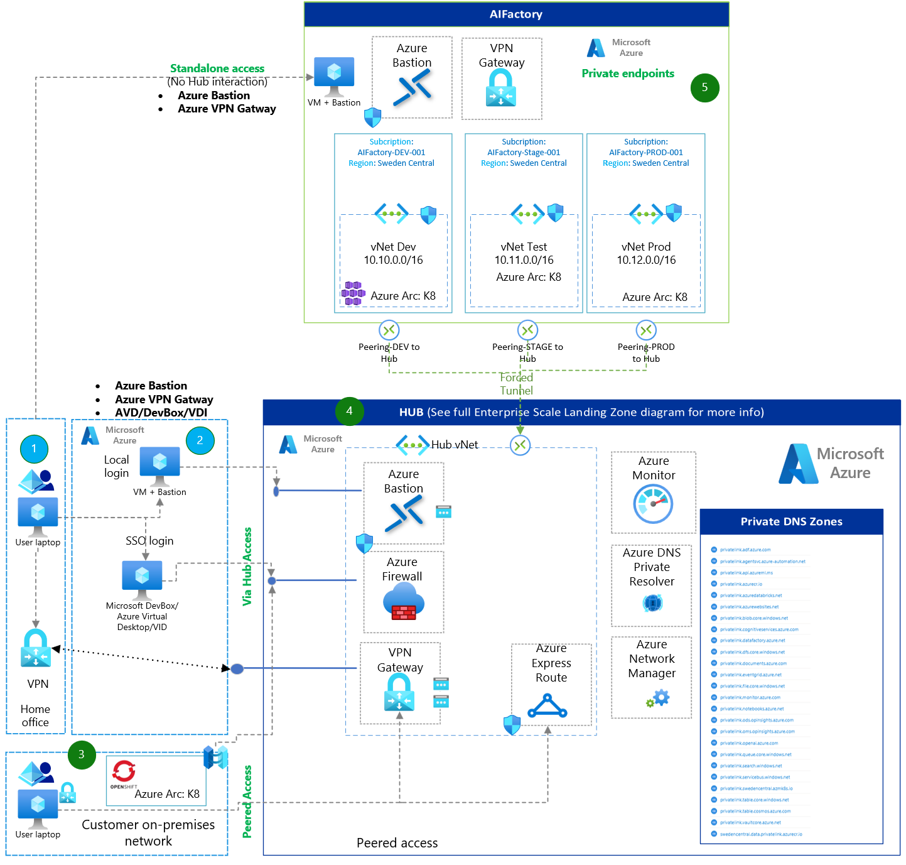

# `Infra:AIFactory`: Networking: Private DNS zones, Hub/Spoke etc (CoreTeam)

## Prerequisite

The ESML AIFactory will work both if you have [Hub-spoke with Azure Virtual WAN](https://learn.microsoft.com/en-us/azure/architecture/networking/architecture/hub-spoke-vwan-architecture) or [traditional Hub-Spoke](https://learn.microsoft.com/en-us/azure/architecture/networking/architecture/hub-spoke?tabs=cli)

The prerequisite knowledge to gain value of this readme page: foundational knowledge exist about: Hub-spoke, DNS zones, DNS forwarding, Private Link, Private endpoints, Virtual network peering.

## Network topology - Hub & Spoke & DNS Zones

You can choose to have Private DNS Zones Centrally in HUB (recommended) or in the AIFactory spoke, in its common resource group (default):
- Option A (Recommended to try out the AIFactory):  Run the AI Factory standalone with its own Private DNS Zone. Default behaviour, no change needed
- Option B (Recommended for productional use): Create a policy to create the private DNS zones in your HUB, and set the AIFactory config flag `centralDnsZoneByPolicyInHub` to `true`
    - The flag `centralDnsZoneByPolicyInHub` can be seen in [this AIFactory config file:e](../../../environment_setup/aifactory/parameters/10-esml-globals-4-13_21_22.json)

## AIFactory Hub-Spoke - Light & Simplified view

- Simplified view
- Not all Private DNS zones are listed. [To see all - go here](./15-aifactory-overview.md)
- Not all networking components are shown. [To see more - go here (this doc)](#aifactorys-enterprise-scale-landing-zones-virtual-wan) and [go here (this doc)](#how-to-give-user-access-from-corp-on-premises-network---custom-dns-server-hosted-onpremises)

## AIFactory's Enterprise Scale Landing Zones: Virtual Wan

### Zoomed in:

1) AIFactory Shared Governance
2) AIFactory Common-Dev
3) AIFactory Project001-Dev (ESML)
4) AIFactory Project002-Dev (ESGenAI)
5) AIFactory Common-Test
6) AIFactory Project001-Test (ESML)
7) AIFactory Project002-Test (ESGenAI)
8) AIFactory Common-Prod
9) AIFactory Project001-Prod (ESML)
10) AIFactory Project002-Prod (ESGenAI)
11) Platform and Devops team
    - **Core team**: The code repository, where AIFactory (IaC) Automation and pipeline resides
    - **Project team**: The code repository, where AIFactory (MLops,LLMOps) Automation and pipeline resides

## How-to: view how the secure Azure Machine Learning workspaces are setup in the AIFactory automation

In the ESML AIFactory the Azure Machine Learning workspaces are setup accoring to the SDK v1 specification. Since this is the security setup (no ARM used. No public IP)

[Read more here - how to secure Azure Machine Learning (SDK v1)](https://learn.microsoft.com/en-us/azure/machine-learning/tutorial-create-secure-workspace-vnet?view=azureml-api-1)

Note: It is also possible to use SDK v2 - with some modifications, since the SDK v2 networking is less strict, it uses ARM and needs public communication for this.

[Read more here - how to secure Azure Machine Learning (SDK v2)](https://learn.microsoft.com/en-us/azure/machine-learning/tutorial-create-secure-workspace-vnet?view=azureml-api-2)

## How-to: Configure Azure PaaS services to use private DNS zones (centralDnsZoneByPolicyInHub:true)

[Since the ESML AIFactory are using secure Azure Machine Learning workspaces, with private link, and private DNS zones](#how-to-understand-how-the-secure-azure-machine-learning-workspaces-is-setup-in-the-aifactory-automation), we need to setup and configure private DNS.

Tip: After you have tested that it works to access and use everything via Bastion and the VM - jumping into the secure AIFactory, the next step would be to access the AIFactory and Azure machine learning workspaces and AI Studio, without having to login on a VM via Bastion. From an end user computer that resides on the corp network, or connected to the HUB in some way (VPN).

To do that, we need to peer the AIFactory spoke vNet to the HUB. 

WE also need to create the private DNS zones in the HUB, since private endpoints is used - a-records is needed in the HUB's private DNS zones, or conditional forwarding is needed - which may leads to manual work.
- E.g. we want to avoid having the private DNS zones locally, which will work, but is not optimal, since manual work is needed, whenever an AIFactory projecte is created. 
- E.g. It is not recommended for productional and scalability reasons to use local Private DNS zones.

Hece, the [SOLUTION](#solution---private-dns-zones-custom-dns--azure-policy) below: 

### Challenge more info - Private DNS zones: Avoid manual work?
If you do not have central Privat DNS Zones, the DNS forwarding will not work until you also add conditional forwarding manually. 
- You willmay neeed have to create ~40 conditional forwarding, for all your onpremises DNS server, to have it working.
- The records needs to exists also in the HUB's private DNS zone and Custom DNS server - a manual task for each AIFactory project that is created.           
- If the storage account with private endpoint, and users are using both public or private access, it will not work, since users are not in DNS zone.

### SOLUTION - Private DNS zones: Custom DNS + Azure Policy
If user are on-premises and tries to connect to a public Azure Machine Learning workspace or storage account, the on-premies DNS will ping the Custom DNS server that will call Azure to provide DNS, that in turn will know the public IP. This will work, if the below actions are taken. 

- Action 1: The custom DNS Server, needs to be in the central HUB
- Action 2: A Policy can be assigned on MGMT group (or subscription) that for every type or private DNS zones (for PaaS) will create records, in the DNS Zone.				
    - [How-to: Create Azure Policy that adds private link records to centralized private DNZ zones automatically](https://www.azadvertizer.net/azpolicyinitiativesadvertizer/Deploy-Private-DNS-Zones.html)
- Action 3: Create a central private endpoint for all, somewhere.This, since our Azure portals (such as Azure ML portal) are global, we need a private endpoint to that portal. 
    - If you have traditional Hub/Spoke topology, create it in the Hub. 				
    - If you have WWAN - you have a central vNet to the WWAN-hub, where Private DNS resolvers and DNS forward can live (for 1 or many if multi region) in WWAN hub.
    - [How-to: Private DNZ zones to forward - for Azure Machine Learning portal to work](https://learn.microsoft.com/en-us/azure/machine-learning/how-to-custom-dns?tabs=azure-cli&view=azureml-api-2#example-custom-dns-server-hosted-on-premises)

### How-to: Give user access from corp on-premises network - Custom DNS Server hosted onpremises
This is needed to avoid Bastion and VM being the only way to access the secure AIFactory

[How-to: Private DNZ zones to forward - for Azure Machine Learning portal & services to work](https://learn.microsoft.com/en-us/azure/machine-learning/how-to-custom-dns?tabs=azure-cli&view=azureml-api-2#example-custom-dns-server-hosted-on-premises)

E.g. the below scenario is what we want to achieve: 

## FIREWALL & Ports: Needed for Azure Machine Learning (Updated: 2024-07)

 For updated informatiom - go here:
 - [How to secure Azure Machine Learning (SDK v1)](https://learn.microsoft.com/en-us/azure/machine-learning/tutorial-create-secure-workspace-vnet?view=azureml-api-1)
 - [How to secure Azure Machine Learning (SDK v2)](https://learn.microsoft.com/en-us/azure/machine-learning/tutorial-create-secure-workspace-vnet?view=azureml-api-2)

For ease, below you can see an ESML AIFActory Excel sheet with ports in the NSG's for the ESML AIFactory vNets subnet for training. 
- Note: This setting supports both (SDK v1) and (SDK v2) currently (2024-07-05): 

# FAQ - Networking

## Q: How to I trouble shoot Azure Machine Learning networking? Diagnostics? Troubleshoot private endpoint connection problems? 

- A: If you have problems connecting to the workspace, see Troubleshoot secure workspace connectivity.[Workspace diagnostics & Troubleshoot private endpoint connection problems](https://learn.microsoft.com/en-us/azure/machine-learning/how-to-troubleshoot-secure-connection-workspace?view=azureml-api-2)

- A: You can also run diagnostics on your workspace from Azure Machine Learning studio or the Python SDK. After diagnostics run, a list of any detected problems is returned. This list includes links to possible solutions. For more information, see [How to use workspace diagnostics](https://learn.microsoft.com/en-us/azure/machine-learning/how-to-workspace-diagnostic-api?view=azureml-api-2)

[Go here for more related FAQ](../40-49/41-FAQ-01.md)

