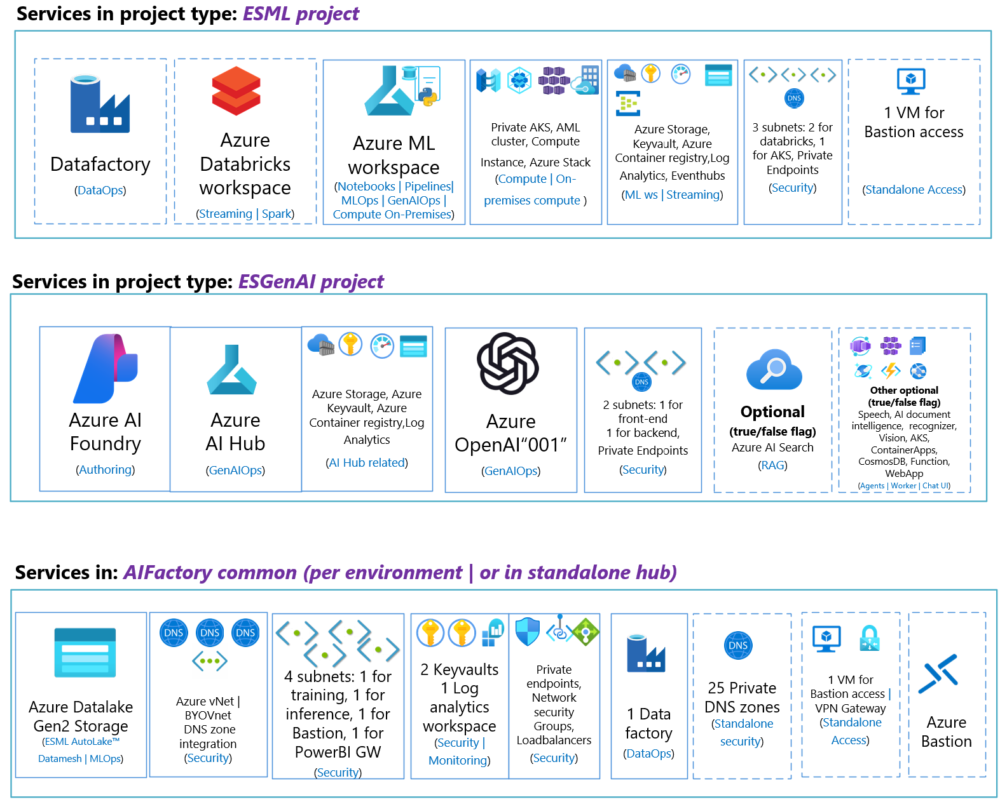

# AIFactory overview

# List of Azure Services
List of services provisioned using AIFactory to add AIFactory projects:

- **ESML project (DataOps, MLOps E2E):** 
    - **Main services:**:  Azure Datafactory, Azure Eventhubs, Azure Machine Learning, Azure Databricks, Azure Kubernetes Service (AKS)
    - **Supporting services:**: Azure Keyvault, Azure container registry, Azure Application Insight
    - **Optional services:**: Azure VM (for networking access via Bastion)
- **ESGenAI project (GenAI Chatbot):** 
    - **Main services:**: Azure OpenAI,Azure AI Search,Azure AI Studio (*WIP)
    - **Supporting services:**: Azure Keyvault, Azure container registry, Azure Application Insight
    - **Optional services:**: Azure VM (for networking access via Bastion)

## Naming convention explained

- `<region>`: Short 3 letter region, such as: *weu, uks, swe*
- `<env>`:  [dev,test,prod]
- `<instance-3>`: A number with 3 figures as string
    - convention: `<instance-3>`
    - example: `001`

- `<random-5>`: A random salt of lenght 5
    - convention: `<random-5>`
    - example: `ert4y`

# Visual diagram view of services - ProjectTypes: ESML, ESGenAI and ESML Common

## AIFactory Common - Naming convention & services details

**Note: Customizable:**
- You can also "Bring Your Own Vnet"  [How-to - Prerequisites setup](./12-prerequisites-setup.md)
- You can centralize your private DNS zones (recommended) in your HUB, insted of having them locally in the AIFactory spoke, and common resource group. [How-to - Prerequisites setup](./12-prerequisites-setup.md)
- You can remove Bastion after peering the AIFactory, and configured networking (DNS forwarding)  [How-to - Prerequisites setup](./12-prerequisites-setup.md)

**AIFactory Common:** 
- **Main services:**: 
    - **Azure Datalake Gen2 Storage(1)**: To act as the ESML AIFactory datalake
        - Naming convention (defualt): `<8><random-5><instance-3><env>`
        - Name example: `dcbatmangdxriesml001dev`
    - **Virtual Network (1)**: For the 4 main subnets, and all subnets created automatically by the AIFactory IaC automation, for each AIFactory project
        - Name convention(defualt): `vnt-esmlcmn-weu-dev-001`
        - Name example: `vnt-esmlcmn-weu-dev-001`
    - **Subnets (x4)**: 1 for training, 1 for inference, 1 for PowerBI Gateway link, 1 for Bastion
        - 1) training
            - Name convention(defualt): `snet-esml-cmn-<instance-3>`
            - Name example: `snet-esml-cmn-001`
        - 2) inference
            - Name convention(defualt): `snet-esml-cmn-<instance-3>-scoring`
            - Name example: `snet-esml-cmn-001-scoring`
        - 4) PowerBI Gateway
            - Name convention(defualt): `snet-esml-cmn-pbi-<instance-3>`
            - Name example: `snet-esml-cmn-pbi-001`
    - **Azure Datafactory(1)**: To be used by the ESML Core teams's data ingetion team.
    - **Log Analytics workspace(1)**: To be to centralize the monitoring to one workspace from all projects, per environment.
    - **Private endpoints (7)**: [See BICEP for definition](../../../environment_setup/aifactory/bicep/esml-common/modules-common/nsgCommon.bicep)
    - **Private DNS Zones (7)**: [See BICEP for definition](../../../environment_setup/aifactory/bicep/esml-project/22-main.bicep)
        - Storage account
            - privatelink.blob.${environment().suffixes.storage
            - privatelink.file.${environment().suffixes.storage
            - privatelink.dfs.${environment().suffixes.storage
            - privatelink.queue.${environment().suffixes.storage
            - privatelink.table.${environment().suffixes.storage
        - Keyvault
            - privatelink.vaultcore.azure.net
        - Azure machine learning:
            - privatelink.azurecr.io
            - privatelink.api.azureml.ms
            - privatelink.notebooks.azure.net
        - Datafactory: 
            - privatelink.datafactory.azure.net
            - privatelink.adf.azure.com
    - **Network Security Groups (+4)**: [See BICEP for definition](../../../environment_setup/aifactory/bicep/esml-common/modules-common/nsgCommon.bicep)
- **Supporting services:**: 
    - **Azure Keyvault(x2)**: 1 to be used by ESML Core team. 1 for DataOps team, to store external credentials (Database logins etc) and their Azure Datafactory
       -  1) To be used by ESML Core team 
            - Naming convention (defualt): `kv-cmn<env>-<random-5><instance-3>`
            - Name example: `kv-cmndev-gderq-001`
        - 2) To be used by the Data ingestion team, that may reside in the ESML Core team, or not. Here various passwords are stored. Also the DVSM credentials.
            - Naming convention (defualt): `kv-cmnadm<env>-<random-5><instance-3>`
            - Name example: `kv-cmnadmdev-gderq-001`
    
- **Optional services:**: 
    - Azure VM (for networking access via Bastion), Azure Bastion
        - Naming convention (defualt): `dsvm-cmn-<region>-<env>-<instance-3>`
        - Name example: `dsvm-cmn-weu-dev-001`

## Networking - More information: Private DNS Zones, Private endpoints, Hub/Spoke

[HOWTO - Netoworking options: Hybrid access etc](./14-networking-privateDNS.md)

        
