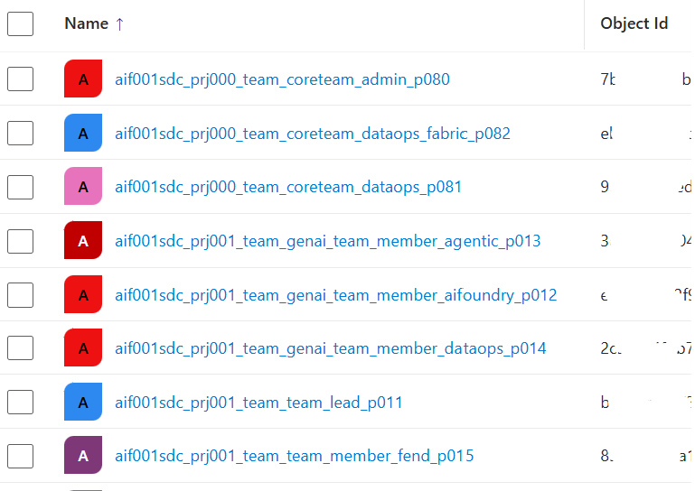
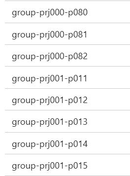
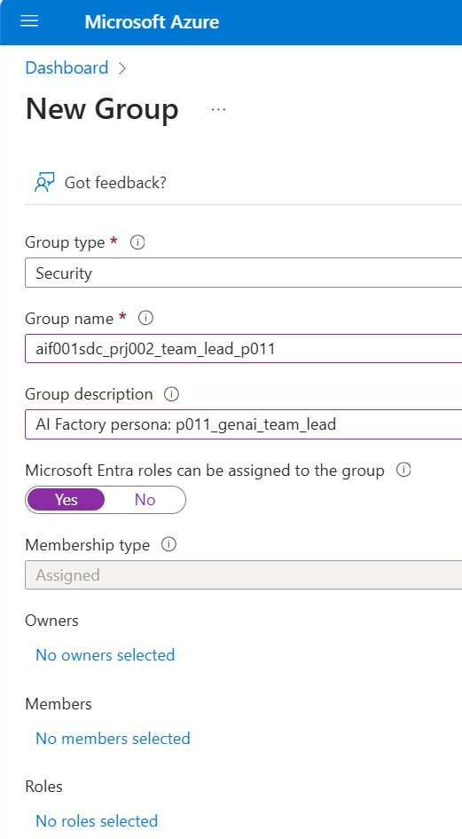

# Microsoft EntraID Security Groups & Personas
Microsoft EntraID Security groups are mapped to Personas. 

# Rules & AI Factory configuration file (.yaml or .env)
- The 3 arrays below contains "Group ObjectID" for Entra ID security groups in a commas separated list, without space. It should not contain the Group name. 
- All groups needs to be created. Some can be empty of members.
- Only the first group in each array is mandatory to add members to (`team_lead`, `core_team_admin`)
- A member can belong to 1 core team group, and at the same time one project team.
- A member cannot belong to multiple project team groups, instead move the member upwards in the elevation chaing, "team lead" being the one with highest permissions.

## Microft EntraID group names

```python
groups_project_members_esml: "<aif001sdc_prj001_team_lead_p001>,<aif001sdc_prj001_team_member_ds_p002>,<aif001sdc_prj001_team_member_fend_p003>" #3 groups of users. All except p001 group can be empty groups.
  groups_project_members_genai_1: "<aif001sdc_prj002_team_lead_p011>,<aif001sdc_prj002_genai_team_member_aifoundry_p012>,<aif002sdc_prj001_genai_team_member_agentic_p013>,<aif001sdc_prj001_genai_team_member_dataops_p014>,<aif001sdc_prj001_team_member_fend_p015>" #[GH-Secret] 5 groups. All except p011 can be empty groups.
  groups_coreteam_members: "<aif001sdc_coreteam_admin_p080>,<aif001sdc_coreteam_dataops_p081>,<aif001sdc_coreteam_dataops_fabric_p082>" #[GH-Secret] 3 groups. All except p080 group can be empty groups. 

```

## AI Factory persona names: 

```python
 # PERSONAS (001-010 are reserved for ESML, 011-020 for GenAI-1, 021-030 for GenAI-2, 080-090 for CoreTeam. 100-110 for Service Principals)
  personas_project_esml: "p001_esml_team_lead,p002_esml_team_member_datascientist,p003_esml_team_member_front_end,p101_esml_team_process_ops" # 4 Personas where first 3 contains users. The 4th is of type Service Principal. 3 are mapped to groups_project_members_esml & PROJECT_TYPE=esml
  personas_project_genai_1: "p011_genai_team_lead,p012_genai_team_member_aifoundry,p013_genai_team_member_agentic,p014_genai_team_member_dataops,p015_genai_team_member_frontend,p102_esml_team_process_ops" # 6 Personas where 5 contain users. The 6th is an SP. mapped to groups_project_members_genai_1 & PROJECT_TYPE=genai-1
  personas_core_team: "p080_coreteam_it_admin,coreteam_dataops,p081_coreteam_dataops_fabric, p103_coreteam_team_process_ops" # 4 Personas, whereof first 3 contains useres. The 4th is a service principal. These personas are mapped to group_coreteam_members
```

# Option A) How to: Automatically create groups, which auto-adds info to seeding keyvault 

We do not want to distrurb the Entra ID administrator for every project we want to automatically provision. 
Hence the Entra ID administrator needs to create the groups beforehand, example 5-10 groups, and add the information in the Seeding keyvault, reachable for the AI Factory core team administrator. 

This can of course be done manually by the administrator, to create the Microsoft EntraID groups, per project, per coreteam-. But it will be alot of groups (if 30 groups for 10 project teams, plus 3 core team groups) - **hence we created a bash script that automates, creation of groups, and add info to seeding keyvault automatically**

[Automation Script](../../../environment_setup/aifactory/bicep/esml-util/32-create-azure-groups.sh)

## After the script finished: How it will look as below in Microsoft EntraID
You may choose your own group names, but you need to have the two strings
 - prjXXX (`prj001` or `prj000` for core team)
 - p001 as suffix (for persona001)

 This since the names in seeding keyvault will be generated based on that.



## After the script finished: Seeding keyvault information - automatically added
- Names will be extracted from full group-name to shorter generic names, in the format of `group-prjXXX-pXXX`, where core-team has `prj000` in its name. 




# Option B) Howto - Manually create groups & persona connection: 

An Entra ID administrator can manually create the Microsoft EntraID groups, per project, per coreteam as below. But it will be alot of groups (if 30 groups for 10 project teams). 

- The Microsoft EntraID group should be of
    - **Group type**: Security
    - **Group name**: Prefferebly the as suggested naming convention containing at least project number(prj001) and persiona number (p001)
    - **Group description**: Prefferebly persona name
    - **Microsoft Entra roles can be assigned to the group**: Yes
    - **Membership type**: Assigned
    - **Owners, Members, Roles**: - (will be set by AI Factory)



Then the administrator needs to add the ObjectID per EntraID group, to the seeding keyvault, with the naming convention accordingly, `group-prjXXX-pXXX`, such as below: 


