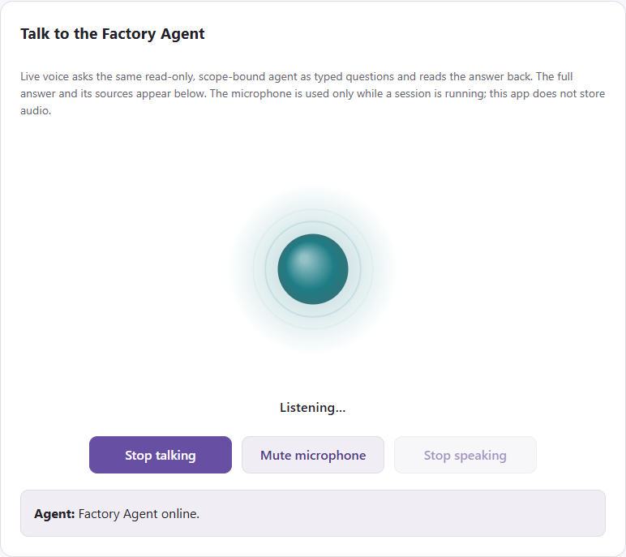
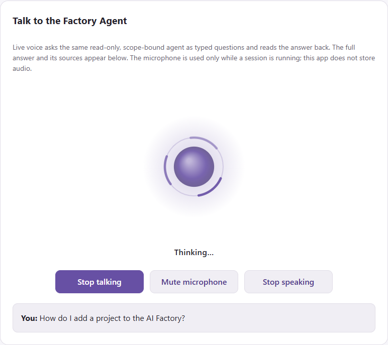
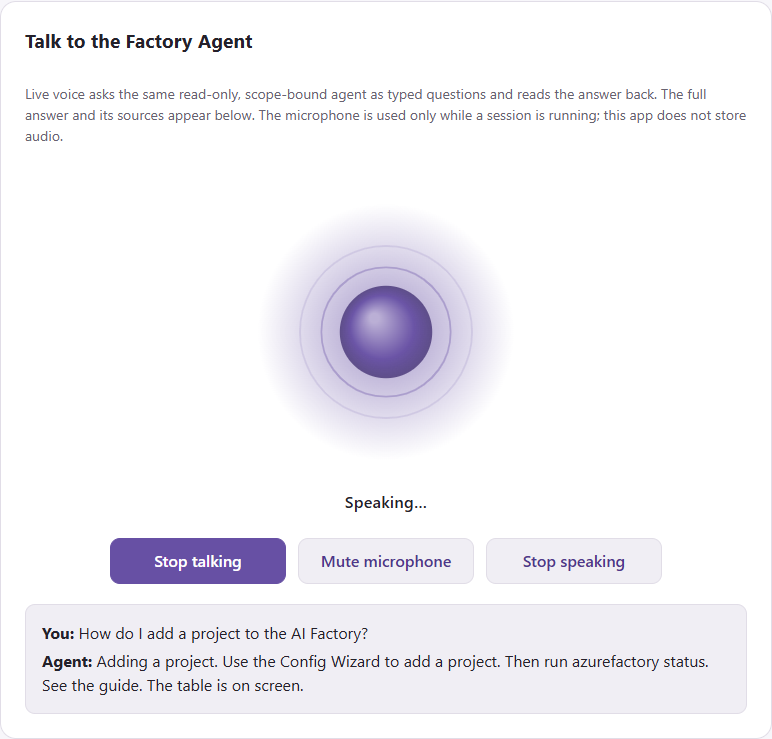
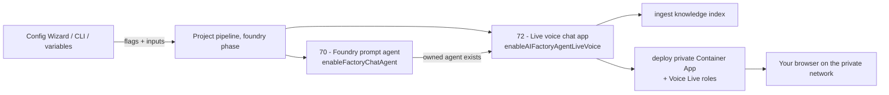

# 21. Agent Factory chat and live voice

The **Factory Agent chat** is a private web application where authorized people ask the AI Factory
questions and get **evidence-backed answers with citations**, scoped to one factory, project and
environment. With **live voice** you can also *talk* to it: the page shows a pulsing orb that
listens, thinks and speaks, the way a voice assistant would.





Voice is **optional and off by default**. It never gives the agent more power: a spoken question
goes through exactly the same sign-in, scope, permissions, retrieval, tools and citations as a typed
one. Typing keeps working when voice is off, unavailable or blocked.

!!! note "What this chapter covers"

    How the pieces fit, the switches that turn them on, the two ways to deploy (pipeline or operator),
    how to use it, the security model, operating limits, and troubleshooting. Details for developers live
    in the [application guide](https://github.com/jostrm/azure-enterprise-scale-ml/blob/main/usecase_code/40-agent-factory/40-aifactory-agent/readme.md)
    and the [live voice step](https://github.com/jostrm/azure-enterprise-scale-ml/blob/main/usecase_code/40-agent-factory/47-aifactory-agent-live-voice/readme.md).

## At a glance

| You want | Turn on | What happens |
|---|---|---|
| The agent to exist in your project Foundry | `enableFactoryChatAgent` | The late project-pipeline step `70-factory-chat-agent` creates or updates the owned prompt agent `enterprise-scale-ai-factory`. It never deletes an agent and refuses one it does not own. |
| A web chat with **live voice** (project001 Dev) | `enableFactoryChatAgent` **and** `enableAIFactoryAgentLiveVoice` | Step `72-aifactory-agent-live-voice` verifies that agent, builds the knowledge index and deploys the private chat application with Azure Voice Live. Voice without the chat flag **fails loudly** instead of being ignored. |
| Voice on an app you already deployed by hand | `voice.enabled` in your own agent configuration | Redeploy with `40-aifactory-agent/deploy.py`. Your grants and all other settings stay as you configured them (see [operator flow](#b-operator-flow-existing-or-customized-app)). |

Saving a flag only records intent. **Nothing deploys until an approved pipeline run (or an operator
command) executes it.** A flag set to `false` skips its step; it never deletes anything.



## What you need first

- An **AI Factory project001 Dev** with Foundry (`enableAIFoundry`), AI Search (`enableAISearch`) and an
  **internal** Container Apps environment (`enableContainerApps`), plus a succeeded chat model deployment
  (`modelGPTXName`) and a text-embedding deployment.
- An **Entra registration** for web sign-in, created once by an Entra admin. Pipelines never write
  Microsoft Graph. The operator tool does it for you:

  ```powershell
  python -m aifactory_agent.browser_auth --config <agent config> `
    --redirect-uri "https://<private-agent-host>/" --user-object-id "<your Entra object id>" --apply
  ```

  It creates a dedicated single-page-app registration with the delegated scope `access_as_user`, v2 tokens
  and the exact redirect URI. The backend `auth.audience` is the registration's client ID.
- The **object IDs of the people** who may use the chat (read-only access: `knowledge.read`,
  `factory.read`).
- Network access to the app: it lives on your private network, so connect the approved VPN or use a machine
  inside it. For voice, the app must also reach your Foundry resource over its **private endpoint**
  (`<foundry>.services.ai.azure.com`).

## Turn it on

### A. Pipeline (new app, project001 Dev)

Set these in `variables.json` / ADO `variables.yaml` / GitHub variables (or in the Config Wizard, Simple Mode
card, or the CLI), then run the project pipeline.

| Setting (default) | GitHub variable | Purpose |
|---|---|---|
| `enableFactoryChatAgent` (`false`) | `ENABLE_FACTORY_CHAT_AGENT` | Creates the owned Foundry prompt agent. Requires `enableAIFoundry` and a succeeded `modelGPTXName`. |
| `enableAIFactoryAgentLiveVoice` (`false`) | `ENABLE_AI_FACTORY_AGENT_LIVE_VOICE` | Deploys the chat app with voice. Requires `enableFactoryChatAgent`, `enableContainerApps`, `enableAIFoundry`, `enableAISearch`. |
| `aifactoryAgentEntraAppId` | `AIFACTORY_AGENT_ENTRA_APP_ID` | Client ID (GUID) of the Entra registration. **Needed** for voice. |
| `aifactoryAgentReaderObjectIds` | `AIFACTORY_AGENT_READER_OBJECT_IDS` | Comma-separated object IDs (1 to 20) with read-only access. **Needed** for voice. |
| `aifactoryAgentContainerAppsEnvironment` | `AIFACTORY_AGENT_CONTAINER_APPS_ENVIRONMENT` | Internal environment name; empty picks the single one in the project resource group. |
| `aifactoryAgentVoiceName` | `AIFACTORY_AGENT_VOICE_NAME` | Speech voice; empty uses `en-US-Ava:DragonHDLatestNeural`. |
| `aifactoryAgentVoiceLanguages` | `AIFACTORY_AGENT_VOICE_LANGUAGES` | Comma-separated input languages; empty uses `en-US`. Swedish needs `sv-SE,en-US`. |

Command line:

```powershell
azurefactory config review --folder C:\factory --project-number 001 `
  --enable-factory-chat-agent true --enable-aifactory-agent-live-voice true `
  --aifactory-agent-entra-app-id <client-id> --aifactory-agent-reader-object-ids <object-id>
```

!!! warning "The step never replaces an app you deployed by hand"

    The pipeline step generates a **read-only baseline** configuration. It only creates or updates an app that
    it created itself (tag `aifactory-integration: live-voice`). If `aifactory-agent-project001-dev` already
    exists without that tag, the step stops with guidance. Use the operator flow below instead.

Rules that always apply: project001 Dev only (other projects fail, Stage and Prod skip); the model deployment,
the Foundry agent and the Entra registration are prerequisites, never created by the live voice step; delete-all
runs skip it; the run reports every step and never prints secrets.

### B. Operator flow (existing or customized app)

If you already run the chat app (or need more than read-only grants, extra clients or a different agent
invocation), keep using your own `config.local.json` and add the voice block:

```json
"voice": {
  "enabled": true,
  "voice_name": "en-US-Ava:DragonHDLatestNeural",
  "input_languages": ["en-US"]
}
```

Then, from `usecase_code/40-agent-factory/40-aifactory-agent` with Python 3.12 and the locked requirements:

```powershell
python -m pip download --dest .build\wheels --platform manylinux2014_x86_64 --platform manylinux_2_28_x86_64 `
  --python-version 312 --implementation cp --abi cp312 --only-binary ":all:" -r requirements.lock.txt pip==25.3
python deploy.py --config config.local.json --environment <internal-environment-name>            # read-only plan
python deploy.py --config config.local.json --environment <internal-environment-name> --apply    # after review
```

The deployment adds one **revision** of the same app. With voice enabled it also assigns the Voice Live roles
(see below) from a separate, opt-in template; turning voice off later does not remove them.

## Use it

1. Open the app's private address in **Edge, Chrome, Safari or Firefox** (the page needs HTTPS and a microphone)
   and sign in with Microsoft. Choose the factory/project/environment you are authorized for.
2. Select **Start talking** and allow the microphone for the site. The orb shows what the agent is doing:

   | State | Meaning |
   |---|---|
   | Connecting | Opening the secure voice connection. |
   | Listening | Your microphone is live; the orb reacts to your voice. |
   | Thinking | Your question was understood; the governed backend is answering. |
   | Speaking | A short spoken summary is playing. |
   | Voice unavailable | The session ended or could not start; typing still works. |

3. Ask your question. The **full answer and its sources appear on the page**; what is spoken is a shorter
   rendition with no citation markers, links, code or long tables ("...the table is on screen").
4. **Interrupt any time** by speaking over the agent or selecting *Stop speaking*. *Mute microphone* keeps the
   session but sends no audio. *Stop talking* ends the session.

!!! note "Embedded ESAIF Agent Chat"

    The chat embedded in the MAUI app blocks browser permission prompts, so it cannot ask for the microphone.
    Use a regular browser for voice.

## Security and privacy

- **One governed brain.** Voice Live only turns speech into text and text into speech. It never writes the
  answer. Every transcript is answered by the same backend as typed chat: Entra sign-in, exact-scope
  `knowledge.read` grant, retrieval, tools, citations and audit.
- **No credentials in the browser.** The browser talks to your app's WebSocket (`/api/voice/ws`), which connects to
  Azure Voice Live with the app's managed identity. Your sign-in token is sent in the **first frame**, never in a URL,
  and a voice session **ends no later than the token expires**.
- **The browser cannot choose** the model, voice, instructions or tools. Origin, size, rate and concurrency limits
  apply, and errors shown to you never include internal detail.
- **Audio and tokens are not stored or logged.** The microphone is used only while a session is running, and the
  page's `Permissions-Policy` allows it for the app itself only. If voice is disabled the voice routes do not exist.
- **Roles.** With voice enabled, the app identity gets **Cognitive Services User** and **Foundry User** (formerly
  *Azure AI User*) on the project Foundry account, as Microsoft documents for keyless Voice Live. They are broader
  than the project-scoped role the text chat uses, so they live in their own template and are only applied when voice
  is on. Prefer keeping local authentication disabled on the Foundry account.

## Operate it

| Topic | Details |
|---|---|
| Limits (defaults) | 15 minutes per session, idle end after 2 minutes, 4 concurrent sessions per app replica, one session per user (a newer one replaces the older). |
| Cost | Voice Live is billed per use by the tier of the configured speech `model` (default `gpt-4.1-nano`), in addition to the grounded answer's model and Search usage. HD voices are regional. Check your agreement's current rates. |
| Languages | English by default. Swedish is not in the automatic multilingual list: set `sv-SE,en-US` and a Swedish voice such as `sv-SE-SofieNeural`. The voice is fixed per session. |
| Knowledge | The index is rebuilt by a nightly refresh job and by `ingest`. Re-run `ingest` after large documentation changes. |
| Turn voice off | Set `voice.enabled` to `false` (operator flow) or the flag to `false`; the app keeps running as a text chat. Nothing is deleted. |
| Roll back | Container Apps keep earlier revisions; activate the previous revision. |

## Troubleshooting

| You see | Likely cause and fix |
|---|---|
| No voice card | Voice is disabled in the app configuration, or the page is not signed in yet. |
| "Sign in to use live voice." | The Entra session is missing or about to expire. Sign in again. |
| "Microphone access was blocked." | Allow the microphone for the site in the browser, or the host window blocks permission prompts. |
| "Live voice needs HTTPS (or localhost)" | Open the app through its `https://` address. |
| "Live voice is unavailable right now. Typing still works." | The app could not reach Azure Voice Live: check the Foundry private endpoint and DNS for `services.ai.azure.com`, the two Voice Live roles, and the Foundry account's region support. |
| "Too many live voice sessions are active." | The per-replica limit was reached. Try again shortly or raise `max_concurrent_sessions`. |
| "Live voice was started in another tab or window." | A newer session replaced this one. |
| "The voice session reached its time limit." | Start again; sessions never outlive the sign-in token. |
| The step stops with "already exists and was not created by this pipeline step" | An app deployed by hand exists. Use the operator flow, or remove the app and let the pipeline create it. |

## Evidence and limits

- The voice relay, the orb UI and the pipeline step are covered by offline tests with fake backends and by real
  browser runs. A live Azure Voice Live session depends on your tenant: its region, private networking and
  role assignments. Treat the first session in each environment as the live validation.
- Voice Live is a Microsoft preview-era service surface: model and region availability, pricing and the exact
  role requirements can change. Check the
  [Voice Live documentation](https://learn.microsoft.com/azure/ai-services/speech-service/voice-live) before production use.
- Each spoken question is answered on its own (like typed chat); the agent does not speak filler words while it
  thinks. Session limits apply per app replica.
- Saving configuration, running `plan`, or seeing a green pipeline step is not proof that the app is reachable or
  that speech works on your network. Open the page and run a short session.

See also: [Agent Factory chat application guide](https://github.com/jostrm/azure-enterprise-scale-ml/blob/main/usecase_code/40-agent-factory/40-aifactory-agent/readme.md),
[live voice pipeline step](https://github.com/jostrm/azure-enterprise-scale-ml/blob/main/usecase_code/40-agent-factory/47-aifactory-agent-live-voice/readme.md),
[CLI options](https://github.com/jostrm/azure-enterprise-scale-ml/blob/main/environment_setup/azurefactory-cli/readme.md#ai-factory-agent-live-voice-options-project001-dev),
[all parameters](https://jostrm.github.io/azure-enterprise-scale-ml/parameters/advanced/).
