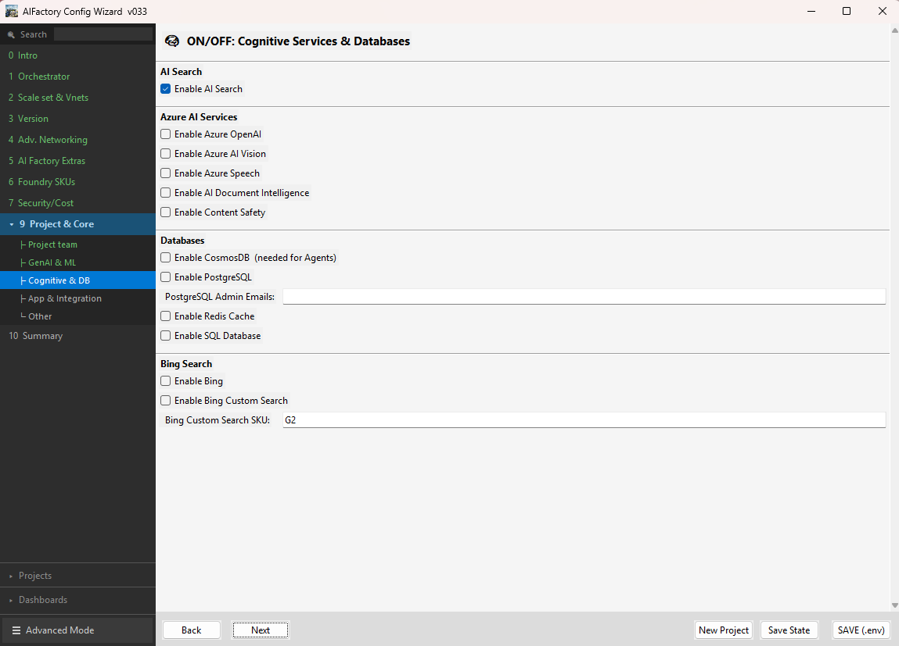
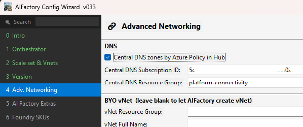

# End-2-End setup tutorial (3 steps): AIFactory + 1 ESMLProject

> [!IMPORTANT]
> See the new bootstrap template repository - even more automated way to setup Enterprise Scale AIFactory's. (This section is still valid and good to read)
> [Enterprise Scale AIFactory - Template repo using the AI Factory as submodule](https://github.com/jostrm/azure-enterprise-scale-ml-usage)

## Prerequisites
[Prerequisites](../10-19/12-prerequisites-setup.md) for Azure and Azure Devops/Github

### Prerequisite setup tools:  on your laptop (for both option A) Azure Devops and B) Github):
- **Git Bash**: https://git-scm.com/downloads e.g. GNU bash, version 5.2.37 or above
    - **Purpose**: The install script runs in bash terminal (Git bash)
    - **Note Mac/Linux**: It has been seen that Ubuntu bash (sames that comes with Mac OS), additional libraries will be needed to be installed
    - **Version**: 5.2.37
    ```bash
    bash --version
    ```` 
### Prerequisite setup tools: on your laptop (for Option B - Github)
- **Github CLI**: https://cli.github.com/
    - **Purpose**: The .env file will push those values as Github secrets and variables, and create Github environments Dev, Stage, Production
    - **Version**: 2.71.0 or above
        ```bash
           gh --version
        ```` 
### Prerequisite (Optional But Highly Recommended) - AI Factory Configuration Wizard

Use the [**AI Factory Configuration Wizard**](../../../environment_setup/install_config_wizard/readme.md)

## Setup options: 
Whether you want to use Azure DevOps or GitHub, we recommend using the [**AI Factory Configuration Wizard**](../../../environment_setup/install_config_wizard/readme.md) to configure the AI Factory and its first project initially. The wizard provides a guided, form-based UI that validates your inputs and generates a correctly populated configuration file — significantly reducing the risk of misconfiguration on first deployment.



> **Two common workflows**
>
> - **ITSM-integrated (fully automated):** Many teams integrate the AI Factory pipelines directly with their ITSM system (ServiceNow, Jira Service Management, etc.), so that project teams can "order" an AI Factory project via a self-service ticket — triggering the pipeline with 100% automation and zero manual intervention.
> - **Core-team managed:** Other teams prefer to route tickets to the AI Factory core team, who then uses the [**AI Factory Configuration Wizard**](../../../environment_setup/install_config_wizard/readme.md) to generate the correct configuration from the ticket information and trigger the pipeline on behalf of the requesting team.

### Option A — Azure DevOps

[Setup AIFactory — Infra Automation (Azure DevOps YAML + Bicep)](../../../environment_setup/aifactory/bicep/copy_to_local_settings/azure-devops/esml-yaml-pipelines/readme.md)

### Option B — GitHub Actions

[Setup AIFactory — Infra Automation (GitHub Actions + Bicep)](../../../environment_setup/aifactory/bicep/copy_to_local_settings/github-actions/readme.md)

## Result: 
This is what you will get:

[AIFactory overview](../10-19/15-aifactory-overview.md)

[AIFactory architecture diagrams](../10-19/11-architecture-diagrams.md) 

## Advanced Configuration: Standalone VS Hub-connected centralized private DNS zones

### When to choose What? 
Recommended approach is to combine `BYOvNet` with `Hub-Connected & Centralized private DNS zones`. This enables all 4 access modes: `Peering, VPN, Bastion, Whitelisting user IP's` and separates the networking from the AI Factory common area, to your centralized Hub (Hub/Spoke).
- **Scenarios**: Production scenario.

But if you want simplicity or want to setup an AI Factory in an isolated bubble - not involving your Hub, choose `Standalone` mode. 
- Standalone mode is still secured with private networking, and you can reach the UI portals (Azure AI Foundry, Azure Machine Learning) via either: `VPN, Bastion, Whitelisting user IP's`
- **Scenarios**: 
    1) Testing out the AI Factory accelerator
    2) Setup an AIFactory for a temporary workshop, that needs to have high security.
    3) If it is not possible to connect it to your HUB, for various reasons.

### Standalone
For `Standalone mode` using the *AI Factory common resource group* for both `Virtual Network, Network Security Groups, Private DNS zones` set the values as below: `true, subscriptionId and resourceGroupName` where your centralized Private DNS zones resides. This is usually your Hub subscription and platform-connectivity resource group.

```python
  # HUB vs STANDALONE
  
  CENTRAL_DNS_ZONE_BY_POLICY_IN_HUB="false" # <optional>Centralized DNS via Hub policy<default>false<keep-as-is> <otherwise> true, uses central private DNS zones in HUB resource group managed by Azure Policy.
  PRIV_DNS_SUBSCRIPTION_PARAM="<todo>" # <optional>Hub DNS subscription ID<default><todo>_SubscriptionID<mandatory> if CENTRAL_DNS_ZONE_BY_POLICY_IN_HUB:'true' <ensure> Hub connectivity subscription ID.
  PRIV_DNS_RESOURCE_GROUP_PARAM="<todo>" # <optional>Hub DNS resource group<default><todo>_ResourceGroup_name<mandatory> if CENTRAL_DNS_ZONE_BY_POLICY_IN_HUB:'true' <ensure> Hub connectivity resource group.
```

### Hub-Connected & Centralized private DNS zones
For `Hub-connected mode` using your own *Hub resource group* for both `Private DNS zones` 
Set values as below, e.g. where your centralized Private DNS zones resides. This is usually your Hub subscription and platform-connectivity resource group.



## Config: EntraID groups to Personas

How-to Create EntraID groups, Connect to Personas, Add info to seeding keyvault: 

[Ask your AI Factory core team to read this](../10-19/16-ad-groups-personas.md)

## Config: WebApp (post deployment of WebApp)

### Authentication (Webapp)
- **Identity provider:** Microsoft EntraID
- **Client secret setting**:  
    - Service principal: Project specific, see project keyvault `esml-project-sp-003` 
- **Issuer URL**: https://sts.windows.net/`your_tenantId`/v2.0
    - See project keyvault for tenant id.
- **Tenant requirement**
    - Allow requests only from the issuer tenant

### Authentication (In EntraID) - API permissions
- The service principal, Authentication page for, `esml-project-sp-003`, needs to have API permissions, delegated, in Microsoft Graph:
    - **User.Read**
        - Sign in an read user profile
    - **offline_access**
        - Maintain data you have given it access to (such as login token, if offline)

### Authentication (In EntraID) - Redirect URL
Redirect url is on the same page, where checkbox is, and should be: 
 
https://`webapp-prj003-your-web-app-name-001`.azurewebsites.net/.auth/login/aad/callback

### Networking (WebApp)
- You can choose to run the WebApp within the subnet: `snet-esml-cmn-001-scoring` 

# Deprecated setup
- Deprecated 2025-03: [Azure Devops - Classic](../../../environment_setup/aifactory/bicep/copy_to_local_settings/azure-devops/esml-ado-pipelines/readme.md)
    - No new features will be added for this option. Use YAML option instead.
    - Very detailed setup info with screenshots (Azure Devops classic)
        - [Setup AIFactory - Infra Automation (AzureDevops classic + BICEP)](../10-19/13-setup-aifactory.md)

