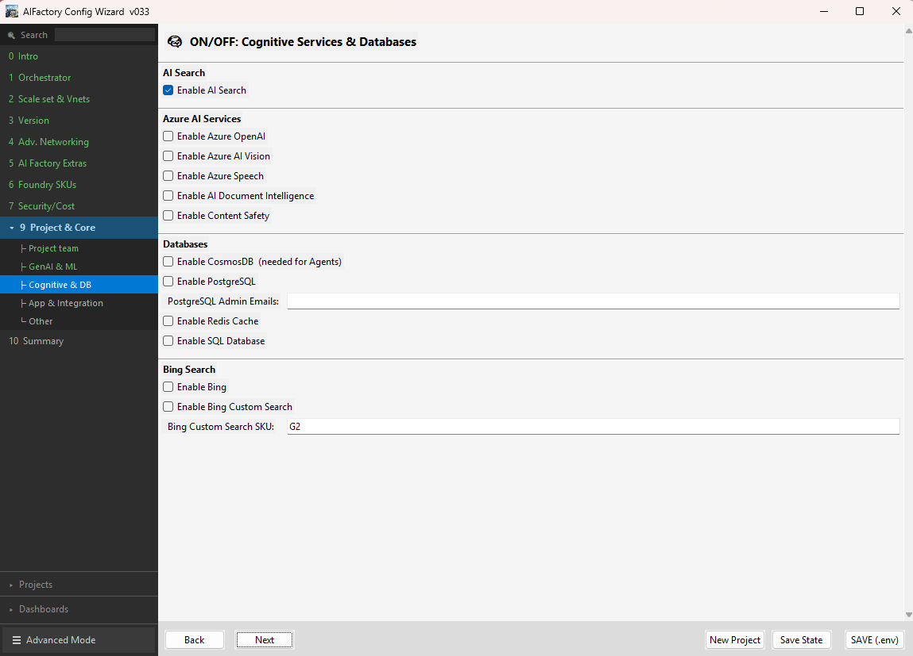
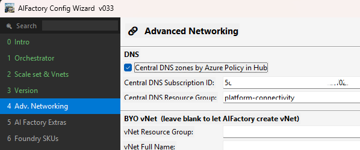

# End-2-End setup tutorial (3 steps): AIFactory + 1 ESMLProject

> [!IMPORTANT]
> See the new bootstrap template repository - even more automated way to setup Enterprise Scale AIFactory's. (This section is still valid and good to read)
> [Enterprise Scale AIFactory - Template repo using the AI Factory as submodule](https://github.com/jostrm/azure-enterprise-scale-ml-usage)

## Prerequisites
[Prerequisites](../10-19/12-prerequisites-setup.md) for Azure and Azure Devops/Github

### Prerequisite setup tools:  on your laptop (for both option A) Azure Devops and B) Github):
- **Git Bash**: https://git-scm.com/downloads e.g. GNU bash, version 5.2.37 or above
    - **Purpose**: The install script runs in bash terminal (Git bash)
    - **Note Mac/Linux**: It has been seen that Ubuntu bash (sames that comes with Mac OS), additional libraries will be needed to be installed
    - **Version**: 5.2.37
    ```bash
    bash --version
    ```` 
### Prerequisite setup tools: on your laptop (for Option B - Github)
- **Github CLI**: https://cli.github.com/
    - **Purpose**: The .env file will push those values as Github secrets and variables, and create Github environments Dev, Stage, Production
    - **Version**: 2.71.0 or above
        ```bash
           gh --version
        ```` 
### Prerequisite (Optional But Highly Recommended) - AI Factory Configuration Wizard

For Windows 11, use the [**AI Factory Configuration Wizard (MAUI) installer and quick start**](../../../environment_setup/install_config_wizard/maui/readme.md).
The installer includes the local Python API; a separate Python installation is not needed.
The [classic Tkinter wizard](../../../environment_setup/install_config_wizard/readme.md) remains available for Windows, macOS, and Linux.

## Setup options: 
Whether you want to use Azure DevOps or GitHub, we recommend using the [**AI Factory Configuration Wizard**](../../../environment_setup/install_config_wizard/readme.md) to configure the AI Factory and its first project initially. The wizard provides a guided, form-based UI that validates your inputs and generates a correctly populated configuration file — significantly reducing the risk of misconfiguration on first deployment.

For a DEV-first automated setup from an existing subscription, use one of the
new launchers from the parent repository:

```bash
bash ./ADO-create-new-aifactory-scaleset.sh
# or
bash ./GHA-create-new-aifactory-scaleset.sh
```

Select templates with `--aifactory-version 125` or `AIFACTORY_VERSION=125`.
The numeric format is one major digit plus two minor digits: `124` means
`release/v1.24`, `125` means `release/v1.25`. Use explicit dotted values for
future versions such as `1.100` or `10.2`; `main` is also an explicit choice.
New factories default to `124`. Existing factories and new scale sets inherit
their saved version; an unknown existing version blocks rather than downgrades.
Without an explicit choice, an interactive terminal asks you to accept or change
the effective default. `--non-interactive` and API execution never prompt for it.

Preview resolves the published branch to an exact commit; execution uses that
commit, not a newer branch head. Missing branches or incompatible contracts fail
without fallback. `AIF_SUBMODULE_BRANCH` and `AIF_SUBMODULE_REF` remain supported,
but conflicting explicit selectors are rejected. The chosen version is saved in
`aifactory/config-wizard/aifactory-version.json`; consumer/development `main`
remains separate from the selected template release.

### Frozen lifecycle creation

Use the selected published `bootstrap/AIFactory-lifecycle.sh execute` entrypoint
with `--stdin-manifest`, `--source-root`, `--execution-root`, and `--receipt` for
scoped/common-only creation. A trusted backend supplies the complete frozen
manifest through a protected child stdin pipe; do not put configuration or
credentials in shell arguments or environment variables.

This is a separate scoped provider path, not a flag that bypasses only the final
project dispatch in the legacy bootstrap. Empty project lists must remain empty.
See `bootstrap/lib/factory_lifecycle_contract.txt` for complete configuration,
publication, authentication, coordination and scope prerequisites. Unsupported
configuration blocks rather than falling back to project001. The legacy
creation wrappers reject `AIF_CREATE_PROJECTS` and `AIF_PROJECT_MODE` settings;
a version-contract marker alone does not advertise scoped creation support.

**Manual provider installation prerequisite:** legacy creation and project-update
scripts do not install or register the separate lifecycle provider. Before
preparing a scoped operation, copy the appropriate file byte-for-byte from the
isolated checkout of the **selected published source commit**, not mutable
development `main`, into the consumer repository:

| Provider | Selected source file | Consumer destination |
| --- | --- | --- |
| GitHub Actions | `bootstrap/templates/factory-lifecycle-gha.yml` | `.github/workflows/factory-lifecycle.yml` |
| Azure DevOps | `bootstrap/templates/factory-lifecycle-ado.yml` | `aifactory/pipelines/factory-lifecycle.yml` |

The repository owner must review and publish that consumer change separately;
the lifecycle runtime never copies files into, commits, or pushes the consumer
repository. Register the ADO YAML pipeline at its destination and select its
pipeline identity in the reviewed route. For GHA, the dispatchable workflow must
be available on the repository's default branch. Keep the templates manual-only:
GHA uses `workflow_dispatch`; ADO has `trigger: none` and `pr: none`.

The frozen route identifies the independently reviewed consumer commit. Its
provider file and the isolated lifecycle helper must match the selected source
version. A release without these files is unsupported until published; do not
copy newer development templates over an older selected release or substitute a
different consumer commit after confirmation.

The legacy DEV-first flow registers resource providers, creates or reuses a
federated deployment identity, creates or validates the required seeding Key
Vault, creates the initial Entra team group, configures and commits automation,
deploys the common environment, and then deploys project 001.

Private-only standalone deployments can use an integrated access hub in the
DEV common network or an external `aifactory-connectivity` subscription. The
external option creates central private DNS zones, assigns the DNS initiative
to the spoke, deploys an Entra-authenticated Point-to-Site VPN gateway and DNS
Private Resolver, and peers each AI Factory environment VNet to the access hub.



> **Two common workflows**
>
> - **ITSM-integrated (fully automated):** Many teams integrate the AI Factory pipelines directly with their ITSM system (ServiceNow, Jira Service Management, etc.), so that project teams can "order" an AI Factory project via a self-service ticket — triggering the pipeline with 100% automation and zero manual intervention.
> - **Core-team managed:** Other teams prefer to route tickets to the AI Factory core team, who then uses the [**AI Factory Configuration Wizard**](../../../environment_setup/install_config_wizard/readme.md) to generate the correct configuration from the ticket information and trigger the pipeline on behalf of the requesting team.

### Naming constraints

Azure deployment names are limited to 64 characters. When configuring prefixes in your `.env` file, keep this in mind:
- Keep AIFACTORY_PREFIX and PROJECT_PREFIX short (6 characters or less recommended)
- Environment-specific prefixes (DEV_NETWORK_ENV, STAGE_NETWORK_ENV, PROD_NETWORK_ENV) add to the total length
- Longer prefixes can cause deployment names to exceed the 64-character limit

The Configuration Wizard validates prefix lengths and warns if deployment names would be truncated. If you configure prefixes manually, use shorter values to ensure all resource names deploy correctly.

### Option A — Azure DevOps

[Setup AIFactory — Infra Automation (Azure DevOps YAML + Bicep)](../../../environment_setup/aifactory/bicep/copy_to_local_settings/azure-devops/esml-yaml-pipelines/readme.md)

### Option B — GitHub Actions

[Setup AIFactory — Infra Automation (GitHub Actions + Bicep)](../../../environment_setup/aifactory/bicep/copy_to_local_settings/github-actions/readme.md)

## Result: 
This is what you will get:

[AIFactory overview](../10-19/15-aifactory-overview.md)

[AIFactory architecture diagrams](../10-19/11-architecture-diagrams.md) 

## Advanced Configuration: Standalone VS Hub-connected centralized private DNS zones

### When to choose What? 
Recommended approach is to combine `BYOvNet` with `Hub-Connected & Centralized private DNS zones`. This enables all 4 access modes: `Peering, VPN, Bastion, Whitelisting user IP's` and separates the networking from the AI Factory common area, to your centralized Hub (Hub/Spoke).
- **Scenarios**: Production scenario.

But if you want simplicity or want to setup an AI Factory in an isolated bubble - not involving your Hub, choose `Standalone` mode. 
- Standalone mode is still secured with private networking, and you can reach the UI portals (Azure AI Foundry, Azure Machine Learning) via either: `VPN, Bastion, Whitelisting user IP's`
- **Scenarios**: 
    1) Testing out the AI Factory accelerator
    2) Setup an AIFactory for a temporary workshop, that needs to have high security.
    3) If it is not possible to connect it to your HUB, for various reasons.

### Standalone
For `Standalone mode` using the *AI Factory common resource group* for both `Virtual Network, Network Security Groups, Private DNS zones` set the values as below: `true, subscriptionId and resourceGroupName` where your centralized Private DNS zones resides. This is usually your Hub subscription and platform-connectivity resource group.

```python
  # HUB vs STANDALONE
  
  CENTRAL_DNS_ZONE_BY_POLICY_IN_HUB="false" # <optional>Centralized DNS via Hub policy<default>false<keep-as-is> <otherwise> true, uses central private DNS zones in HUB resource group managed by Azure Policy.
  PRIV_DNS_SUBSCRIPTION_PARAM="<todo>" # <optional>Hub DNS subscription ID<default><todo>_SubscriptionID<mandatory> if CENTRAL_DNS_ZONE_BY_POLICY_IN_HUB:'true' <ensure> Hub connectivity subscription ID.
  PRIV_DNS_RESOURCE_GROUP_PARAM="<todo>" # <optional>Hub DNS resource group<default><todo>_ResourceGroup_name<mandatory> if CENTRAL_DNS_ZONE_BY_POLICY_IN_HUB:'true' <ensure> Hub connectivity resource group.
```

### Hub-Connected & Centralized private DNS zones
For `Hub-connected mode` using your own *Hub resource group* for both `Private DNS zones` 
Set values as below, e.g. where your centralized Private DNS zones resides. This is usually your Hub subscription and platform-connectivity resource group.



## Config: EntraID groups to Personas

How-to Create EntraID groups, Connect to Personas, Add info to seeding keyvault: 

[Ask your AI Factory core team to read this](../10-19/16-ad-groups-personas.md)

## Config: WebApp (post deployment of WebApp)

### Authentication (Webapp)
- **Identity provider:** Microsoft EntraID
- **Client secret setting**:  
    - Service principal: Project specific, see project keyvault `esml-project-sp-003` 
- **Issuer URL**: https://sts.windows.net/`your_tenantId`/v2.0
    - See project keyvault for tenant id.
- **Tenant requirement**
    - Allow requests only from the issuer tenant

### Authentication (In EntraID) - API permissions
- The service principal, Authentication page for, `esml-project-sp-003`, needs to have API permissions, delegated, in Microsoft Graph:
    - **User.Read**
        - Sign in an read user profile
    - **offline_access**
        - Maintain data you have given it access to (such as login token, if offline)

### Authentication (In EntraID) - Redirect URL
Redirect url is on the same page, where checkbox is, and should be: 
 
https://`webapp-prj003-your-web-app-name-001`.azurewebsites.net/.auth/login/aad/callback

### Networking (WebApp)
- You can choose to run the WebApp within the subnet: `snet-esml-cmn-001-scoring` 

# Deprecated setup
- Deprecated 2025-03: [Azure Devops - Classic](../../../environment_setup/aifactory/bicep/copy_to_local_settings/azure-devops/esml-ado-pipelines/readme.md)
    - No new features will be added for this option. Use YAML option instead.
    - Very detailed setup info with screenshots (Azure Devops classic)
        - [Setup AIFactory - Infra Automation (AzureDevops classic + BICEP)](../10-19/13-setup-aifactory.md)
