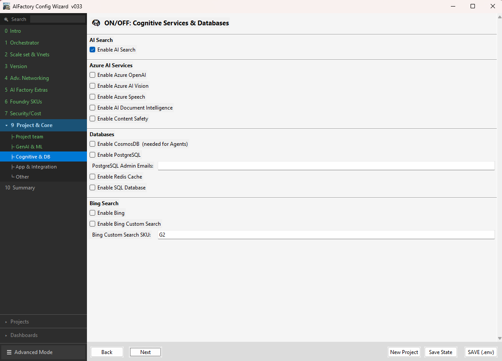
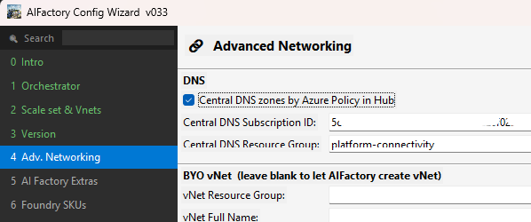

# End-to-end setup: Azure Factory and AI projects

For terminal commands, Python or direct HTTP requests, start with
[17. Azure Factory CLI, Config Wizard API, and usage](../10-19/17-cli-and-api-and-usage.md).

> For an introduction to the app interface and read-only API/CLI operations, see
> the [AI Factory tutorial (version 1.25+)](28-tutorial-walkthrough.md).
>
> For the Monitor-only, FinOps-focused companion, see [AI Factory tutorial: FinOps monitoring](tutorial-fiops.md).

Use the **Enterprise Scale AI Factory** app or its API to configure factories,
review and trigger IaC pipelines, monitor Azure resources, promote projects from
Dev to Stage/Prod, and manage tickets. Configuration, deployment and monitoring
are separate operations; a saved definition is not a deployed resource.

Start by [choosing a setup path](#choose-the-setup-path), then follow the
[shell-first](#shell-first-new-registered-consumer-v125--main) or
[app-first](#app-first-the-same-configuration-and-execution-contracts) instructions.
The [legacy setup](#existing-single-factory-setup) section covers existing
single-factory repositories.

## Two common workflows

- **ITSM or self-service portal integration:** Teams order projects through ServiceNow,
  Jira Service Management or their own cloud portal. A trusted automation runner
  calls the AI Factory API to prepare the exact configuration, apply the team's
  approval policy, confirm execution and track the job. With identities,
  permissions, pipeline bindings and approvals established, this can run without
  manual intervention. The desktop's local API is not a public ITSM endpoint;
  use an authenticated integration, not an exposed loopback port.
  See [ITSM integration with callbacks](./29-ITSM-integrated.md) for the CLI/API workflow.
- **Core-team managed:** The core team uses the
  [Enterprise Scale AI Factory app](../../../environment_setup/install_config_wizard/maui/readme.md)
  to configure from the ticket, review and trigger the pipeline, and follow its
  progress in the integrated terminal. The API invokes the appropriate reviewed
  Bash/provider flow underneath; users do not need to compose shell commands.
  The two scoped Bash entrypoints are `bootstrap/ADO-azurefactory.sh` and
  `bootstrap/GHA-azurefactory.sh`. Built-in tickets help manage the work; external
  connector synchronization is explicit, not automatic deployment approval.

## Choose the setup path

Choose a workflow based on your permissions and network topology. Full bootstrap
supports both GitHub Actions and Azure DevOps, including external connectivity
hubs. Use the Configuration Wizard when administrators have already supplied the
required infrastructure and identities.

| Path | Use it for | Prerequisite handling |
|---|---|---|
| **Full bootstrap** | Privileged setup with GitHub Actions or Azure DevOps, including an external hub | Review create-or-reuse provisioning in the same workflow; do not manually look up generated object IDs |
| **Simple Mode** | The smaller GitHub-only Dev001 form, without external-hub controls | Uses the privileged coordinator, subject to the topology limitation below |
| **Configuration Wizard** | Restricted teams using prerequisites supplied by their administrators | Consumes precreated identities, groups, vault and connectivity references |
| **Factory Catalog** | Optional inventory, configuration editing and scoped operations | Not a mandatory handoff to finish Full bootstrap |

For an external hub, select **Full bootstrap** in the Start Guide. If that option
is unavailable, update to a compatible app/API version before continuing.

### How the scripted Azure DevOps setup automates prerequisites

The legacy single-factory Azure DevOps setup uses a **scripted privileged
bootstrap**. Its entrypoint is
[`ADO-create-new-aifactory-scaleset.sh`](../../../bootstrap/ADO-create-new-aifactory-scaleset.sh);
the GitHub counterpart is
[`GHA-create-new-aifactory-scaleset.sh`](../../../bootstrap/GHA-create-new-aifactory-scaleset.sh).
Both share
[`bootstrap/lib/create-new-aifactory-scaleset.sh`](../../../bootstrap/lib/create-new-aifactory-scaleset.sh).
The shared `aif_scaleset_main` invokes the following helpers:

| Helper | Automated responsibility |
|---|---|
| `aif_ensure_first_party_enterprise_apps` | Find/create the required tenant service principals and resolve the AML/Databricks object IDs |
| `aif_ensure_bootstrap_identity` | Create/reuse the selected deployment identity and grants |
| `aif_ensure_seeding_keyvault` / `aif_seed_optional_project_sp` | Create/reuse the seed vault and seed applicable credentials without entering secret values into configuration |
| `aif_ensure_team_group` | Resolve/create the Entra security group and selected membership |
| `aif_prepare_external_access_hub` / `aif_ensure_vpn_access_hub` | Prepare the external hub and create a missing VPN gateway or reuse an existing one |
| `aif_configure_ado` / `aif_configure_github_identity` | Configure provider-specific authentication and automation |

These helpers resolve `azure_machinelearning_sp_oid`, create or reuse the team
group, and prepare the seed vault. Provide authenticated administrative access
and the intended tenant, subscriptions, repository and hub details before running
the script.

For an existing registered `azurefactory` draft, continue through the registered
workflow rather than running a legacy full-bootstrap script over it. This
preserves saved configuration and keeps configuration approval separate from
cloud/provider execution.

### What the local-change review means

**Review exact local changes** approves configuration persistence, not deployment.
`org-department-id` and `org-department-name` are project metadata: with an initial
project selected, supplied values are saved with that project's organization
data; they do not provision infrastructure. With explicit common-only
creation there is no project to attach them to, so the review identifies them as
not included in that save.

`inputCommonSPSecretKey` and `project_service_principal_Secret_seeding_kv_name`
are **Key Vault secret names/references**, not secret values. A supplied reference
is saved at its appropriate common/project scope; this does not create the
referenced secret. The passwordless managed-identity bootstrap clears unused
service-principal secret references. Supply secret references only when required
by your selected authentication method.

### Current integrated-hub limitation

The registered combination `access_hub_mode=integrated` with
`setup_hub_access=true`, including the default Simple topology, is currently
blocked. A retained shared lock account cannot put its single canonical private
endpoint into a factory-owned common VNet without a compatible network, DNS and
deletion-ownership contract. Use an explicitly configured external hub or no-hub
setup instead, and review the resulting network configuration before execution.

The external-hub path uses a retained, nondelegated **hub** private-endpoint
subnet, not the first factory's runner/spoke subnet. Additional factories must
reuse that shared endpoint and have explicit reachability; VNet peering is not
transitive. The hub can be in the same subscription as the factories.
No-hub mode (`integrated` with `setup_hub_access=false`) skips shared hub-lock
storage; it does not mean an external hub was precreated.

Use compatible source, API and app versions that support your selected topology.
Confirm that the required helpers are available in the selected published source
before preparing a deployment.

### Private connection discovery requires execution approval

For no-hub private bootstrap, `initial-common-deployment` is followed by
`connection-discovery`, then `connection`. Discovery has its own exact review:
it **creates bounded VM Run Command resources**, whose guest commands issue only
the approved Blob HEAD/GET reads. It is not a cloud-write-free preview.
The subsequent connection preview replays protected, short-lived evidence without
dispatching guest commands. Enrollment requires a new approval and rechecks live
state before mutation; discovery approval is not enrollment/governance approval.
Already-private shared hubs still require authenticated private reachability from
the executing host; preview must not reopen public access or dispatch a hidden
remote command to work around missing connectivity.

## New folder structure

### Version and folder compatibility

| AI Factory source | Folder support | Default use |
|---|---|---|
| `release/v1.24` (`124`, LTS) | Legacy `aifactory` only | New legacy bootstrap default |
| `release/v1.25` (`125`) | Legacy `aifactory` and registered `azurefactory` | Stable registered-layout release |
| `main` | Legacy `aifactory` and registered `azurefactory` | Unstable development |

Selecting another submodule branch changes the shared code/templates; it does **not**
rename, migrate or replace configuration storage. A repository originally created
with `aifactory\variables.json` therefore remains a supported legacy repository
when its submodule moves to `release/v1.25` or `main`. Existing repositories can
therefore update the shared source while retaining the single `aifactory` folder.
Migration is a separate catalog operation with its own preview and confirmation.

### Modern Simple/Full Bash creation is configure-first

For a **new** consumer, `GHA-create-new-aifactory-scaleset.sh`,
`ADO-create-new-aifactory-scaleset.sh` and the `ALL` dispatcher route
`main`/`125` or later versions to the authenticated local API's shared
registered-creation adapter, **before** the legacy bootstrap's Azure, GitHub,
repository or template-copy operations. A new consumer defaults to `main`; an
explicit `124` or an existing saved legacy version preserves the legacy route.
The same guard applies when directly sourcing the shared Bash library. The `ALL`
dispatcher also accepts `AIF_ORCHESTRATOR=ado|gha`; conflicting provider selectors
fail closed.
Existing legacy folders
are not silently converted, and existing registers retain the scoped lifecycle
guard.

```bash
# Set AIFACTORY_API_KEY privately; do not put it in a command or receipt.
export AIF_TENANT_ID="<tenant-uuid>"
export AIF_DEV_SUBSCRIPTION_ID="<subscription-uuid>"
export AIF_PREFIX="acme-ai-"
export AIF_LOCATION="swedencentral"
export AIF_TEAM_MEMBER_EMAIL="owner@example.org"
export AIF_TEAM_GROUP_NAME="acme-ai-team"
export GITHUB_REPOSITORY="organization/new-consumer"
export AIF_SIMPLE_MODE=true              # omit/false for the Full configuration form
export AIF_PROJECT_NUMBER=007            # omit for project001; never creates both
bash ./bootstrap/GHA-create-new-aifactory-scaleset.sh \
  --repo-root "/path/to/new-consumer" --aifactory-version main \
  --non-interactive --save-receipt "./creation-review.json"
```

Use a new receipt filename outside the generated `azurefactory` directory.
The destination may be one missing child of an existing ordinary parent.
Preparation creates only that directory and pending local catalog metadata;
confirmation owns the register/settings transaction. An unconfirmed
preparation can be repeated with a new receipt filename: only recognized pending
catalog lock/database files are accepted, and the API validates the destination
again. Unrelated files, links and existing registers remain blocked.
`--dry-run` only prints offline inputs: it neither calls the API nor writes files.
`--yes`, `--prepare-only` and `--no-wait` **never** approve a modern configuration
or start deployment. A compatible API and the shared `azurefactory` SDK are
required; missing `initial-project-v1` or `draft-scale-identity-v1` capabilities fail closed rather than falling back to legacy
templates. Unsupported legacy environment switches are reported, not ignored.
Simple keeps its fixed Dev001 scale set; an explicit project number is sent as
`initial_project`, not as an unsupported Simple configuration field.

The adapter calls `POST /api/v1/creation/prepare` with contract version 1,
`mode: simple|full-bootstrap`, the consumer folder, orchestrator and nonsecret
configuration. Authentication is the loopback API key, not an Azure sign-in.
The returned catalog preview contains the canonical `azurefactory` folder,
mapped settings and deferred deployment fields. Review those fields too: accepted
connection metadata is not automatically enrolled or deployed.

Review the receipt, then explicitly run
`azurefactory catalog confirm --receipt "./creation-review.json" --yes`
(or `bash ./azurefactory.sh catalog confirm ...` with the registered helper bundle).
This consumes the same server-held configuration receipt as
`POST /api/v1/creation/confirm`; it is not a bootstrap start.
Confirmation creates the canonical register, factory, scale set and selected
initial project's `variables.json` through the shared catalog transaction.
This step saves **configuration only**. Repository publication, identity creation,
binding/enrollment, runner setup and cloud deployment are separate operations.
Continue in the Simple/Full workflow to prepare the next explicitly reviewed
privileged stage; no switch to Catalog or the restricted Wizard is required.
Published source/ref checks and protected manifests remain mandatory; this path
does not install or publish uncommitted source changes. For explicit common-only
creation use `azurefactory factory create --common-only` instead.

The registered adapter accepts `AIF_ACCESS_HUB_MODE=integrated|external`
(`i|e` also work). External mode requires all four explicit
`AIF_ACCESS_HUB_SUBSCRIPTION_ID`, `AIF_ACCESS_HUB_RESOURCE_GROUP`,
`AIF_ACCESS_HUB_VNET_NAME`, and `AIF_ACCESS_HUB_VNET_CIDR` values.
`AIF_SETUP_HUB_ACCESS=true|false` is independent of topology; setting it to
false does not convert an external hub into an owned hub.

When reusing a VPN gateway, privileged bootstrap can review an **additive factory
route** in explicit `single-writer` mode. Existing routes and gateway settings
are retained. The preview is read-only; execution rechecks the configuration and
opaque ETag, appends only the approved factory CIDR, waits for completion and
verifies the resulting settings. Ordinary client-traffic counters do not count
as configuration changes.

This gateway update has **no verified provider-enforced conditional-write
guarantee**. Manually serialize every writer to the shared hub, including other
factories, repositories, portal users and CLI users, from review through
completion. A repository reservation is not a shared-hub lock. Blob mode does
not silently fall back to this operation. Unsupported gateway settings, active
migration/capture, BGP or unrecoverable RADIUS secrets block the update. Any
uncertain result retains its receipt and requires reconciliation, not a retry.

Long-running privileged stages refresh cached Azure CLI tokens before they enter
the final two minutes of their lifetime. Refreshed tokens must retain the reviewed
tenant and operator identity. This does not sign in, switch accounts or retry an
HTTP write after a 401; an unexpected authentication failure still stops the
stage and retains its recovery evidence.

<details>
<summary>Advanced reference: privileged prerequisites and shared-hub foundation</summary>

#### Privileged prerequisite engine contract

This section is a reference for administrators and automation authors. For the
standard setup workflow, continue to [Setup in three steps](#setup-in-three-steps).

`bootstrap/lib/registered_prerequisites.py` provides read-only `prepare(...)`
and one-use `execute(...)` for a **separately approved privileged stage**, not
for restricted Wizard deployment. It binds the exact register bytes and reviewed
local source payload, Entra group/member discovery, seed-vault configuration,
resource IDs, proposed mutations, and physical lease scopes. Its source fingerprint
includes local changes and is separate from published-source verification.
Identity/federation enrollment remains the audited `factory_enrollment.py` stage;
new group or identity identifiers require a fresh downstream review.
`capabilities()` explicitly advertises only the after-common prerequisite stage,
with `cold_start_supported=false` and `supports_restricted_wizard=false`.
Its plan exposes commands, effects, authentication scopes, source/input hashes,
stage readiness, and preconditions. Execution returns stage results, nonsecret
outputs, changed/uncertain state, and the durable receipt path.
`verify_source_snapshot(...)` verifies an explicitly pinned five-file local
helper bundle and its loaded dependencies; missing helpers or changed bytes fail
before cloud discovery. Local verification records `published_ref_verified=false`.
A native package may use this only under its existing explicit
trusted-source/consent policy. It does not relax the independent published-source
checks for common/project deployment. The installed package must include the
required helper.

External RGs are retained dependencies, never owned/enrolled/deleted factory
scopes. Existing gateways are discovered by their actual VNet attachment and
reused unchanged only when P2S settings, routes and resolver evidence match.
Incompatible shared gateways require review of the exact resource; generated
names are never substituted. New gateway, resolver, DNS links, explicit peerings,
and common-VNet Bastion Developer effects are visible before approval.

**New shared hubs require the Blob foundation stage described below.** Explicitly
supplied legacy factory-common ADLS `factorymeta` coordinates remain supported
unchanged, without automatic migration or cross-factory shared-hub protection.
The prefix-first coordinator supplies minimum foundation and explicitly preserved
networking before later common workloads. Its network12 replay requires the
`preserve-v1-runtime-proof` zero-write contract, not a BYO flag or an assumption
that an incremental VNet deployment preserves subnets. Integrated shared-hub
ownership remains blocked as described above. Resolve missing prerequisites before
continuing. Interrupted
execution retains durable local/cloud receipts and infinite physical leases;
inspect and reconcile them explicitly. No automatic retry, rollback, lease break,
repository publication, sign-in, or catalog mutation is performed by the engine.

**Shared-hub foundation:** use one GitHub Actions or Azure DevOps repository per
factory. Multiple factories can share one retained connectivity resource group,
hub and VPN in the same Dev subscription or an external hub subscription.
`bootstrap/lib/hub_lock_foundation.py` provides the independent first stage:

- `prepare(source_root=..., tenant_id=..., hub_resource_group_id=..., location=...,
  bootstrap_public_ipv4=..., expected_source_hash=...)` is read-only and returns
  the frozen native plan, exact commands/scopes, source hashes, warnings and blockers.
  `SOURCE_FILES` contains only this module and `factory_enrollment.py`; no Git
  origin, consumer register, common VNet or factory-common account is required.
- `execute(plan, state_dir=..., expected_plan_hash=...,
  acknowledge_initialization_governance=True)` creates or reuses the RG,
  deterministic `afhub` account, private `hub-locks` container and exact signed-in
  principal's container-scoped Storage Blob Data Contributor grant. The account
  name is derived only from the canonical physical hub subscription/RG, not
  factory/repository/user identity. Ownership, name and security conflicts block;
  existing resources and lock contents are never replaced to resolve conflicts.
  An existing account retains its original location even when another factory
  requests a different region. Equivalent existing container grants are reused
  regardless of assignment name; a conditioned grant is not bypassed by creating
  a new unrestricted grant. Known missing parents defer child-resource discovery
  until provisioning rather than issuing invalid role-scope queries.
- **Externally serialize all first initializers.** Before account/container/RBAC
  exist, no Blob lease can protect provisioning. ARM PUT has no atomic create-only
  guarantee: immediate absent-resource rechecks are not distributed protection.
  After an authenticated data-plane probe, the helper acquires the canonical
  hub-RG infinite lease, verifies the foundation and releases only its own lease.
  Subsequent shared changes must reacquire the same physical lease. Uncertain
  writes retain receipts, a local initialization claim and any acquired lease;
  no blind retry, deletion or automatic lease break is provided.
- Storage is Standard_LRS StorageV2, HNS off, Entra OAuth only, HTTPS/TLS 1.2+,
  shared keys/public Blob access disabled, firewall default-deny and bypass None.
  Only the explicitly reviewed bootstrap host's public IPv4 is admitted.
  An existing different firewall rule is a conflict, not silently replaced.
  No all-networks or trusted-service bypass is enabled. **Storage IP rules have
  no automatic expiry.** A blocked/interrupted workflow leaves the approved rule
  in place. Every receipt's `bootstrap_network_access` records the exact account
  and rule, whether this execution created it (unknown after a lost account-PUT
  response), and whether it was reused unchanged. Existing rules must not be
  removed on reuse; no cleanup/removal is authorized by foundation approval.
- The transition to private access is a **separate step** requiring an approved
  private endpoint, DNS configuration and authenticated private-path evidence for
  the account/container scopes. The foundation helper does not verify
  provider-runner reachability and keeps the approved public path until the
  required evidence is available.
  An already private account is reused unchanged only with bootstrap data-plane
  reachability; this does not certify runners.
  Receipts retain cleanup instructions: a separately approved endpoint must
  target the exact account's `blob` subresource with an Approved connection;
  each execution path must resolve the Blob FQDN to that endpoint's actual
  private IP and pass an Entra-authenticated data-plane probe. Every known
  bootstrap/provider-runner writer must be enumerated and verified. Unknown
  writers, missing DNS evidence or unverified paths block removal of the
  workflow-added rule and disabling public access. Foundation success alone
  is not whole-workflow completion.

The subsequent `registered_prerequisites` context selects
`coordination_mode="connectivity-hub"`, canonical `hub_resource_group_id`, and
the returned `{account_id, account_url, container}`. That shared scope must match
the external hub and must not appear in `owned_resource_group_ids`, including
same-subscription hubs. Existing factory ownership/deletion guards are unchanged.
No-hub setups do not need this foundation. The prerequisite core uses the exact
reviewed provider initializer reference for serialization instead; a missing or
changed reference blocks rather than silently running without coordination.
Provider registration is per subscription: workload-subscription registration
does not cover a separate connectivity subscription. The hub foundation reviews
`Microsoft.Storage` registration in its exact connectivity subscription before
any storage creation. `Registered` is reused without another registration;
`NotRegistered` adds an explicit register-and-wait effect to the same stage;
`Registering` waits without submitting a duplicate registration. Preparation
never registers a provider. Execution requires the reviewed subscription-level
`Microsoft.Storage/register/action` permission and waits for `Registered`.
The exact account-name availability check is deferred until registration is
ready and must succeed before resource creation. A failure, timeout or expired
review stops storage creation and retains reconciliation evidence; it never
unregisters the provider or silently changes subscriptions.

</details>

### Registered folder layout

The shared starter is `bootstrap/templates/azurefactory/register.json`: a valid
version-2 register with **zero factories**, empty configurations and empty bindings.
It deliberately contains no example IDs, tenant/subscription values, projects,
pipeline bindings or deployed-resource records. The following is an **illustrative
projection after explicit catalog configuration**, not a tree copied by bootstrap:

```text
azurefactory\
  register.json
  factories\
    acme-ai\
      factory.json
      pipelines\
        ado.json
      scalesets\
        001\
          scaleset_state.json
          projects\
            project001\
              project_state.json
              variables.json
```

The **Azure Factory folder** holds multiple AI Factories. The **Azure Factory
register file**, `register.json`, commits their identities and configuration
together. Named files below it are readable/generated projections: edit through
the app/API, not by changing an export. Every project folder lives under its
scale set and is named `projectXXX`, such as `project001`. There are no
factory-level project folders or separate Dev/Stage/Prod project copies.
Each project's `variables.json` retains the existing pipeline format:
`dev` and `stage_prod` sections, shared/environment-specific settings, all three
subscription IDs and factory/scale-set naming. Environments are configuration,
not another folder level. Friendly names are optional metadata. Projects do not
inherit a new factory-wide settings layer. Keep credentials in protected storage,
never in these files.

Factory type is explicit. AI deployment is supported; robot/web/app factory types
are extension points, not additional deployment engines.

### Initialize only the register (offline and no overwrite)

From a checkout of the shared repository, use Python 3:

```powershell
python .\bootstrap\lib\initialize_azurefactory.py --root "C:\path\consumer\azurefactory"
```

The parent directory must already exist. Select the **`azurefactory` folder**,
not its parent repository and not the legacy `aifactory` folder. Initialization
publishes only `register.json` using atomic no-overwrite creation. Reruns preserve
an existing register byte-for-byte after storage-envelope checks; full validation
of populated definitions remains the catalog API's responsibility. Malformed JSON,
unsupported envelopes, linked paths, mixed layouts and nonempty unregistered
destinations fail without overwriting user files. No readable projection or
`variables.json` is generated. Add or import your metadata through the catalog
before expecting the illustrated factory, scale-set and project files.

An existing sibling `aifactory\variables.json`, including a legacy Dev-only
configuration and a placeholder config-wizard README, is legitimate legacy input.
The register-only helper leaves it untouched and does **not** register that
factory. Preview and confirm explicit adoption/migration with the catalog API.
An existing factory recognized from its legacy folder does not need an empty
register or migration merely to make it visible.
Current v1.25/main launchers detect `azurefactory\register.json`. Registered
operations require `inspect|execute` plus the reviewed protected manifest and are
delegated to `ADO-azurefactory.sh` or `GHA-azurefactory.sh`; raw legacy options are
rejected before writes. A registered runtime still materializes an isolated
`aifactory` execution projection for the existing pipelines. v1.24 launchers do
not understand the register layout. An empty register is neither a deployment
root nor evidence of deployed infrastructure.

With the updated shared checkout/submodule, normal
`01-aif-copy-aifactory-templates.sh` invocation (also `--auto`) still copies
infrastructure/pipeline and use-case templates for the established manual
`01` → `02` bootstrap. It additionally stages the central zero-factory starter at
`aifactory-templates\azurefactory\register.json`, preserving that starter on reruns.
This is an **inactive template**, not a registered/imported factory, project
configuration or deployed-resource data. It does not activate a consumer-root
`azurefactory` folder. Default copy refuses mixed/new roots, including any
consumer-root `azurefactory` folder or active ancestor register, before copying.

Only explicit `--init-azurefactory` initializes a consumer-root register and
exits **before** template cleanup/copying. Alternatively use the Python helper
above with a separate `azurefactory` folder. Neither is needed to view a
recognized legacy factory. The ADO/GHA legacy create/update launchers explicitly
pass `--legacy-templates`, retaining the original payload without a nested starter
when creation moves templates into `aifactory`.
The copier still replaces other template/use-case directories; **do not run it
merely to initialize a register**. No new configuration wizard is installed, and
staging/initializing the starter does not change authentication, cloud resources,
pipelines, root bindings or existing `aifactory\variables.json`.

## Setup in three steps

### Shell-first: new registered consumer (v1.25+ / main)

Use an existing consumer Git repository with the shared source as a submodule.
No desktop app is required. **Confirm the submodule version and required
entrypoint** before running setup. From the consumer root in Git Bash:

```bash
git -C ./azure-enterprise-scale-ml status --short --branch
git -C ./azure-enterprise-scale-ml rev-parse HEAD
test -f ./azure-enterprise-scale-ml/01-start-v125-and-above.sh
bash ./azure-enterprise-scale-ml/01-start-v125-and-above.sh
```

If the file is missing, obtain a compatible approved source version
through your normal reviewed Git workflow, preserving local edits; do not fall
back to `00-start.sh` or `124`. An explicitly reviewed separate source checkout can
also be invoked from the consumer root with `--consumer-root "$PWD"`. The command
prints its source path, branch, commit, dirty status and helper-payload digest;
it never fetches, checks out a branch, pulls, commits or pushes.
That report identifies the **local helper payload**. The factory's separately
selected source version is reviewed during configuration and frozen for runtime
execution.

This new entrypoint installs `azurefactory.sh`, both scoped provider wrappers,
their supporting libraries and the same Python SDK/CLI locally, then initializes
only the empty register. Use `--provider ado` or `--provider gha` to install one
wrapper; opposing-provider files are never deleted. Rerunning is an idempotent
helper refresh: changed helper files are backed up under `.aifactory-backups`,
while register configuration, projections, saved versions, workflows, `.env`
and an existing `.gitignore` remain untouched. `--refresh-only` skips register
initialization. Review ignore rules yourself and keep backups/receipts private.
It does not run the legacy template copier or overwrite a legacy `aifactory`
destination. Use explicit migration for an existing legacy repository.

**Start the supported API without opening a GUI.** The CLI is a client, not a
second catalog writer. Run `bash ./azurefactory.sh api instructions` for the
startup/discovery instructions. In a separate terminal use your approved current
Tkinter backend checkout, install its documented Python prerequisites, set
`AIFACTORY_API_KEY` privately, and run `python -m src.api`. Its default address is
`http://127.0.0.1:8765`. Set the same key in your client terminal and set
`AIFACTORY_API_URL` only when using another authorized address. Use the endpoint
reported by the API's startup/discovery instructions. The server must support
the initial-project contract: `doctor` and factory creation require its live
OpenAPI `CatalogPrepare.initial_project` field. Update incompatible servers before
preparing factory creation.

```bash
bash ./azurefactory.sh health
bash ./azurefactory.sh doctor
bash ./azurefactory.sh factory create --help
```

**Configure your factory.** Supply your approved tenant/subscription, region,
prefix, network and provider; no values are
inferred from a signed-in Azure account. The following uses shell variables you
set to those approved values, and a native API-host folder path (Git Bash on
Windows: `FACTORY_FOLDER="$(cygpath -w "$PWD/azurefactory")"`):

```bash
bash ./azurefactory.sh factory create \
  --folder "$FACTORY_FOLDER" --prefix "$FACTORY_PREFIX" --region "$AZURE_REGION" \
  --environment dev --suffix 001 --tenant-id "$TENANT_ID" \
  --subscription-id "$SUBSCRIPTION_ID" --orchestrator ado \
  --vnet-cidr "$APPROVED_VNET_CIDR" --aifactory-version 125 \
  --save-receipt ./factory.receipt.json
```

Stop and read the complete preview. This shared API operation configures the
factory, scale set and **one initial project, default `project001`**. An explicit
`--project-number 003` replaces that initial project choice; it does not add both
001 and 003. This example explicitly selects version `125`; `main` is a supported
development choice. Omitting `--aifactory-version` delegates to the API's registered
default, never a legacy `124` fallback. Existing saved versions are not changed by helper refresh.
Register initialization leaves tenant, subscription and project configuration empty.

For multiple scale sets use `--scale-set-json`; if more than one submitted scale
has the same environment, select the initial placement with `--initial-project-json`,
for example `{"number":"007","placements":[{"environment":"dev","suffix":"002"}]}`.
`--settings-json` applies nonsecret editable settings in that same preview
(for example `{"enableAIFactoryHub":"false","BYO_subnets":"false"}`).
`--common-only` explicitly configures without an initial project; non-AI factory
types also do not implicitly get an AI project. The project001 guarantee applies
to normal AI creation, not register-only initialization or explicit common-only.

Only after approving that exact preview, run separately:

```bash
bash ./azurefactory.sh catalog confirm --receipt ./factory.receipt.json --yes
bash ./azurefactory.sh catalog list --folder "$FACTORY_FOLDER"
```

Confirmation saves the registered configuration and generated projections; it
creates no Azure resources. The initial project is already included, so add only
additional projects with `project add`, and use the returned exact UUIDs for
later operations.
Enrollment, parameter review and `runtime deploy`/`runtime confirm` remain
separate, explicitly reviewed operations. Scoped Bash execution still requires
the protected manifest and existing binding, source and approval checks.

### App-first: the same configuration and execution contracts

1. **Prepare access.** Install the
   [Windows app and prerequisites](../../../environment_setup/install_config_wizard/maui/readme.md).
   Establish Azure and ADO/GitHub permissions and the reviewed pipeline/provider
   setup. The app bundles its API; Bash execution still needs the documented
   host tools. See [deployment prerequisites](../10-19/12-prerequisites-setup.md).
2. **Configure.** Choose the workflow from [Choose the setup path](#choose-the-setup-path).
   Simple/Full bootstrap retain their configuration and staged execution on the
   same screen; Catalog is an alternative for inventory/configuration work, not
   a prerequisite. Select the factory's region, environment/scale sets, pipeline
   route and initial project (default project001, or an explicit alternative).
   **Configure only—do not deploy** saves definitions without creating Azure
   resources. **Apply network defaults** changes only draft addressing; explicit
   validation reports current-configuration warnings.
3. **Review and execute.** Select the exact factory, environment, scale set and
   project; prepare and confirm the operation. Follow the integrated terminal
   and job status, then refresh Azure to verify deployment. Adding a Stage
   placement is planning; its deployment requires a separate execution review.
   **Full bootstrap** coordinates separately reviewed prerequisite, common and
   initial-project stages; saving its form alone provisions nothing. Respect the
   integrated-hub limitation and any source, permission or reachability blockers.

The scoped Bash entrypoints accept `inspect` or `execute` with a protected,
reviewed runtime manifest supplied by trusted automation. They do not initialize
the register or replace authentication/approval. Use the app/API/CLI for normal
setup; see the [execution contract](../../../bootstrap/lib/factory_lifecycle_contract.txt)
for runner integration.

The legacy-named v1.25/main create/update launchers accept those same
`inspect|execute` arguments at a registered root and delegate to the scoped
entrypoint. Conversely, the scoped provider wrappers expose explicit
`legacy-create` and `legacy-update` compatibility commands for an existing
single-factory repository:

```bash
bash ./ADO-azurefactory.sh legacy-update --aifactory-version 125
bash ./GHA-azurefactory.sh legacy-update --aifactory-version main
```

The unified `ALL-create-new-aifactory-scaleset.sh` forwards registered
`inspect|execute` calls after orchestrator selection. The control launcher bundle
is preserved while switching template versions, so selecting `124` cannot replace
the modern dual-layout router with an older script.

GitHub Actions and Azure DevOps may use separate repositories. Runtime adapters
can generate an isolated `aifactory` execution folder for existing pipelines;
that does not replace the new register layout.

Existing installations are never migrated automatically. Preview migration into
a separate empty `azurefactory` folder and confirm it explicitly; the source
configuration remains unchanged. Before migrating, install compatible published
app, API and provider versions.

New registered Full bootstrap saves directly into `azurefactory`; it does not
require a subsequent migration. Only a separately created legacy `aifactory`
result uses the explicit migration path. Registration alone does not establish
Azure ownership or authorize deployment.

[Architecture](../10-19/11-architecture-diagrams.md) ·
[Factory overview](../10-19/15-aifactory-overview.md) ·
[Installation and classic wizard](../../../environment_setup/install_config_wizard/readme.md)

<details>
<summary>Legacy folder structure and setup</summary>

The instructions below describe existing single-factory repositories rooted at
`aifactory`. They remain supported; do not rename that folder in place.

```text
repository\
  aifactory\
    variables.json
    config-wizard\
      project-001\
        project_state.json
```

## Existing single-factory setup

> [!IMPORTANT]
> For an automated starting point, use the
> [AI Factory template repository](https://github.com/jostrm/azure-enterprise-scale-ml-usage),
> which includes the shared AI Factory source as a submodule. The instructions
> below remain applicable to existing single-factory repositories.

## Prerequisites

Review the [Azure and Azure DevOps/GitHub prerequisites](../10-19/12-prerequisites-setup.md)
before starting.

### Local tools for Azure DevOps and GitHub Actions

Install [Git Bash](https://git-scm.com/downloads) on Windows, using GNU Bash
5.2.37 or later. The setup scripts run in Bash. On macOS or Linux, use a
compatible Bash installation and install the required dependencies.

```bash
bash --version
```

### Additional tool for GitHub Actions

Install [GitHub CLI](https://cli.github.com/) 2.71.0 or later. The setup scripts
use it to publish applicable `.env` values as GitHub secrets and variables and
create the Dev, Stage and Production environments.

```bash
gh --version
```

### Optional: AI Factory Configuration Wizard

For Windows 11, use the [**AI Factory Configuration Wizard (MAUI) installer and quick start**](../../../environment_setup/install_config_wizard/maui/readme.md).
The installer includes the local Python API; a separate Python installation is not needed.
The [classic Tkinter wizard](../../../environment_setup/install_config_wizard/readme.md) remains available for Windows, macOS, and Linux.

## Setup options

For restricted teams with administrator-provided prerequisites, use the
[**AI Factory Configuration Wizard**](../../../environment_setup/install_config_wizard/readme.md).
For privileged create-or-reuse provisioning, use Full bootstrap instead.
An external hub alone does not make the Wizard mandatory.

For a DEV-first automated setup from an existing subscription, use one of the
new launchers from the parent repository:

```bash
bash ./ADO-create-new-aifactory-scaleset.sh
# or
bash ./GHA-create-new-aifactory-scaleset.sh
```

Select templates with `--aifactory-version 125` or `AIFACTORY_VERSION=125`.
The numeric format is one major digit plus two minor digits: `124` means
`release/v1.24`, `125` means `release/v1.25`. Use explicit dotted values for
future versions such as `1.100` or `10.2`; `main` is also an explicit choice.
New legacy factories default to `124`. Existing factories and new scale sets inherit
their saved version; an unknown existing version blocks rather than downgrades.
Without an explicit choice, an interactive terminal asks you to accept or change
the effective default. `--non-interactive` and API execution never prompt for it.

Preview resolves the published branch to an exact commit; execution uses that
commit, not a newer branch head. Missing branches or incompatible contracts fail
without fallback. `AIF_SUBMODULE_BRANCH` and `AIF_SUBMODULE_REF` remain supported,
but conflicting explicit selectors are rejected. The chosen version is saved in
`aifactory/config-wizard/aifactory-version.json`; consumer/development `main`
remains separate from the selected template release.

Registered `azurefactory` runs do not read that legacy version file. Their
protected manifest freezes the selected published source branch and exact commit.
`release/v1.25` and `main` support the register layout; `release/v1.24` does not.

### Frozen lifecycle creation

Use the selected published `bootstrap/AIFactory-lifecycle.sh execute` entrypoint
with `--stdin-manifest`, `--source-root`, `--execution-root`, and `--receipt` for
scoped/common-only creation. A trusted backend supplies the complete frozen
manifest through a protected child stdin pipe; do not put configuration or
credentials in shell arguments or environment variables.

This is a separate scoped provider path, not a flag that bypasses only the final
project dispatch in the legacy bootstrap. Empty project lists must remain empty.
See `bootstrap/lib/factory_lifecycle_contract.txt` for complete configuration,
publication, authentication, coordination and scope prerequisites. Unsupported
configuration blocks rather than falling back to project001. The legacy
creation wrappers reject `AIF_CREATE_PROJECTS` and `AIF_PROJECT_MODE` settings;
a version-contract marker alone does not advertise scoped creation support.

**Manual provider installation prerequisite:** legacy creation and project-update
scripts do not install or register the separate lifecycle provider. Before
preparing a scoped operation, copy the appropriate file byte-for-byte from the
isolated checkout of the **selected published source commit**, not mutable
development `main`, into the consumer repository:

| Provider | Selected source file | Consumer destination |
| --- | --- | --- |
| GitHub Actions | `bootstrap/templates/factory-lifecycle-gha.yml` | `.github/workflows/factory-lifecycle.yml` |
| Azure DevOps | `bootstrap/templates/factory-lifecycle-ado.yml` | `aifactory/pipelines/factory-lifecycle.yml` |

The repository owner must review and publish that consumer change separately;
the lifecycle runtime never copies files into, commits, or pushes the consumer
repository. Register the ADO YAML pipeline at its destination and select its
pipeline identity in the reviewed route. For GHA, the dispatchable workflow must
be available on the repository's default branch. Keep the templates manual-only:
GHA uses `workflow_dispatch`; ADO has `trigger: none` and `pr: none`.

The frozen route identifies the independently reviewed consumer commit. Its
provider file and the isolated lifecycle helper must match the selected source
version. A release without these files is unsupported until published; do not
copy newer development templates over an older selected release or substitute a
different consumer commit after confirmation.

The legacy DEV-first flow registers resource providers, creates or reuses a
federated deployment identity, creates or validates the required seeding Key
Vault, creates the initial Entra team group, configures and commits automation,
deploys the common environment, and then deploys project 001.

Private-only standalone deployments can use an integrated access hub in the
DEV common network or an external `aifactory-connectivity` subscription. The
external option creates central private DNS zones, assigns the DNS initiative
to the spoke, deploys an Entra-authenticated Point-to-Site VPN gateway and DNS
Private Resolver, and peers each AI Factory environment VNet to the access hub.



> **Two common workflows**
>
> - **ITSM-integrated:** Teams request projects through a self-service ticket.
>   An authenticated integration prepares the configuration and triggers the
>   pipeline according to the organization's approval policy.
> - **Core-team managed:** The AI Factory core team uses the
>   [Configuration Wizard](../../../environment_setup/install_config_wizard/readme.md)
>   to prepare configuration from the ticket and review the pipeline execution.

### Naming constraints

Azure deployment names are limited to 64 characters. When configuring prefixes in your `.env` file, keep this in mind:
- Keep `AIFACTORY_PREFIX` and `PROJECT_PREFIX` short (6 characters or fewer recommended)
- Environment-specific prefixes (`DEV_NETWORK_ENV`, `STAGE_NETWORK_ENV`, `PROD_NETWORK_ENV`) add to the total length
- Longer prefixes can cause deployment names to exceed the 64-character limit

The Configuration Wizard validates prefix lengths and warns if deployment names would be truncated. If you configure prefixes manually, use shorter values to ensure all resource names deploy correctly.

### Option A — Azure DevOps

[Setup AIFactory — Infra Automation (Azure DevOps YAML + Bicep)](../../../environment_setup/aifactory/bicep/copy_to_local_settings/azure-devops/esml-yaml-pipelines/readme.md)

### Option B — GitHub Actions

[Setup AIFactory — Infra Automation (GitHub Actions + Bicep)](../../../environment_setup/aifactory/bicep/copy_to_local_settings/github-actions/readme.md)

## Result

After deployment, use these references to understand the factory's resources and
architecture:

[AIFactory overview](../10-19/15-aifactory-overview.md)

[AIFactory architecture diagrams](../10-19/11-architecture-diagrams.md) 

## Advanced configuration: standalone or hub-connected private DNS

### Choose a network topology

For production, combine `BYOvNet` with **hub-connected networking and centralized
private DNS zones**. This separates shared connectivity from the AI Factory
common resources and supports peering, VPN, Bastion and approved client-IP access.

Use **standalone mode** for an isolated factory that does not connect to your
central hub, such as an evaluation or temporary workshop. Standalone mode still
uses private networking; configure VPN, Bastion or approved client-IP access as
appropriate to reach Azure AI Foundry and Azure Machine Learning.

### Standalone

In standalone mode, the **AI Factory common resource group** contains the virtual
network, network security groups and private DNS zones. Set
`CENTRAL_DNS_ZONE_BY_POLICY_IN_HUB="false"`. The hub DNS subscription and resource
group values are required only when centralized hub DNS is enabled.

```bash
  # HUB vs STANDALONE
  
  CENTRAL_DNS_ZONE_BY_POLICY_IN_HUB="false" # <optional>Centralized DNS via Hub policy<default>false<keep-as-is> <otherwise> true, uses central private DNS zones in HUB resource group managed by Azure Policy.
  PRIV_DNS_SUBSCRIPTION_PARAM="<todo>" # <optional>Hub DNS subscription ID<default><todo>_SubscriptionID<mandatory> if CENTRAL_DNS_ZONE_BY_POLICY_IN_HUB:'true' <ensure> Hub connectivity subscription ID.
  PRIV_DNS_RESOURCE_GROUP_PARAM="<todo>" # <optional>Hub DNS resource group<default><todo>_ResourceGroup_name<mandatory> if CENTRAL_DNS_ZONE_BY_POLICY_IN_HUB:'true' <ensure> Hub connectivity resource group.
```

### Hub-connected networking and centralized private DNS zones

Set `CENTRAL_DNS_ZONE_BY_POLICY_IN_HUB="true"` and provide the subscription ID
and resource group containing your centralized private DNS zones. These are
typically in the hub subscription's platform-connectivity resource group.



## Config: Microsoft Entra groups and personas

See [Microsoft Entra groups and personas](../10-19/16-ad-groups-personas.md) for
instructions on creating groups, mapping them to personas and adding the required
information to the seeding Key Vault.

## Config: WebApp (post deployment of WebApp)

### Authentication (WebApp)

| Setting | Value |
|---|---|
| Identity provider | Microsoft Entra ID |
| Client secret | Use the project-specific service principal; see the project Key Vault entry, for example `esml-project-sp-003`. |
| Issuer URL | `https://sts.windows.net/<your-tenant-id>/v2.0`, using the tenant ID from the project Key Vault. |
| Tenant requirement | Allow requests only from the issuer tenant. |

### Authentication (Microsoft Entra ID): API permissions

Configure the project app registration with the following delegated Microsoft
Graph permissions:

- **User.Read:** Sign in and read the user profile.
- **offline_access:** Maintain access to data the user has authorized.

### Authentication (Microsoft Entra ID): redirect URL

On the app registration's **Authentication** page, configure a Web redirect URI
using your deployed WebApp hostname:

```text
https://<your-web-app-name>.azurewebsites.net/.auth/login/aad/callback
```

### Networking (WebApp)

You can configure the WebApp to use the `snet-esml-cmn-001-scoring` subnet.

## Deprecated setup

The [Azure DevOps Classic setup](../10-19/13-setup-aifactory.md) was deprecated in
March 2025 and receives no new features. Use the YAML pipeline setup for new
deployments. The Classic guide remains available as a reference for existing
installations.

</details>
