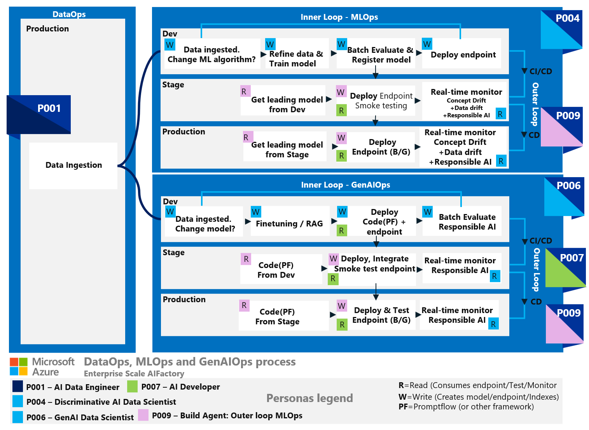
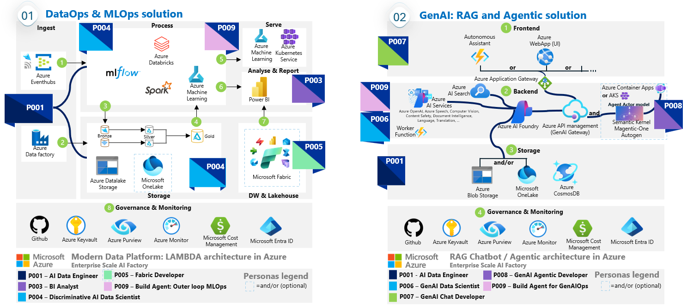
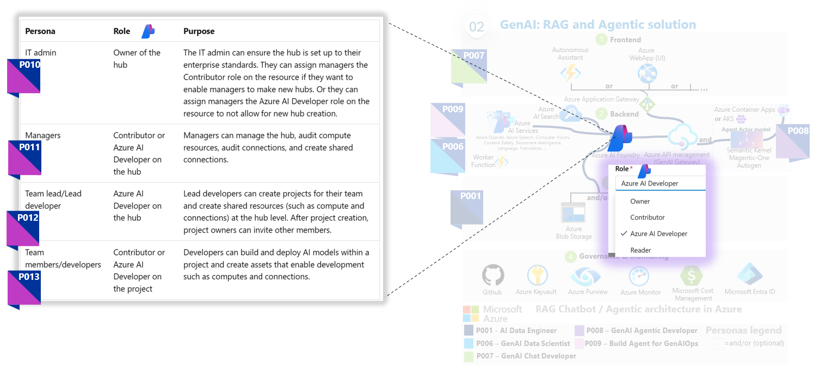

# AI Factory human-access personas

For a runnable walkthrough, start with the
[persona tutorial and offline inspection](../../../environment_setup/aifactory/bicep/personas/readme.md).

## Evidence-backed status of the legacy release

Review baseline: `main` at `3e9102ee`, 5 October 2026. This is a source review,
not an inventory of a deployed tenant. Existing assignments, nested memberships,
management-group/subscription inheritance, credentials and workload identities
can make effective access broader than any template alone.

| Status | Executable evidence |
|---|---|
| Implemented and wired | `useAdGroups` changes assignment principal type to `Group`; `modules/resourceGroupRbacUsers.bicep` assigns the supplied human list project-RG roles; `modules/storageRbacUsers.bicep` grants account-level Blob/File/Queue data roles to that list. |
| Implemented and wired | `modules/kvRbacAssignments.bicep` grants humans **Key Vault Secrets User** (GET/LIST); service principals and managed identities receive **Secrets Officer**. `esml-util/project_lake_access.py:apply` provisions common-lake project ACLs, called by `scripts/Invoke-ProjectLakeAccess.ps1` and ADO/GHA project pipelines. |
| Partially implemented | `esml-util/32-create-azure-groups.sh:create_group` creates legacy groups and `store_group_id_in_keyvault` publishes `group-prjNNN-pNNN`. Its historical path does not safely discover duplicates or protect an existing ID from replacement. |
| Partially implemented | `bootstrap/lib/create-new-aifactory-scaleset.sh:aif_ensure_team_group` supports team-group reuse, but `bootstrap/lib/aifactory_scaleset_config.py` repeats one team-group ID across five project and three core slots. That is not distinct persona authorization. |
| Documented only | The old persona-labelled configuration arrays and service tables below do not implement nine independently mapped roles. `modules/common/CmnAIfactoryNaming.bicep:74-75` derives `p011_genai_team_lead_array` from `technicalAdminsObjectID`; `esml-genai-1/08-rbac-security.bicep` consumes that list. Renaming a persona does not change a permission. |
| Missing from the baseline | Nine-persona lifecycle reconciliation; protected scope-bound seeded discovery; automatic distinct core-team coverage of every project; the exact four-operation secret baseline; and migration-enforced AI-developer-only lake authorization. |

Paths in this table are relative to `environment_setup/aifactory/bicep` unless
prefixed with `bootstrap`. See also
[`resourceGroupRbacUsers.bicep`](../../../environment_setup/aifactory/bicep/modules/resourceGroupRbacUsers.bicep),
[`storageRbacUsers.bicep`](../../../environment_setup/aifactory/bicep/modules/storageRbacUsers.bicep),
[`kvRbacAssignments.bicep`](../../../environment_setup/aifactory/bicep/modules/kvRbacAssignments.bicep),
and [`project_lake_access.py`](../../../environment_setup/aifactory/bicep/esml-util/project_lake_access.py).

**Release verdict:** `RELEASE_125.md` lists "Entra group personas" as inherited
functionality, not a new v1.25 feature. `ROADMAP_MAIN.md` explicitly says persona
labels alone are not policies. The narrow claim of Entra-group RBAC support is
accurate; interpreting it as a complete, distinct persona access model is not.
The older tables below overstate executable persona-specific wiring.

### What "default project access" actually meant

There is no single tenant-independent default. In the phased GenAI route, the
supplied `technicalAdminsObjectID` list normally receives project-RG Contributor,
Azure AI User, Azure AI Project Manager, Cognitive Services User, AI Inference
Deployment Operator, AzureML Data Scientist, workspace-connection secret reader
and AcrPush. Unless disabled, it also receives conditional Role Based Access
Control Administrator (`resourceGroupRbacUsers.bicep:171-205`). The condition
excludes granting Owner, User Access Administrator and RBAC Administrator; it
does **not** prevent granting other powerful roles or data access. Project
storage receives account-level data roles, which cannot be restricted by ADLS
ACLs when RBAC already authorizes the operation.

Common-lake onboarding separately grants project ACLs, including ancestor
traversal and defaults. The legacy modern-layout implementation traverses and
grants the entire project root, not only one environment leaf. Older manual
`addUserAsProjectMember*` routes additionally grant project/dashboard Contributor,
VM Administrator Login and common-network/Bastion permissions at their configured
scopes. These routes are not identical to phased GenAI RBAC.

Key Vault also varies: modern project RBAC grants human secret GET/LIST; the
manual `25-add-users-to-kv-get-list-access-policy.ps1:39-42` grants project humans
GET/LIST and core-team humans GET/LIST/SET. Common infrastructure
`esml-common/main/13-rgLevel.bicep:737-741` also uses a secret `all` policy at
selected call sites. There is **no uniform four-operation human baseline**.
`groups-v1` deliberately implements the requested GET/LIST/SET/DELETE contract:
this is broader than existing read-only project-vault access, but narrower than
secret `all`. The Secrets
Officer role is **not** an exact GET/LIST/SET/DELETE substitute: its secret wildcard
includes backup, restore, recover and purge. Comments suggesting otherwise do
not narrow the Azure role definition. Access-policy vaults and RBAC vaults use
different authorization modes; writing an inactive policy does not establish
effective access.

## Opt-in nine-persona model (`groups-v1`)

This model is an **unreleased opt-in source feature**, not a claim of live-tenant
certification. `persona_access_mode` defaults to `legacy`. Adopting the new model
requires a reviewed `persona_access_manifest` as well as updated provisioning
scripts and pipelines. Never enable it by merely placing new groups into old
`technical_admins_ad_object_id` or positional persona arrays.

### Human permission matrix

The executable policy catalogue and role definitions live in
[`personas/`](../../../environment_setup/aifactory/bicep/personas).
Custom roles intentionally replace broad built-ins where those include unwanted
credential, access-management or secret operations. Resource visibility is not
data authorization.

| Stable ID | Persona | Management-plane boundary | Data-plane boundary |
|---|---|---|---|
| `persona200` | Super admin | Owner on explicitly registered common, connectivity and project RGs; can grant/revoke Azure permissions there. No Entra administration is implied. | Project-admin-equivalent secret operations; a privileged administrator who can grant additional data access, not an ordinary isolated project user. |
| `persona201` | Core team | Contributor on registered common/project RGs; no connectivity grants or unrestricted Azure access administration. Every project also receives the project-admin baseline. | Same project secret baseline; common-resource administrators remain trusted for storage/workload administration. |
| `persona210` | Project member | Broad project-resource management with explicit exclusions for Azure access administration, storage credentials/mutations, vault management and identity-assignment paths. | Exact project-vault secret GET/LIST/SET/DELETE and the safe project AI service-data bundle described below. No source-lake data rights. |
| `persona211` | Project admin | Project member plus project resource-lock creation/removal. Member retains deployment and monitoring operations. Not Owner, User Access Administrator or RBAC Administrator. | Same secret baseline; no source-lake access merely by being an admin. |
| `persona212` | Front-end developer | Project Web/Functions/App Service, Container Apps and API Management operations, not common/shared gateway administration. | Secret baseline and non-data foundational visibility; no source-lake access. |
| `persona213` | AI developer | Project Container Apps, Search, Foundry/Cognitive Services (including Speech/Vision), APIM and Azure ML management. | Secret baseline and project/environment source-lake **read-only ACLs**. Service data operations are separately listed in the executable catalogue; no broad lake data role. |
| `persona214` | Database developer | Project database-resource management for the supported SQL, PostgreSQL, Cosmos DB, Redis and Elastic providers. | Secret baseline. Database engine login/SQL grants/Cosmos data roles/Elastic privileges are separate; resource administration or credential-reset capability is not a claim of no indirect data access. |
| `persona215` | Network & Security | Network Contributor only at reviewed project-relevant subnets/NSGs or a dedicated project-RG VNet. Whole common-RG VNets and connectivity RGs are excluded. | Key Vault Administrator at project vaults: elevated secrets, keys and certificates, subject to service protection policies. No source-lake grant. |
| `persona216` | Project manager | Project visibility/cost and dashboard/Application Insights read access; required common Log Analytics workspace is explicitly scoped. | Log-query access only as listed by the catalogue. No secret values, secret writes, deployments or lake data. Workspace-scoped log access can expose other projects' logs; use a dedicated workspace if that is unacceptable. |

Built-in role identifiers used by this design: Owner
`8e3af657-a8ff-443c-a75c-2fe8c4bcb635`, Contributor
`b24988ac-6180-42a0-ab88-20f7382dd24c`, Reader
`acdd72a7-3385-48ef-bd42-f606fba81ae7`, Cost Management Reader
`72fafb9e-0641-4937-9268-a91bfd8191a3`, Network Contributor
`4d97b98b-1d4f-4787-a291-c67834d212e7`, and Key Vault Administrator
`00482a5a-887f-4fb3-b363-3b7fe8e74483`. Custom role action lists, GUID construction
and actual assignments are authoritative in `catalog.json`, `policy.py` and
`custom-roles.bicep`; the provisioning preview exposes their exact definitions
and scopes before execution.

Custom role IDs are deterministic UUIDv5 values using namespace
`cf916f48-aefd-5f72-929d-f9df85318fb4` and
`role|<lowercase resource-group ARM ID>|<role key>`. Role keys include `member`,
`admin`, `frontend`, `ai`, `database`, `vault-secrets`, `workspace-observer` and
service-data roles in the catalogue. Each definition's assignable scope is its
owned RG; role-assignment scope is still the narrower target where applicable.
The preview returns concrete GUIDs rather than asking operators to invent them.

Project admin's exact increment is `Microsoft.Authorization/locks/read`,
`Microsoft.Authorization/locks/write` and `Microsoft.Authorization/locks/delete`
at the project RG. It can protect/unprotect project resources against accidental
changes, but cannot change role assignments, storage authorization or vault
policies. Both core groups also receive the project-admin custom role on every
project; Core team's Contributor alone would not include resource-lock writes.

The shared `project-ai` service-data bundle preserves safe non-lake developer
capabilities for core groups, Project member, Project admin and AI developer.
It assigns Search Index Data Contributor
(`8ebe5a00-799e-43f5-93ac-243d3dce84a7`) at exact project Search resources, plus
custom `cognitive-inference` (33 explicitly enumerated operations) and
`foundry-agent-author` (44 explicitly enumerated operations) at applicable project
Cognitive/Foundry accounts. Agent authoring includes agents/assistants, threads,
runs, files and vector stores; it excludes connection-secret extraction and
identity-blueprint administration. The Search role includes elevated
index-content security read: do not use this bundle as a per-document end-user
security boundary. `report.service_data` lists concrete IDs, scopes and operations.

Frontend/database personas do not inherit this AI data bundle. Ordinary storage
Blob/File/Queue data roles are deliberately not preserved: isolate source data
from artifacts, queues and application stores before granting separately reviewed
workload access. The model never treats general storage visibility as permission
to read source data.

The secret baseline uses only
`Microsoft.KeyVault/vaults/secrets/getSecret/action`,
`Microsoft.KeyVault/vaults/secrets/readMetadata/action`,
`Microsoft.KeyVault/vaults/secrets/setSecret/action`, and
`Microsoft.KeyVault/vaults/secrets/delete`. It excludes recover, purge,
backup/restore, keys and certificates. A deleted secret may therefore require
Network & Security to recover it before its name can be reused.

**Compatibility differences:** the new Project member does not retain legacy
role-delegation, general storage management/data access, broad common networking,
or credential access that would defeat isolation. Human project-secret SET/
DELETE are explicitly added where the old path provided only GET/LIST. Broad
legacy access must be removed; Azure `NotActions` is not a deny against another
assignment.

### Naming and lifecycle boundaries

The old documented numeric ranges reserve 001-030, 080-090 and 100-110. The new
model avoids semantic reinterpretation of those numbers: core personas are
200-201 and project personas 210-216. Every new name ends in **`personaNNN`**,
never ambiguous `pNNN`. `groups.py:group_specs` is the single naming authority.

Core groups are factory/environment-wide and reused across scalesets. Project
groups include factory, scaleset, project and environment, so `project001` in two
scalesets does not share a group accidentally. Environment names are
`dev`/`test`/`prod`; the pipeline UI's `stage` maps to `test`. Membership across
environments must be deliberate. Stable group object IDs, not mutable names,
are the authorization subjects.

Examples: `aif--contoso--dev--persona200` and
`aif--contoso--sdc001--dev--project001--persona213`; corresponding seeding keys
are `group-aif--contoso--dev--persona200` and
`group-aif--contoso--sdc001--dev--project001--persona213`. Double hyphens separate
components and are forbidden inside factory/scaleset slugs, avoiding ambiguous
concatenation. Seed values use schema `aifactory.persona-group/v1`, binding
`tenant_id`, `factory`, `environment`, `persona`, `object_id`, `display_name`,
and additionally `scaleset`/`project` for project groups.

An Entra administrator creates or explicitly adopts ordinary assigned-membership
security groups, then publishes scope-bound JSON records to the seeding vault.
Discovery and creation are separate operations, preview is the default, duplicate
names fail, and publication cannot silently replace a different object ID.
Deployment identities read those records without Graph group-create privileges.
Neither project nor factory deletion deletes these reusable directory groups.

New common/scaleset provisioning binds the two core groups. Every project
reconciliation, including initial `project001` and all subsequent projects,
includes both core groups and all seven project groups. Assignments use stable
scope/principal/role identity; matching pre-existing grants are not silently
claimed as deployment-owned.

Subscription/RG bootstrap is privileged: an RG-scoped role cannot create sibling
RGs or confer subscription-wide rights. A separately authorized bootstrap/
deployment identity creates the reviewed RGs and performs authorized role
assignments. Core operators may trigger this governed process without becoming
Entra administrators. Do not grant subscription Owner merely to resolve a
pipeline authorization failure.

### Additive membership and data trust boundary

| Membership | Effective result |
|---|---|
| Core team plus any project persona | Union of core and project rights; no project group restricts the core administration grant. |
| Front-end plus database developer | Both management permission sets and one effective secret baseline; still no source-lake grant. |
| Project manager plus a developer | Developer permissions remain. Manager membership does not turn the user read-only. |
| AI developer plus another project persona | Adds that project's authorized source-lake ACL access. |
| AI developer in projects 001 and 002 | Access to both authorized subtrees, not every other project. |
| Project member in 001 and AI developer in 002 | Management in 001; source-data access only in 002 unless another independently authorized membership grants more. |

Modern lake authorization is limited to
`mlops/v1/projects/projectNNN/environments/<environment>`. Only `--x` is added
on ancestors, no default ACL is added above that leaf, and the AI group receives
`r-x` on directories and `r--` on files, with defaults within the leaf.
Legacy `projects/projectNNN` paths require a separately isolated per-environment
lake. Existing ACLs/defaults, ownership and mask expansion are audited before
writes; unrelated project paths are never automatically rewritten.

Read-only source access is intentional: an ADLS writer can own new files and
change their ACLs. Trusted ingestion identities own/write the source tree instead.
Use a separately governed output/artifact store for development writes; do not
silently make the protected source lake writable to solve a workload failure.
Account/container Blob Data Reader/Contributor/Owner is not assigned to ordinary
persona groups because an authorizing RBAC grant bypasses folder ACLs.

Shared Key and public blob access must be explicitly disabled. Retire account/
service SAS, rotate exposed credentials and revoke historical user-delegation
keys as part of the separately reviewed migration. The reconciler does not
silently rotate keys or grant itself a temporary data-owner role. It audits the
filesystem with a bounded path limit (100,000 by default; reviewed
`lake.max_audit_paths` up to 1,000,000); exceeding the limit stops before ACL
writes rather than claiming a partial audit is sufficient.

**The privileged boundary remains real.** Super admins, common-resource
administrators, directory membership administrators and isolated ingestion
operators can change access. Ordinary workload administrators can execute code
as an already attached workload identity. A trusted lake identity attached to a
project-controllable resource is therefore an adoption blocker. Review child
compute identities, external connections, service credentials and deployment
agents too; generic ARM inventory cannot prove the absence of every service's
indirect credential path. No lake credentials may be stored in the project
vault or application settings readable by non-AI personas. Derived data copied
to Search, databases or applications needs its own authorization policy.

Nested Entra memberships and existing user/management-group/subscription grants
must be reviewed by the authorized operator. The normal pipeline deliberately
does not require Graph membership administration. Use PIM/time-bound privileged
membership, approval-protected infrastructure pipelines, Conditional Access,
Key Vault/storage diagnostics and periodic access reviews. Changes to membership
and cached tokens require propagation before effective-access testing.

### Adoption, migration and rollback

Keep `persona_access_mode: "legacy"` until a deliberate adoption is approved.
Create one manifest per project/environment and select it explicitly through
`persona_access_manifest`; a dev manifest cannot authorize a test/prod run.
Existing factory consumers need the updated Purple scripts and copied ADO/GHA
pipeline templates together. A Python API/desktop installer or another
repository pinned to the old Purple snapshot is **not updated by local edits**.
Pink API and MAUI packaging/version propagation are external dependencies.

Supported local paths include the copied Azure DevOps/GitHub common and phased
project workflows (including AML through those workflows), legacy-layout
bootstrap, and the registered configuration/prerequisite/scoped-worker adapters.
Registered workers freeze the persona manifest from the **reviewed consumer
commit**, sanitize legacy human parameters before plan hashing, reconcile after
successful ARM provisioning, and retain the report in the worker receipt.
Only one project manifest is accepted per registered operation; split multi-project
runs. Connectivity grants require their own exact registered scope locks or a
separately reviewed common-access operation.

The separate creation API must advertise **`persona-groups-v1`**. Its server
implementation is outside Purple and was not changed here; unsupported API
versions fail closed. The direct old `esml-project/22-main.bicep` route is also
blocked for `groups-v1`: use the phased project route, not an attempt to mix new
groups with legacy broad assignments. Explicit dashboard/network resources in
an existing-deployment manifest must exist before its security preflight; add
new resources and their permission scope through an approved staged deployment.

1. Inventory every old human group/user assignment, eligible/PIM/transitive
   membership, vault policy, lake ACL/default/owner, shared credential, SAS and
   developer-controllable workload identity. Include assignments inherited from
   subscriptions and management groups. Prefer fresh persona groups rather than
   reusing a broad legacy principal.
2. An authorized directory administrator creates/resolves all nine groups and
   publishes the bound IDs to an existing, reachable seeding vault. Runtime
   consumes the vault records without Graph. Serialize bootstrap runs: Entra
   names are not unique and Key Vault secret publication is not an atomic
   compare-and-swap across independent administrators.
3. Preview the new common/project model. Disable Shared Key/public blobs on the
   source lake through a separately reviewed infrastructure update, isolate
   ingestion identities, migrate project vaults to RBAC deliberately, and remove
   conflicting common-vault policies. Do not flip a vault authorization mode
   without separately preparing legitimate workload access.
4. Record legacy identities in `adoption.legacy_principal_ids`. Exact
   `approved_role_assignment_ids` and `adoption.execute_migration: true` authorize
   only the supported, validated owned-project assignment removals. Inherited/
   shared/common access remains a manual, separately scoped operator action.
   Approved named legacy ACL entries can be removed only inside the target
   environment leaf using `approved_acl_principal_ids`; parent/sibling ACLs,
   `other`, owning-group permissions and file ownership need explicit remediation.
5. Complete the three `security_review` checks:
   `workload_identities_and_secrets_reviewed`,
   `transitive_membership_reviewed`, and `legacy_credentials_reviewed`.
   These are operator attestations, not claims that offline templates can inspect
   the directory or all credential paths. Keep all false until actually reviewed.
6. Run reviewed common and project provisioning, inspect the report, then perform
   real positive/negative authorization probes with distinct test users. Refresh
   tokens after propagation. Expand to other projects/scalesets only after the
   first project behaves as intended.

The runtime rejects bare legacy `group-prjNNN-pNNN` values and positional arrays
as new persona metadata. An explicit bootstrap `groups` mapping adopts a group
only under its canonical new name; an administrator must separately review and
rename a historical group before adoption. Never put a new seeded persona group
in the legacy-removal list. No automatic group renaming, membership edits or
object-ID replacement is performed.

**Rollback is fail-closed:** retain the new groups, bound seeding metadata and
restricted grants while reverting workload changes. Do not automatically restore
legacy Contributor, RBAC Administrator, storage keys or broad lake roles. The
`AIF-Persona-Access` RG marker guards against accidental return to legacy
provisioning through the supported bridge. Restrict access to that marker and
configuration: privileged operators can alter it. Delete only assignments
positively identified as deployment-owned, not matching grants adopted from
another owner. Resource deletion removes resource-scoped Azure assignments;
reusable Entra groups are preserved.

There is no automated receipt-bound deprovision command in this implementation.
Deleting a project RG is **not complete human offboarding**: grants and ACLs on
surviving common resources can remain. Review the stored assignment/ACL report,
remove only approved project-owned entries, and retain shared/adopted access.
Disable/remove group memberships through the authorized Entra process when access
must be withdrawn immediately; do not delete the reusable groups.

### Configuration and operator commands

Start from [`manifest.example.json`](../../../environment_setup/aifactory/bicep/personas/manifest.example.json).
Its GUIDs, names and scopes are **fictional**. Replace every tenant/resource value,
identify trusted ingestion/provisioning principals explicitly, and keep review
flags false until the review is complete. Store a reviewed copy in the consumer
repository, for example `access/dev-project001.json`. Manifest paths are literal
repository-relative paths, not templates with expanded placeholders.

Merge these selectors into the full deployment `variables.json`:

```json
{
  "dev": {
    "persona_access_mode": "groups-v1",
    "persona_access_manifest": "access/dev-project001.json",
    "project_number_000": "001"
  },
  "test": {
    "persona_access_manifest": "access/test-project001.json"
  },
  "prod": {
    "persona_access_manifest": "access/prod-project001.json"
  }
}
```

The selection order is `dev` baseline, then `stage_prod` for non-dev, then the
exact `test`/`prod` section. Change the manifest together with the project number
when provisioning a subsequent project. Scope/environment mismatches stop before
deployment; the bridge never infers which similarly named group to use.

From the consumer repository, these commands are **read-only previews** but
require the caller's existing Azure authentication and network reachability:

```powershell
$personas = ".\azure-enterprise-scale-ml\environment_setup\aifactory\bicep\personas"
python "$personas\groups.py" --manifest .\access\dev-project001.json --operation discover
python "$personas\groups.py" --manifest .\access\dev-project001.json --operation create
python "$personas\pipeline.py" --config .\aifactory\variables.json --environment dev --scope project --phase preflight --format json
```

Only an explicitly authorized Entra administrator should append `--execute` to
the reviewed `groups.py` operation: `discover --execute` publishes existing
groups, whereas `create --execute` can create missing groups before publication.
The compatibility shell entrypoint accepts `--persona-manifest` for this new
path. Its no-argument legacy path remains legacy behavior, not the idempotent
new-model contract. Do not run it accidentally during persona adoption.

`pipeline.py --phase apply` is an Azure permission-changing operation, normally
invoked by the reviewed provider pipeline after infrastructure provisioning.
It is **not a preview**. Do not run it until its exact scopes, migration removals
and required deployment permissions have been approved. Seeding-vault GET and
normal Azure access-assignment authorization do not imply Graph permissions.

### Authorization validation and operating limits

Offline pytest coverage includes policy/scopes, additive memberships, naming
collisions, seeded-ID discovery, duplicate groups, immutable publication,
idempotence, CLI failures, initial/subsequent project wiring, migration guards,
PM exclusions and AI-only ACLs. Mocked HTTP/CLI tests assert no writes on blocked
preflight. Bicep compilation checks syntax, **not** valid Azure role operation
names, current tenant policy or effective human access.

Live probes are deliberately separate:
`environment_setup/unit-tests/test-bicep/integration/test_persona_authorization.py`.
They run only with `LIVE_AZURE=1` and `PERSONA_AUTHORIZATION_CASES` pointing to a
local JSON case inventory. Each case specifies `name`, an already authenticated
`azure_config_dir`, `principal_id`, `tenant_id`, `subscription_id`, exact `url`,
token `resource`, `expected_status` (200 or 403) and `expected_error_code` for
denials. Tokens and returned secret/file content are not logged. Test requests
are read-only, reject redirects and require authorization-specific denial codes:
a firewall failure is not evidence of persona isolation.

Use separate accounts for member, admin, frontend, AI, database, network/security
and PM; add combinations of PM+developer, multiple developers, core+project and
two projects. Probe known existing source files in both own and other project/
environment folders, own secret access and PM secret denial, project dashboard/
cost/log access, and unrelated resource management denial. Independently test
SET/DELETE and prohibited purge/key/certificate operations with disposable
canary secrets in an explicitly authorized tenant exercise; the supplied GET
probe intentionally does not perform destructive operations.

**Live execution is still required before a production designation.** No local
unit test proves tenant-wide absence of nested membership, historical credentials,
privileged self-elevation, third-party service permissions, or future drift.
Database engine grants, private-endpoint reachability, billing-scope cost access,
PIM activation and service-specific AI APIs require tenant validation. Any
failure must be investigated at its actual scope, never resolved by silently
granting Owner or a storage data role.

## Historical conceptual catalogue

The following material is retained for architectural context and legacy
configuration migration. It is **not the permission contract for `groups-v1`**
and does not establish mutually exclusive memberships, privilege precedence,
or verified deployment support.

### Introduction to personas in AI
Please see section [Personas](./25-personas.md) for generic information about Personas - what it is, how to use it where the concept is explained, and its benefits such as access control, education & skilling.You can also read about personas in the Microsoft Well-architected Framework for AI, at [aka.ms/wafai](https://learn.microsoft.com/en-us/azure/well-architected/ai/personas) where the Enterprise Scale AI Factory is referenced. 

The Enterprise Scale AI Factory are using personas both to connect personas to: 
- **Processes**: Each stage in processes such as DataOps, MLOps, or GenAIOps is useful for security, educational purposes, and onboarding people to an AI project.
- **Environments**: Dev, Stage, Production - to limit access in Stage and Production for people.
- **Architecture**: Across multiple Azure services, for access control & education purposes.

## Personas: Processes (DataOps, MLOps, GenAIOps) & Environments



## Personas: Across multiple services
To connect a persona to an architectural design, you can create a graphical image that shows how Azure services are connected. This image can illustrate the flow of data and the interactions between different services. For example, you can show how data flows from Azure Data Factory to Azure Machine Learning, and how Azure DevOps is used to automate the deployment process. This visual representation can help stakeholders understand the architecture and the roles of different personas within it.

Such as the the two AI Factory project types and architectures below, of a LAMBDA architecture for Modern AI analytics in Azure, and GenAI RAG chat / agentic architecture.


## Personas: Single service



You may compare the above, with the below more elevated option: <br>
[Microsoft Learn - AI Foundry: RBAC and persona within AI Foundry](https://learn.microsoft.com/en-us/azure/ai-studio/concepts/rbac-ai-studio)

# Feature Access: Personas VS Azure Policy VS Networking restrictions
In Azure, and in the AI Factory different tools are used to restrict access for purpoeses of: Cost control, Specific LLM models, Access. 

Examples where personas is not the only tool:
- We are not using Personas to **restrict expensive SKU's**, this is done instead with **Azure Policy's**
- We are not using Personas to **restrict what models can be used and deployed** from the Azure AI Studio Model catalogue, this is done via **Azure Policy**

**POLICY: Azure Policy's can be used to restrict:**
- **What compute SKU's** can users provision in Azure Machine learning. Assign Azure policy on landingzone scope (e.g. retstrict expensive SKU's)
- **What models** uses are allowed to use in Azure AI Foundry model catalogue. Assign Azure policy to restrict this if needed.

**NETWORKING: IP rules and Network Security Groups, to restrict access**
- **What environment** can talk to each other: The AIFactory does not allow a workload going from DEV to PRODUTION. DEV can only move a workload to STAGE. STAGE to PRODUCTION.
- **AI Foundy HUB vs AI Foundry project** Users not allowed to reach the Azure AI Foundry Hub, can be disallowed access via Networking rules, as well as via RBAC, for persona `aif001sdc_prj002_genai_team_member_aifoundry_p012` only to reach their project.

# Data Access - ACL
The AI Factory has an enterprise scale datalake, with [RBAC on ACL level described here](../10-19/12-permissions-users-ad-sps.md), for core team, project team, and build agents

# Services Access: Default Personas (security & access for project types)

The IaC acceleration in Enterprise Scale AI Factory, creates a baseline of personas to have more granualar access within the `project team` and `core team`.
These personas are effective `across services`, and `across environments`.

To see built roles needed for `one specific service`, such as Azure AI Foundry, and the specific scenario such as RAG *on your data*, the [official Microosft docs](https://learn.microsoft.com/en-us/azure/ai-studio/concepts/rbac-ai-studio) with *least privileage access* is applied in the AI Factory

Here you see the configuration file, how to connect your own Microft EntraID security groups, to these default personas used `across services`, and `across environments`.

```yaml

  # ENTRA ID SECURITY GROUPS - Object ID's (Create a new set of AD groups per project team. 001,002, etc)
  groups_project_members_esml: "<aif001sdc_prj001_team_lead_p001>,<aif001sdc_prj001_team_member_ds_p002>,<aif001sdc_prj001_team_member_fend_p003>" #[GH-Secret] 3 groups of users. All except p001 group can be empty groups.
  groups_project_members_genai_1: "<aif001sdc_prj002_team_lead_p011>,<aif001sdc_prj002_genai_team_member_aifoundry_p012>,<aif002sdc_prj001_genai_team_member_agentic_p013>,<aif001sdc_prj001_genai_team_member_dataops_p014>,<aif001sdc_prj001_team_member_fend_p015>" #[GH-Secret] 5 groups. All except p011 group can be empty groups. ObjectID for Entra ID security groups in a commas separated list, without space
  groups_coreteam_members: "<aif001sdc_coreteam_admin_p080>,<aif001sdc_coreteam_dataops_p081>,<aif001sdc_coreteam_dataops_fabric_p082>" #[GH-Secret] 3 groups. All except p080 group can be empty groups.

  # PERSONAS (001-010 are reserved for ESML, 011-020 for GenAI-1, 021-030 for GenAI-2, 080-090 for CoreTeam. 100-110 for Service Principals)
  personas_project_esml: "p001_esml_team_lead,p002_esml_team_member_datascientist,p003_esml_team_member_front_end,p101_esml_team_process_ops" # 4 Personas where first 3 contains users. The 4th is of type Service Principal.
  personas_project_genai_1: "p011_genai_team_lead,p012_genai_team_member_aifoundry,p013_genai_team_member_agentic,p014_genai_team_member_dataops,p015_genai_team_member_frontend,p102_esml_team_process_ops" # 6 Personas where 5 contain users. 
  personas_core_team: "p080_coreteam_it_admin,p081_coreteam_dataops,p082_coreteam_dataops_fabric, p103_coreteam_team_process_iac,p104_coreteam_team_process_ops" # 4 Personas, whereof first 3 contains users. The 4th is a service principal. These personas are mapped to group_coreteam_members

```

> [!NOTE]
> If no personas are connected by user configuration, the default `project team`, `core team` personas is used.

# Core Team (`080-090`)
Personas `080-090` are reserved for the `core team`. The personas, will get permission via BICEP on both service-level, across serices, and at resource group level.

## Resource group - COMMON:

Below the built-in Azure roles is seen that `Core team` members are assigned, on the common resource group level:
- **Contributor**
- **AcrPush**
- (**Virtual Machine Administrator Login**): *Sign on on VM via Bastion* (If Bastion access is set to be included)

## Resource group - PROJECT SPECIFIC:
Below the built-in Azure roles is seen that `Core team` members are assigned, on the project specific resource group level:
- **Contributor**
- **AcrPush**
- **Virtual Machine Administrator Login**

## Across services: Core Team
Persona group| Persona|Services|Purpose|Scenarios|Link to education|Environment
|---|---|---|---|---|---|---|
|**Core Team**|`p080_coreteam_it_admin`|[Azure Eventhubs](), [Azure Data factory](),[Fabric Data factory](), [Azure Datalake Gen2](), [Key vault - CmnAdmin ](),[Key vault - Cmn](),[Container Registry - Cmn](), [Log Analytics Workspace](), [Networking - Limited access]() <br> + [ESML Services - p001]() + [GenAI Services - p011]() |Same as 2019 persona `core team`, e.g. Governance of AI factory. Access to the `common area` of the AIFactory + optionally one assinged project, for DataOps purpose. | Configure & Trigger IaC pipelines, DataOps, MLOps, GenAIOps, RAG, Agentic |[Microsoft Learn](https://learn.microsoft.com/en-us/azure/ai-services/openai/concepts/use-your-data?tabs=ai-search%2Ccopilot)|Dev|
|↓ /DataOps|`p081_coreteam_dataops`|[Azure Eventhubs](), [Azure Data factory](), [Azure Datalake Gen2](), [Key vault - Cmn]() <br> + [ESML Services - p001]()| DataOps purpose. Have access to `kv-cmnadm keyvault` with info on data sources and `kv-cmn keyvault` to access the MASTER folder structure in the datalake, and projects IN-folder. Can read from data source, and write to MASTER folder, and projects IN folder. Purpose: Bootstrap  projects with data in their datalake projectIN-folder.| DataOps |[Microsoft Learn](https://learn.microsoft.com/en-us/azure/ai-services/openai/concepts/use-your-data?tabs=ai-search%2Ccopilot)|Dev |
|↓/DataOpsFabric|`p082_coreteam_dataops_fabric`|[Azure Eventhubs](), [Fabric Data factory](), [Azure Datalake Gen2](), [Key vault - Cmn]() <br> + [ESML Services - p001]()| DataOps purpose. Have access to `kv-cmnadm keyvault` with info on data sources, and `kv-cmn keyvault` to access the MASTER folder structure in the datalake,and projects IN-folder. Can read from data source, and write to MASTER folder, and projects IN folder. Purpose: Bootstrap  projects with data in their datalake projectIN-folder.| DataOps |[Microsoft Learn](https://learn.microsoft.com/en-us/azure/ai-services/openai/concepts/use-your-data?tabs=ai-search%2Ccopilot)| Dev |
|**Build Agent**|`p103_coreteam_team_process_iac`|[Github Action]() or [Azure Devops - pipeline/service connetion]() |Service Principle for `core team` IaC activitites - Automation of AI factory. OWNER access for subscriptions of the AIFactory, to automate IaC provisioning.Have access to `seeding keyvault` to copy project related information  | IaC pipelines |[Microsoft Learn](https://learn.microsoft.com/en-us/azure/devops/pipelines/agents/agents?view=azure-devops&tabs=yaml%2Cbrowser)|Stage,Prod |
|**Build Agent**|`p104_coreteam_team_process_ops`|[Azure Eventhubs](), [Azure Data factory]() / [Fabric Data factory](), [Azure Datalake Gen2](), [Key vault - Cmn]() <br> + [ESML Services - p001]()| DataOps purpose.Have access to `kv-cmnadm keyvault` and `kv-cmn keyvault` with info on data sources and datalake. This is a Service Principle/process used for BuildAgent/Processes to automate `core team` tasks, to bootstrap the projects with data in their datalake project folder.| DataOps, Monitoring & Alerting |[Microsoft Learn WAF AI - MLOps & GenAIOps](https://learn.microsoft.com/en-us/azure/well-architected/ai/mlops-genaiops)| Stage,Prod |

# Project Team: ProjectType GenAI (Personas: `011-020`)

Personas `011-020` are reserved within the main persona `project team` and the project type `GenAI-1`. The personas, will get permission via BICEP on both service-level, across serices, and at resource group level.

## Resource group - COMMON Services:

Built-in Azure roles (most personas) for `Project team` members, on the common service level, in the common resource group:
- **Azure Container Registry: Reader**: *access to the common Azure container registry*
- **Azure Container Registry: AcrPush**: *access the common Azure container registry*
- **Azure Datalake Gen2 - project folder: ACL**: *acccess the project specific folder* [Read more about ACL (Read,Write, Execute)](../10-19/12-permissions-users-ad-sps.md)

## Resource group - PROJECT SPECIFIC:
Built-in Azure roles (most personas) for `Project team` members, on the resource group level:
- **Reader**: *access to the Azure AI foundry hub and project.
- **AcrPush**: *push container images to an Azure Container Registry*

Some *persona specific* built-in roles, will also be assigned on resource group level.  Example of persona `p011_genai_team_lead`:
- **Azure AI Inference Deployment Operator**: *Grants permission to create resource deployments for AI inference.*
- **Azure Machine Learning Workspace Connection Secrets Reader**:  *Grants permission to read secrets from workspace connections. Used when deploying machine learning models that need to access external services securely.*
- **AzureML Data Scientist**: *permissions to perform data science tasks within the AI project /workspace. Cannot create or delete compute resources and modifying the workspace itself*
- **Role Based Access Control Administrator**: *For administrators to assign roles, but does not allow managing access through other methods like Azure Policy*
- **Virtual Machine Administrator Login**: *Sign on on VM via Bastion*

## Across services: GenAI
Each persona has access to **multiple** Azure services, to be able to work in various use cases and scenarios.

Persona group| Persona|Services|Purpose|Scenarios|Link to education|Environment
|---|---|---|---|---|---|---|
|**Project Team**|`p011_genai_team_lead`|[Azure AI hub](#service-ai-foundry),[Azure AI project](),[Application Insights](),[Azure AI services](),[Machine learning online endpoint](),[Key vault](),[Container Registry - Cmn/Prj](), [*Search service*](),[Storage account 1](),[Storage account 2](), [Azure Datalake Gen2 - project folder]()| Project onboarding & AI Foundry HUB management. GenAI tools. Access to `project keyvault` with info on GenAI services.| GenAIOps, RAG, Agentic, Finetuning |[Microsoft Learn: WAF AI](https://learn.microsoft.com/en-us/azure/well-architected/ai/)| Dev |
|↓ /AIFoundryRAGAgentic|`p012_genai_team_member_aifoundry`|[Azure AI project](#service-ai-foundry),[Application Insights](),[Azure AI services](),[Machine learning online endpoint](),[Key vault](),[Container Registry - Cmn/Prj](), [*Search service*](),[Storage account 1](),[Storage account 2](), [Azure Datalake Gen2 - project folder]()|  GenAI tools. Access to `project keyvault` with info on GenAI services. | Enable access for full RAG scenario. Azure AI foundry on your data with Azure AI Search. AI foundry Agentic, AI foundry finetuning |[Microsoft Learn: AI Foundry on your data](https://learn.microsoft.com/en-us/azure/ai-services/openai/concepts/use-your-data?tabs=ai-search%2Ccopilot)| Dev|
|↓ /UnmanagedAgenticFinetuning|`p013_genai_team_member_agentic`|[Azure Machine Learning](#service-azure-machine-learning-esml-persona-p002_esml_team_member_datascientist),[Application Insights](),[Azure AI services](),[Machine learning online endpoint](),[Key vault](),[Container Registry - Cmn/Prj](), [*Search service*](),[Storage account 1](),[Storage account 2](), [Azure Datalake Gen2 - project folder]()| GenAI tools + Unmanaged Agentic, custom finetuning. Access to `project keyvault` with info on GenAI services. |  GenAIOps, Unmanaged Agentic/Finetuning |[1)Microsoft Learn: Finetune with Azure Machine Learning](https://learn.microsoft.com/en-us/training/modules/finetune-foundation-model-with-azure-machine-learning/) [2)Github: Magentic-One/Autogen](https://microsoft.github.io/autogen/stable/user-guide/agentchat-user-guide/magentic-one.html)| Dev |
|↓ /DataOps|`p014_genai_team_member_dataops`| [*Search service - endpoint*](),[Machine learning online endpoint](),[Key vault](),[Storage account 2](), [Azure Datalake Gen2 - project folder]()| DataOps. When DataOps team `p081_coreteam_dataops` moved data to project folder, a trigger  this persona will use the new data, for either RAG or finetuning, calling pipeline/SDK. Access to `project keyvault` with info on GenAI services. | DataOps to RAG/Finetuning |[Microsoft Learn: WAF AI - Grounding data](https://learn.microsoft.com/en-us/azure/well-architected/ai/grounding-data-design)| Dev |
|↓ /FrontEnd|`p015_genai_team_member_frontend`|[Azure WebApp](https://github.com/microsoft/sample-app-aoai-chatGPT/tree/main),[Azure API Management - GenAI Gateway](), [Azure AI services - endpoint](),[Machine learning online endpoint](),[Key vault](), [Cosmos DB]()|Front end development, configuring and calling endpoints for a Chat RAG scenario, saving history in Cosmos DB. Access to `project keyvault` with info on endpoints to consume. | Front end |[Github: RAG WebApp](https://github.com/microsoft/sample-app-aoai-chatGPT/tree/main)| Dev |
|Build Agent|`p102_esml_team_process_ops`|[Azure AI project](),[Azure Machine Learning](#service-azure-machine-learning-esml-persona-p002_esml_team_member_datascientist),[Azure WebApp](https://github.com/microsoft/sample-app-aoai-chatGPT/tree/main),[Application Insights](),[Azure AI services](),[Machine learning online endpoint](),[Key vault](),[Container Registry - Cmn/Prj](), [*Search service*](),[Storage account 1](),[Storage account 2](), [Azure Datalake Gen2 - project folder]()  [Cosmos DB]()| GenAIOps purpose. Access to `project keyvault` with info on GenAI services and endpoints, using SDK and project specific storage to automate build of GenAIOps artifacts.| GenAIOps, RAG, Agentic, Finetuning, Monitoring & Alerting |[Microsoft Learn: WAF AI - MLOps & GenAIOps](https://learn.microsoft.com/en-us/azure/well-architected/ai/mlops-genaiops)| Stage, Production |

## Within services: GenAI
### Service: `Azure AI Foundry`: GenAI

Depending on persona an Azure AI Foundry Hub can be assigned the built-in roles: `Azure AI Administrator`, `Azure AI Developer`, and an Azure AI Foundry project can be assigned the built-in roles: `Azure AI Administrator`, `Azure Machine Learning Workspace Connection Secrets Reader`, `AzureML Metrics Writer (preview)`

> [!NOTE]
> In the AI Factory, we are not using the elevated `Owner` or `Contributor` role on the AI Hub (even if possible), this since the AI Factory IaC already auotomates that part. From [MS Learn - about Owner](https://learn.microsoft.com/en-us/azure/ai-studio/concepts/rbac-ai-studio#default-roles-for-the-hub) Owner: *Full access to the hub, including the ability to manage and create new hubs and assign permissions. This role is automatically assigned to the hub creator*. 
>- In the AI Factory no user can create new Hubs. Only core team, using using the IaC Automation that ensures networking & RBAC to be assigned accordingly, and that integration to other serivces (AI Search, WebApp, Storage, CosmosDB) works.

Explanation `AzureML Data Scientist` (`Azure AI Developer`)
- For now, the AI Factory setup of *AI Foundry Hub* and *AI project* only needs the `AzureML Data Scientist` built-in role to function - but the parenthesis states that since the product group have updated to use the more elevated role `Azure AI Developer`, the AI Factory will also update to that role, in near future.
    - Elevated difference: *The Azure AI Developer role is more elevated because it encompasses a wider range of actions, including the ability to create projects and manage compute resources, which are not included in the AzureML Data Scientist role*

Persona group|Persona|AI Hub roles |AI Project roles|Purpose|Env
|---|---|---|---|---|---|
|AIFactory IaC/Core team|`p080_coreteam_it_admin`|`Azure AI Administrator,Azure AI Developer`,`Azure AI Inference Deployment Operator (RG)`|`Azure AI Administrator,Azure AI Developer`,`Azure Machine Learning Workspace Connection Secrets Reader(RG)`| AIFactory IaC ensures hub is set up to their enterprise standards and assigns `p080_coreteam_it_admin` ability to manage the hub, audit compute, connections, create shared connections. Only by using the AI Factory IaC, Core team can create new Hub with 1 default AI Project project via an GenAI project - including connectiont to Azure AI Services, AI Search, and keuvaylt information bootstrapped.| Dev|
|Project Team|`p012_genai_team_member_aifoundry`|`Azure AI Developer`|`AzureML Data Scientist` (`Azure AI Developer`)| Perform all actions except create new hubs and manage the hub permissions. Create compute, and connections. HENCE: Users can interact with existing Azure AI resources such as Azure OpenAI, Azure AI Search, and Azure AI services.Build and deploy AI models within a project and create assets that enable development such as computes and connections, model deployments, RAG scenario, Finetuning|Dev|
|Project Team|`p013_genai_team_member_agentic`|`Azure AI Developer`,`Azure AI Inference Deployment Operator (RG)`|`AzureML Data Scientist` (`Azure AI Developer`),`Azure Machine Learning Workspace Connection Secrets Reader(RG)`|Perform all actions except create new hubs and manage the hub permissions. Create compute, and connections. HENCE: Users can interact with existing Azure AI resources such as Azure OpenAI, Azure AI Search, and Azure AI services.Build and deploy AI models within a project and create assets that enable development such as computes and connections, model deployments, RAG scenario, Finetuning, Agentic scenario| Dev |
|Project Team|`p014_genai_team_member_dataops`|`Azure AI Developer`,`Azure AI Inference Deployment Operator (RG)`|`AzureML Data Scientist` (`Azure AI Developer`),`Azure Machine Learning Workspace Connection Secrets Reader(RG)`| Consume connections and use the SDK to re-index for grouding RAG scenarios, or finetuning|Dev|
|Project Team|`p102_esml_team_process_ops`|`Azure AI Developer`,`Azure AI Inference Deployment Operator (RG)`|`Azure AI Developer`,`Azure Machine Learning Workspace Connection Secrets Reader(RG)`| Perform all actions except create new hubs and manage the hub permissions. For example, users can create projects, compute, and connections. Users can assign permissions within their project. HENCE: Users can interact with existing Azure AI resources such as Azure OpenAI, Azure AI Search, and Azure AI services.Build and deploy AI models within a project and create assets that enable development such as computes and connections, model deployments, RAG scenario, Finetuning |Stage, Production|

Note: Some roles are assigned on **Resource group** scope:
- AI Hub: **Azure AI Inference Deployment Operator**: *Perform all actions required to create a resource deployment within a resource group.*
- AI Project: **Azure Machine Learning Workspace Connection Secrets Reader**: *Grants permission to read secrets from workspace connections. Used when deploying machine learning models that need to access external services securely.*

Note: Below roles are **not set** explicitly for AI Foundry Hub in AI factory - due to reasons mentioned in *Not set reason*: 
- AI Hub: **Reader**: *Read only access to the hub. This role is automatically assigned to all project members within the hub*
    - **Not set reason**: Since all users in the GenAI project already has Reader on Resource group level.
- AI Hub: **Owner**:*Full access to the hub, including the ability to manage and create new hubs and assign permissions. This role is automatically assigned to the hub creator*
    - **Not set reason**: Since **too elevated access**, and since this is already automated in the AI Factory IaC pipelines. No end-users needs this access.
- AI Hub: **Contributor**: *User has full access to the hub, including the ability to create new hubs*
    - **Not set reason**: Since **too elevated access**, and since this is already automated in the AI Factory IaC pipelines. No end-users needs this access.

[Microsoft docs](https://learn.microsoft.com/en-us/azure/ai-studio/concepts/rbac-ai-studio#default-roles-for-the-hub)

### Service: `Azure AI Search`: GenAI

Persona group|Personas|Roles|Purpose|Environment
|---|---|---|---|---|
|Project Team|`p011_genai_team_lead`,`p012_genai_team_member_aifoundry`, |`Search Index Data Contributor`,`Search Service Contributor`| Management: Search service and its indexes, including creating and configuring indexes, indexers, and other objects. Data operations: load data into indexes, run indexing jobs, and modify index content.| Dev| 
|Project Team|`p102_esml_team_process_ops` |`Search Index Data Contributor`,`Search Service Contributor`| Management: Search service and its indexes, including creating and configuring indexes, indexers, and other objects. Data operations: load data into indexes, run indexing jobs, and modify index content.| Stage, Production |

### Service: `Azure AI Services`: GenAI

Persona group|Personas|Roles|Purpose|Environment
|---|---|---|---|---|
|Project Team|`p011_genai_team_lead`,`p012_genai_team_member_aifoundry`, |`Cognitive Services OpenAI Contributor`,`Cognitive Services OpenAI User`,`Cognitive Services Usages Reader`| Creating and fine-tuning models, uploading datasets, and viewing and querying data. Monitor quota usage and resource consumption, helping you manage and optimize your Azure OpenAI resources effectively.| Dev|
|Project Team|`p102_esml_team_process_ops` |`Cognitive Services OpenAI Contributor`,`Cognitive Services OpenAI User`,`Cognitive Services Usages Reader`| Creating and fine-tuning models, uploading datasets, and viewing and querying data. Monitor quota usage and resource consumption, helping you manage and optimize your Azure OpenAI resources effectively.| Stage, Production|

### Service: `Azure Blob Storage 1 - AI Foundry`: GenAI

Persona group|Personas|Roles|Purpose|Environment
|---|---|---|---|---|
|Project Team|`p011_genai_team_lead`,`p012_genai_team_member_aifoundry` |`Storage Blob Data Contributor`| Required for AI foundry meta data, and for AI Foundry RAG scenario | Dev |
|Project Team|`p102_esml_team_process_ops` |`Storage Blob Data Contributor`| Required for reading and writing data to the blob storage, for AI Foundry RAG scenario |  Stage, Production|

### Service: `Azure Blob Storage 2 - User Data & Fintuning`: GenAI

Persona group|Personas|Roles|Purpose|Environment
|---|---|---|---|---|
|Project Team|`p011_genai_team_lead`,`p012_genai_team_member_aifoundry` |`Storage Blob Data Owner`| Required for AI Foundry in finetuning scenario. Also for reading and writing user data to the blob storage, separated from AI Foundry meta data. | Dev |
|Project Team|`p102_esml_team_process_ops` |`Storage Blob Data Contributor`| Required for AI Foundry in finetuning scenario. Also for reading and writing user data to the blob storage, separated from AI Foundry meta data. |  Stage, Production|

### Service: `Azure Keyvault`: GenAI

Persona group|Personas|Access policys |Purpose|Environment
|---|---|---|---|---|
|Project Team|`p011_genai_team_lead`,`p012_genai_team_member_aifoundry` |`GET, LIST, SET, DELETE` | Access to project keyvault with info on endpoints, project specific artifacts| Dev |
|Project Team|`p102_esml_team_process_ops` |`GET, LIST, SET`| Access to project keyvault with info on endpoints, project specific artifacts |  Stage, Production|


# Project Team: ProjectType ESML (`001-010`)

Personas `001-010` are reserved within the main persona `project team` for project type `ESML`.

## Across services: ESML

Persona group| Persona|Services|Purpose|Scenarios|Link to education|Environment
|---|---|---|---|---|---|---|
|**Project Team**|`p001_esml_team_lead`|[Azure Machine Learning](#service-azure-machine-learning-esml-persona-p002_esml_team_member_datascientist),[Azure Data factory](),[Application Insights](),[AKS private project cluster](),[Key vault- project specific](),[Container Registry - Cmn/Prj](),[Azure Eventhubs](), [*Azure Databricks*](),[Storage account 1 - AML(R/W/E)](), [Azure Datalake Gen2 - project folder(R/W/E)](), [Managed Identity]()| Project onboarding & Azure Machine Learning management.Use various Azure ML compute (define code, train, serve models). Clone notebooks. Compute Instance creation. Compute Clusters creation. Deploy on private AKS cluster. R/W images to ACR. Access to `project keyvault` with info on services, project specific artifacts| DataOps, MLOps, Finetuning |[Microsoft Learn - MLOps:AIFactory](https://learn.microsoft.com/en-us/azure/cloud-adoption-framework/ready/azure-best-practices/ai-machine-learning-mlops?source=docs)| Dev |
|↓ /DataScientist|`p002_esml_team_member_datascientist`|[Azure Machine Learning](#service-azure-machine-learning-esml-persona-p002_esml_team_member_datascientist),[Application Insights](),[AKS private project cluster](),[Key vault- project specific](),[Container Registry - Cmn/Prj](), [*Azure Databricks*](),[Storage account 1 - AML(R/E)](), [Azure Datalake Gen2 - project folder (R/W/E)](), [Managed Identity]()| Use various Azure ML compute (define code, train, serve models). Clone notebooks. Compute Instance creation. Compute Clusters creation. Deploy on private AKS cluster. R/W images to ACR. Access to `project keyvault` with info on services, project specific artifacts| MLOps, Finetuning, |[Microsoft Learn - MLOps:AIFactory](https://learn.microsoft.com/en-us/azure/cloud-adoption-framework/ready/azure-best-practices/ai-machine-learning-mlops?source=docs)| Dev |
|↓ /Inference |`p003_esml_team_member_front_end`|[Azure Machine Learning - endpoints (batch/online)](#service-azure-machine-learning-esml-persona-p002_esml_team_member_datascientist),[Azure API Management ](),[Key vault- project specific](), [*Azure Databricks*](),[Azure Datalake Gen2 - project folder (R/W/E)](), [Managed Identity]()| Inference models, consolidate endpoints from Azure ML to API Management. Test endpoints. Access to `project keyvault` with info on endpoints, project specific artifacts| Inference & Consuming endpoints, Monitoring |[Microsoft Learn - MLOps:AIFactory](https://learn.microsoft.com/en-us/azure/cloud-adoption-framework/ready/azure-best-practices/ai-machine-learning-mlops?source=docs)| Dev |
|Build Agent|`p101_esml_team_process_ops`|[Azure Machine Learning](#service-azure-machine-learning-esml-persona-p002_esml_team_member_datascientist),[Azure Data factory](),[Application Insights](),[AKS private project cluster](),[Key vault- project specific](),[Container Registry - Cmn/Prj](),[Azure Eventhubs](), [*Azure Databricks*](),[Storage account 1 - AML(R/W/E)](), [Azure Datalake Gen2 - project folder(R/W/E)](), [Managed Identity]()| DataOps, MLOps purpose. Access to `project keyvault` with info on services and endpoints, using SDK and project specific storage to automate build of MLOps pipelines & Endpoints | DataOps, MLOps, Monitoring & Alerting |[Microsoft Learn: WAF AI - MLOps & GenAIOps](https://learn.microsoft.com/en-us/azure/well-architected/ai/mlops-genaiops)| Stage, Production |

## Within services: ESML

### Service: `Azure Machine Learning`: ESML (Persona: `p002_esml_team_member_datascientist`)

## How-to Create EntraID groups, Connect to Personas, Add info to seeding keyvault

[Ask your AI Factory core team to read this](../10-19/16-ad-groups-personas.md)
