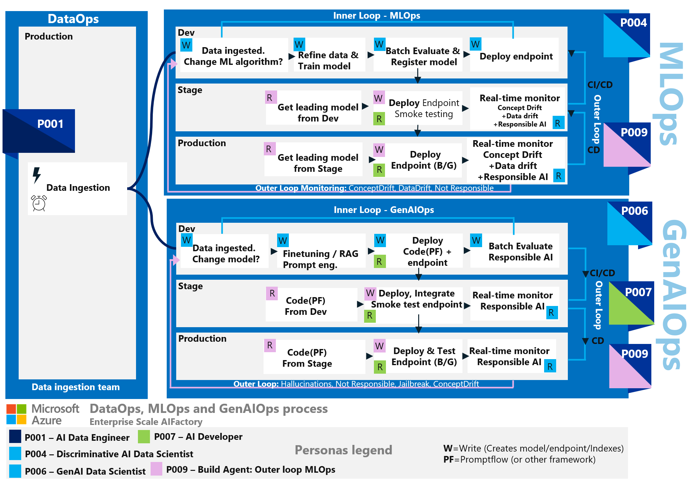
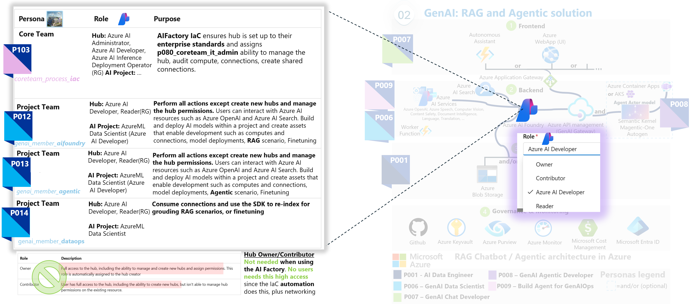

# Introduction to Personas in AI
Please see section [Personas](./25-personas.md) for generic information about Personas - what it is, how to use it where the concept is explained, and its benefits such as access control, education & skilling.You can also read about personas in the Microsoft Well-architected Framework for AI, at [aka.ms/wafai](https://learn.microsoft.com/en-us/azure/well-architected/ai/personas) where the Enterprise Scale AI Factory is referenced. 

The Enterprise Scale AI Factory are using personas both to connect personas to: 
- **Processes**: Each stage in processes such as DataOps, MLOps, or GenAIOps is useful for security, educational purposes, and onboarding people to an AI project.
- **Environments**: Dev, Stage, Production - to limit access in Stage and Production for people.
- **Architecture**: Across multiple Azure services, for access control & education purposes.

## Personas: Processes (DataOps, MLOps, GenAIOps) & Environments



## Personas: Across multiple services
To connect a persona to an architectural design, you can create a graphical image that shows how Azure services are connected. This image can illustrate the flow of data and the interactions between different services. For example, you can show how data flows from Azure Data Factory to Azure Machine Learning, and how Azure DevOps is used to automate the deployment process. This visual representation can help stakeholders understand the architecture and the roles of different personas within it.

Such as the the two AI Factory project types and architectures below, of a LAMBDA architecture for Modern AI analytics in Azure, and GenAI RAG chat / agentic architecture.


## Personas: Single service



You may compare the above, with the below more elevated option: <br>
[Microsoft Learn - AI Foundry: RBAC and persona within AI Foundry](https://learn.microsoft.com/en-us/azure/ai-studio/concepts/rbac-ai-studio)

# Feature Access: Personas VS Azure Policy VS Networking restrictions
In Azure, and in the AI Factory different tools are used to restrict access for purpoeses of: Cost control, Specific LLM models, Access. 

Examples where personas is not the only tool:
- We are not using Personas to **restrict expensive SKU's**, this is done instead with **Azure Policy's**
- We are not using Personas to **restrict what models can be used and deployed** from the Azure AI Studio Model catalogue, this is done via **Azure Policy**

**POLICY: Azure Policy's can be used to restrict:**
- **What compute SKU's** can users provision in Azure Machine learning. Assign Azure policy on landingzone scope (e.g. retstrict expensive SKU's)
- **What models** uses are allowed to use in Azure AI Foundry model catalogue. Assign Azure policy to restrict this if needed.

**NETWORKING: IP rules and Network Security Groups, to restrict access**
- **What environment** can talk to each other: The AIFactory does not allow a workload going from DEV to PRODUTION. DEV can only move a workload to STAGE. STAGE to PRODUCTION.
- **AI Foundy HUB vs AI Foundry project** Users not allowed to reach the Azure AI Foundry Hub, can be disallowed access via Networking rules, as well as via RBAC, for persona `aif001sdc_prj002_genai_team_member_aifoundry_p012` only to reach their project.

# Data Access - ACL
The AI Factory has an enterprise scale datalake, with [RBAC on ACL level described here](../10-19/12-permissions-users-ad-sps.md), for core team, project team, and build agents

# Services Access: Default Personas (security & access for project types)

The IaC acceleration in Enterprise Scale AI Factory, creates a baseline of personas to have more granualar access within the `project team` and `core team`.
These personas are effective `across services`, and `across environments`.

To see built roles needed for `one specific service`, such as Azure AI Foundry, and the specific scenario such as RAG *on your data*, the [official Microosft docs](https://learn.microsoft.com/en-us/azure/ai-studio/concepts/rbac-ai-studio) with *least privileage access* is applied in the AI Factory

Here you see the configuration file, how to connect your own Microft EntraID security groups, to these default personas used `across services`, and `across environments`.

```yaml

  # ENTRA ID SECURITY GROUPS - Object ID's (Create a new set of AD groups per project team. 001,002, etc)
  groups_project_members_esml: "<aif001sdc_prj001_team_lead_p001>,<aif001sdc_prj001_team_member_ds_p002>,<aif001sdc_prj001_team_member_fend_p003>" #[GH-Secret] 3 groups of users. All except p001 group can be empty groups.
  groups_project_members_genai_1: "<aif001sdc_prj002_team_lead_p011>,<aif001sdc_prj002_genai_team_member_aifoundry_p012>,<aif002sdc_prj001_genai_team_member_agentic_p013>,<aif001sdc_prj001_genai_team_member_dataops_p014>,<aif001sdc_prj001_team_member_fend_p015>" #[GH-Secret] 5 groups. All except p011 group can be empty groups. ObjectID for Entra ID security groups in a commas separated list, without space
  groups_coreteam_members: "<aif001sdc_coreteam_admin_p080>,<aif001sdc_coreteam_dataops_p081>,<aif001sdc_coreteam_dataops_fabric_p082>" #[GH-Secret] 3 groups. All except p080 group can be empty groups.

  # PERSONAS (001-010 are reserved for ESML, 011-020 for GenAI-1, 021-030 for GenAI-2, 080-090 for CoreTeam. 100-110 for Service Principals)
  personas_project_esml: "p001_esml_team_lead,p002_esml_team_member_datascientist,p003_esml_team_member_front_end,p101_esml_team_process_ops" # 4 Personas where first 3 contains users. The 4th is of type Service Principal.
  personas_project_genai_1: "p011_genai_team_lead,p012_genai_team_member_aifoundry,p013_genai_team_member_agentic,p014_genai_team_member_dataops,p015_genai_team_member_frontend,p102_esml_team_process_ops" # 6 Personas where 5 contain users. 
  personas_core_team: "p080_coreteam_it_admin,p081_coreteam_dataops,p082_coreteam_dataops_fabric, p103_coreteam_team_process_iac,p104_coreteam_team_process_ops" # 4 Personas, whereof first 3 contains users. The 4th is a service principal. These personas are mapped to group_coreteam_members

```

> [!NOTE]
> If no personas are connected by user configuration, the default `project team`, `core team` personas is used.

# Core Team (`080-090`)
Personas `080-090` are reserved for the `core team`. The personas, will get permission via BICEP on both service-level, across serices, and at resource group level.

## Resource group - COMMON:

Below the built-in Azure roles is seen that `Core team` members are assigned, on the common resource group level:
- **Contributor**
- **AcrPush**
- (**Virtual Machine Administrator Login**): *Sign on on VM via Bastion* (If Bastion access is set to be included)

## Resource group - PROJECT SPECIFIC:
Below the built-in Azure roles is seen that `Core team` members are assigned, on the project specific resource group level:
- **Contributor**
- **AcrPush**
- **Virtual Machine Administrator Login**

## Across services: Core Team
Persona group| Persona|Services|Purpose|Scenarios|Link to education|Environment
|---|---|---|---|---|---|---|
|**Core Team**|`p080_coreteam_it_admin`|[Azure Eventhubs](), [Azure Data factory](),[Fabric Data factory](), [Azure Datalake Gen2](), [Key vault - CmnAdmin ](),[Key vault - Cmn](),[Container Registry - Cmn](), [Log Analytics Workspace](), [Networking - Limited access]() <br> + [ESML Services - p001]() + [GenAI Services - p011]() |Same as 2019 persona `core team`, e.g. Governance of AI factory. Access to the `common area` of the AIFactory + optionally one assinged project, for DataOps purpose. | Configure & Trigger IaC pipelines, DataOps, MLOps, GenAIOps, RAG, Agentic |[Microsoft Learn](https://learn.microsoft.com/en-us/azure/ai-services/openai/concepts/use-your-data?tabs=ai-search%2Ccopilot)|Dev|
|↓ /DataOps|`p081_coreteam_dataops`|[Azure Eventhubs](), [Azure Data factory](), [Azure Datalake Gen2](), [Key vault - Cmn]() <br> + [ESML Services - p001]()| DataOps purpose. Have access to `kv-cmnadm keyvault` with info on data sources and `kv-cmn keyvault` to access the MASTER folder structure in the datalake, and projects IN-folder. Can read from data source, and write to MASTER folder, and projects IN folder. Purpose: Bootstrap  projects with data in their datalake projectIN-folder.| DataOps |[Microsoft Learn](https://learn.microsoft.com/en-us/azure/ai-services/openai/concepts/use-your-data?tabs=ai-search%2Ccopilot)|Dev |
|↓/DataOpsFabric|`p082_coreteam_dataops_fabric`|[Azure Eventhubs](), [Fabric Data factory](), [Azure Datalake Gen2](), [Key vault - Cmn]() <br> + [ESML Services - p001]()| DataOps purpose. Have access to `kv-cmnadm keyvault` with info on data sources, and `kv-cmn keyvault` to access the MASTER folder structure in the datalake,and projects IN-folder. Can read from data source, and write to MASTER folder, and projects IN folder. Purpose: Bootstrap  projects with data in their datalake projectIN-folder.| DataOps |[Microsoft Learn](https://learn.microsoft.com/en-us/azure/ai-services/openai/concepts/use-your-data?tabs=ai-search%2Ccopilot)| Dev |
|**Build Agent**|`p103_coreteam_team_process_iac`|[Github Action]() or [Azure Devops - pipeline/service connetion]() |Service Principle for `core team` IaC activitites - Automation of AI factory. OWNER access for subscriptions of the AIFactory, to automate IaC provisioning.Have access to `seeding keyvault` to copy project related information  | IaC pipelines |[Microsoft Learn](https://learn.microsoft.com/en-us/azure/devops/pipelines/agents/agents?view=azure-devops&tabs=yaml%2Cbrowser)|Stage,Prod |
|**Build Agent**|`p104_coreteam_team_process_ops`|[Azure Eventhubs](), [Azure Data factory]() / [Fabric Data factory](), [Azure Datalake Gen2](), [Key vault - Cmn]() <br> + [ESML Services - p001]()| DataOps purpose.Have access to `kv-cmnadm keyvault` and `kv-cmn keyvault` with info on data sources and datalake. This is a Service Principle/process used for BuildAgent/Processes to automate `core team` tasks, to bootstrap the projects with data in their datalake project folder.| DataOps, Monitoring & Alerting |[Microsoft Learn WAF AI - MLOps & GenAIOps](https://learn.microsoft.com/en-us/azure/well-architected/ai/mlops-genaiops)| Stage,Prod |

# Project Team: ProjectType GenAI (Personas: `011-020`)

Personas `011-020` are reserved within the main persona `project team` and the project type `GenAI-1`. The personas, will get permission via BICEP on both service-level, across serices, and at resource group level.

## Resource group - COMMON Services:

Built-in Azure roles (most personas) for `Project team` members, on the common service level, in the common resource group:
- **Azure Container Registry: Reader**: *access to the common Azure container registry*
- **Azure Container Registry: AcrPush**: *access the common Azure container registry*
- **Azure Datalake Gen2 - project folder: ACL**: *acccess the project specific folder* [Read more about ACL (Read,Write, Execute)](../10-19/12-permissions-users-ad-sps.md)

## Resource group - PROJECT SPECIFIC:
Built-in Azure roles (most personas) for `Project team` members, on the resource group level:
- **Reader**: *access to the Azure AI foundry hub and project.
- **AcrPush**: *push container images to an Azure Container Registry*

Some *persona specific* built-in roles, will also be assigned on resource group level.  Example of persona `p011_genai_team_lead`:
- **Azure AI Inference Deployment Operator**: *Grants permission to create resource deployments for AI inference.*
- **Azure Machine Learning Workspace Connection Secrets Reader**:  *Grants permission to read secrets from workspace connections. Used when deploying machine learning models that need to access external services securely.*
- **AzureML Data Scientist**: *permissions to perform data science tasks within the AI project /workspace. Cannot create or delete compute resources and modifying the workspace itself*
- **Role Based Access Control Administrator**: *For administrators to assign roles, but does not allow managing access through other methods like Azure Policy*
- **Virtual Machine Administrator Login**: *Sign on on VM via Bastion*

## Across services: GenAI
Each persona has access to **multiple** Azure services, to be able to work in various use cases and scenarios.

Persona group| Persona|Services|Purpose|Scenarios|Link to education|Environment
|---|---|---|---|---|---|---|
|**Project Team**|`p011_genai_team_lead`|[Azure AI hub](#service-ai-foundry),[Azure AI project](),[Application Insights](),[Azure AI services](),[Machine learning online endpoint](),[Key vault](),[Container Registry - Cmn/Prj](), [*Search service*](),[Storage account 1](),[Storage account 2](), [Azure Datalake Gen2 - project folder]()| Project onboarding & AI Foundry HUB management. GenAI tools. Access to `project keyvault` with info on GenAI services.| GenAIOps, RAG, Agentic, Finetuning |[Microsoft Learn: WAF AI](https://learn.microsoft.com/en-us/azure/well-architected/ai/)| Dev |
|↓ /AIFoundryRAGAgentic|`p012_genai_team_member_aifoundry`|[Azure AI project](#service-ai-foundry),[Application Insights](),[Azure AI services](),[Machine learning online endpoint](),[Key vault](),[Container Registry - Cmn/Prj](), [*Search service*](),[Storage account 1](),[Storage account 2](), [Azure Datalake Gen2 - project folder]()|  GenAI tools. Access to `project keyvault` with info on GenAI services. | Enable access for full RAG scenario. Azure AI foundry on your data with Azure AI Search. AI foundry Agentic, AI foundry finetuning |[Microsoft Learn: AI Foundry on your data](https://learn.microsoft.com/en-us/azure/ai-services/openai/concepts/use-your-data?tabs=ai-search%2Ccopilot)| Dev|
|↓ /UnmanagedAgenticFinetuning|`p013_genai_team_member_agentic`|[Azure Machine Learning](#service-azure-machine-learning-esml-persona-p002_esml_team_member_datascientist),[Application Insights](),[Azure AI services](),[Machine learning online endpoint](),[Key vault](),[Container Registry - Cmn/Prj](), [*Search service*](),[Storage account 1](),[Storage account 2](), [Azure Datalake Gen2 - project folder]()| GenAI tools + Unmanaged Agentic, custom finetuning. Access to `project keyvault` with info on GenAI services. |  GenAIOps, Unmanaged Agentic/Finetuning |[1)Microsoft Learn: Finetune with Azure Machine Learning](https://learn.microsoft.com/en-us/training/modules/finetune-foundation-model-with-azure-machine-learning/) [2)Github: Magentic-One/Autogen](https://microsoft.github.io/autogen/stable/user-guide/agentchat-user-guide/magentic-one.html)| Dev |
|↓ /DataOps|`p014_genai_team_member_dataops`| [*Search service - endpoint*](),[Machine learning online endpoint](),[Key vault](),[Storage account 2](), [Azure Datalake Gen2 - project folder]()| DataOps. When DataOps team `p081_coreteam_dataops` moved data to project folder, a trigger  this persona will use the new data, for either RAG or finetuning, calling pipeline/SDK. Access to `project keyvault` with info on GenAI services. | DataOps to RAG/Finetuning |[Microsoft Learn: WAF AI - Grounding data](https://learn.microsoft.com/en-us/azure/well-architected/ai/grounding-data-design)| Dev |
|↓ /FrontEnd|`p015_genai_team_member_frontend`|[Azure WebApp](https://github.com/microsoft/sample-app-aoai-chatGPT/tree/main),[Azure API Management - GenAI Gateway](), [Azure AI services - endpoint](),[Machine learning online endpoint](),[Key vault](), [Cosmos DB]()|Front end development, configuring and calling endpoints for a Chat RAG scenario, saving history in Cosmos DB. Access to `project keyvault` with info on endpoints to consume. | Front end |[Github: RAG WebApp](https://github.com/microsoft/sample-app-aoai-chatGPT/tree/main)| Dev |
|Build Agent|`p102_esml_team_process_ops`|[Azure AI project](),[Azure Machine Learning](#service-azure-machine-learning-esml-persona-p002_esml_team_member_datascientist),[Azure WebApp](https://github.com/microsoft/sample-app-aoai-chatGPT/tree/main),[Application Insights](),[Azure AI services](),[Machine learning online endpoint](),[Key vault](),[Container Registry - Cmn/Prj](), [*Search service*](),[Storage account 1](),[Storage account 2](), [Azure Datalake Gen2 - project folder]()  [Cosmos DB]()| GenAIOps purpose. Access to `project keyvault` with info on GenAI services and endpoints, using SDK and project specific storage to automate build of GenAIOps artifacts.| GenAIOps, RAG, Agentic, Finetuning, Monitoring & Alerting |[Microsoft Learn: WAF AI - MLOps & GenAIOps](https://learn.microsoft.com/en-us/azure/well-architected/ai/mlops-genaiops)| Stage, Production |

## Within services: GenAI
### Service: `Azure AI Foundry`: GenAI

Depending on persona an Azure AI Foundry Hub can be assigned the built-in roles: `Azure AI Administrator`, `Azure AI Developer`, and an Azure AI Foundry project can be assigned the built-in roles: `Azure AI Administrator`, `Azure Machine Learning Workspace Connection Secrets Reader`, `AzureML Metrics Writer (preview)`

> [!NOTE]
> In the AI Factory, we are not using the elevated `Owner` or `Contributor` role on the AI Hub (even if possible), this since the AI Factory IaC already auotomates that part. From [MS Learn - about Owner](https://learn.microsoft.com/en-us/azure/ai-studio/concepts/rbac-ai-studio#default-roles-for-the-hub) Owner: *Full access to the hub, including the ability to manage and create new hubs and assign permissions. This role is automatically assigned to the hub creator*. 
>- In the AI Factory no user can create new Hubs. Only core team, using using the IaC Automation that ensures networking & RBAC to be assigned accordingly, and that integration to other serivces (AI Search, WebApp, Storage, CosmosDB) works.

Explanation `AzureML Data Scientist` (`Azure AI Developer`)
- For now, the AI Factory setup of *AI Foundry Hub* and *AI project* only needs the `AzureML Data Scientist` built-in role to function - but the parenthesis states that since the product group have updated to use the more elevated role `Azure AI Developer`, the AI Factory will also update to that role, in near future.
    - Elevated difference: *The Azure AI Developer role is more elevated because it encompasses a wider range of actions, including the ability to create projects and manage compute resources, which are not included in the AzureML Data Scientist role*

Persona group|Persona|AI Hub roles |AI Project roles|Purpose|Env
|---|---|---|---|---|---|
|AIFactory IaC/Core team|`p080_coreteam_it_admin`|`Azure AI Administrator,Azure AI Developer`,`Azure AI Inference Deployment Operator (RG)`|`Azure AI Administrator,Azure AI Developer`,`Azure Machine Learning Workspace Connection Secrets Reader(RG)`| AIFactory IaC ensures hub is set up to their enterprise standards and assigns `p080_coreteam_it_admin` ability to manage the hub, audit compute, connections, create shared connections. Only by using the AI Factory IaC, Core team can create new Hub with 1 default AI Project project via an GenAI project - including connectiont to Azure AI Services, AI Search, and keuvaylt information bootstrapped.| Dev|
|Project Team|`p012_genai_team_member_aifoundry`|`Azure AI Developer`|`AzureML Data Scientist` (`Azure AI Developer`)| Perform all actions except create new hubs and manage the hub permissions. Create compute, and connections. HENCE: Users can interact with existing Azure AI resources such as Azure OpenAI, Azure AI Search, and Azure AI services.Build and deploy AI models within a project and create assets that enable development such as computes and connections, model deployments, RAG scenario, Finetuning|Dev|
|Project Team|`p013_genai_team_member_agentic`|`Azure AI Developer`,`Azure AI Inference Deployment Operator (RG)`|`AzureML Data Scientist` (`Azure AI Developer`),`Azure Machine Learning Workspace Connection Secrets Reader(RG)`|Perform all actions except create new hubs and manage the hub permissions. Create compute, and connections. HENCE: Users can interact with existing Azure AI resources such as Azure OpenAI, Azure AI Search, and Azure AI services.Build and deploy AI models within a project and create assets that enable development such as computes and connections, model deployments, RAG scenario, Finetuning, Agentic scenario| Dev |
|Project Team|`p014_genai_team_member_dataops`|`Azure AI Developer`,`Azure AI Inference Deployment Operator (RG)`|`AzureML Data Scientist` (`Azure AI Developer`),`Azure Machine Learning Workspace Connection Secrets Reader(RG)`| Consume connections and use the SDK to re-index for grouding RAG scenarios, or finetuning|Dev|
|Project Team|`p102_esml_team_process_ops`|`Azure AI Developer`,`Azure AI Inference Deployment Operator (RG)`|`Azure AI Developer`,`Azure Machine Learning Workspace Connection Secrets Reader(RG)`| Perform all actions except create new hubs and manage the hub permissions. For example, users can create projects, compute, and connections. Users can assign permissions within their project. HENCE: Users can interact with existing Azure AI resources such as Azure OpenAI, Azure AI Search, and Azure AI services.Build and deploy AI models within a project and create assets that enable development such as computes and connections, model deployments, RAG scenario, Finetuning |Stage, Production|

Note: Some roles are assigned on **Resource group** scope:
- AI Hub: **Azure AI Inference Deployment Operator**: *Perform all actions required to create a resource deployment within a resource group.*
- AI Project: **Azure Machine Learning Workspace Connection Secrets Reader**: *Grants permission to read secrets from workspace connections. Used when deploying machine learning models that need to access external services securely.*

Note: Below roles are **not set** explicitly for AI Foundry Hub in AI factory - due to reasons mentioned in *Not set reason*: 
- AI Hub: **Reader**: *Read only access to the hub. This role is automatically assigned to all project members within the hub*
    - **Not set reason**: Since all users in the GenAI project already has Reader on Resource group level.
- AI Hub: **Owner**:*Full access to the hub, including the ability to manage and create new hubs and assign permissions. This role is automatically assigned to the hub creator*
    - **Not set reason**: Since **too elevated access**, and since this is already automated in the AI Factory IaC pipelines. No end-users needs this access.
- AI Hub: **Contributor**: *User has full access to the hub, including the ability to create new hubs*
    - **Not set reason**: Since **too elevated access**, and since this is already automated in the AI Factory IaC pipelines. No end-users needs this access.

[Microsoft docs](https://learn.microsoft.com/en-us/azure/ai-studio/concepts/rbac-ai-studio#default-roles-for-the-hub)

### Service: `Azure AI Search`: GenAI

Persona group|Personas|Roles|Purpose|Environment
|---|---|---|---|---|
|Project Team|`p011_genai_team_lead`,`p012_genai_team_member_aifoundry`, |`Search Index Data Contributor`,`Search Service Contributor`| Management: Search service and its indexes, including creating and configuring indexes, indexers, and other objects. Data operations: load data into indexes, run indexing jobs, and modify index content.| Dev| 
|Project Team|`p102_esml_team_process_ops` |`Search Index Data Contributor`,`Search Service Contributor`| Management: Search service and its indexes, including creating and configuring indexes, indexers, and other objects. Data operations: load data into indexes, run indexing jobs, and modify index content.| Stage, Production |

### Service: `Azure AI Services`: GenAI

Persona group|Personas|Roles|Purpose|Environment
|---|---|---|---|---|
|Project Team|`p011_genai_team_lead`,`p012_genai_team_member_aifoundry`, |`Cognitive Services OpenAI Contributor`,`Cognitive Services OpenAI User`,`Cognitive Services Usages Reader`| Creating and fine-tuning models, uploading datasets, and viewing and querying data. Monitor quota usage and resource consumption, helping you manage and optimize your Azure OpenAI resources effectively.| Dev|
|Project Team|`p102_esml_team_process_ops` |`Cognitive Services OpenAI Contributor`,`Cognitive Services OpenAI User`,`Cognitive Services Usages Reader`| Creating and fine-tuning models, uploading datasets, and viewing and querying data. Monitor quota usage and resource consumption, helping you manage and optimize your Azure OpenAI resources effectively.| Stage, Production|

### Service: `Azure Blob Storage 1 - AI Foundry`: GenAI

Persona group|Personas|Roles|Purpose|Environment
|---|---|---|---|---|
|Project Team|`p011_genai_team_lead`,`p012_genai_team_member_aifoundry` |`Storage Blob Data Contributor`| Required for AI foundry meta data, and for AI Foundry RAG scenario | Dev |
|Project Team|`p102_esml_team_process_ops` |`Storage Blob Data Contributor`| Required for reading and writing data to the blob storage, for AI Foundry RAG scenario |  Stage, Production|

### Service: `Azure Blob Storage 2 - User Data & Fintuning`: GenAI

Persona group|Personas|Roles|Purpose|Environment
|---|---|---|---|---|
|Project Team|`p011_genai_team_lead`,`p012_genai_team_member_aifoundry` |`Storage Blob Data Owner`| Required for AI Foundry in finetuning scenario. Also for reading and writing user data to the blob storage, separated from AI Foundry meta data. | Dev |
|Project Team|`p102_esml_team_process_ops` |`Storage Blob Data Contributor`| Required for AI Foundry in finetuning scenario. Also for reading and writing user data to the blob storage, separated from AI Foundry meta data. |  Stage, Production|

### Service: `Azure Keyvault`: GenAI

Persona group|Personas|Access policys |Purpose|Environment
|---|---|---|---|---|
|Project Team|`p011_genai_team_lead`,`p012_genai_team_member_aifoundry` |`GET, LIST, SET, DELETE` | Access to project keyvault with info on endpoints, project specific artifacts| Dev |
|Project Team|`p102_esml_team_process_ops` |`GET, LIST, SET`| Access to project keyvault with info on endpoints, project specific artifacts |  Stage, Production|


# Project Team: ProjectType ESML (`001-010`)

Personas `001-010` are reserved within the main persona `project team` for project type `ESML`.

## Across services: ESML

Persona group| Persona|Services|Purpose|Scenarios|Link to education|Environment
|---|---|---|---|---|---|---|
|**Project Team**|`p001_esml_team_lead`|[Azure Machine Learning](#service-azure-machine-learning-esml-persona-p002_esml_team_member_datascientist),[Azure Data factory](),[Application Insights](),[AKS private project cluster](),[Key vault- project specific](),[Container Registry - Cmn/Prj](),[Azure Eventhubs](), [*Azure Databricks*](),[Storage account 1 - AML(R/W/E)](), [Azure Datalake Gen2 - project folder(R/W/E)](), [Managed Identity]()| Project onboarding & Azure Machine Learning management.Use various Azure ML compute (define code, train, serve models). Clone notebooks. Compute Instance creation. Compute Clusters creation. Deploy on private AKS cluster. R/W images to ACR. Access to `project keyvault` with info on services, project specific artifacts| DataOps, MLOps, Finetuning |[Microsoft Learn - MLOps:AIFactory](https://learn.microsoft.com/en-us/azure/cloud-adoption-framework/ready/azure-best-practices/ai-machine-learning-mlops?source=docs)| Dev |
|↓ /DataScientist|`p002_esml_team_member_datascientist`|[Azure Machine Learning](#service-azure-machine-learning-esml-persona-p002_esml_team_member_datascientist),[Application Insights](),[AKS private project cluster](),[Key vault- project specific](),[Container Registry - Cmn/Prj](), [*Azure Databricks*](),[Storage account 1 - AML(R/E)](), [Azure Datalake Gen2 - project folder (R/W/E)](), [Managed Identity]()| Use various Azure ML compute (define code, train, serve models). Clone notebooks. Compute Instance creation. Compute Clusters creation. Deploy on private AKS cluster. R/W images to ACR. Access to `project keyvault` with info on services, project specific artifacts| MLOps, Finetuning, |[Microsoft Learn - MLOps:AIFactory](https://learn.microsoft.com/en-us/azure/cloud-adoption-framework/ready/azure-best-practices/ai-machine-learning-mlops?source=docs)| Dev |
|↓ /Inference |`p003_esml_team_member_front_end`|[Azure Machine Learning - endpoints (batch/online)](#service-azure-machine-learning-esml-persona-p002_esml_team_member_datascientist),[Azure API Management ](),[Key vault- project specific](), [*Azure Databricks*](),[Azure Datalake Gen2 - project folder (R/W/E)](), [Managed Identity]()| Inference models, consolidate endpoints from Azure ML to API Management. Test endpoints. Access to `project keyvault` with info on endpoints, project specific artifacts| Inference & Consuming endpoints, Monitoring |[Microsoft Learn - MLOps:AIFactory](https://learn.microsoft.com/en-us/azure/cloud-adoption-framework/ready/azure-best-practices/ai-machine-learning-mlops?source=docs)| Dev |
|Build Agent|`p101_esml_team_process_ops`|[Azure Machine Learning](#service-azure-machine-learning-esml-persona-p002_esml_team_member_datascientist),[Azure Data factory](),[Application Insights](),[AKS private project cluster](),[Key vault- project specific](),[Container Registry - Cmn/Prj](),[Azure Eventhubs](), [*Azure Databricks*](),[Storage account 1 - AML(R/W/E)](), [Azure Datalake Gen2 - project folder(R/W/E)](), [Managed Identity]()| DataOps, MLOps purpose. Access to `project keyvault` with info on services and endpoints, using SDK and project specific storage to automate build of MLOps pipelines & Endpoints | DataOps, MLOps, Monitoring & Alerting |[Microsoft Learn: WAF AI - MLOps & GenAIOps](https://learn.microsoft.com/en-us/azure/well-architected/ai/mlops-genaiops)| Stage, Production |

## Within services: ESML

### Service: `Azure Machine Learning`: ESML (Persona: `p002_esml_team_member_datascientist`)

## How-to Create EntraID groups, Connect to Personas, Add info to seeding keyvault

[Ask your AI Factory core team to read this](../10-19/16-ad-groups-personas.md)
