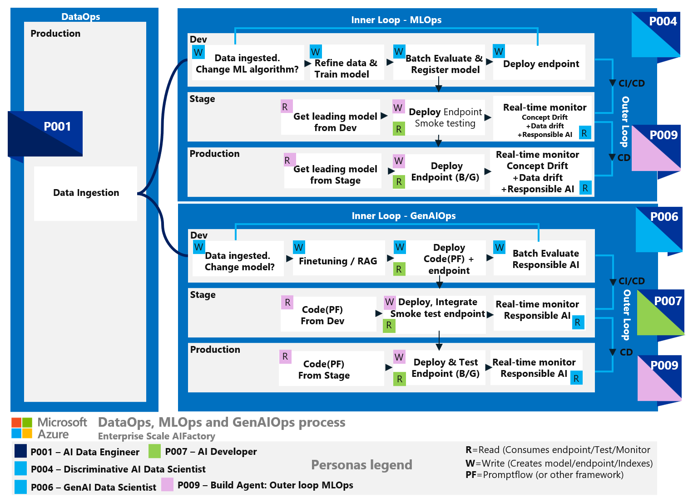
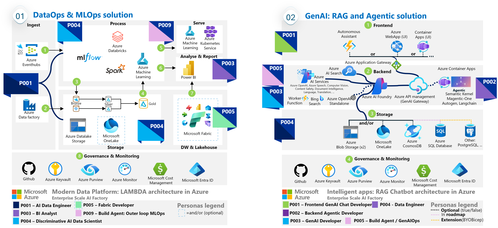
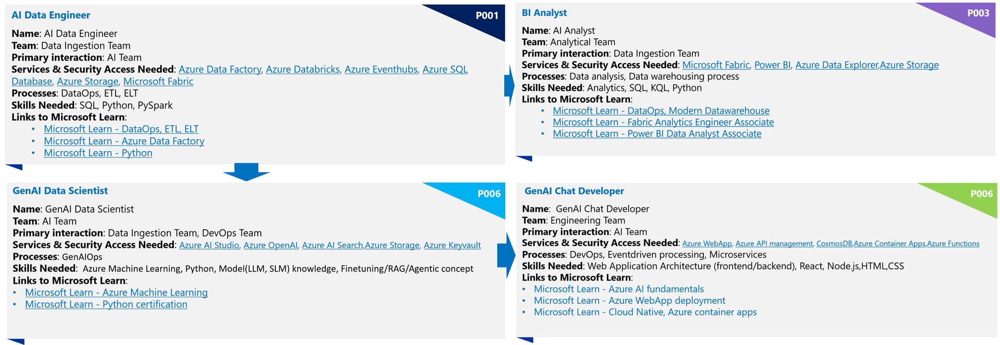

# Introduction to Personas in AI
This article describes personas and the benefits of involving personas in an architecture build. It covers examples of how you can define personas, the benfits of personas, and how to use them. It addresses how personas align with processes, organizations, and useful artifacts you may use to define your own personas, such as persona template cards, persona tables or persona graphs.

**Tools, processes, and people**. Personas can be a tool to map these entities.

You can use personas to map skilling needs to the *process* and *tools* used in the solution. Tools being Azure services and the architecture used in the solution. You can use personas to define scope of responsibility in the process to set a persona in context, and to enforce the principle of least privilege. 

Personas can also be used to find resource gaps in your project. It can be used to help in decisions if to recruit or educate *people* to cover the gap of a specific persona, or to redesign the solution, removing the persona dependency.

## What are Personas?
Personas can be described as subsets of users, reflecting not only a role but also real user behaviour and needs. One person may have one or multiple personas assigned, in different contexts. 

A persona does not need to be a person - it may be an unattended process, such as an agent process being part of the solution.

Persona compared to role: Where a role refers to a function or position in a more static sense, a persona is something a person (or agent) adopts to achieve a specific goal.

## Context of Personas in AI
This article focuses on two AI categories — discriminative AI and generative AI — and the architectures used to create custom solutions within these categories.
* **Discriminative AI**: Machine learning, Deep learning when training your own models from scratch on your data, with the goal to use AI for classification, regression, forecasting, reinforcement learning. A model to predict sales forecasting as one example.
* **Generative AI**: To use foundational models that generates content - such as a large language model to create, summarize, analyse text, or generating images or audio.

The article will connect to processes related to building custom AI such as *DataOps, MLOps in discriminative AI, GenAIOps in generative AI, Inner & Outer loop of MLOps or GenAIOps*

## Context of personas in the AIFactory

The **The AIFactory** has default personas, that are collected within the groups *CORE TEAM* and *PROJECT TEAM*. All and all to achive the overall gain of:

- **Enterprise Scaling AI** with operations for multiple TEAMS and use cases in your organization 
- **Going for PoC to Production** in an accelerated way, GenAIOps, for intelligent apps
- **Tools, Processes & People** where personas is connected with the processes (DataOps, MLOps, GenAIOps) and with the tools (Azure services and architecture)

# Benefits of Personas
Personas are typically added to user stories, features, and requirements. They offer many benefits when creating an AI solution.

1) **Find resource gaps, define responsibility, or find redesign needs:** If you do not have people in your organization that fit a persona description needed to support a **process step**, you either need to redesign the architecture, change the process, or onboard new people with that persona. Personas is a good tool to define scope of **responsibility**
2) **Education:** Mapping personas to specific **Azure services** in the architecture provides the benefits of offering **educational** sessions and online courses to upskill within.
3) **Security & Access:** Personas mapped to **processes, architectures and services** can be used to define which services they need access to in a process.
4) **Project planning & Interactions** Personas mapped to each other can be used see which personas that primarily interacts with each other, to be used to setup sync meetings and project planning.

> [!NOTE]
>   
> Example of redesigning architecture: If a *Sr developer persona* is missing, low-code options may be available, or to use SaaS, or 3rd party component software instead.
>

# How to Use Personas

1) **Mapping personas with an AI process**: Mapping which personas are needed to support what process (DataOps, MLOps, GenAIOps) provides context for the persona. Processes which a person with a specific persona, may need to be upskilled within. 
2) **Mapping the process with the AI architecture**: Mapping the process to the supporting architecture shows what services a persona needs to work with and connects the process to a part of the architecture and services. Architecture and services which a person with a specific persona, may need to be upskilled within.
3) **Map people to tools, processes, and skilling** [A persona template card](#using-persona-template-cards) can be used to define which services a persona needs access to in a process, and which skils a persona (person or agent) needs as a prerequisite.

# Connection to Processes: DataOps, MLOps, GenAIOps

Different categories of AI solutions require different processes. This section describes the processes and areas of AI that personas in this article are connected to.

1) **DataOps:** Related to data ingestion and preparation.
2) **MLOps:** MLOps: Involves the operationalization of machine learning models.
3) **GenAIOps:** GenAIOps: Pertains to generative AI processes.
3) **Inner Loop**: Refining the solution in the development environment, either in the R&D phase or caused by outer loop monitoring triggers that a solution needs improvement
4) **Outer Loop**: Process of moving from development environment to stage and production, where monitoring and continous evaluation is used to detect if improvement is nessesary.

Connecting personas to each stage in processes such as DataOps, MLOps, or GenAIOps is useful for security, educational purposes, and onboarding people to an AI project.

#### Figure - Personas and processes of DataOps, MLOps, GenAIOps

## Connecting Personas to an Architectural Design
To connect a persona to an architectural design, you can create a graphical image that shows how Azure services are connected. This image can illustrate the flow of data and the interactions between different services. For example, you can show how data flows from Azure Data Factory to Azure Machine Learning, and how Azure DevOps is used to automate the deployment process. This visual representation can help stakeholders understand the architecture and the roles of different personas within it.

Such as the architecture below, of a LAMBDA architecture for Modern analytics in Azure: 

# How to define Personas

> [!IMPORTANT]
>  The personas defined here may be seem as baseline personas, but the recommendation is to defined your own personas, using tools such as tables, persona template cards, graphs described in this section.
>  It is important to that personas fit your [processes](#connection-to-processes-dataops-mlops-genaiops), organization, and users. A custom persona, defined with a [persona template card](#using-persona-template-cards) can support this.

# How to define Identity-based RBAC to Personas
**Identity based RBAC** can be defined as links to another page, with a detailed table. All Azure services in a persona card can be linked and open a new markdown file with a table where security and role based access control is mapped to each service, in each environment (Dev, Stage, Production) of your architecture [See here for an example of such table from our MLOps accelerator](https://learn.microsoft.com/en-us/azure/architecture/ai-ml/guide/machine-learning-operations-v2#identity-rbac)

## Using a Table
A table can help organize and visualize the information for each persona. Here is an examples of how to structure a table for a persona. 

You may link the Azure services to another table where the indetity-based RBAC are specified, per service and per envrionment (Dev, Stage, Production)

The below example of tables, consists of a *project-way-of-working* in a matrix organizational type, with resource pools in a project, ending up with a product. Hence also includes *project- and product management personas*.

  >  **Tradeoff**. If you have too few personas, it becomes challenging to implement role-based access control with least privileged access and to distribute work responsibilities effectively. On the other hand, having too many personas creates additional management overhead. 5-10 personas can be a good starting point, and only add personas that you intend to use.

### Persona Table: DataOps and MLOps process with LAMBDA architecure

|Persona|Area or Team|Primary Interaction|Process|Related Architecture|Scope|Security Access on services|Security Access on Data|Skills|Link to education|
|---|---|---|---|---|---|---|---|---|---|
|AI Data Engineer(P001)|Data Ingestion Team|AI Team|ETL, ELT, DataOps|LAMBDA|Ingestion/Store of LAMBDA|[Azure Data Factory](), [Azure Databricks](), [Azure Eventhubs](), [Azure SQL Database](), [Azure Storage](), [Microsoft Fabric]()|Full access to master datalake and full access on AI project specific areas [More info]()|SQL, Python, PySpark|[Link to Microsoft Learn]()|
|Analyst Data Engineer(P002)|Data Ingestion Team|Analytical Team|ETL, ELT, DataOps|LAMBDA|Ingestion/Store of LAMBDA|[Azure Data Factory](), [Azure Databricks](), [Azure Eventhubs](), [Azure SQL Database](), [Azure Storage](), [Microsoft Fabric]()|Full access to datalake/lakehouse and full access on AI project specific datalake area [More info]()|SQL, Python, PySpark|[Link to Microsoft Learn]()|
|BI Analyst(P003)|Analytical team|Data Engineer|Data analysis, Data warehousing|LAMBDA|Process/Serving of LAMBDA|[Microsoft Fabric](), [Power BI](), [Azure Data Explorer]()|No access on master datalake/lakehouse and read access on assigned project specific areas[More info]()|Analytics, SQL, KQL, Python| [Link to Microsoft Learn]()|
|Discriminative AI Data Scientist(P004)|AI team|Data Ingestion Team, DevOps Team|MLOps|LAMBDA|Process/Store of LAMBDA, INNER loop of MLOps|[Azure Machine Learning](), [Azure Databricks](),[Azure Storage](), [Azure Keyvault]()|No access on master datalake, and full access on assigned project specific areas [More info]()|Python, Pyspark|[Link to Microsoft Learn]()|
|Discriminative AI MLOps engineer(P005)|DevOps team|Data Ingestion Team|MLOps, CI/CD|LAMBDA|OUTER loop of MLOps|[Azure DevOps](), [GitHub Actions](), [Azure Machine Learning](), [Azure Datafactory]()|No access on master datalake, and read access on assigned project specific areas [More info]()|Powershell, Python|[Link to Microsoft Learn]()|
|GenAI Data Scientist(P006)|AI team|Data Ingestion Team,Engineering team|GenAIOps|Agentic, RAG|INNER loop of GenAIOps|[Azure AI Studio](), [Azure OpenAI](), [Azure AI Search]()|No access on master datalake, and read/write access on assigned project specific areas [More info]()|Azure Machine Learning, Python, Model(LLM, SLM) knowledge, Finetuning/RAG/Agentic concept|[Link to Microsoft Learn]()|
|GenAI Chat Developer(P007)|Engineering team|AI Team|DevOps|Web Application Architecture (frontend/backend),ventdriven processing, Microservices|Full DevOps process|[Azure WebApp](), [Azure API management](), [Azure Container Apps](),[Azure Functions](),[CosmosDB]()| Read access on assigned project specific areas in datalake [More info]()|React, Node.js,HTML,CSS|[Link to Microsoft Learn]()|
|DeveloperAgent Unittest Writer(P008)|Engineering team|AI Team|DevOps|-|-|[Azure Devops](), [Github]()|No access to datalake [More info]()|Python, Pyspark|[Link to Microsoft Learn]()|
|BuildAgent MLOps(P009)|Engineering team|AI Team|DevOps|LAMBDA|Process/Serving of LAMBDA, OUTER Loop MLOps| [Azure Machine Learning](), [Azure Devops](), [Github]()|Read/Write access to specific areas in datalake [More info]()|Python, Pyspark|[Link to Microsoft Learn]()|
|Data & AI Product Manager(P010)|Product Management|Engineering Team|SCRUM Process|LAMBDA, SaaS |Monitor & Govern of LAMBDA, Full SCRUM process|[Microsoft Product](), [ProductPlan](), [ProductBoard](), [Azure Devops](), [GITHUB]()|No access to datalake [More info]()|Product Management|[Link to Microsoft Learn]()|
|Project Manager(P011)|Project Management|All teams|SCRUM Process|-|-|[Microsoft Project](), [Microsoft Planner](), [Azure Devops](), [GITHUB]()|No access to datalake [More info]()|Project management, SCRUM Master|[Link to Microsoft Learn]()|

### Persona Table: DataOps and GenAIOps process with a RAG Chat architecture

## Using Persona Template Cards
Persona template cards can also be used to define personas. These cards contain the same information as the table or a quick sumamry, and can be used to map a persona to a process, skills needed, and security access needed. To define them, you can use Microsoft Powerpoint, or as a set of markdown files.

### Powerpoint as tool
Here is an example of what a persona template card might look like. 

### Markdown files as tool
You can also use markdown as below, to define the persona template cards

### Persona Template Card: AI Data Engineer

* **Name**: AI Data Engineer (P001 | Dark Blue)
* **Team**: Data Ingestion Team
* **Primary interaction**: AI Team
* **Services & Security Access Needed**: [Azure Data Factory](), [Azure Databricks](), [Azure Eventhubs](), [Azure SQL Database](), [Azure Storage](), [Microsoft Fabric]()
* **Processes**: DataOps, ETL, ELT
* **Skills Needed**: SQL, Python, PySpark
* **Links to Microsoft Learn**:
    - [Microsoft Learn - DataOps, ETL, ELT](https://learn.microsoft.com/en-us/azure/architecture/databases/architecture/dataops-mdw)
    - [Microsoft Learn - Azure Data Factory](https://learn.microsoft.com/en-us/azure/data-factory/apply-dataops)
    - [Microsoft Learn - Python](https://learn.microsoft.com/en-us/training/paths/python-language/)

### Persona Template Card: BI Analyst

* **Name**: BI Analyst (P003 | Purple)
* **Team**: Analytical Team
* **Primary interaction**: Data Ingestion Team
* **Services & Security Access Needed**: [Microsoft Fabric](), [Power BI](), [Azure Data Explorer](),[Azure Storage]()
* **Processes**: Data analysis, Data warehousing process
* **Skills Needed**: Analytics, SQL, KQL, Python
* **Links to Microsoft Learn**:
    - [Microsoft Learn - DataOps, Modern Datawarehouse](https://learn.microsoft.com/en-us/azure/architecture/databases/architecture/dataops-mdw)
    - [Microsoft Learn - Fabric Analytics Engineer Associate](https://learn.microsoft.com/en-us/credentials/certifications/fabric-analytics-engineer-associate/)
    - [Microsoft Learn - Power BI Data Analyst Associate](https://learn.microsoft.com/en-us/credentials/certifications/data-analyst-associate/)

### Persona Template Card: Discriminative AI Data Scientist

* **Name**: Discriminative AI Data Scientist (P004 | Light blue)
* **Team**: AI Team
* **Primary interaction**:  Data Ingestion Team, DevOps Team
* **Services & Security Access Needed**: [Azure Machine Learning](), [Azure Databricks](),[Azure Storage](), [Azure Keyvault]()
* **Processes**: MLOps
* **Skills Needed**: Azure Machine Learning, Python
* **Links to Microsoft Learn**: 
    - [Microsoft Learn - Azure AI Engineer Associate](https://learn.microsoft.com/en-us/credentials/certifications/azure-ai-engineer/?practice-assessment-type=certification)
    - [Microsoft Learn - MLOps End-2-End with Azure machine learning](https://learn.microsoft.com/en-us/training/paths/build-first-machine-operations-workflow/)
    - [Microsoft Learn - Azure Machine Learning](https://azure.microsoft.com/en-us/solutions/ai/data-scientist-resources/)
    - [Microsoft Learn - Python certification](https://learn.microsoft.com/en-us/training/paths/python-language/)

### Persona Template Card: GenAI Data Scientist

* **Name**: GenAI Data Scientist (P006 | Light blue)
* **Team**: AI Team
* **Primary interaction**:  Data Ingestion Team, DevOps Team
* **Services & Security Access Needed**: [Azure AI Studio](), [Azure OpenAI](), [Azure AI Search](),[Azure Storage](), [Azure Keyvault]()
* **Processes**: GenAIOps
* **Skills Needed**: Azure Machine Learning, Python, Model(LLM, SLM) knowledge, Finetuning/RAG/Agentic concept
* **Links to Microsoft Learn**: 
    - [Microsoft Learn - Azure AI fundamentals](https://learn.microsoft.com/en-us/credentials/certifications/azure-ai-fundamentals/?practice-assessment-type=certification)
    - [Microsoft Learn - Azure AI Studio](https://learn.microsoft.com/en-us/training/modules/introduction-to-azure-ai-studio/)
    - [Microsoft Learn - Python certification](https://learn.microsoft.com/en-us/training/paths/python-language/)

### Persona Template Card: GenAI Chat Developer

* **Name**: GenAI Chat Developer(P007 | Light green)
* **Team**: Engineering Team
* **Primary interaction**: AI Team
* **Services & Security Access Needed**: [Azure WebApp](), [Azure API management](), [CosmosDB](),[Azure Container Apps](),[Azure Functions]()
* **Processes**: DevOps, Eventdriven processing, Microservices
* **Skills Needed**: Web Application Architecture (frontend/backend), React, Node.js,HTML,CSS
* **Links to Microsoft Learn**: 
    - [Microsoft Learn - Azure AI fundamentals](https://learn.microsoft.com/en-us/credentials/certifications/azure-ai-fundamentals/?practice-assessment-type=certification)
    - [Microsoft Learn - Azure WebApp deployment ](https://learn.microsoft.com/en-us/azure/static-web-apps/deploy-react)
    - [Microsoft Learn - Cloud Native, Azure container apps](https://learn.microsoft.com/en-us/training/paths/deploy-cloud-native-applications-to-azure-container-apps/)

### Next steps and additional guidance

To get the details of learning material and certifications, [Microsoft Learn](https://learn.microsoft.com/en-us/training/). 
When creating the security access controls per service, you can visit [Microsoft Well architected Framework](https://learn.microsoft.com/en-us/azure/well-architected/) for best practices, such as the  [Azure Well-Architected Framework perspective on Azure Machine Learning](https://learn.microsoft.com/en-us/azure/well-architected/service-guides/azure-machine-learning), in combination of aligning with your organisations policy's.
