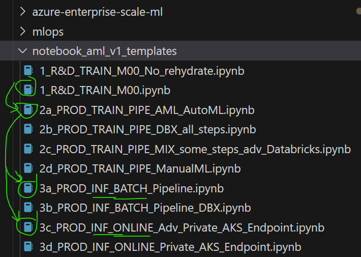

# 1) Install `ESML+ AMLv1+v2 (with AutoML)` - on laptop or DSVM
1) Install/Open miniconda (exists already on DSVM)
    - Install MiniConda (>v 4.7), and open the MiniConda command prompt on your computer
    - https://docs.conda.io/projects/conda/en/latest/user-guide/install/windows.html
2) Open terminal in VS Code, or your MiniConda terminal on your laptop
    - Option a) Download the latest install folder `AzureML_v1_55_and_v2_1_15.zip`
    - Option b) Clone your repo, containing the `azure-enterprise-scale-ml` repo submodule, e.g. folder.
3) Go to the folder `azure-enterprise-scale-ml`, and view the install_sdk folder: 
    - Option a) AML SDKv1+SDKv2 - CD to `azure-enterprise-scale-ml\environment_setup\install_sdk\user_dev_env_install\AzureML_v1_55_and_v2_1_15`
        - [Link to AzureML_v1_55_and_v2_1_15](../../../environment_setup/install_sdk/user_dev_env_install/AzureML_v1_55_and_v2_1_15/)
    - Option b) AML SDKv1 - CD to `azure-enterprise-scale-ml\environment_setup\install_sdk\user_dev_env_install\AzureML_v1_55`
        - [Link to AzureML_v1_55 ](../../../environment_setup/install_sdk/user_dev_env_install/AzureML_v1_55/)

4) RUN `automl_setup.cmd`If you are on Windows (10 or 11)
    - Windows: `automl_setup.cmd` 
        - Choose this optiom for BUILD AGENT. 
            - Tip: Choose the already created VM called `dsvm-cmn-swe-dev-001`
        - Choose this options for you USERS LAPTOP, if Windows 10 or 11.
            - Tip & Fallback: You always have a project specific Windows DSVM `dsvm-project001-swe-dev-001`
    - MAC `automl_setup_mac.sh`, if your data scientist has this OS on laptop
    - LINUX `automl_setup_linux.sh`, if your data scientist has this OS on laptop

# 2) Install on Azure Machine Learning - Compute Instance, and run AzureML Notebooks
Here a CONDA installation, without any start-script works, and the Linux YML file.

1) Go to NOTEBOOKS in Azure ML Studio
2) Open terminal. Create a COMPUTE INSTANCE, if needed, to power the terminal (and notebooks)
3) CD `azure-enterprise-scale-ml\environment_setup\install_sdk\user_dev_env_install\AzureML_v1_55_and_v2_1_15`
4) CREATE the CONDA environment, and activate it:
    - conda deactivate
    - conda env list
    - conda env create -f automl_env_linux.yml
    - conda activate testenv

5) Open an ESML Quickstart Notebook - Note: It till not work to run notebook, until STEP 6) is DONE
- Example notebook: `notebook_templates_quickstart\2_PRODUCTION_phase_TRAIN_Pipeline_M10_M11.ipynb`
6) Create a NEW cell at the top. 
    - a) Notebook: CELL: Install the ipykernel package to make your Conda environment available in Jupyter Notebook
        - `pip install --user ipykernel`
    - b) Terminal: Run the below, in terminal - this associates your Conda environment with Jupyter Notebook.
        - `python -m ipykernel install --user --name=azure_automl_esml_v155`
    - c) Restart Jupyter Notebook. Close any sessions. 
        - Reopen and you should see  `azure_automl_esml_v155` as an option in the kernel
        - You may want to hit the REFRESH icon to the right (see image), and it will appear in the COMBOBOX. You may also run d) 
    - d) Optional: You can programmatically select environment wit this command in a CELL, at the top of notebook
        - `%%bashconda activate azure_automl_esml_v155`

# Compute Instance (verify): It should look like something below: 

# VS Code (verify): Post-setup: After`azure-enterprise-scale-ml` submodule is on your computer, visible in your repo:
- After the code is on your computer, or at the ESML generated DSVM, you need to "flip" to main branch, and when running notebooks, you need to select the correct CONDA-evironment.See images below.
- Select correct BRANCH on the subclassed ESML library (only need to do this once):

# 3 Getting started: Notebooks
Open a notebook (note what level the folder is on). You can use any combinations of 1,2,3 notebooks
- If you want to work with Databricks and pyspark, for batch deployment: 1 + 2b + 3b
- If you want to use Azure ML compute and AutoML, for online deployment AND/OR batch deployment: 1 + 2a + 3b and/or 3c

- Note: if you cannot see any `notebook_template_...` folder, but `settings` folder at your root,  please update ESML (pull latest on "azure-enterprise-scale-ml) , and then use the  [02_update_templates_QUICK.ipynb](../../azure-enterprise-scale-ml/copy_my_subfolders_to_my_grandparent/02_update_templates_QUICK.ipynb) that automatically `UPDATES` (copy templtes folders) See `4) Copy TEMPLATES ` below in this readme.
- Note: If you cannot see either `notebook_template_...` or `settings` folder in your ROOT, then you need to `INIT` all TEMPLATES, run this notebook: [01_init_templates_ALL.ipynb](../../azure-enterprise-scale-ml/copy_my_subfolders_to_my_grandparent/01_init_templates_ALL.ipynb) 

### Select correct CONDA environment, when running notebooks (only need to do this once, per notebook)

# FAQ: How-to clone repo with submodule to local computer? 

1) Create a "project001" folder on local machine, open GIT command prompt there, then clone repo to that project001 folder.
2) Add ESML as a GIT Submodule "linked" to your GIT repo:

- Open GIT command prompt, go to your `local root folder for the code` (you should see the folder `azure-enterprise-scale-ml` and `notebook_demos` with a `dir` in the GIT CMD)run below: 

    > git config --system core.longpaths true

    > git submodule add https://github.com/jostrm/azure-enterprise-scale-ml

- Note: If the sumodule is already added by another team member in your project, the above command, git submodule add, will not work. Then you need to run the below instead: 

    > git submodule update --init --recursive

    

