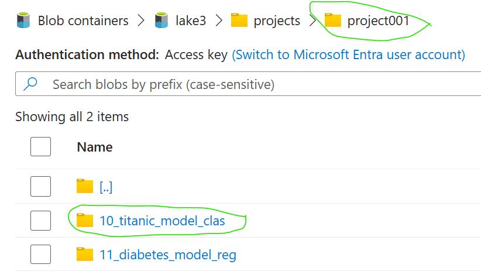
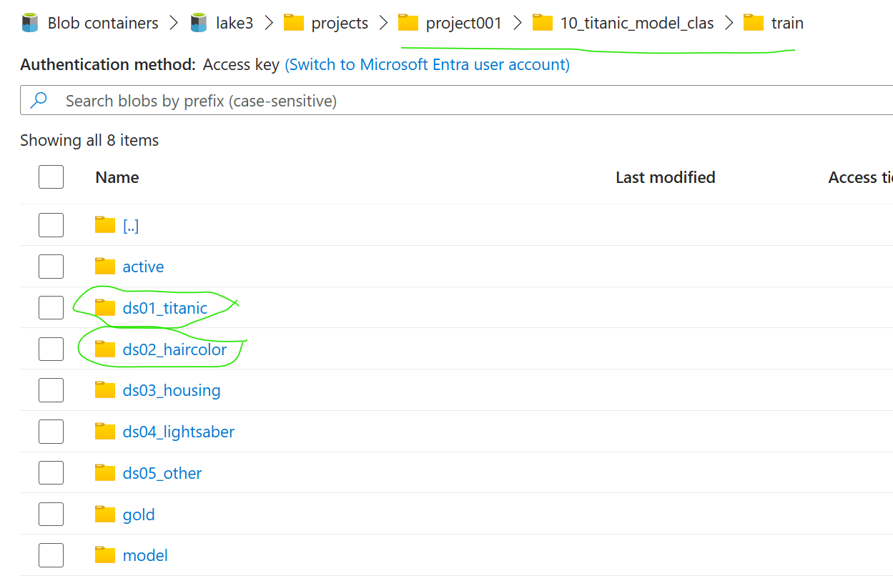

# HOWTO - DataLake access to project folder: Onboard own data

# Pre-requisites

[HOWTO - install AzureML SDK v1+v2 and ESML accelerator library](../v2/30-39/33-install-azureml-sdk-v1+v2.md)

[HOWTO - Supported use cases & Accelerated use cases](../v2/30-39/33-install-azureml-sdk-v1+v2.md)

# 1) Create your new branch for `Project` and `Model`  and EDIT the SETTINGS

  - Branch-name: We recommend to include organization/bu, project, and model.
  - Ask your ESML-coreteam what project-number you have 001,...,123 and choose your model prefix M01...M34 
  - Important: projectXXX and MXX should be unique, and is a defined ESML naming convention
  - Example name: `project001_M01` or HR_Dept_project001_M01

# 2) Edit the files in the setting folder - folder that was copied earlier to your root
It is the 3rd file `lake_settings.json` you need to edit, configure, to connect to your data in the dalake. 
- [settings/project_specific/model/lake_settings.json](../../../../settings/project_specific/model/lake_settings.json)

You may want to verify the settings in at least the top 3 files below.

  1) [settings/enterprise_specific/dev_test_prod_settings](../../../../settings/enterprise_specific/dev_test_prod_settings.json) - Role: ESML coreteam/IT admin (`configure once`)
  2) [settings/project_specific/security_config.json](../../../../settings/project_specific/security_config.json)  - Role: ESML coreteam/IT admin (`configure once, per project`)
  3) [settings/project_specific/model/lake_settings.json](../../../../settings/project_specific/model/lake_settings.json)   - Role: Data scientist (Here you decide `dataset names` and model prefix `M01`)
  4) [settings/active_dev_test_prod.json](../../../../settings/active_dev_test_prod.json) Role: Data scientist, to set what environment to debug `dev,test,prod`
  - optional (adjust according to your policy): [../../settings/enterprise_specific/*](../../../../settings/enterprise_specific/*) - Role: ESML Coreteam - `defaults for all projects to start with`
  - optional (override enterprise policy, to fit the use case): [../../settings/project_specific/*](../../../../settings/project_specific/*)  Role: Data scientist `computes, automl performance settings` 


## Tip: How to edit `lake_settings.json`
1) Change `project_number` and `project_folder_name`

```json
{
    "project_number": 1,
    "project_folder_name": "project001",
    "active_model": 11,
    "models":
        
```


2) Copy a DEMO json-clause, and rename the `model_short_alias` M10  to your preffered, example:`M08` if your `model_number` is 8
3) Change the label, ml_typem, ml_metric if needed.

```json
 {
                "model_number": 10,
                "model_folder_name": "10_titanic_model_clas",
                "model_short_alias": "M10",
                "dataset_folder_names": ["ds01_titanic","ds02_haircolor","ds03_housing","ds04_lightsaber"],
                "label":"Survived",
                "ml_type":"classification",
                "ml_metric":"AUC_weighted",
                "ml_metric_docs": ["AUC_weighted","accuracy","precision_score_weighted","average_precision_score_weighted","norm_macro_recall"],
                "ml_time_out_score": 0.8
},
```

- NB! The `model_folder_name` and `dataset_folder_names` needs to match exactly the name you have in your datalake, under your project folder. 

See Example below of how the model configuration of lake_settings for model `10_titanic_model_clas` is mapped to the folder structure in datalake: 




