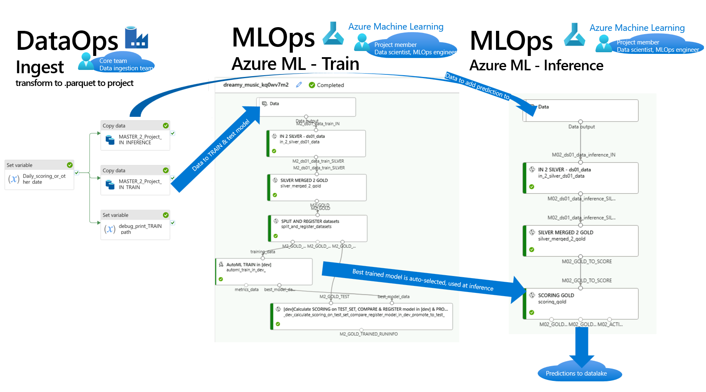

# !HOWTO - Quickstart: DataOps with Azure Datafactory ESML templates

# Prerequisites

[HOWTO - install AzureML SDK v1+v2 and ESML accelerator library](../v2/30-39/33-install-azureml-sdk-v1+v2.md)

[HOWTO - Supported use cases & Accelerated use cases](../v2/30-39/33-install-azureml-sdk-v1+v2.md)

# Context and pipeline outputs: MLOps in relation to DataOps

- 

# 1) Import Datafactory templates & Run manually
! TODO: jostrm TBA ! 

**Output:**
- 3 Azure Data factory pipelines for: Training, Inference, Data refinement
- 2 Azure Data factoru pipelines for DataMes: Shareback data, Shareforward data

# 2) Setup DATAMESH triggers, in Datafactory (via EventGrid)

! TODO: jostrm TBA ! 

