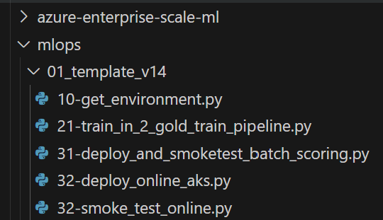
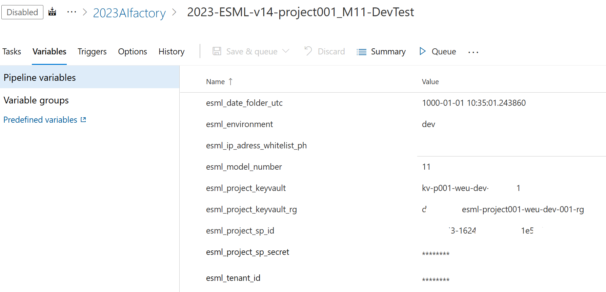

# HOWTO - Quickstart: MLOps with Azure Machine Learning and Databricks

# Prerequisites

[HOWTO - install AzureML SDK v1+v2 and ESML accelerator library](../v2/30-39/33-install-azureml-sdk-v1+v2.md)

[HOWTO - Supported use cases & Accelerated use cases](../v2/30-39/33-install-azureml-sdk-v1+v2.md)

# Context and pipeline outputs: MLOps in relation to DataOps

- 

# 1) Configure & Run ESML template Notebooks

1) Configure the lake_settings
- See section "3 Getting started: Notebooks" in: [HOWTO - install AzureML SDK v1+v2 and ESML accelerator library](../v2/30-39/33-install-azureml-sdk-v1+v2.md)
2) Run the 3 notebooks of your choice to genereate the Azure ML Pipelines: 
- Example: If you want to work with Databricks and pyspark, for batch deployment: 1 + 2b + 3b
- Example: If you want to use Azure ML compute and AutoML, for online deployment AND/OR batch deployment: 1 + 2a + 3b and/or 3c


**Output:**
- 2 Azure Machine Learning pipelines for: Training and Inference
- 1 Online endpoint

# 2) CI/CD (Python): Configure the ESML MLOps template, to use your project, model, pipelines

1)  Configure the inline python parameters in the file `21-train_in_2_gold_train_pipeline.py`



**Parameters to configure** in `21-train_in_2_gold_train_pipeline.py` at line 49, 50

```python

advanced_mode = False # ADVANCED MODE (DatabricksSteps also) + Manual ML (or AutoML if defined in Databricks notebook)
use_automl = True # SIMPLE MODE + AutoMLStep (if True)Manual ML Step (if False)

```

# 3) Import & Configre the GHA/ADO ESML Azure Devops pipeline

1) Import Pipeline from from template - [Template location ](../../../copy_my_subfolders_to_my_grandparent/mlops/02_cicd-ado-gha_mlops/azure_devops)
2) Configure the Variables in Azure Devops / Github Actions




