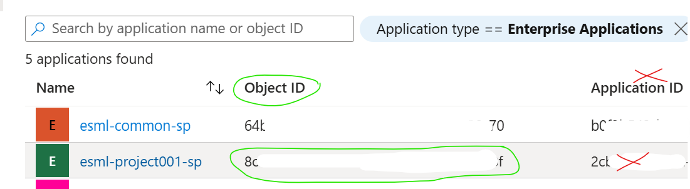

# FAQ - Core team & AFactory infra

## Q: AIFactory setup: How-to clone repo with submodule to local computer? The folder  `azure-enterprise-scale-ml` is empty?

1) Create a "project001" folder on local machine, open GIT command prompt there, then clone repo to that project001 folder.
2) Add ESML as a GIT Submodule "linked" to your GIT repo:

- Open GIT command prompt, go to your `local root folder for the code` (you should see the folder `azure-enterprise-scale-ml` and `notebook_demos` with a `dir` in the GIT CMD)run below: 

    > git config --system core.longpaths true

    > git submodule add https://github.com/jostrm/azure-enterprise-scale-ml

- Note: If the sumodule is already added by another team member in your project, the above command, git submodule add, will not work. Then you need to run the below instead: 

    > git submodule update --init --recursive

## Q:AIFactory setup: ADO/GHA pipelines - Why can't it find the path in my submodule when running pipelines?
- A: You have to enable the checkbox in Azure Devops pipeline to * [x] `Checkout from submodule`
- See more: https://stackoverflow.com/questions/53616942/how-to-setup-submodules-azure-devops

## Q: How can I trouble shoot error in ADO/GHA pipeline to create AIFactory project?

- A: See the [Flow diagram docs - trouble shooting](../10-19/13-flow-diagram-1.md)
   
## Q: How can I peer the AIFactory to my HUB - The Azure Machine learning portal gives error, that I don't get when inside a VM via Bastion

- A: See the [Networking docs - How-to guide](../10-19/14-networking-privateDNS.md)      

## Q: ADO/GHA pipelines - Why can't it read from the Seeding keyvault, when running pipelines?

- A: See the [Seedning keyvault - trouble shooting](../10-19/12-seeding-keyvault.md)

## ADO pipeluen failed, log message say something about *rbacDBX2AazureMLwithProjectSP001sdcde*? 

```json
{"code":"DeploymentFailed","target":".../Microsoft.Resources/deployments/rbacDBX2AazureMLwithProjectSP001sdcdev","details":[{"code":"PrincipalTypeNotSupported","message":"Principals of type Application cannot validly be used in role assignments."}]}
```
- A: This is due to either that the ApplicationID is passed, instead of the ObjectID when the BICEP try to set RBAC. Error probably occured that ApplicationID, or wrong ObjectID was copied from Microsoft EntraID to the seeting keyvault, for the secret name *esml-project001-sp-oid* in the seeding keyvault.
- How to fix: 
    - 1) Go to the [seeding keyvault](../10-19/12-seeding-keyvault.md) and verify that the VALUE of the secret name that ends with *-oid* such as *esml-project001-sp-oid* are correct.
        - Compare with the value from Microsoft EntraID, enterprise applications - see image.
        - Check if there is leading or trailing spaces. 
        - Check if it is the tenant id instead of esml-project-sp-oid, etc.



### Q: Networking: How to I trouble shoot Azure Machine Learning networking? Diagnostics? Troubleshoot private endpoint connection problems? 

- A: If you have problems connecting to the workspace, see Troubleshoot secure workspace connectivity.[Workspace diagnostics & Troubleshoot private endpoint connection problems](https://learn.microsoft.com/en-us/azure/machine-learning/how-to-troubleshoot-secure-connection-workspace?view=azureml-api-2)

- A: You can also run diagnostics on your workspace from Azure Machine Learning studio or the Python SDK. After diagnostics run, a list of any detected problems is returned. This list includes links to possible solutions. For more information, see [How to use workspace diagnostics](https://learn.microsoft.com/en-us/azure/machine-learning/how-to-workspace-diagnostic-api?view=azureml-api-2)

- A: How to [check diagnostics via Python code]()


