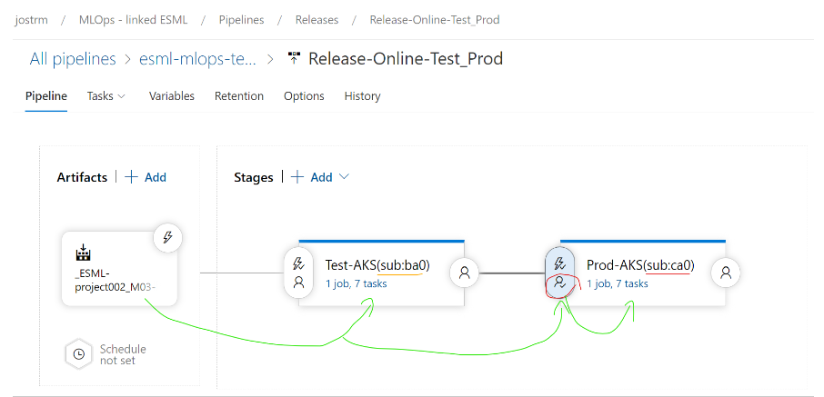

# FAQ - Data scientist & Azure ML pipelines
## Q: How-to clone repo with submodule to local computer? The folder  `azure-enterprise-scale-ml` is empty?

1) Create a "project001" folder on local machine, open GIT command prompt there, then clone repo to that project001 folder.
2) Add ESML as a GIT Submodule "linked" to your GIT repo:

- Open GIT command prompt, go to your `local root folder for the code` (you should see the folder `azure-enterprise-scale-ml` and `notebook_demos` with a `dir` in the GIT CMD)run below: 

    > git config --system core.longpaths true

    > git submodule add https://github.com/jostrm/azure-enterprise-scale-ml

- Note: If the sumodule is already added by another team member in your project, the above command, git submodule add, will not work. Then you need to run the below instead: 

    > git submodule update --init --recursive

    
## Q: ADO/GHA pipelines - Why can't it find the path in my submodule when running pipelines?
- A: You have to enable the checkbox in Azure Devops pipeline to * [x] `Checkout from submodule`
- See more: https://stackoverflow.com/questions/53616942/how-to-setup-submodules-azure-devops
## Q: Azure Datafactory & DataOps - How to work with Azure DataFactory, and branching? naming convention on IR etc
- A: Same name of Your Integration Runtime on all 3 Datafactories: Dev, Test, Prod
- A: Only connect the DEV data factory to GIT/Azure Devops
- A: Use GLOBAL variable "esml_environment" with values [dev,test,prod] in all Data factories

More info: https://learn.microsoft.com/en-us/azure/data-factory/continuous-integration-delivery

## Q: Why does my training run "timeout" in Azure Devops. Works from my computer?
- A:  Might be due to: Capabilities and limitations of Microsoft-hosted agents, if you use the FREE tier of Azure Devops.
  - **Public project**: 10 free Microsoft-hosted parallel jobs that can run for up to 360 minutes (6 hours) each time
  - **Private project**: One free parallel job that can run for up to 60 minutes each time
  - [https://docs.microsoft.com - Azure devops build agents](https://docs.microsoft.com/en-us/azure/devops/pipelines/agents/hosted?view=azure-devops&tabs=yaml#capabilities-and-limitations)
  - Example: Even if you specified the timeout as 1200 minutes, unfortunately, it can not override the limitations of the server.

## Q: Azure Devops and GIT Branching stragey - DEV, TEST, PROD, many models branches? 
 A: Commonly two options is used, see 1 and 2 here:
  ### 1) Either use in Azure Devops the commandline args variable `esml_environment` to set to  "dev, test, prod", to BUILD a environment, then also read this to RELEASE to same environment (dev,test,prod)
    - See `mlops` template folder. It read this variable in the mlops orchestration-scripts, such as `10-get_environment.py` using this factor method `p = ESMLProject.get_project_from_env_command_line()` - this will use `Argparser` and set  `p.dev_test_prod = esml_environment` and adjust the ESMLProject correctly.
    > 
      -Note: You still need 1 branch per model, and at least 1 BUILD pipeline per model. 
    
  ### 2) Use branching `per environment`, and `per model`:
    - https://docs.microsoft.com/en-us/azure/devops/pipelines/release/triggers?view=azure-devops&viewFallbackFrom=vsts
      - Example: You can have `3 branches per model`, and `3 Build pipelines per model`
      - project002_**M03-Dev**,project002_**M03-Test**,project002_**M03-Prod**
      - project002_**M05-Dev**,project002_**M05-Test**,project002_**M05-Prod**
      - ...

## Q: Is there any good design pattern for how many BUILD and RELEASE piplines to use, since ML-model?
- Tip: You may have two Azure Devops build pipelines (DEV, TEST_PROD) and 2 RELEASE pipelines (DEV, TEST_PROD) where TEST_PROD has 2 STAGES.
- BUILD: DEV with low compute for serving, but high compute for training.
- RELEASE: TEST_PROD  is the same trained model (same hyperparameter tuning) and may have highter COMPUTE performance, rightsized to smoke test actual workloads.
  - TEST and PROD pipeline/online-AKS is in different subscriptions. 
  - There is STAGING between TEST and PROD - with a human GATE before PROD release.
      > 

      