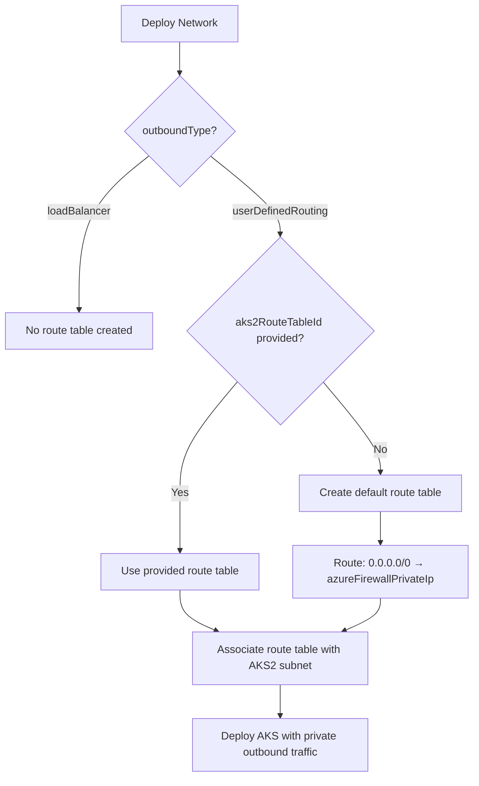

# Azure ML Private AKS with User Defined Routing (UDR)

## Overview

This guide explains how to configure Azure Machine Learning with a fully private AKS cluster that uses User Defined Routing (UDR) instead of a public load balancer. This configuration eliminates all public IP addresses from your AKS deployment, routing all traffic through Azure Firewall or a NAT Gateway.

## Architecture Components

### Modified Files

1. **`modules/aksCluster.bicep`** - AKS cluster module with flexible outbound routing
2. **`esml-genai-1/31-network.bicep`** - Network configuration with automatic route table creation

## Key Features

✅ **100% Backward Compatible** - Default behavior unchanged (uses public load balancer)  
✅ **Auto-Creates Route Table** - Automatically creates route table when using UDR without providing one  
✅ **BYO Route Table Support** - Override with your own existing route table  
✅ **Conditional Deployment** - Only creates resources when needed  
✅ **Proper Dependencies** - Ensures route table is created before subnet association  

## Configuration Parameters

### Network Module Parameters (`31-network.bicep`)

| Parameter | Type | Default | Description |
|-----------|------|---------|-------------|
| `outboundType` | string | `'loadBalancer'` | Outbound routing method: `loadBalancer` or `userDefinedRouting` |
| `aks2RouteTableId` | string | `''` | Optional. Resource ID of existing route table for AKS2 subnet |
| `azureFirewallPrivateIp` | string | `''` | Required when `outboundType='userDefinedRouting'` and no route table ID provided |
| `aks2SubnetCidr` | string | `''` | CIDR for the AKS2 subnet (e.g., `10.1.3.0/24`) |

### AKS Cluster Module Parameters (`aksCluster.bicep`)

| Parameter | Type | Allowed Values | Default | Description |
|-----------|------|----------------|---------|-------------|
| `outboundType` | string | `loadBalancer`, `userDefinedRouting`, `managedNATGateway`, `userAssignedNATGateway` | `'loadBalancer'` | AKS outbound connectivity method |

## Deployment Scenarios

### Scenario 1: Default Configuration (Backward Compatible)

**No changes required** - existing deployments continue to work as before.

```bicep
// Default behavior - uses public load balancer
module network '31-network.bicep' = {
  params: {
    // ... standard parameters ...
    // outboundType defaults to 'loadBalancer'
  }
}

module aks 'aksCluster.bicep' = {
  params: {
    // ... standard parameters ...
    // outboundType defaults to 'loadBalancer'
  }
}
```

**Result:** AKS cluster with public IP address (existing behavior)

---

### Scenario 2: Private AKS with Auto-Created Route Table

Use this when you want a fully private AKS cluster and let Azure automatically create the route table.

#### Prerequisites

- Azure Firewall deployed in your hub VNet
- Know the private IP address of your Azure Firewall (e.g., `10.0.1.4`)

#### Network Deployment

```bicep
module network '31-network.bicep' = {
  params: {
    // Standard parameters
    projectNumber: '005'
    env: 'prod'
    location: 'westeurope'
    locationSuffix: 'weu'
    vnetNameBase: 'vnet-esml'
    
    // AKS2 subnet configuration
    aks2SubnetCidr: '10.1.3.0/24'
    
    // Enable User Defined Routing
    outboundType: 'userDefinedRouting'
    azureFirewallPrivateIp: '10.0.1.4'  // Your Azure Firewall private IP
    
    // ... other parameters ...
  }
}
```

#### AKS Deployment

```bicep
module aks 'aksCluster.bicep' = {
  params: {
    // Standard parameters
    name: 'aks005-weu-prod'
    location: 'westeurope'
    kubernetesVersion: '1.28.5'
    
    // Enable User Defined Routing (no public IP)
    outboundType: 'userDefinedRouting'
    
    // Use the AKS2 subnet
    agentPoolProfiles: [{
      name: 'agentpool'
      count: 3
      vmSize: 'Standard_D4_v3'
      vnetSubnetID: network.outputs.aks2SubnetId  // Subnet has route table attached
      // ... other agent pool settings ...
    }]
    
    // ... other parameters ...
  }
}
```

**Created Resources:**
- Route Table: `rt-prj005-aks2-weu-prod`
- Route: `default-route-to-azfw` (`0.0.0.0/0` → `10.0.1.4`)
- AKS Subnet: `snt-prj005-aks-002` (with route table associated)
- Private AKS cluster (no public IP)

---

### Scenario 3: Private AKS with BYO (Bring Your Own) Route Table

Use this when you have an existing route table with custom routes.

#### Prerequisites

- Existing route table with routes configured
- Route table must include default route `0.0.0.0/0` to your firewall/NAT gateway

#### Network Deployment

```bicep
// Reference to existing route table
var existingRouteTableId = '/subscriptions/00000000-0000-0000-0000-000000000000/resourceGroups/rg-network-hub/providers/Microsoft.Network/routeTables/rt-hub-firewall'

module network '31-network.bicep' = {
  params: {
    // Standard parameters
    projectNumber: '005'
    env: 'prod'
    location: 'westeurope'
    locationSuffix: 'weu'
    vnetNameBase: 'vnet-esml'
    
    // AKS2 subnet configuration
    aks2SubnetCidr: '10.1.3.0/24'
    
    // Use existing route table
    outboundType: 'userDefinedRouting'
    aks2RouteTableId: existingRouteTableId  // Your existing route table
    // azureFirewallPrivateIp not needed when using existing route table
    
    // ... other parameters ...
  }
}
```

#### AKS Deployment

```bicep
module aks 'aksCluster.bicep' = {
  params: {
    // Standard parameters
    name: 'aks005-weu-prod'
    location: 'westeurope'
    kubernetesVersion: '1.28.5'
    
    // Enable User Defined Routing
    outboundType: 'userDefinedRouting'
    
    // Use the AKS2 subnet (with your route table)
    agentPoolProfiles: [{
      name: 'agentpool'
      count: 3
      vmSize: 'Standard_D4_v3'
      vnetSubnetID: network.outputs.aks2SubnetId
      // ... other agent pool settings ...
    }]
    
    // ... other parameters ...
  }
}
```

**Result:** AKS cluster uses your existing route table and remains fully private.

---

## Understanding the Route Table Logic

### Decision Flow



### Variable Logic in Code

```bicep
// Determine which route table ID to use
var aks2RouteTableIdToUse = !empty(aks2RouteTableId) 
  ? aks2RouteTableId                                    // Use provided route table
  : (outboundType == 'userDefinedRouting' && !empty(aks2SubnetCidr) 
      ? aks2DefaultRouteTable.id                        // Use auto-created route table
      : '')                                             // No route table (loadBalancer mode)
```

## Azure Firewall Configuration

### Required Firewall Rules

When using User Defined Routing, your Azure Firewall must allow outbound traffic for:

#### 1. **Azure Services** (Application Rules)
```
- *.hcp.<region>.azmk8s.io:443 (AKS control plane)
- mcr.microsoft.com:443 (Microsoft Container Registry)
- *.data.mcr.microsoft.com:443 (MCR storage)
- management.azure.com:443 (Azure Resource Manager)
- login.microsoftonline.com:443 (Azure AD)
- *.blob.core.windows.net:443 (Storage accounts)
- *.azurecr.io:443 (Azure Container Registry)
```

#### 2. **Network Rules**
```
- Azure Cloud (service tag): 443
- AzureContainerRegistry: 443
- AzureKeyVault: 443
- MicrosoftContainerRegistry: 443
```

#### 3. **Ubuntu/OS Updates**
```
- security.ubuntu.com:80, 443
- azure.archive.ubuntu.com:80, 443
- changelogs.ubuntu.com:80, 443
```

### Example Azure Firewall Application Rule

```bicep
resource firewallApplicationRule 'Microsoft.Network/azureFirewalls/applicationRuleCollections@2023-05-01' = {
  parent: azureFirewall
  name: 'aks-required-rules'
  properties: {
    priority: 100
    action: {
      type: 'Allow'
    }
    rules: [
      {
        name: 'allow-aks-control-plane'
        protocols: [{
          protocolType: 'Https'
          port: 443
        }]
        targetFqdns: [
          '*.hcp.${location}.azmk8s.io'
          'mcr.microsoft.com'
          '*.data.mcr.microsoft.com'
        ]
        sourceAddresses: ['10.1.3.0/24'] // AKS subnet
      }
    ]
  }
}
```

## Troubleshooting

### Issue: AKS Nodes Not Starting

**Symptoms:** AKS nodes remain in "NotReady" state

**Possible Causes:**
1. Route table not associated with subnet
2. Azure Firewall rules missing
3. Incorrect firewall private IP address

**Solution:**
```powershell
# Verify route table association
az network vnet subnet show \
  --vnet-name vnet-esml-weu-prod \
  --name snt-prj005-aks-002 \
  --resource-group rg-network \
  --query 'routeTable.id'

# Verify route
az network route-table route list \
  --route-table-name rt-prj005-aks2-weu-prod \
  --resource-group rg-network \
  --output table

# Check AKS node status
kubectl get nodes
```

### Issue: Cannot Pull Container Images

**Symptoms:** Pods stuck in "ImagePullBackOff"

**Cause:** Azure Firewall blocking container registry access

**Solution:** Add required application rules for MCR and ACR (see Azure Firewall Configuration section)

### Issue: Route Table Not Created

**Symptoms:** Deployment succeeds but no route table exists

**Cause:** Missing required parameters

**Solution:** Verify parameters:
```bicep
// Ensure all three conditions are met
outboundType: 'userDefinedRouting'  // ✓ Set to userDefinedRouting
aks2SubnetCidr: '10.1.3.0/24'       // ✓ Not empty
azureFirewallPrivateIp: '10.0.1.4'  // ✓ Valid IP address
```

## Outputs

The network module provides the following outputs:

| Output | Type | Description |
|--------|------|-------------|
| `aks2SubnetId` | string | Resource ID of the AKS2 subnet |
| `aks2RouteTableId` | string | Resource ID of the route table (auto-created or provided) |

### Using Outputs

```bicep
// Reference subnet in AKS deployment
agentPoolProfiles: [{
  vnetSubnetID: network.outputs.aks2SubnetId
}]

// Reference route table for validation or further configuration
output routeTableUsed string = network.outputs.aks2RouteTableId
```

## Best Practices

### 1. **Hub-Spoke Architecture**
- Deploy Azure Firewall in hub VNet
- Peer spoke VNets (where AKS resides) to hub VNet
- Use route tables to direct traffic through hub firewall

### 2. **Route Table Naming Convention**
- Auto-created: `rt-{projectName}-aks2-{locationSuffix}-{env}`
- Example: `rt-prj005-aks2-weu-prod`

### 3. **Security**
- Start with restrictive firewall rules
- Add rules as needed based on application requirements
- Use Azure Firewall diagnostics to identify blocked traffic

### 4. **Testing**
- Deploy to dev environment first
- Verify pod connectivity and image pulls
- Test external connectivity from pods
- Promote to production after validation

### 5. **Monitoring**
- Enable Azure Firewall logs
- Monitor route table effective routes
- Set up alerts for AKS node failures

## Migration Path

### From Public AKS to Private AKS

1. **Phase 1: Preparation**
   - Deploy Azure Firewall in hub VNet
   - Configure required firewall rules
   - Create test route table

2. **Phase 2: Dev Environment**
   - Deploy new dev AKS cluster with UDR
   - Test application deployment
   - Validate connectivity

3. **Phase 3: Production**
   - Schedule maintenance window
   - Deploy new production AKS cluster with UDR
   - Migrate workloads
   - Decommission old cluster

## Additional Resources

- [Azure AKS Egress Traffic](https://learn.microsoft.com/en-us/azure/aks/egress-outboundtype)
- [Azure Firewall with AKS](https://learn.microsoft.com/en-us/azure/aks/limit-egress-traffic)
- [Private AKS Cluster](https://learn.microsoft.com/en-us/azure/aks/private-clusters)
- [User Defined Routing](https://learn.microsoft.com/en-us/azure/virtual-network/virtual-networks-udr-overview)

## Summary

This implementation provides three flexible deployment options:

1. **Default (Backward Compatible)**: No changes needed, uses public load balancer
2. **Auto-Created Route Table**: Specify firewall IP, route table created automatically
3. **BYO Route Table**: Use your existing route table with custom routes

All scenarios maintain backward compatibility while enabling fully private AKS deployments with proper network isolation and security controls.
