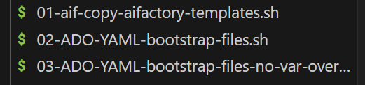

# Azure Devops orchestration (.yaml): Bicep
Edit the [Variables](./variables/variables.yaml) file, and import Build pipeline in Azure Devops.

## See [Full Prerequisites](../../../../../../documentation/v2/10-19/12-prerequisites-setup.md)

### Prerequisite reminder - setup tools:  on your laptop (for both option A) Azure Devops and B) Github):
- **Git Bash**: https://git-scm.com/downloads e.g. GNU bash, version 5.2.37 or above
    - **Purpose:** The install script runs in bash terminal (Git bash)
    - **Note Mac/Linux**: It has been seen that Ubuntu bash (sames that comes with Mac OS), additional libraries will be needed to be installed
    - **Version:** 5.2.37
    ```bash
    bash --version
    ```` 

### Prerequisite: GIT enable long paths

```
git config --system core.longpaths true
```

## START

1) Add or Update the submodule to your repo (to get the bootstrap files)

    ADD, if you are the first developer to checkin the code. Run from your repo root location:
    ```
    git submodule add https://github.com/jostrm/azure-enterprise-scale-ml
    ```
    UPDATE, if you are not the 1st developer to checkin the code to your repo, e.g. if you cloned the repo.
    ```bash
    git submodule update --init --recursive --remote
    ```

    Then in both cases, choose A or B, where we recommend Option A
    
    **Option A)** To get `stable version` (recommended), set at specific `RELEASE branch`: 
    ```
    git submodule foreach 'git checkout "release/v1.24" && git pull origin "release/v1.24"'
    ```

    **Option B)**
    To get latest features/fixes, unstable, set at `MAIN branch`: 
    ``` 
    git submodule foreach 'git checkout main && git pull origin main'
    ```

    This will add a folder in your repo at root (a GIT submodule) called `azure-enterprise-scale-ml` that contains accelerator code (bootstrap scripts, templates)
    
    Example: The [**AI Factory Configuration Wizard**](../../../environment_setup/install_config_wizard/readme.md) is then in this folder: 
        - `root\azure-enterprise-scale-ml\environment_setup\install_config_wizard\aifactory-config-windows.zip`
            

2) Run the start script `./azure-enterprise-scale-ml/00-start.sh`, from your `root`location. This will create some bootstrap-scripts at your repo root

    ```
   bash ./azure-enterprise-scale-ml/00-start.sh
    ```
3) Run the file created at your root called: `01-aif-copy-aifactory-templates.sh`, this will create a folder at your root called `aifactory-templates` with templates for Azure Devops Build pipelines, variable file, which you afterwards may edit with the [**AI Factory Configuration Wizard**](../../../environment_setup/install_config_wizard/readme.md)
    ```
   bash ./01-aif-copy-aifactory-templates.sh
    ```
4) Rename the newly created folder  `aifactory-templates` to  `aifactory` (protects you to overwrite your configuration if running the script again)
    - Note: Is is under the `aifactory` folder, you will configure your [variables.yaml](../../../../aifactory/esml-infra/azure-devops/bicep/yaml/variables/variables.yaml)

>[!TIP]
> If you want to update the pipeline templates? Without overwriting previous configuration. Then run the bash file created at your root called: `03-ADO-YAML-bootstrap-files-no-var-overwrite.sh`. This will ensure updated pipeline templates, and will not overwrite variables

The file structure should now look something like below (parameters folder should not be visible). The underlined folder is the AI Factory `submodule`, marked with `s` in VS Code:


At the root, you will see some `bash` scripts:



## Steps 5-8: Config & Run!
Configure and setting up the actual `AI Application Landingzones` a.k.a `AI Factory projects`, where a `project` has 1 up to 3 `application landingzones`(Dev, Stage, Prod)

>[!NOTE]
> If you want to learn how to configure the AI Factory automation in `standalone mode` versus `Hub-connected centralized private DNS zones` with `BYOVnet`- [ setup starting page](../../../../../../documentation/v2/20-29/24-end-2-end-setup.md)
>

5) Configure the [variables.yaml](./variables/variables.yaml) by using the [**AI Factory Configuration Wizard**](../../../environment_setup/install_config_wizard/readme.md)
    - Choose naming convention: prefix, suffixes
    - Choose which services to enable or disable
    - BYOVNet, BYOSubnet, BYOAce, enableAIGateway
    - etc

**Running the Pipelines**

6) Run pipeline: AIFactory Common (Common part of landingzone: Networking, etc)
- ☑️ Start with setting up a common AIFactory environment, example, the DEV environment. Go to Pipelines Import the .yaml file
    - File: [infra-aifactory-common.yaml](./esml-infra-common/infra-aifactory-common.yaml)

7) Run pipeline for the 1st AIFactory project (Application part of landingzone, reusing common parts to save cost, create low coupling,enforce `Least privileged access`): 
- In Azure Devops, import and run the pipelines to setup 1-M projects. There are 2 AIFactory architectures (DataOps/MLOps and GenAI), in the same project type supported as of now: 
    - ☑️ Import [infra-project-genai.yaml](./esml-infra-project/infra-project-genai.yaml)
    - ☑️ Run the preffered Azure Devops Stage(Dev, Stage, or Prod) for which environment, you want to create the project in? (Uncheck all except DEV, if only DEV)

# QUICK TIPS: Add/Remove services to project, or create NEW project?
- ❓Q1: If you want to ADD more services to same project? 
- A: Edit Variables.yaml, Checkin code, Re-run pipeline
    - ☑️ Edit the variables starting with `enable`. Page 9 in the [**AI Factory Configuration Wizard**](../../../environment_setup/install_config_wizard/readme.md)
        - Alternatively you may edit them manually, setting them to `true` will add that resource. Changing from `true` to `false` will remove the resource. Such as `enableAzureMachineLearning`, `enableAIFoundry` in [variables.yaml](../../../../aifactory/esml-infra/azure-devops/bicep/yaml/variables/variables.yaml). 
        - See [docs about all PARAMETERS here](https://jostrm.github.io/azure-enterprise-scale-ml/parameters/)
    - ☑️ Check in the code, prefferebly in a new branch with a name such as "project001"
    - ☑️ Re-run Azure Devops pipeline [infra-project-genai.yaml](./esml-infra-project/infra-project-genai.yaml) in the Devops Stage(Dev, Stage, or Prod) where it resides.

- ❓ Q3: If you want to add more projects: 001,002,003, for more teams? 
- A: Simply use the [**AI Factory Configuration Wizard**](../../../environment_setup/install_config_wizard/readme.md) where you can "create new project". 
    - Alternatively, if you don't want to use the Wizard, you can edit the `Variables.yaml` file manually, change the `project_number` variable, then checkin the edited Variables.file, and re-run the pipeline. 
    - See [docs about all PARAMETERS here](https://jostrm.github.io/azure-enterprise-scale-ml/parameters/)

> [!TIP]
>  Do you want to use **Github** instead of Azure Devops? Then you can use the AIFactory Github Template repository to get a bootstrapped repo quickly (as a mirror repo, or "bring your own repo"). [AIFactory Template Repo](https://github.com/jostrm/azure-enterprise-scale-ml-usage).
>