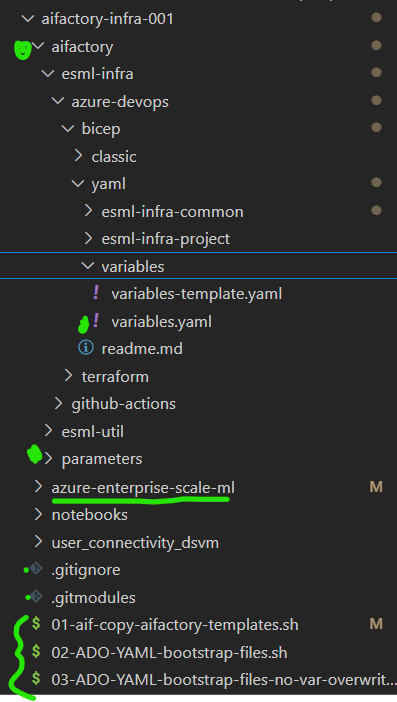

# Azure Devops orchestration (.yaml): Bicep
Edit the [Variables](./variables/variables.yaml) file, and import Build pipeline in Azure Devops.

## Steps 1-3: These are ONLY needed if you did not run the SCRIPTS as mentioned in [prerequisites](../../../../../documentation/v2/10-19/12-prerequisites-setup.md)

[prerequisites](../../../../../documentation/v2/10-19/12-prerequisites-setup.md)

>[!IMPORTANT]
> If this link works: [base parameters](../../../../aifactory/parameters/) you should not do thes steps 1-3 (you already have copied templates files locally)
>

0) Add the submodule to your repo (to get the bootstrap files)

    Run from your repo root location:

    ```
    git submodule add https://github.com/jostrm/azure-enterprise-scale-ml
    ```

    This will add a folder in your repo at root (a GIT submodule) called `azure-enterprise-scale-ml` that contains accelerator code (boostrap scripts, templates)

1) Run the start script `./azure-enterprise-scale-ml/00-start.sh`,  this will create some bootstrap-scripts at your repo root.

    ```
   bash ./azure-enterprise-scale-ml/00-start.sh
    ```
2) Run the file created at your root called: `01-aif-copy-aifactory-templates.sh`, this will create a folder at your root called `aifactory-templates` with templates for GHA workflows, and parameters.
    ```
   bash ./01-aif-copy-aifactory-templates.sh
    ```
3) Rename the newly created folder  `aifactory-templates` to  `aifactory` (protects you to overwrite your configuration if running the script again)
    - Note: Is is under the `aifactory` folder, you will configure your [base parameters](../../../../aifactory/parameters/) and other variables.

>[!TIP]
> If you want to update the pipeline templates? Witout overwriting previous configuration. Then run the bash file created at your root called: `03-ADO-YAML-bootstrap-files-no-var-overwrite.sh`. This will ensure updated pipeline templates, and will not overwrite base parameters, or variables

The file structure should now look something like below. The underlined folder is the AI Factory `submodule`.



## Steps 4-7

>[!NOTE]
> If you want to learn how to configure the AI Factory in `standalone mode` versus `Hub-connected centralized private DNS zones` with `BYOVnet`- [ setup starting page](../../../../../../documentation/v2/20-29/24-end-2-end-setup.md)
>

4) Configure the 12 [base parameters](../../../../aifactory/parameters/) 
5) Configure the [variables.yaml](./variables/variables.yaml), that will overwrite some of the base parameters.
6) Run pipeline: AIFactory Common
- Start with setting up a common AIFactory environment, example, the DEV environment. Go to Pipelines Import the .yaml file
    - [infra-aifactory-common.yaml](./esml-infra-common/infra-aifactory-common.yaml)

7) Run pipeline for an AIFactory project: 
- Then you can import and run the pipelines to setup 1-M projects. There are 2 AIFactory project types supported as of now: 
    - [infra-project-genai.yaml](./esml-infra-project/infra-project-genai.yaml)
    - [infra-project-esml.yaml](./esml-infra-project/infra-project-esml.yaml)

> [!TIP]
>  Do you want to use Github instead of Azure Devops? Then you can use the AIFactory Github Template repository to get a bootstrappd repo quickly (as a mirror repo, or "bring your own repo"). [AIFactory Template Repo](https://github.com/jostrm/azure-enterprise-scale-ml-usage).
>