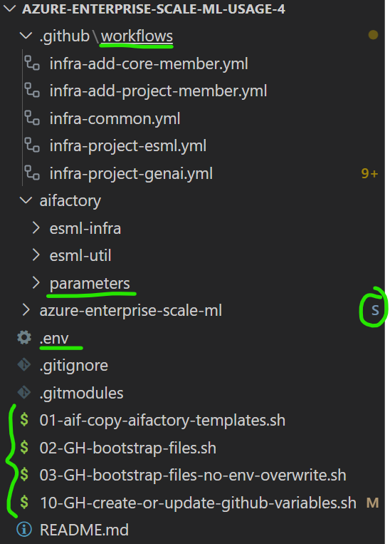
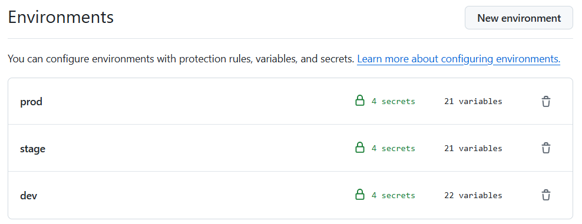

# Github orchestration (.yaml): Bicep

>[!NOTE]
> If you want to learn how to configure the AI Factory in `standalone mode` versus `Hub-connected centralized private DNS zones` with `BYOVnet`- [ setup starting page](../../../../../documentation/v2/20-29/24-end-2-end-setup.md)
>

## Note: 1-4 is needed only if you did not run the SCRIPTS as mentioned in [prerequisites](../../../../../documentation/v2/10-19/12-prerequisites-setup.md)

0) Add the submodule to your repo (to get the bootstrap files)

    Run from your repo root location:

    ```
    git submodule add https://github.com/jostrm/azure-enterprise-scale-ml
    ```

    This will add a folder in your repo at root (a GIT submodule) called `azure-enterprise-scale-ml` that contains accelerator code (boostrap scripts, templates)
    
1) Run the start script `./azure-enterprise-scale-ml/00-start.sh`,  this will create some bootstrap-scripts at your repo root.

    ```
   bash ./azure-enterprise-scale-ml/00-start.sh
    ```
2) Run the file created at your root called: `01-aif-copy-aifactory-templates.sh`, this will create a folder at your root called `aifactory-templates` with templates for GHA workflows, and parameters.
    ```
   bash ./01-aif-copy-aifactory-templates.sh
    ```
3) Rename the newly created folder  `aifactory-templates` to  `aifactory` (protects you to overwrite your configuration if running the script again)
    - Note: Is is under the `aifactory` folder, you will configure your [base parameters](../../../../aifactory/parameters/) and other variables.
4) Run the file created at your root called: `02-GH-bootstrap-files.sh`, this will creat an .env file at your root.
    - Note: If you want to refresh the pipeline templates, but not overwrite the .env file, you may run `03-GH-bootstrap-files-no-env-overwrite.sh`
     ```
   bash ./02-GH-bootstrap-files.sh
    ```

OUTPUT: The file structure should now look something like below: 



## Continue with steps:5-9:

5) Authenticate to  Azure and Github
You need to login via `Azure CLI` and `Github CLI`, but recommendation is to also test login via `Powershell`. 
- NB! Recommendation is to use a service principal when logging in. Not your user id.
- The Service Principal should have OWNER permission to all 3 subscriptions (Dev, Test, Prod), such as the `esml-common-bicep-sp` service principle.
- Test the login for all 3 subscriptions using `az cli` and `powershell` as below: 

   a) Log in to `Azure CLI with a service principal`, to a specific tenant

   ```sh
    # Define the variables
    clientId="your-client-id"
    clientSecret="your-client-secret"
    tenantId="your-tenant-id"
    subscriptionId="your-subscription-id"
    
    az login --service-principal -u $clientId -p $clientSecret --tenant $tenantId
    az account set --subscription $subscriptionId
   ```

   b) Log in to `GitHub CLI:`

   ```sh
    gh auth login
   ```


6) Edit the [base parameters](../../../../aifactory/parameters/). All files 12 files such as [10-esml-globals-1.json](../../../../aifactory/parameters/10-esml-globals-1.json)
7) Edit the [.env] variables at your root. (These will override some of the base parameters)
8) Run the file created at your root called: `10-GH-create-or-update-github-variables.sh`, that will copy values from .env to your Github repo as Environment variables, and secrets.
    ```
   bash ./10-GH-create-or-update-github-variables.sh
    ```

    - Select `y`in the prompt `Do you want to use overwrite AZURE_CREDENTIALS with dummy value?` the first time you run the script.
    - Then, set the AZURE_CREDENTIALS manually using Github web portal for each Environment. The format should be: 
        ```json
        {
            "clientId": "<AppId of service princple that is OWNER, such as esml-commonn-bicep-sp>",
            "clientSecret": "Secret of of service princple that is OWNER, such as esml-commonn-bicep-sp",
            "subscriptionId": "<subscriptionID>",
            "tenantId": "<TenantId>"
        }
        ```

    - OUTPUT: The environment in Github should now look something like below (~21 variables in each environment: Dev,Stage, Prod)
    - 

9) Run the Github action workflows, start with `infra-aifactory-common.yaml` then you can run `infra-project-genai.yaml` or `infra-project-esml.yaml`

## Workflow: AIFactory Common 
Start with setting up a common AIFactory environment, example, the DEV environment
- [infra-aifactory-common.yaml](./esml-infra-common/infra-aifactory-common.yaml)

## Workflow: AIFactory projects
Then you can import and run the pipelines to setup 1-M projects. There are 2 AIFactory project types supported as of now: 
- [infra-project-genai.yaml](./infra-project-genai.yml)
- [infra-project-esml.yaml](./infra-project-esml.yml)


> [!TIP]
>  A quicker & easier way? You can use the AIFactory Github Template repository to get a bootstrappd repo quickly (as a mirror repo, or "bring your own repo"). [AIFactory Template Repo](https://github.com/jostrm/azure-enterprise-scale-ml-usage), ready to run. All files copied already. Just configure and run.
>