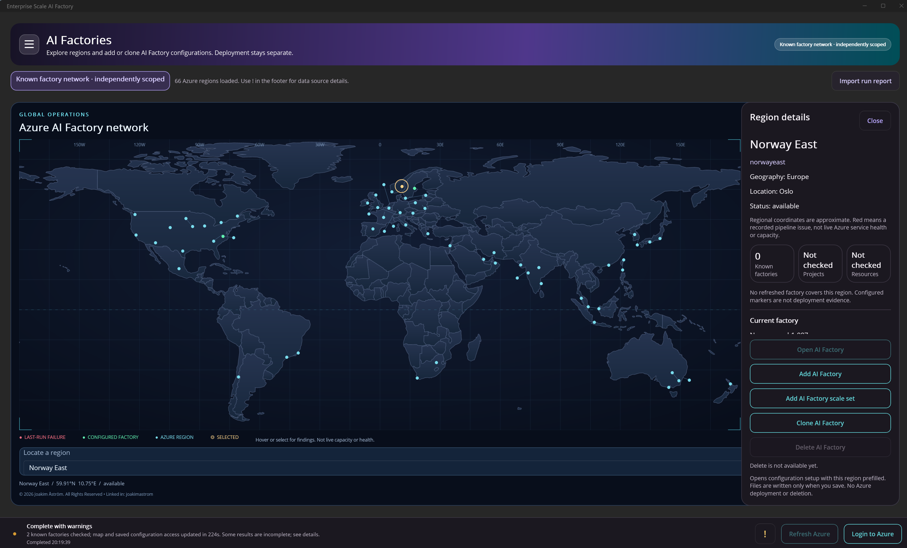
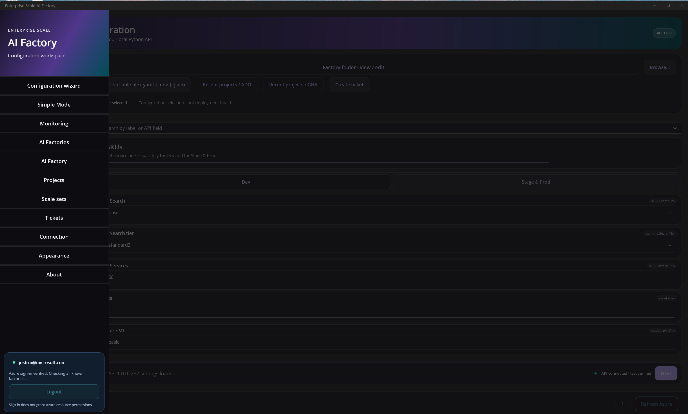

# Enterprise Scale AI Factory for Windows 11

A native .NET MAUI desktop app with its Python API included: configuration,
reviewed IaC execution, Azure monitoring, project operations and tickets.

## Install

1. Open the [matched desktop release](https://github.com/jostrm/azure-enterprise-scale-ml/releases/tag/desktop-v0.47.6) and download the **1.0.1 Setup EXE and all its `.bin` parts** into one folder.
2. Double-click the setup EXE and follow the short wizard. It installs for your Windows account; administrator rights are not normally required.
3. Open **Enterprise Scale AI Factory** from Start. The app starts its bundled local API automatically.

| Download | Version |
| --- | --- |
| [Setup EXE](https://github.com/jostrm/azure-enterprise-scale-ml/releases/download/desktop-v0.47.6/ESAIF.ConfigWizard-1.0.1-win-x64-setup.exe) | MAUI 1.0.1 |
| [All required data parts](https://github.com/jostrm/azure-enterprise-scale-ml/releases/tag/desktop-v0.47.6) | Match the Setup EXE filename |

**All data parts and the Setup EXE are required.** The `.bin` files contain the compressed application and included components. They are not optional downloads or your personal data.

Keep the files together with their original filenames, then run **only the Setup EXE**. It reads the data parts automatically. [MAUI-SHA256SUMS.txt](https://github.com/jostrm/azure-enterprise-scale-ml/releases/download/desktop-v0.47.6/MAUI-SHA256SUMS.txt) lists their hashes; compare a download with `Get-FileHash .\filename -Algorithm SHA256`. This installer includes the matched v0.47.6 API.

**Unsigned preview:** Windows SmartScreen or your organization's application policy may warn or block installation. Verify the download source and hashes. Follow your organization's approval process; do not disable security controls. This is not a Microsoft Store or signed enterprise deployment package.

Installation, bundled API/schema/templates, Python/Tcl/Tk files and uninstall were exercised on Windows 11 x64 build 26100. The current desktop preview also ran with .NET and Windows App SDK loaded locally. This is not a clean-VM certification of every Windows 11 build or managed-device policy.

## Prerequisites

| Purpose | What you need |
| --- | --- |
| Open the app | Windows 11 **x64** (build 22000 or later) and [Microsoft Edge WebView2 Evergreen Runtime](https://developer.microsoft.com/microsoft-edge/webview2/). WebView2 is normally already installed on Windows 11; setup checks for it. |
| App/API runtimes | **Included:** .NET, Windows App SDK, Python, Tcl/Tk, FastAPI and API dependencies. No Visual Studio, .NET SDK, MAUI workload or separate Python installation is needed just to use the desktop UI. |
| Run deployment scripts | [Git for Windows with Git Bash](https://git-scm.com/downloads/win), [Azure CLI](https://learn.microsoft.com/cli/azure/install-azure-cli-windows), and a **host Python 3.10+** available in Git Bash. The embedded API interpreter does not replace the standalone Python command required by the Bash launchers. |
| GitHub Actions projects | [GitHub CLI](https://cli.github.com/), plus access to the target repository and appropriate Azure permissions. |
| Azure DevOps projects | Access to the target Azure DevOps organization/project, configured pipelines and appropriate Azure permissions. |

Internet access is required for sign-in, Azure inventory, source-version checks and deployments. Installing the app does **not** grant Azure or repository permissions. The [deployment prerequisites](../../../documentation/v2/10-19/12-prerequisites-setup.md) still apply.

## First use

1. Follow the [end-to-end setup guide](../../../documentation/v2/20-29/24-end-2-end-setup.md).
   New multi-factory setups use an `azurefactory` folder and **Manage factories**.
   **Configure only—do not deploy** saves the selected definitions; execution is separate.
2. Select the exact AI Factory, environment, scale set and project. Prepare and
   confirm a deployment, then follow the terminal/job status and refresh Azure.
   Planning a later environment does not deploy it.
3. Use **Projects**, **AI Factories**, monitoring and **Tickets** for day-to-day
   work. **Full bootstrap** is the separate common-infrastructure-plus-first-project
   creation flow. **Connection** shows the local API connection.

The new layout requires a release containing the matching app/API support;
downloaded older installers do not gain it by changing folder names.

LEGACY folder structure &amp; setup

Open an existing consumer repository's `aifactory` folder in **Configuration
wizard**. **Plan to Stage** creates a draft; **Deploy** or **Review update**
prepares execution. **Patch** off preserves installed templates; on refreshes
them. The root launchers are `ADO-update-aifactory-and-run-project.sh` and
`GHA-update-aifactory-and-run-project.sh` (alias of `GH-update-aifactory-and-run-project.sh`).
Keep scripts/templates matched to the selected published version. Migration to
an Azure Factory register is explicit and preserves the source.

## Updates and uninstall

Close the app and finish or explicitly resolve any active deployment before updating. Run the newer installer to update the same per-user installation. Uninstall through **Settings > Apps > Installed apps > Enterprise Scale AI Factory**.

Your repositories, saved configurations and Azure resources are separate from the app installation. Uninstall is not an Azure cleanup operation.

## Screenshots

