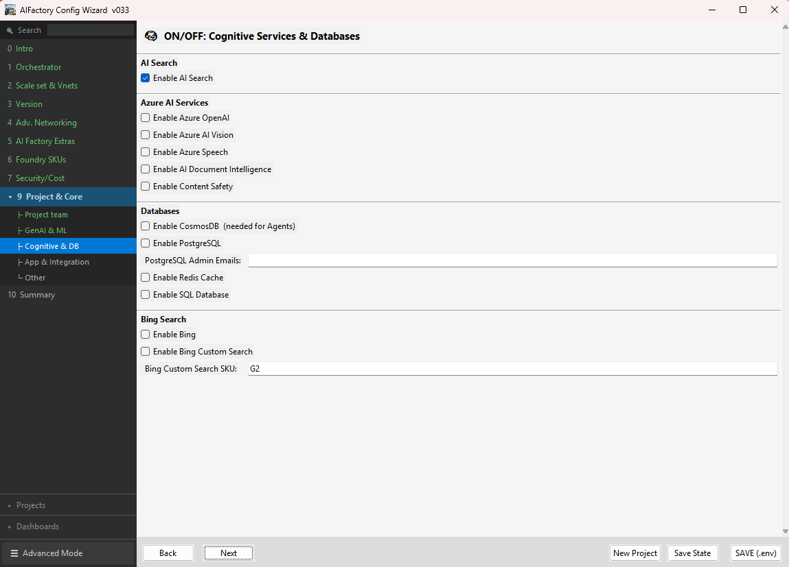

# AI Factory Configuration Wizard

The **AI Factory Configuration Wizard** is a guided, form-based desktop tool that simplifies the initial setup of an Enterprise Scale AI Factory. Instead of manually editing configuration files, the wizard walks you through every required parameter, validates your inputs in real time, and generates a correctly populated `.env.template` (GitHub Actions) or `variables.yaml` (Azure DevOps) file — ready to be used directly in your CI/CD pipeline.



## Why use the Wizard?

- **Reduces misconfiguration risk** — mandatory fields are marked and validated before the file is generated
- **Speeds up first-time setup** — no need to read through a large configuration file to find what to change
- **ITSM-friendly** — core teams can generate the correct configuration directly from a service ticket and trigger the pipeline on behalf of the requesting team. Or get the "initial full configuration", where the ITSM tickets only contain the *project specifics* such as *which resources a team wants to order* e.g. have enabled=true (checkboxes in Wizard)

## Download

| Platform | File |
|---|---|
| Windows | [aifactory-config-windows.zip](windows/aifactory-config-windows.zip) |
| Linux | [aifactory-config-linux.tar.gz](linux/aifactory-config-linux.tar.gz) |
| macOS | [aifactory-config-macos.tar.gz](macos/aifactory-config-macos.tar.gz) |

### ⚠️ Security warning on first run

The app is not yet signed with a commercial certificate. Your OS may show a warning the first time you run it — this is expected. The source code is fully open and auditable in this repository.

**Windows — "Windows protected your PC" (SmartScreen)**
1. Click **More info**
2. Click **Run anyway**

**macOS — "cannot be opened because it is from an unidentified developer"**
1. Right-click (or Control-click) the app
2. Select **Open**
3. Click **Open** in the dialog

**Linux** — no warning expected; you may need to make the file executable:
```bash
chmod +x aifactory-config
./aifactory-config
```
## Documentation

[Quickstart Documentation](https://jostrm.github.io/azure-enterprise-scale-ml/)
- Full parameter reference: [https://jostrm.github.io/azure-enterprise-scale-ml/parameters/](https://jostrm.github.io/)
- Recommended for all that wants to setup an AI Factory: Core team or project team.

[Full Documentation](../../documentation/readme.md) 
- All AI Factory concepts ( not full parameter reference)
- Recommended only for advanced core team.

# Prerequisites — AIFactory Config Wizard

The wizard is distributed as a **self-contained executable** built with PyInstaller.  
In most cases you do **not** need Python installed — just download, extract, and run.

---

## Windows

| Requirement | Details |
|-------------|---------|
| **OS** | Windows 10 (1903+) or Windows 11 |
| **Architecture** | x86-64 (64-bit). ARM devices running Windows 11 also work via x64 emulation. |
| **Visual C++ Runtime** | Usually pre-installed. If the app fails to start, install [Microsoft Visual C++ Redistributable](https://aka.ms/vs/17/release/vc_redist.x64.exe). |
| **Python** | **Not required.** Python is bundled inside the `.exe`. |

### Run
1. Download [`aifactory-config-windows (3).zip`](windows/aifactory-config-windows%20%283%29.zip).
2. Extract the archive (right-click → *Extract All…*).
3. Double-click **`aifactory-config.exe`**.

> **Windows SmartScreen warning?**  The first run may show a "Windows protected your PC" prompt because the binary is unsigned. Click *More info* → *Run anyway*.

---

## macOS

| Requirement | Details |
|-------------|---------|
| **OS** | macOS 12 Monterey or later recommended (macOS 11 Big Sur minimum). |
| **Architecture** | Apple Silicon (arm64) and Intel (x86-64). The binary is built for the architecture of the GitHub Actions runner (currently Apple Silicon — `macos-latest`). |
| **Python** | **Not required.** Python is bundled inside the binary. |
| **Tkinter** | Bundled via PyInstaller. No separate install needed. |

### Run
```bash
# 1. Extract
tar -xzf macos/aifactory-config-macos.tar.gz

# 2. Allow execution
chmod +x aifactory-config

# 3. Launch
./aifactory-config
```

> **Gatekeeper warning?**  macOS may block the binary because it is not notarized.  
> Run once from Terminal:  
> ```bash
> xattr -d com.apple.quarantine ./aifactory-config
> ```  
> Then launch normally.

---

## Linux

| Requirement | Details |
|-------------|---------|
| **OS** | Any modern x86-64 Linux distribution (Ubuntu 22.04 LTS or later recommended). |
| **Architecture** | x86-64 (64-bit). |
| **Python** | **Not required.** Python is bundled inside the binary. |
| **Tkinter / Tcl/Tk system libs** | The runtime Tk shared libraries must be present on the host. Install with: |

```bash
# Debian / Ubuntu
sudo apt-get install -y python3-tk

# Fedora / RHEL / CentOS
sudo dnf install -y python3-tkinter

# Arch Linux
sudo pacman -S tk
```

### Run
```bash
# 1. Extract
tar -xzf linux/aifactory-config-linux.tar.gz

# 2. Allow execution
chmod +x aifactory-config

# 3. Launch (requires a desktop environment / display)
./aifactory-config
```

> Running on a headless server without a display? Set `DISPLAY` or use a virtual framebuffer (`Xvfb`), though the wizard is designed for interactive desktop use.

---


