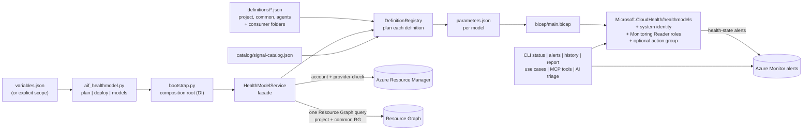
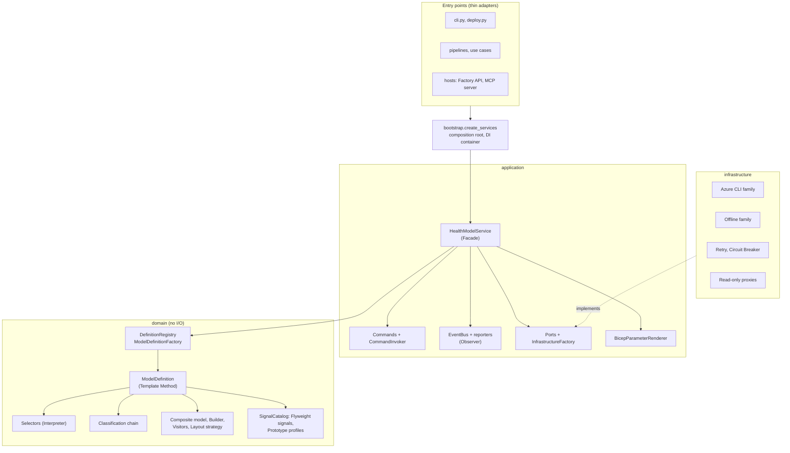
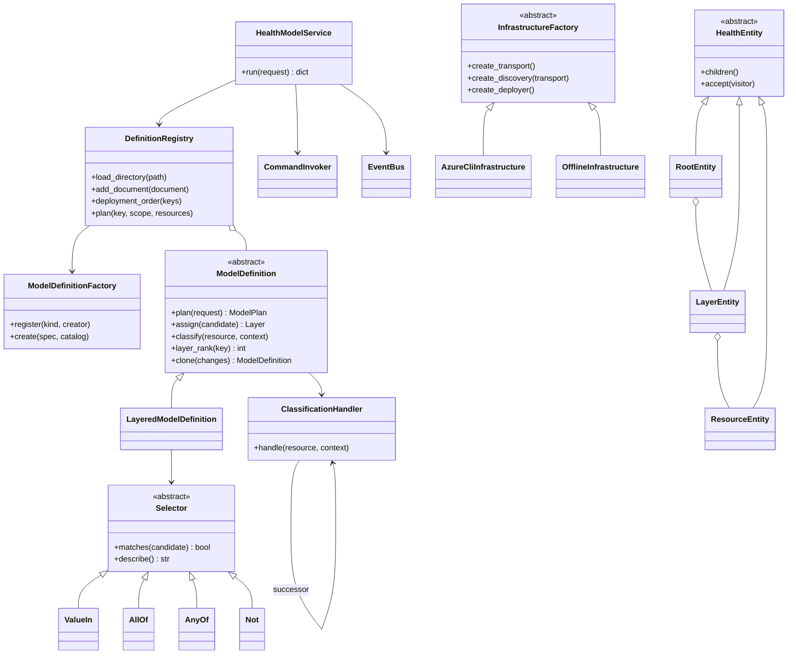
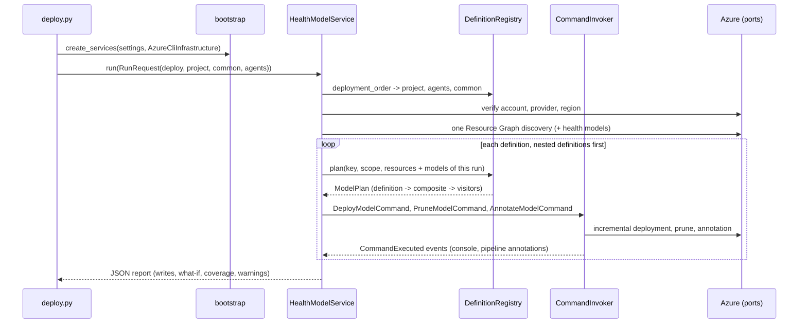
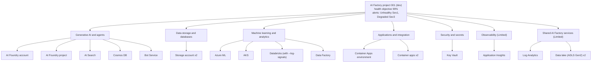
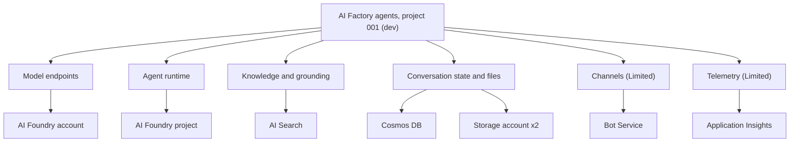

# Azure Monitor health models for the Enterprise Scale AI Factory

Out-of-the-box, state-based health for AI Factory projects and their common services, defined in
Bicep and deployed by an optional ADO or GitHub Actions step. It turns the Azure Monitor metrics,
Resource Health and logs that a factory already produces into one health tree per project
(`healthy` / `degraded` / `unhealthy` / `unknown`), with default health-state alerts and tooling to
read alerts, change them, report external signals and triage with a Foundry model.

Azure Monitor health models are in preview (`Microsoft.CloudHealth`, API `2026-09-01-preview`).
Microsoft's FAQ states that there is *no* out-of-box health model; this folder provides one for the
AI Factory.

| Deliverable | Where |
| --- | --- |
| Health model in Bicep (model, identity, RBAC, root, layers, entities, relationships, alerts, action group) | [`bicep/main.bicep`](bicep/main.bicep), [`bicep/modules`](bicep/modules) |
| Signal catalog: 28 resource profiles, 77 curated signals, 9 layers, `enable*` flag map | [`catalog/signal-catalog.json`](catalog/signal-catalog.json) |
| Model definitions: `project`, `common`, `agents`; add more as JSON without code (schema included) | [`definitions`](definitions) |
| Object-oriented core with dependency injection: domain, application, infrastructure layers and a composition root | [`src/aifactory_healthmodel`](src/aifactory_healthmodel), launcher [`aif_healthmodel.py`](aif_healthmodel.py) |
| Optional pipeline step, Azure DevOps and GitHub Actions | `environment_setup/aifactory/bicep/copy_to_local_settings/.../infra-project-healthmodel.yaml` and `.yml` |
| Runtime client and CLI: status, alerts, history, reports, annotations, set alerts | [`client.py`](src/aifactory_healthmodel/client.py), [`cli.py`](src/aifactory_healthmodel/cli.py) |
| Read-only MCP-ready tools | [`tools.py`](src/aifactory_healthmodel/tools.py) |
| Use case examples (read health, alerts, external signals, AI triage, MCP, several models in one run) | [`usecase_code`](usecase_code) |
| Tests (TDD): 555 tests, 551 offline + 4 opt-in live; golden masters prove the refactor changed no output | [`tests`](tests) |

## Contents

1. [Baseline and gap assessment](#1-baseline-and-gap-assessment)
2. [Architecture and design decisions](#2-architecture-and-design-decisions)
3. [Object-oriented design and dependency injection](#3-object-oriented-design-and-dependency-injection)
4. [Model definitions: creating more health models](#4-model-definitions-creating-more-health-models)
5. [Model structure](#5-model-structure)
6. [Signal catalog](#6-signal-catalog)
7. [Quick start](#7-quick-start)
8. [Optional pipeline step (ADO and GitHub Actions)](#8-optional-pipeline-step-ado-and-github-actions)
9. [Alerts: defaults, reading and setting](#9-alerts-defaults-reading-and-setting)
10. [Tuning with overrides](#10-tuning-with-overrides)
11. [Operating a model](#11-operating-a-model)
12. [Use case examples](#12-use-case-examples)
13. [MCP-ready tools](#13-mcp-ready-tools)
14. [Tests and test-driven design](#14-tests-and-test-driven-design)
15. [Validation in the test environment](#15-validation-in-the-test-environment)
16. [Limitations and follow-ups](#16-limitations-and-follow-ups)

---

## 1. Baseline and gap assessment

Assessed on 3 October 2026 against the working trees of the purple accelerator, the Python API
(Tkinter), the MAUI wizard with its shared domain/base layers, the AI Factory CLI, and a live
test factory.

### What existed

| Area | Confirmed baseline | Gap closed here |
| --- | --- | --- |
| `healthmodel/` | Empty `readme.md` | Complete solution in this folder |
| Purple Bicep (`esml-genai-1`, `esml-common`, modules) | No health model and no workload alert rules; the only action group is in the FinOps automation sample | `bicep/main.bicep` with default health-state alerts |
| Python API / Tkinter, MAUI, DomainLayer, CLI | No `CloudHealth` or health-model references | Not changed; integration points listed in [section 16](#16-limitations-and-follow-ups) |
| Project and common pipelines | No health model step | Optional standalone pipelines for ADO and GitHub Actions |
| `scripts/enable-resource-providers.ps1` | `Microsoft.CloudHealth` missing | Added |
| Test subscription | `Microsoft.CloudHealth` was `NotRegistered` | Registered during validation |

### Confirmed current constraints (verified live, not historical)

These were proven against Azure while building and are encoded in the catalog and tests:

| Finding | Evidence | Handling |
| --- | --- | --- |
| Health models exist in 14 regions only; the accelerator default `eastus2` is not one of them | `az provider show -n Microsoft.CloudHealth` | Same-geography fallback (`eastus2` -> `centralus`, `denmarkeast` -> `swedencentral`, ...) or `--health-model-location` |
| Azure Resource Health is **not supported** (HTTP 422) for container registries, Container Apps environments/apps/jobs, Databricks and Azure ML workspaces | Signal status errors on the deployed model | Resource Health disabled for these profiles; container registries and Container Apps jobs listed as *not monitorable* with the reason |
| Databricks workspaces emit **no** platform metrics | `az monitor metrics list-definitions` returned 0 metrics | Opt-in Log Analytics signal (`--log-signals`) on `DatabricksJobs` |
| `DatabricksJobs` exists in the workspace schema even without diagnostic settings, so a naive count query reports a *false Healthy* zero | Live signal was Healthy with no logs | Query returns no row (Unknown) unless Databricks logs arrived in the last day |
| A new Monitoring Reader assignment for the model identity propagates slowly and unevenly: 37 signal authorization errors after deployment, intermittent flapping, all cleared within about 70 minutes | Signal status errors over time | `status` reports signal errors with a hint; the pipeline prints status after deploy |
| Storage `ResponseType` includes frequent benign `ClientOtherError` (404/409) | Live dimension values | Storage failure signal counts throttling types only |
| Bicep 0.44 has no type definitions for `2026-09-01-preview` (needed for signal aggregation groups) | `bicep build` BCP081 | Targeted `#disable-next-line BCP081`; schema covered by tests and live deployment |

The test factory itself showed one real problem while validating: AKS `aks001-sdc-dev` reported
Resource Health **Degraded** ("connection issue between agent nodes and apiserver"). The model and its
default alert caught it within minutes; it is a platform condition, not a defect of this work.

### Second iteration: object-oriented redesign

The first version was procedural: one `planner.py` with `model_scope in ("project", "common")`
branches, the shared-dependency rule in the catalog, and one `AzureBoundary` class for every Azure
call. Confirmed gaps against the request for an object-oriented, dependency-injected design that makes
new health models easy:

| Gap in the first version (confirmed in code) | Now |
| --- | --- |
| A new kind of model meant new `if model_scope == ...` branches in the planner, CLI and naming | Declarative [model definitions](#4-model-definitions-creating-more-health-models); a new model is one JSON file, no code |
| Classification, layer assignment, rendering, layout and coverage interleaved in one function | Separate domain objects (chain, selectors, composite, visitors, layout strategy, coverage analyzer) |
| Concrete classes created inside functions; tests monkeypatched module globals | Constructor injection through a small container and one composition root ([`bootstrap.py`](src/aifactory_healthmodel/bootstrap.py)) |
| No retries; a throttled or briefly unavailable ARM call failed the run | Retry and Circuit Breaker decorators on every ARM transport |
| `plan` was read-only by convention | `plan` is read-only by construction: protection proxies refuse writes |
| Discovery per model; models planned in the same run could not nest each other in `plan` | One discovery per run; nested definitions are ordered first and injected |
| No way to plan without Azure access | Offline infrastructure family (`plan --inventory`) |

Historical, already resolved in the first version and kept by tests: the five code-review findings
listed in [section 14](#14-tests-and-test-driven-design). Behaviour is unchanged by the redesign: seven
golden masters captured from the procedural planner before the change are reproduced byte for byte,
and a live what-if against the deployed models shows no configuration change
([section 15](#15-validation-in-the-test-environment)).

Not treated as defects: the `mcp/` package and `usecase_code/40-agent-factory` were being changed by
separate in-flight work during this session and were left untouched. The repository tests that failed
before this work are fixed, see [section 14](#14-tests-and-test-driven-design).

---

## 2. Architecture and design decisions



Design decisions:

- **One catalog, many consumers.** `catalog/signal-catalog.json` holds layers, classification rules,
  signals, thresholds and the `enable*` flag map. Model definitions select from it, the tests
  validate it against live metric definitions, and hand-written Bicep parameter files can load it
  with `loadJsonContent` ([`bicep/examples/minimal.bicepparam`](bicep/examples/minimal.bicepparam)).
- **What a model contains is data.** Each model kind is a definition (JSON) that selects catalog
  profiles into layers ([section 4](#4-model-definitions-creating-more-health-models)). The catalog says
  *how* to monitor a resource type; a definition says *which* resources form a workload view.
- **Model what exists, check what is enabled.** Resources are discovered with Resource Graph in the
  project and common resource groups, so the model contains exactly what the factory deployed. The
  `enable*` flags from `variables.json` are compared with discovery and reported as drift
  (`monitored`, `missing`, `present-but-disabled`, `disabled`, `excluded-by-override`). This avoids re-implementing the accelerator's
  naming salts and works for factories created by Tkinter, MAUI, the CLI or pipelines.
- **Layers and propagation.** The root (the project) depends on layers; layers aggregate resources
  with `WorstOf`. Observability, shared common services and virtual machines use **Limited** impact:
  they can degrade the workload but never make it unhealthy.
- **Low-noise signals.** Foundry availability uses the `BestOf` minimum-traffic gate from the Foundry
  reference model: below 20 requests per 5 minutes a few failures cannot alert. Error counts use 15
  minute windows; latency thresholds are generous; unknown (no data) never counts as a failure.
- **Explicit entities, not discovery rules.** Health model discovery rules add recommended signals
  with generic thresholds and create duplicate entities when combined with designed ones. Explicit
  entities give curated thresholds, stable names and testable output.
- **Idempotent and least privilege.** Incremental deployments; every object is tagged
  `managedBy=aifactory-healthmodel`; `--prune` deletes only tagged objects that left the plan. The
  model identity gets **Monitoring Reader** only (the template test forbids Contributor/Owner).
- **Fail-closed tooling.** The signed-in tenant and subscription must match the configuration;
  `plan` performs no writes (enforced by read-only proxies); Azure CLI is called with a fixed set of
  commands and never through a batch shell on Windows (URLs contain `&`); raw CLI output is never
  echoed, only ARM error codes and messages.

---

## 3. Object-oriented design and dependency injection

The code follows a layered (hexagonal) design. The **domain** plans models and has no Azure I/O; the
**application** layer orchestrates use cases against small **ports**; the **infrastructure** layer
adapts Azure to those ports; only the **composition root** knows concrete classes and wires them
with constructor injection.





One `deploy --scope all --model agents` run:



### Patterns: where and why

| Pattern | Where | Why |
| --- | --- | --- |
| Dependency injection, Singleton (container lifetime) | [`container.py`](src/aifactory_healthmodel/container.py), [`bootstrap.py`](src/aifactory_healthmodel/bootstrap.py) | One shared instance per composition without module globals; tests and hosts replace any service with `configure` |
| Factory Method | `ModelDefinitionFactory.register/create` by `kind`; `clone()` creates `type(self)` | New definition kinds (coded definitions) without changing the registry |
| Abstract Factory | `InfrastructureFactory` -> `AzureCliInfrastructure`, `OfflineInfrastructure` | Transport, account check, provider, discovery and deployer always come from one consistent family |
| Builder | `HealthModelBuilder` | Step-by-step tree construction; layout computed once in `build()` |
| Prototype | `Profile.clone`, `Layer.clone`, `ModelDefinition.clone` | Overrides and variants without mutating the shared catalog or registered definitions |
| Adapter | [`infrastructure/azure_cli.py`](src/aifactory_healthmodel/infrastructure/azure_cli.py), [`identity.py`](src/aifactory_healthmodel/infrastructure/identity.py) | `az` and HTTP behind the application ports |
| Bridge | `HealthModelClient` (abstraction) over `ArmTransport` (CLI, token, decorated) | Client API independent of identity and transport |
| Composite | `RootEntity` -> `LayerEntity` -> `ResourceEntity` | Uniform operations over the tree |
| Decorator | `RetryingTransport`, `CircuitBreakerTransport` | Resilience for any transport, stackable |
| Facade | `HealthModelService` | One call for verify, discover, plan, what-if or deploy of any number of models |
| Flyweight | `Signal` + `SignalFactory` | One immutable definition shared by every entity and by inheriting profiles |
| Proxy | `ReadOnlyTransport/Deployer/Providers` (protection), `LazyClient` (virtual) | `plan`, `status` and MCP tools cannot write; clients are created only when a command needs one |
| Chain of Responsibility | [`domain/classification.py`](src/aifactory_healthmodel/domain/classification.py) | Each rule decides or passes on; insert your own handler (for example an opt-out tag) |
| Command | [`application/commands.py`](src/aifactory_healthmodel/application/commands.py) | Every write can be described (`plan` lists `writes`), executed and audited (invoker history) |
| Interpreter, Specification | [`domain/selectors.py`](src/aifactory_healthmodel/domain/selectors.py) | The selector language of definitions; selectors compose with `&`, `\|`, `~` in code |
| Iterator | `breadth_first`, `depth_first`, `edges` | Walk the composite without exposing its structure |
| Observer | `EventBus`, `ConsoleReporter`, `PipelineReporter` | Progress on stderr, plan warnings as GitHub/Azure DevOps annotations, custom subscribers |
| State | circuit breaker `closed` / `open` / `half-open` | Behaviour follows the state; one trial call in half-open |
| Strategy | `LayoutStrategy` (`TieredLayout`), `layer_rank`/`order_key` hooks | Replaceable canvas layout and ordering |
| Template Method | `ModelDefinition.plan` | Fixed planning skeleton: name, overrides, classify, assign, filter, order, build, validate, coverage |
| Visitor | `PayloadVisitor`, `ValidationVisitor`, `SignalCountVisitor` | New operations on the tree without changing entity classes |

Deliberately not used: **Mediator** (collaborators already meet in one facade and one event bus;
another hub would add indirection, not decoupling) and **Memento** (models are declarative and
deployments idempotent: the previous state is the previous definition in git, and Azure keeps the
health history and annotations).

### Well-Architected Framework and cloud design patterns

| Pillar | How the design supports it |
| --- | --- |
| Reliability | Retry with exponential backoff and jitter, circuit breaker, idempotent incremental deployments, nested models deployed first; the models themselves implement Health Endpoint Monitoring |
| Security | Monitoring Reader only; read-only proxies for `plan`, `status`, `alerts`, `history` and MCP tools; fail-closed account check; no raw CLI output; no batch shell; pipelines accept definition keys only |
| Cost Optimization | Reuses platform metrics; one discovery per run for every model; Log Analytics signals are opt-in; offline planning needs no Azure calls |
| Operational Excellence | Definitions as code with a JSON schema; `plan` shows the exact writes; deployment annotations; pipeline annotations; golden-master and contract tests |
| Performance Efficiency | One paged Resource Graph query; flyweight signals; batched serial entity loops in Bicep |

| Cloud design pattern | Implementation |
| --- | --- |
| [Retry](https://learn.microsoft.com/azure/architecture/patterns/retry) | `RetryingTransport`: only transient faults (408, 429, 5xx); non-idempotent POST actions only on 429 |
| [Circuit Breaker](https://learn.microsoft.com/azure/architecture/patterns/circuit-breaker) | `CircuitBreakerTransport`: opens after 5 consecutive transient faults for 30 s; retries stop when it opens |
| [Health Endpoint Monitoring](https://learn.microsoft.com/azure/architecture/patterns/health-endpoint-monitoring) | The health models, and external probes reported as signals ([`03_external_signals.py`](usecase_code/03_external_signals.py)) |
| [External Configuration Store](https://learn.microsoft.com/azure/architecture/patterns/external-configuration-store) | Model definitions and the catalog live outside the code; consumer folders override built-ins |
| [Anti-Corruption Layer](https://learn.microsoft.com/azure/architecture/patterns/anti-corruption-layer) | Ports and adapters isolate the preview `Microsoft.CloudHealth` API and the Azure CLI |
| [Deployment Stamps](https://learn.microsoft.com/azure/architecture/patterns/deployment-stamp) | One model per project stamp, rolled up by the common model |

Using the services from a host (Factory API, MAUI backend, MCP server):

```python
from aifactory_healthmodel.application.ports import CallableClientFactory, ClientFactory
from aifactory_healthmodel.application.service import HealthModelService, RunRequest
from aifactory_healthmodel.bootstrap import Settings, create_services
from aifactory_healthmodel.infrastructure.azure_cli import AzureCliInfrastructure

services = create_services(
    Settings(subscription_id=scope.subscription_id, tenant_id=scope.tenant_id, read_only=True),
    infrastructure=AzureCliInfrastructure(scope.subscription_id),
    configure=lambda s: s.replace(ClientFactory, instance=CallableClientFactory(MyAuditedClient)))
report = services.get(HealthModelService).run(RunRequest(mode="plan", scope=scope, models=("project", "agents")))
```

---

## 4. Model definitions: creating more health models

A model definition decides which discovered resources form one health model and how they are
layered. The built-in definitions live in [`definitions`](definitions):

| Key | Deployed to | Model name | Contents |
| --- | --- | --- | --- |
| `project` | project RG | `hm-{prefix}prj{NNN}-{loc}-{env}{suffix}` | Every catalog resource in the project RG in its catalog layer, plus Log Analytics and data lakes from the common RG in a Limited **shared** layer; reports the project `enable*` flags |
| `common` | common RG | `hm-{prefix}cmn-{loc}-{env}{suffix}` | Every catalog resource in the common RG, plus a **projects** layer nesting every project model of the factory and environment; reports the common flags |
| `agents` | project RG | `hm-{prefix}agt{NNN}-{loc}-{env}{suffix}` | User-flow view of generative AI agents: model endpoints, agent runtime, knowledge, conversation state, channels (Limited), telemetry (Limited). Opt in with `--model agents` |

```json
{
  "$schema": "./model-definition.schema.json",
  "key": "agents",
  "nameToken": "agt{project}",
  "home": "project",
  "rootDisplayName": "AI Factory agents, project {project} ({env})",
  "reportCoverage": false,
  "layers": [
    {"key": "models", "displayName": "Model endpoints", "impact": "Standard",
     "select": {"origin": "project", "profile": ["foundry", "openai", "ai-service"]}},
    {"key": "knowledge", "displayName": "Knowledge and grounding", "impact": "Standard",
     "select": {"origin": "project", "profile": ["search", "bing"]}}
  ],
  "alertPolicy": {"rootUnhealthySeverity": "Sev1", "rootDegradedSeverity": "Sev3", "layerUnhealthySeverity": "Sev2"}
}
```

| Field | Meaning |
| --- | --- |
| `key` | 2-31 lowercase letters, digits or dashes; used by `--model`, `nestedModel` and the runtime `--scope` |
| `kind` | `layered` (default) or a kind registered in `ModelDefinitionFactory` |
| `nameToken` | 2-8 lowercase letters or digits, optionally followed by `{project}`; unique across definitions, so model names never collide |
| `home` | `project` or `common`: the resource group the model is deployed to and whose coverage it reports |
| `rootDisplayName` | Placeholders `{project}` and `{env}` (no format specs); write literal braces as `{{` and `}}` |
| `reportCoverage` | Report `enable*` flag coverage, unmodelled and not-monitorable resources of the home resource group |
| `layers` | In priority order; a resource joins the **first** layer whose `select` matches. `{"fromCatalog": true}` puts each resource in its catalog layer; a `key` (2-41 lowercase letters, digits or dashes, ending with a letter or digit) names a layer (catalog keys inherit display name and impact, custom keys need both). Catalog layers keep the catalog order, custom layers follow in definition order |
| `overrides` | Same format as `--overrides` ([section 10](#10-tuning-with-overrides)); `--overrides` wins per field |
| `alertPolicy`, `healthObjective` | Defaults for this model; `--alert-policy` wins per key, `--health-objective` wins |

Selector language (several keys in one object must all match):

| Selector | Matches |
| --- | --- |
| `{"all": true}` | Every candidate |
| `{"profile": "search"}` or a list | Catalog profile key |
| `{"origin": "project"}` | Where the resource lives: `project` RG, `common` RG, or `model`: a health model of a definition named by a `nestedModel` selector of the same definition |
| `{"type": "Microsoft.Search/searchServices"}` | Azure resource type, case-insensitive |
| `{"layer": "genai"}` | Catalog layer of the profile |
| `{"tag": {"workload": "agents"}}`, `{"tag": {"owner": true}}` | Tag value (case-insensitive) or presence |
| `{"name": "st(agent\|chat).*"}` | Regular expression matching the whole resource name |
| `{"nestedModel": "project"}` | Health models that definition created for any project of the same factory and environment |
| `{"allOf": [...]}`, `{"anyOf": [...]}`, `{"not": {...}}` | Boolean composition |

Adding a model:

1. **JSON in the consumer repository** (recommended): save `aifactory/healthmodels/<key>.json` next to
   `variables.json`. The tool loads `<folder of --variables-json>/healthmodels` automatically for
   `plan`, `deploy` and the runtime commands (`status --scope <key>`, `alerts`, ...), and both pipelines
   pass it too; add the key to `extraModels` (ADO) or `extra_models` (GitHub), or locally `--model <key>`.
   `--definitions-dir DIR` (repeat) adds more folders and `--model path/to/<key>.json` a single file;
   later folders override earlier keys, including built-in ones. The `$schema` reference gives editor
   validation.
2. **Validate** before running: `python aif_healthmodel.py models --definitions-dir ..\..\aifactory\healthmodels`
   lists every definition with its layer selectors and exits 1 on the first invalid file (unknown
   fields, profiles, layers or definitions, invalid or inverted override thresholds, duplicate tokens,
   nesting cycles, health models selected without `nestedModel`).
3. **Code**, for rules a selector cannot express: subclass `LayeredModelDefinition`, override a
   hook and register a kind.

```python
from aifactory_healthmodel.domain.definitions import LayeredModelDefinition, ModelDefinitionFactory

class CriticalOnly(LayeredModelDefinition):
    def assign(self, candidate):
        return super().assign(candidate) if candidate.resource.tags.get("criticality") == "high" else None

services = create_services(settings, infrastructure=family, configure=lambda s: s.replace(
    ModelDefinitionFactory, instance=ModelDefinitionFactory().register("critical-only", CriticalOnly)))
# definitions with "kind": "critical-only" now use CriticalOnly
```

```powershell
python aif_healthmodel.py models                                                   # built-in definitions and selectors
python aif_healthmodel.py plan <scope args> --scope all --model agents --what-if  # project, agents, then common
python aif_healthmodel.py plan <scope args> --model agents                         # only the agents model
python aif_healthmodel.py plan <scope args> --scope all --inventory resources.json # offline, from a Resource Graph export
```

Every model of a run shares one discovery. Definitions that nest others are planned and deployed
last, and models planned earlier in the same run are nested even before Resource Graph indexes them.
A definition only ever nests models of the definitions it names with `nestedModel`, so it contains
the same resources whatever else runs. Before the first Azure call, every model of the run is
validated: definition and run overrides merged and checked, workspace ID, deployment options and the
common resource group. A run therefore never stops half deployed because of invalid input.

---

## 5. Model structure

Project model (`hm-{prefix}prj{NNN}-{loc}-{env}{suffix}`, deployed to the project resource group), as
rendered for the test factory:



Common model (`hm-{prefix}cmn-{loc}-{env}{suffix}`, deployed to the common resource group): data
lakes, Key Vaults, Log Analytics, admin and build-agent VMs (Limited), and a **projects** layer that
nests every project model of the same factory, scale set and environment. A nested model contributes
its root state, so the common model gives a factory-wide view while each project keeps its own model.

Agents model (`hm-{prefix}agt{NNN}-{loc}-{env}{suffix}`, opt-in, deployed to the project resource
group), as deployed for the test factory: a user-flow view of the same resources, arranged by the
path of an agent request.



Every layer alerts on Unhealthy (Sev2). Each layer entity, resource entity and relationship has a
deterministic name, so re-deployments update in place.

---

## 6. Signal catalog

All metric names, aggregations, time grains and dimensions were checked against metric definitions
captured from the live test factory (and the Microsoft Learn reference for types not deployed there),
stored in [`tests/fixtures/metric-definitions.json`](tests/fixtures/metric-definitions.json).
Every `enable*` flag in `variables.yaml` is either mapped to a profile or explained in
`nonResourceFlags`; all flags that default to `true` are modelled.

| Profile | Azure resource | Layer | Enable flags | Signals: metric (aggregation, window) degraded / unhealthy | Resource Health |
| --- | --- | --- | --- | --- | --- |
| `foundry` | `microsoft.cognitiveservices/accounts` kind AIServices | Generative AI and agents | `enableAIFoundry`, `enableAIServices` | `model-availability`: ModelAvailabilityRate (Average, PT5M) <=99 / <=95<br>`model-traffic-gate`: ModelRequests (Total, PT5M) - / >=20<br>`throttled-calls`: BlockedCalls (Total, PT15M) >10 / >100<br>`server-errors`: ServerErrors (Total, PT15M) >5 / >50<br>`provisioned-utilization`: ProvisionedUtilization (Maximum, PT5M) >=90 / >=100<br>BestOf gate: availability counts only with >= 20 requests / 5 min | Enabled |
| `openai` | `microsoft.cognitiveservices/accounts` kind OpenAI | Generative AI and agents | `enableAzureOpenAI` | `model-availability`: ModelAvailabilityRate (Average, PT5M) <=99 / <=95<br>`model-traffic-gate`: ModelRequests (Total, PT5M) - / >=20<br>`throttled-calls`: BlockedCalls (Total, PT15M) >10 / >100<br>`server-errors`: ServerErrors (Total, PT15M) >5 / >50<br>`provisioned-utilization`: ProvisionedUtilization (Maximum, PT5M) >=90 / >=100<br>BestOf gate: availability counts only with >= 20 requests / 5 min | Enabled |
| `ai-service` | `microsoft.cognitiveservices/accounts` (AI service kinds) | Generative AI and agents | `enableAzureAIVision`, `enableAzureSpeech`, `enableAIDocIntelligence`, `enableContentSafety` | `server-errors`: ServerErrors (Total, PT15M) >5 / >50<br>`throttled-calls`: BlockedCalls (Total, PT15M) >10 / >100<br>`latency`: Latency (Average, PT15M) >5000 / >15000 | Enabled |
| `foundry-project` | `microsoft.cognitiveservices/accounts/projects` | Generative AI and agents | `enableAFoundryCaphost`, `enableAIFactoryCreatedDefaultProjectForAIFv2` | `agent-response-failures`: AgentResponses [filter] (Total, PT15M) >3 / >20<br>`thread-store-throttling`: CosmosDbThrottledRequests (Total, PT15M) >0 / >25 | Disabled |
| `search` | `microsoft.search/searchservices` | Generative AI and agents | `enableAISearch` | `throttled-queries`: ThrottledSearchQueriesPercentage (Average, PT5M) >10 / >25<br>`search-latency`: SearchLatency (Average, PT5M) >2 / >5 | Enabled |
| `cosmos` | `microsoft.documentdb/databaseaccounts` | Generative AI and agents | `enableCosmosDB` | `service-availability`: ServiceAvailability (Average, PT1H) <99 / <95<br>`throttled-requests`: ThrottledRequestPercentage (Average, PT5M) >1 / >10<br>`server-side-latency`: ServerSideLatency (Average, PT5M) >100 / >500 | Enabled |
| `bot` | `microsoft.botservice/botservices` | Generative AI and agents | `enableBotService` | `server-errors`: RequestsTraffic [filter] (Total, PT15M) >5 / >50 | Disabled |
| `bing` | `microsoft.bing/accounts` | Generative AI and agents | `enableBing`, `enableBingCustomSearch` | `server-errors`: ServerErrors (Total, PT15M) >5 / >50<br>`latency`: Latency (Average, PT15M) >5000 / >15000 | Disabled |
| `storage` | `microsoft.storage/storageaccounts` without HNS | Data storage and databases | always | `availability`: Availability (Average, PT5M) <99 / <95<br>`e2e-latency`: SuccessE2ELatency (Average, PT5M) >1000 / >5000<br>`throttled-transactions`: Transactions [filter] (Total, PT15M) >10 / >100 | Enabled |
| `adls-gen2` | `microsoft.storage/storageaccounts` with HNS | Data storage and databases | always | `availability`: Availability (Average, PT5M) <99 / <95<br>`e2e-latency`: SuccessE2ELatency (Average, PT5M) >1000 / >5000<br>`throttled-transactions`: Transactions [filter] (Total, PT15M) >10 / >100 | Enabled |
| `postgres-flexible` | `microsoft.dbforpostgresql/flexibleservers` | Data storage and databases | `enablePostgreSQL` | `database-alive`: is_db_alive (Minimum, PT5M) - / <1<br>`cpu`: cpu_percent (Average, PT15M) >80 / >95<br>`memory`: memory_percent (Average, PT15M) >85 / >95<br>`storage`: storage_percent (Maximum, PT15M) >80 / >90<br>`failed-connections`: connections_failed (Total, PT15M) >10 / >50 | Enabled |
| `redis` | `microsoft.cache/redis` | Data storage and databases | `enableRedisCache` | `server-load`: serverLoad (Maximum, PT5M) >70 / >90<br>`used-memory`: usedmemorypercentage (Maximum, PT5M) >80 / >95 | Enabled |
| `sql-database` | `microsoft.sql/servers/databases` | Data storage and databases | `enableSQLDatabase` | `availability`: availability (Average, PT5M) <99 / <95<br>`cpu`: cpu_percent (Average, PT15M) >80 / >95<br>`storage`: storage_percent (Maximum, PT15M) >80 / >90<br>`failed-connections`: connection_failed (Total, PT15M) >10 / >50 | Enabled |
| `keyvault` | `microsoft.keyvault/vaults` | Security and secrets | always | `availability`: Availability (Average, PT5M) <99 / <95<br>`saturation`: SaturationShoebox (Average, PT5M) >75 / >90<br>`api-latency`: ServiceApiLatency (Average, PT5M) >1000 / >5000 | Enabled |
| `aml` | `microsoft.machinelearningservices/workspaces` | Machine learning and analytics | `enableAzureMachineLearning`, `enableAIFoundryHub` | `failed-runs`: Failed Runs (Total, PT1H) >2 / >10<br>`model-deploy-failures`: Model Deploy Failed (Total, PT1H) >0 / >3<br>`unusable-nodes`: Unusable Nodes (Maximum, PT15M) >0 / >2<br>`quota-utilization`: Quota Utilization Percentage (Maximum, PT15M) >85 / >95 | Disabled |
| `aks` | `microsoft.containerservice/managedclusters` | Machine learning and analytics | `enableAKS`, `enableAksForAzureML` | `node-cpu`: node_cpu_usage_percentage (Average, PT5M) >80 / >95<br>`node-memory`: node_memory_working_set_percentage (Average, PT5M) >80 / >95<br>`node-disk`: node_disk_usage_percentage (Maximum, PT15M) >80 / >90<br>`unschedulable-pods`: cluster_autoscaler_unschedulable_pods_count (Average, PT15M) >0 / >5 | Enabled |
| `databricks` | `microsoft.databricks/workspaces` | Machine learning and analytics | `enableDatabricks` | `failed-job-runs`: KQL FailedRuns (query, PT1H) >0 / >5 | Disabled |
| `datafactory` | `microsoft.datafactory/factories` | Machine learning and analytics | `enableDatafactory`, `enableDatafactoryCommon` | `pipeline-failures`: PipelineFailedRuns (Total, PT1H) >0 / >5<br>`trigger-failures`: TriggerFailedRuns (Total, PT1H) >0 / >5 | Enabled |
| `containerapps-env` | `microsoft.app/managedenvironments` | Applications and integration | `enableContainerApps` | `cores-quota`: EnvCoresQuotaUtilization (Maximum, PT5M) >80 / >95 | Disabled |
| `containerapp` | `microsoft.app/containerapps` | Applications and integration | `enableContainerApps`, `enableAzureMcpServer` | `server-errors`: Requests [filter] (Total, PT15M) >5 / >50<br>`cpu`: CpuPercentage (Average, PT5M) >80 / >95<br>`memory`: MemoryPercentage (Average, PT5M) >80 / >95<br>`response-time`: ResponseTime (Average, PT15M) >10000 / >30000 | Disabled |
| `webapp` | `microsoft.web/sites` | Applications and integration | `enableWebApp`, `enableFunction` | `http-5xx`: Http5xx (Total, PT15M) >5 / >50<br>`health-check`: HealthCheckStatus (Average, PT5M) <100 / <50<br>`response-time`: HttpResponseTime (Average, PT15M) >5 / >15 | Enabled |
| `logicapp` | `microsoft.logic/workflows` | Applications and integration | `enableLogicApps` | `runs-failed`: RunsFailed (Total, PT1H) >0 / >5<br>`triggers-failed`: TriggersFailed (Total, PT1H) >0 / >5 | Enabled |
| `eventhub` | `microsoft.eventhub/namespaces` | Applications and integration | `enableEventHubs` | `server-errors`: ServerErrors (Total, PT15M) >5 / >50<br>`throttled-requests`: ThrottledRequests (Total, PT15M) >10 / >100 | Enabled |
| `apim` | `microsoft.apimanagement/service` | Applications and integration | `ENABLE_APIM` | `capacity`: Capacity (Average, PT5M) >75 / >90<br>`gateway-5xx`: Requests [filter] (Total, PT15M) >10 / >100 | Enabled |
| `appinsights` | `microsoft.insights/components` | Observability | `enableApplicationInsights` | `failed-requests`: requests/failed (Count, PT15M) >10 / >100<br>`server-exceptions`: exceptions/server (Count, PT15M) >25 / >250<br>`failed-dependencies`: dependencies/failed (Count, PT15M) >25 / >250 | Disabled |
| `loganalytics` | `microsoft.operationalinsights/workspaces` | Observability | always | `query-availability`: AvailabilityRate_Query (Average, PT15M) <99 / <95<br>`ingestion-latency`: Ingestion Time (Average, PT15M) >300 / >900 | Enabled |
| `vm` | `microsoft.compute/virtualmachines` | Virtual machines | `enableAdminVM` | `vm-availability`: VmAvailabilityMetric (Minimum, PT5M) - / <1<br>`cpu`: Percentage CPU (Average, PT15M) >85 / >95<br>`available-memory`: Available Memory Percentage (Average, PT15M) <15 / <5<br>`os-disk-iops`: OS Disk IOPS Consumed Percentage (Average, PT15M) >90 / >98 | Disabled |
| `health-model` | `microsoft.cloudhealth/healthmodels` | AI Factory projects | always | root state of the nested project model | Disabled |

Not modelled, with reason (`notMonitorable` in the catalog): container registries (no Resource
Health, no documented failure dimension) and Container Apps jobs (no Resource Health, execution state
values not yet verified). Plumbing such as private endpoints, NICs, DNS zones, NSGs, disks, identities
and dashboards is listed in `excludedTypes`. Any other unknown type is reported by `plan` as
`unmodelled` instead of being silently dropped.

---

## 7. Quick start

Prerequisites: Python 3.10+, Azure CLI with Bicep, and an identity that can read the project and
common resource groups, deploy to the target resource group and create role assignments
(`Microsoft.Authorization/roleAssignments/write`). Registering the provider needs `*/register/action`.

```powershell
cd azure-enterprise-scale-ml/healthmodel

# Read-only plan from the persistent factory configuration (project + common models)
python aif_healthmodel.py plan --consumer-root ..\.. --variables-json aifactory/variables.json `
  --environment dev --project 001 --scope all --what-if

# Deploy (registers Microsoft.CloudHealth once if needed) and e-mail health alerts
python aif_healthmodel.py deploy --consumer-root ..\.. --variables-json aifactory/variables.json `
  --environment dev --project 001 --scope all --register-provider --alert-email ops@contoso.com

# Add the agents model (or any definition) to the same run
python aif_healthmodel.py deploy --consumer-root ..\.. --variables-json aifactory/variables.json `
  --environment dev --project 001 --scope all --model agents

# List the model definitions
python aif_healthmodel.py models

# Current health (--scope selects the definition: project, common, agents, ...)
python aif_healthmodel.py status --consumer-root ..\.. --variables-json aifactory/variables.json `
  --environment dev --project 001 --scope agents
```

Without a `variables.json`, pass the scope explicitly:

```powershell
python aif_healthmodel.py plan --tenant-id <tenant> --subscription <subscription> --environment dev --project 001 `
  --location swedencentral --location-suffix sdc --resource-group-prefix spider- --resource-group-suffix -001 `
  --project-resource-group spider-esml-project001-sdc-dev-001-rg --common-resource-group spider-esml-common-sdc-dev-001
```

Useful options: `--scope project|common|all`, `--model KEY_OR_FILE` (repeat), `--definitions-dir DIR`,
`--inventory resources.json` (offline plan), `--log-signals` (Databricks), `--overrides file.json`,
`--alert-policy file.json`, `--action-group-id <id>` (repeat), `--health-objective 98` (integer
percent), `--no-reader-roles`, `--prune`, `--health-model-location westeurope`. Without `--scope`,
`--model` plans only the named models.

Plain Bicep works too: `az deployment group create -g <project-rg> -f bicep/main.bicep -p bicep/examples/minimal.bicepparam`.
[`bicep/examples/project001-dev.parameters.json`](bicep/examples/project001-dev.parameters.json) is the
full rendered model for the (anonymized) test factory; regenerate it with
`python bicep/examples/render_example.py`.

---

## 8. Optional pipeline step (ADO and GitHub Actions)

Both pipelines run `aif_healthmodel.py` from the purple submodule, default to read-only **plan** and
support `scope` (`project`, `common`, `all`), `mode` (`plan`, `deploy`), `registerProvider`, `prune`,
`alertEmails` and `extraModels` (`extra_models` in GitHub: comma-separated definition keys such as
`agents`; anything that is not a key is rejected). Consumer definitions in
`<folder of configFile>/healthmodels/*.json` are passed automatically to plan/deploy and to the
post-deploy status check. Deploy is idempotent, so run the step after every project deployment.

| | Azure DevOps | GitHub Actions |
| --- | --- | --- |
| File | `copy_to_local_settings/azure-devops/esml-yaml-pipelines/esml-infra-project/infra-project-healthmodel.yaml` (copied by the bootstrap with the folder) | `copy_to_local_settings/github-actions/infra-project-healthmodel.yml` (copy to `.github/workflows/`) |
| Identity | Existing per-environment service connection from `variables.yaml` | Existing environment OIDC identity (`AZURE_CLIENT_ID`, `TENANT_ID`, `vars.AZURE_SUBSCRIPTION_ID`) |
| Run after the project | Uncomment the `resources.pipelines` trigger on `infra-project-genai` | Call it from `infra-project.yml` (`workflow_call`) |
| Runner | Microsoft-hosted (`windows-2022`) or self-hosted pool; all calls are ARM, so no private network is needed | `ubuntu-latest` or self-hosted |

GitHub Actions chaining in `infra-project.yml`:

```yaml
  health_model:
    needs: deploy_foundry
    if: ${{ needs.deploy_foundry.result == 'success' }}
    uses: ./.github/workflows/infra-project-healthmodel.yml
    with:
      environment: ${{ inputs.environment }}
      project_number: '001'
      mode: deploy
      scope: all
      extra_models: agents
    secrets: inherit
```

Why a separate step and not a job inside `infra-project-genai.yaml` / `infra-project.yml`: those
pipelines are governed by the reviewed-deployment contract (exactly nine ADO jobs, protected
configuration clean-up as the last step, GitHub bootstrap copying three named workflows) with tests
that pin it. A chained, optional pipeline adds the capability without changing that contract.

---

## 9. Alerts: defaults, reading and setting

Health model alerts fire when an *entity changes state*, not per signal, and resolve automatically
when it recovers. They are normal Azure Monitor alerts (`monitorService: Health Model`) and use action
groups.

| Entity | Unhealthy | Degraded |
| --- | --- | --- |
| Root (the project or the common services) | **Sev1** | **Sev3** |
| Each layer | **Sev2** | off |
| Each resource | off | off |

Without an action group the alerts are visible in Azure Monitor and in the model but nobody is
notified. Ways to change alerts:

- **Per deployment:** `--alert-email` (creates `ag-<model>` with e-mail receivers), `--action-group-id`
  (up to five in total), `--alert-policy policy.json` with any of `rootUnhealthySeverity`,
  `rootDegradedSeverity`, `layerUnhealthySeverity`, `layerDegradedSeverity`,
  `resourceUnhealthySeverity`, `resourceDegradedSeverity` (empty string disables). The same keys are
  the `alertPolicy` parameter of `bicep/main.bicep`.
- **At runtime for one entity** (read-modify-write that keeps the entity's signals; only the given
  fields change, so existing action groups and the description are kept unless you replace them with
  `--action-group-id` or stop notifications with `--clear-action-groups`):

  ```powershell
  python aif_healthmodel.py set-alert --model-id <id> --entity layer-genai --unhealthy Sev1 --degraded Sev3 `
    --action-group-id /subscriptions/<sub>/resourceGroups/<rg>/providers/microsoft.insights/actionGroups/<ag>
  python aif_healthmodel.py set-alert --model-id <id> --entity layer-genai --degraded off
  ```

Reading and handling alerts:

```powershell
python aif_healthmodel.py alerts --model-id <id> --hours 168            # 1, 24, 168 or 720
python aif_healthmodel.py alert-state --model-id <id> --alert-id <alert-id> --state Acknowledged --comment "Investigating"
```

Each alert carries `context.entityName`, `context.entityDisplayName` and `context.linkToHealthTimeline`;
the alert ID is scoped to the model (`<model-id>/providers/Microsoft.AlertsManagement/alerts/<guid>`).
Across a subscription, Resource Graph finds them with:

```kusto
alertsmanagementresources
| where properties.essentials.monitorService == "Health Model"
| project name, severity = tostring(properties.essentials.severity),
          state = tostring(properties.essentials.alertState),
          condition = tostring(properties.essentials.monitorCondition),
          entity = tostring(properties.context.entityName), model = tostring(properties.essentials.targetResourceName)
```

Health-model alerts complement, not replace, existing resource alert rules. Validate the model first
(alerts without action groups), then add action groups and retire overlapping resource alerts.

---

## 10. Tuning with overrides

`--overrides overrides.json` changes the catalog for one deployment; invalid keys, unknown signals and
inverted thresholds fail before any Azure call.

```json
{
  "signals": {
    "foundry/throttled-calls": { "degradedThreshold": 50, "unhealthyThreshold": 500 },
    "storage/e2e-latency": { "enabled": false },
    "aks/node-cpu": { "timeGrain": "PT15M", "refreshInterval": "PT15M" },
    "cosmos/server-side-latency": { "degradedThreshold": null }
  },
  "profiles": {
    "vm": { "impact": "Suppressed" },
    "databricks": { "enabled": false },
    "appinsights": { "resourceHealth": "Enabled" }
  }
}
```

Members of an aggregation group (the Foundry availability gate) cannot be disabled individually;
disable the profile instead. To change defaults for everyone, edit the catalog: the tests then check
the new metric, aggregation, grain, dimensions and threshold order against the captured definitions.

---

## 11. Operating a model

```powershell
python aif_healthmodel.py status  --model-id <id>                        # tree, problems, unknowns, signal errors
python aif_healthmodel.py status  --model-id <id> --fail-on Unhealthy    # exit 3: gate a release on health
python aif_healthmodel.py history --model-id <id> --entity root --hours 24
python aif_healthmodel.py history --model-id <id> --entity <entity> --signal model-availability
python aif_healthmodel.py report  --model-id <id> --entity layer-apps --signal smoke-test --state Unhealthy --expires 15
python aif_healthmodel.py annotate --model-id <id> --detail event=release --detail version=2026.10.1
```

Instead of `--model-id`, pass `--subscription --resource-group --name`, or the factory configuration
(`--variables-json --environment --project [--scope common|agents|<definition key>]`; consumer keys
resolve from `<folder of --variables-json>/healthmodels` and `--definitions-dir`). `--auth identity` uses
`azure-identity` (managed identity in Container Apps, Functions or AKS) instead of the Azure CLI.
`status`, `alerts` and `history` run behind the read-only proxy; every runtime command retries
transient ARM faults. Every deploy also annotates the root timeline (`event=aifactory-healthmodel-deployment`).

---

## 12. Use case examples

| Script | Shows |
| --- | --- |
| [`01_read_health.py`](usecase_code/01_read_health.py) | Workload and layer state, drill-down to failing signals, transitions, signal history, annotations |
| [`02_alerts.py`](usecase_code/02_alerts.py) | List alerts, acknowledge or close, configure alerts on an entity (`--apply` to change) |
| [`03_external_signals.py`](usecase_code/03_external_signals.py) | Synthetic HTTP probe reported as an expiring external signal; release annotations |
| [`04_ai_triage.py`](usecase_code/04_ai_triage.py) | Triage note from a Foundry deployment (validated with `gpt-6.1-sol` over the private endpoint) built only from health data; advisory, changes nothing |
| [`05_mcp_tools.py`](usecase_code/05_mcp_tools.py) | `tools/list` and `tools/call` the way an MCP server uses [`tools.py`](src/aifactory_healthmodel/tools.py) |
| [`06_multiple_models.py`](usecase_code/06_multiple_models.py) | Several models in one run: composition root, an in-code definition next to the built-in ones, event subscribers, the facade; `--demo` runs offline on the anonymized test factory |

All scripts accept `--model-id` or `--subscription --resource-group --name`, and `--auth cli|identity`
(06 takes the factory configuration instead). Read-only examples use a read-only transport; write
actions in the examples require an explicit `--apply`.

---

## 13. MCP-ready tools

[`tools.py`](src/aifactory_healthmodel/tools.py) defines four **read-only** tools in the Model Context
Protocol shape (`name`, `title`, `description`, `inputSchema`, `annotations.readOnlyHint`):
`healthmodel_summary`, `healthmodel_alerts`, `healthmodel_entity_history`, `healthmodel_signal_history`.
`call_tool(client_factory, name, arguments)` validates arguments (model resource ID checked server-side
and case-insensitively, enums, ranges, no extra properties; schema patterns are portable ECMA-262) and dispatches to a `HealthModelClient` created by the host, so the host keeps
authentication and authorization. Writes (alert changes, health reports) are deliberately not tools.

Registering them in an MCP server is a few lines; `read_only_client_factory` gives every client a
resilient transport behind a read-only proxy, so even a host bug cannot write:

```python
from aifactory_healthmodel.tools import TOOLS, call_tool, read_only_client_factory
clients = read_only_client_factory("identity")   # managed identity of the MCP host
# list_tools -> TOOLS; call_tool(name, args) -> call_tool(clients, name, args)
```

The AI Factory MCP package (`../mcp`) was not modified; adding these tools there is a follow-up.

---

## 14. Tests and test-driven design

```powershell
cd azure-enterprise-scale-ml/healthmodel
python -m pytest            # 551 passed, 4 skipped (live)
```

Every unit was written test-first; each bug found in Azure became a failing test before the fix. The
object-oriented redesign was protected by **golden masters**: before the change, the procedural planner
rendered seven scenarios (default, Log Analytics signals, overrides, coverage flags, deployment
options, common model with nested projects, common model with flags and overrides) to
[`tests/fixtures/golden`](tests/fixtures/golden); the declarative `project` and `common` definitions
reproduce every parameter document and summary exactly, and the checked-in example parameters file is
still byte-identical.

| File | Tests | Proves |
| --- | --- | --- |
| `test_catalog.py` | 248 | Every signal is API-shaped and names a real metric, aggregation, grain and dimension; thresholds ordered; every `enable*` flag modelled or explained; requested services covered; Resource Health off where Azure returns 422 |
| `test_naming.py` | 29 | Resource group and model names; definition tokens and sibling-model patterns (also with hashed names); parity with the accelerator's dashboard naming code; region fallback; fail-closed placeholders |
| `test_definitions.py` | 49 | Golden-master parity (7 scenarios); built-in and consumer definitions; agents model; Prototype clones validated like files; strict validation (26 invalid cases, including inverted override thresholds, display-name format specs, layer keys that cannot form entity names and model selection without `nestedModel`); only named definitions are nested; nesting cycles; Factory Method kinds; JSON schema in sync with the parser |
| `test_planning.py` | 29 | Classification of the anonymized test factory, layers, tree shape, positions, overrides, drift report, nested models, Log Analytics signals |
| `test_selectors.py` | 17 | Selector Interpreter: every term, boolean composition, operators, descriptions, clear errors |
| `test_classification.py` | 5 | Chain of Responsibility: origins, guards, nested models, not-monitorable and excluded types, extensible chain |
| `test_model.py` | 7 | Composite tree, breadth/depth-first iterators, layout Strategy, payload/count/validation Visitors |
| `test_domain_signals.py` | 12 | Flyweight signals shared and interned, Prototype profiles, threshold evolution, immutable catalog |
| `test_container.py` | 8 | DI container: singleton and transient lifetimes, replace, cycle detection, thread safety |
| `test_bootstrap.py` | 7 | Composition root: decorator chains per mode, replaceable registrations, consumer definition folders, read-only services refuse to deploy |
| `test_application.py` | 21 | Facade: nesting order, one discovery, write preview, commands and events, provider gate, offline family, definition defaults, every model validated before the first Azure call (no half-deployed runs), a model's contents independent of the rest of the run, Observer reporters, Virtual Proxy |
| `test_infrastructure.py` | 20 | Azure CLI adapters (no batch shell, body files, ARM errors with HTTP status), token transport, Retry and Circuit Breaker (State), protection proxies, offline family |
| `test_bicep.py` | 8 | Template compiles cleanly; API version equals the catalog; renderer/template parameter contract; alert defaults; Monitoring Reader only; example files current |
| `test_deploy.py` | 23 | Plan never writes; account mismatch stops before Azure reads; provider registration gate; one Incremental deployment per model; prune via DI; what-if; `--model`, `--definitions-dir`, `--inventory`, `models` |
| `test_client.py` | 25 | Paging, summary (including signal errors and parents failing by their own signals), history, reports, annotations, read-modify-write alert changes, real alert payload shape |
| `test_cli.py` | 22 | CLI commands and exit codes; runtime `--scope` resolves consumer definitions (the folder given last wins); MCP tool schemas use portable (ECMA-262) regex and validate server-side; read-only client factory |
| `test_pipelines.py` | 8 | Pipelines are manual, plan by default, gate deploy-only switches, validate extra model keys, offer identical choices |
| `test_triage.py` | 10 | Prompt contains only health facts and is bounded; Foundry endpoint allow-list |
| `test_docs.py` | 3 | This readme documents every catalog profile, CLI command and pipeline |
| `test_live.py` | 4 | Opt-in smoke tests against a deployed model (`AIF_HEALTHMODEL_LIVE=1`, `AIF_HEALTHMODEL_ID`; write test needs `AIF_HEALTHMODEL_LIVE_WRITE=1`) |

An independent code review of the finished change found five issues (hashed model names breaking
nesting, a root failing through its own report missing from `problems`, `set-alert` dropping action
groups, override-disabled profiles reported as `missing`, a Python-only regex in the MCP schema); each
became a failing test first and is fixed. A second independent review of the object-oriented redesign
found three more, also fixed test-first: merged override thresholds were only checked after earlier
models of a multi-model run had been deployed (now every model is validated before the first Azure
call); a definition selecting by `origin`/catch-all could nest different models depending on the
rest of the run (now only definitions named by `nestedModel` are nested); and runtime commands could
not resolve consumer definitions (now `<folder of --variables-json>/healthmodels` and
`--definitions-dir` work for every command, including the pipelines' status check). A follow-up
verification of those fixes found four smaller gaps, also closed test-first: display names with format
specs, layer keys ending in a dash, and cloned definitions now fail validation at load instead of
mid-run (one validation for JSON files, clones and coded definitions), and a repeated definitions
folder keeps its last position, so the folder given last wins.

The catalog tests were mutation-checked: a mistyped metric, an unsupported time grain, inverted
thresholds, an unexplained flag, an unmapped default flag, an unknown dimension and a broken
aggregation group are each caught by the intended test. Repository tests for the folders touched
here (workflow parity, GitHub bootstrap, environment parity, feature contracts, dashboard-only,
wizard parity, parameter documentation) were run; the generated parameter documentation is
byte-identical with and without the new workflow.

The whole repository CI gate (`environment_setup/unit-tests/test-bicep/run_ci.py`) is green on
4 October 2026:

| CI phase | Result |
| --- | --- |
| unit (offline pytest suite) | 4,360 passed, 20 skipped by design (opt-in authenticated API integration, a compiled-dashboard artifact, symlinks that need admin rights on Windows), 0 failed |
| syntax | 34 YAML, 58 Bash and 137 Python files parse, Bash uses LF line endings; 0 failures |
| bicep (pinned compiler 0.44.1, offline) | 21 entrypoints and 191 reachable templates compile; all 662 feature-flag cases bound |

Three repository defects that predated this work were fixed:

| Failing test | Root cause | Fix |
| --- | --- | --- |
| `test_parameter_documentation::test_checked_in_page_is_current` | The parameter reference was not regenerated after the administrator-group bootstrap inputs were added | Page regenerated with `documentation/gh-io/tools/generate_parameters.py` |
| `test_pipeline_feature_contracts::test_github_project_only_orchestrator_passes_exact_target_and_phases` (3 cases) | The test still expected `${{ inputs.environment }}` after GitHub jobs moved to the `vars.AIFACTORY_GITHUB_ENVIRONMENTS` mapping, which `test_github_json_bootstrap` requires | Test expects the mapping expression |
| `test_dns_policy_ownership::test_github_zone_inspection_policy_guard_avoids_az` (3 subtests) | On Windows the test ran `C:\Windows\System32\bash.exe`, the WSL launcher, which receives neither the Windows environment nor Windows paths, so the step's `GITHUB_ENV` writes failed | The test resolves Git Bash on Windows like `run_ci.py` and the other shell tests; a mutation (ignoring the policy switch) is still caught |

On this Windows machine the full unit phase took about 35 minutes while other test runs shared the
CPU, because many tests start Git Bash. That is longer than `run_ci.py`'s 20-minute limit per phase
(the GitHub job allows 30 minutes), so validate locally on Windows with the pytest command directly.

---

## 15. Validation in the test environment

Validated on 3 October 2026 in the test factory (Sweden Central): project resource group
`spider-esml-project001-sdc-dev-001-rg`, common resource group `spider-esml-common-sdc-dev-001`.

| Step | Result |
| --- | --- |
| Register `Microsoft.CloudHealth` | Registered |
| `plan --scope all --what-if` | Project: 26 entities and 53 signals (with `--log-signals`); common: 13 entities, 22 signals; nothing unmodelled |
| `deploy --scope all` | `hm-spider-prj001-sdc-dev-001` and `hm-spider-cmn-sdc-dev-001` in about 2.5 minutes, with Monitoring Reader on both resource groups and deployment annotations |
| Real problem detected | AKS Resource Health Degraded -> analytics layer and root Degraded -> **Sev3** root alert fired; the common model rolled it up through the nested project model |
| Alert lifecycle | External Unhealthy report on the GenAI layer -> layer **Sev2** and root **Sev1** fired within two minutes -> acknowledged through the API -> Healthy report -> both auto-resolved |
| `set-alert` | Alert changed and reset; signals, aggregation group and Resource Health setting preserved |
| Catalog corrections from live evidence | Container registry and Container Apps job removed with reasons; Resource Health disabled for Container Apps, Databricks and Azure ML; Databricks Log Analytics signal hardened; `--prune` removed the stale entities and an emptied layer |
| Use cases 1-5 and live tests | Passed; AI triage with `gpt-6.1-sol` over the private endpoint correctly separated the real AKS issue from the RBAC propagation gap |
| Object-oriented redesign: `plan --scope all --log-signals --what-if` against the deployed models | Same 26 entities / 53 signals and 13 entities / 22 signals; what-if creates and deletes nothing, and every reported *Modify* is a server-managed runtime field (`healthState`, signal `status`, `resourceHealth.signalName`, `aggregatedHealthState`) that templates never carry |
| `deploy --model agents` | `hm-spider-agt001-sdc-dev-001`: 14 entities, 22 signals, six user-flow layers, Monitoring Reader on the project RG, deployment annotation; `status` renders the new model |
| `06_multiple_models.py --demo` | Four models planned offline in one run, `common` nesting the project model planned in the same run |

The three models remain deployed for review. They have no action groups, so nothing notifies anyone.
Remove them with:

```powershell
az resource delete --ids <project-model-id> <common-model-id> <agents-model-id>
az role assignment list --assignee <model-principal-id> --all -o table   # then delete the model's Monitoring Reader assignments
```

---

## 16. Limitations and follow-ups

- **Preview.** The `Microsoft.CloudHealth` API is preview; pin `2026-09-01-preview` (catalog and Bicep
  must stay equal, a test enforces it) and re-run the tests when moving to the stable `2026-11-01` (listed by the
  provider, not yet offered for `healthmodels` in the test subscription).
- **Role propagation.** Expect signal authorization errors for up to about 70 minutes after the first
  deployment (measured on the test factory); `status` shows them. Grant Monitoring Reader ahead of time (`--no-reader-roles` skips the template grants).
- **Coverage gaps.** Container registries and Container Apps jobs are reported but not modelled;
  Databricks needs its `jobs` diagnostic logs in Log Analytics plus `--log-signals`; PostgreSQL, Redis,
  SQL, Event Hubs, App Service, Logic Apps, APIM and Bing were not deployed in the test factory, so
  their signals are verified against the documented metric definitions only.
- **Region.** Fallback regions stay within the same geography; choose `--health-model-location`
  explicitly when data residency requires it.
- **Cost.** Signals reuse metrics and logs Azure Monitor already collects; Log Analytics query signals
  run queries against the workspace. Check current Azure Monitor pricing before production.
- **Integration follow-ups (not done here, by design):** a `healthModel` toggle and settings block in
  the Tkinter/MAUI wizards and the Factory API (matched pink/MAUI release; the API can host
  `create_services` directly and preview models offline with the inventory family); an `azurefactory
  healthmodel` command in the CLI that calls the same `HealthModelService`; registering the read-only
  tools in the AI Factory MCP server; adding the step to the main project pipelines after the
  reviewed-deployment contract is extended.
- **Definitions.** Selectors see the discovered resource, its catalog profile, origin, tags and name;
  rules that need other data (for example Foundry agent names) need a coded kind. The `agents` model
  watches the project's storage accounts as a group; narrow it with `name` or `tag` selectors in a
  consumer copy when a project has unrelated storage.

---

## File layout

```text
healthmodel/
  aif_healthmodel.py            launcher (pipelines, local use)
  catalog/signal-catalog.json   layers, profiles, signals, flag map, exclusions (how to monitor a type)
  definitions/                  project.json, common.json, agents.json, model-definition.schema.json (what a model contains)
  bicep/main.bicep              health model template
  bicep/modules/                reader-role.bicep, action-group.bicep
  bicep/examples/               minimal.bicepparam, project001-dev.parameters.json, render_example.py
  src/aifactory_healthmodel/
    domain/                     signals (catalog), resources, classification, selectors, overrides,
                                model, builder, layout, visitors, coverage, policy, plan, definitions
    application/                ports, service (facade), commands, events, parameters
    infrastructure/             azure_cli, identity, resilience, proxies, offline
    bootstrap.py, container.py  composition root and DI container
    naming, catalog, client, cli, deploy, tools, triage
  usecase_code/                 01-06 examples
  tests/                        unit, contract, golden-master and opt-in live tests; fixtures
```
