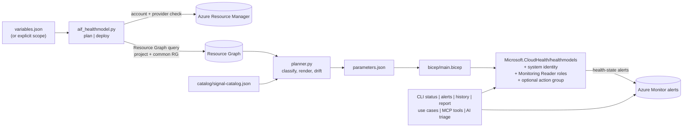
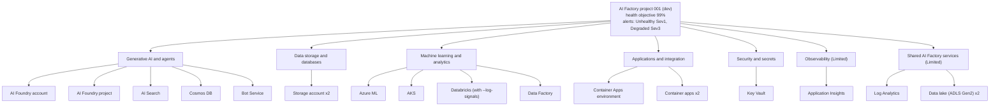

# Azure Monitor health models for the Enterprise Scale AI Factory

Out-of-the-box, state-based health for AI Factory projects and their common services, defined in
Bicep and deployed by an optional ADO or GitHub Actions step. It turns the Azure Monitor metrics,
Resource Health and logs that a factory already produces into one health tree per project
(`healthy` / `degraded` / `unhealthy` / `unknown`), with default health-state alerts and tooling to
read alerts, change them, report external signals and triage with a Foundry model.

Azure Monitor health models are in preview (`Microsoft.CloudHealth`, API `2026-09-01-preview`).
Microsoft's FAQ states that there is *no* out-of-box health model; this folder provides one for the
AI Factory.

| Deliverable | Where |
| --- | --- |
| Health model in Bicep (model, identity, RBAC, root, layers, entities, relationships, alerts, action group) | [`bicep/main.bicep`](bicep/main.bicep), [`bicep/modules`](bicep/modules) |
| Signal catalog: 28 resource profiles, 77 curated signals, 9 layers, `enable*` flag map | [`catalog/signal-catalog.json`](catalog/signal-catalog.json) |
| Planner and deployer (discovery, plan, what-if, deploy, prune, drift report) | [`src/aifactory_healthmodel`](src/aifactory_healthmodel), launcher [`aif_healthmodel.py`](aif_healthmodel.py) |
| Optional pipeline step, Azure DevOps and GitHub Actions | `environment_setup/aifactory/bicep/copy_to_local_settings/.../infra-project-healthmodel.yaml` and `.yml` |
| Runtime client and CLI: status, alerts, history, reports, annotations, set alerts | [`client.py`](src/aifactory_healthmodel/client.py), [`cli.py`](src/aifactory_healthmodel/cli.py) |
| Read-only MCP-ready tools | [`tools.py`](src/aifactory_healthmodel/tools.py) |
| Use case examples (read health, alerts, external signals, AI triage, MCP) | [`usecase_code`](usecase_code) |
| Tests (TDD): 389 tests, 385 offline + 4 opt-in live | [`tests`](tests) |

## Contents

1. [Baseline and gap assessment](#1-baseline-and-gap-assessment)
2. [Architecture and design decisions](#2-architecture-and-design-decisions)
3. [Model structure](#3-model-structure)
4. [Signal catalog](#4-signal-catalog)
5. [Quick start](#5-quick-start)
6. [Optional pipeline step (ADO and GitHub Actions)](#6-optional-pipeline-step-ado-and-github-actions)
7. [Alerts: defaults, reading and setting](#7-alerts-defaults-reading-and-setting)
8. [Tuning with overrides](#8-tuning-with-overrides)
9. [Operating a model](#9-operating-a-model)
10. [Use case examples](#10-use-case-examples)
11. [MCP-ready tools](#11-mcp-ready-tools)
12. [Tests and test-driven design](#12-tests-and-test-driven-design)
13. [Validation in the test environment](#13-validation-in-the-test-environment)
14. [Limitations and follow-ups](#14-limitations-and-follow-ups)

---

## 1. Baseline and gap assessment

Assessed on 3 October 2026 against the working trees of the purple accelerator, the Python API
(Tkinter), the MAUI wizard with its shared domain/base layers, the AI Factory CLI, and a live
test factory.

### What existed

| Area | Confirmed baseline | Gap closed here |
| --- | --- | --- |
| `healthmodel/` | Empty `readme.md` | Complete solution in this folder |
| Purple Bicep (`esml-genai-1`, `esml-common`, modules) | No health model and no workload alert rules; the only action group is in the FinOps automation sample | `bicep/main.bicep` with default health-state alerts |
| Python API / Tkinter, MAUI, DomainLayer, CLI | No `CloudHealth` or health-model references | Not changed; integration points listed in [section 14](#14-limitations-and-follow-ups) |
| Project and common pipelines | No health model step | Optional standalone pipelines for ADO and GitHub Actions |
| `scripts/enable-resource-providers.ps1` | `Microsoft.CloudHealth` missing | Added |
| Test subscription | `Microsoft.CloudHealth` was `NotRegistered` | Registered during validation |

### Confirmed current constraints (verified live, not historical)

These were proven against Azure while building and are encoded in the catalog and tests:

| Finding | Evidence | Handling |
| --- | --- | --- |
| Health models exist in 14 regions only; the accelerator default `eastus2` is not one of them | `az provider show -n Microsoft.CloudHealth` | Same-geography fallback (`eastus2` -> `centralus`, `denmarkeast` -> `swedencentral`, ...) or `--health-model-location` |
| Azure Resource Health is **not supported** (HTTP 422) for container registries, Container Apps environments/apps/jobs, Databricks and Azure ML workspaces | Signal status errors on the deployed model | Resource Health disabled for these profiles; container registries and Container Apps jobs listed as *not monitorable* with the reason |
| Databricks workspaces emit **no** platform metrics | `az monitor metrics list-definitions` returned 0 metrics | Opt-in Log Analytics signal (`--log-signals`) on `DatabricksJobs` |
| `DatabricksJobs` exists in the workspace schema even without diagnostic settings, so a naive count query reports a *false Healthy* zero | Live signal was Healthy with no logs | Query returns no row (Unknown) unless Databricks logs arrived in the last day |
| A new Monitoring Reader assignment for the model identity takes long and propagates unevenly (errors dropped from 37 to 5 over ~45 minutes, some flapping) | Signal status errors over time | `status` reports signal errors with a hint; the pipeline prints status after deploy |
| Storage `ResponseType` includes frequent benign `ClientOtherError` (404/409) | Live dimension values | Storage failure signal counts throttling types only |
| Bicep 0.44 has no type definitions for `2026-09-01-preview` (needed for signal aggregation groups) | `bicep build` BCP081 | Targeted `#disable-next-line BCP081`; schema covered by tests and live deployment |

The test factory itself showed one real problem while validating: AKS `aks001-sdc-dev` reported
Resource Health **Degraded** ("connection issue between agent nodes and apiserver"). The model and its
default alert caught it within minutes; it is a platform condition, not a defect of this work.

Not treated as defects: the `mcp/` package and `usecase_code/40-agent-factory` were being changed by
separate in-flight work during this session and were left untouched. Two existing repository tests
(`test_parameter_documentation::test_checked_in_page_is_current`,
`test_pipeline_feature_contracts::test_github_project_only_orchestrator_passes_exact_target_and_phases`)
fail with and without the files added here; they predate this work.

---

## 2. Architecture and design decisions



Design decisions:

- **One catalog, many consumers.** `catalog/signal-catalog.json` holds layers, classification rules,
  signals, thresholds and the `enable*` flag map. The planner renders entities from it, the tests
  validate it against live metric definitions, and hand-written Bicep parameter files can load it
  with `loadJsonContent` ([`bicep/examples/minimal.bicepparam`](bicep/examples/minimal.bicepparam)).
- **Model what exists, check what is enabled.** Resources are discovered with Resource Graph in the
  project and common resource groups, so the model contains exactly what the factory deployed. The
  `enable*` flags from `variables.json` are compared with discovery and reported as drift
  (`monitored`, `missing`, `present-but-disabled`). This avoids re-implementing the accelerator's
  naming salts and works for factories created by Tkinter, MAUI, the CLI or pipelines.
- **Layers and propagation.** The root (the project) depends on layers; layers aggregate resources
  with `WorstOf`. Observability, shared common services and virtual machines use **Limited** impact:
  they can degrade the workload but never make it unhealthy.
- **Low-noise signals.** Foundry availability uses the `BestOf` minimum-traffic gate from the Foundry
  reference model: below 20 requests per 5 minutes a few failures cannot alert. Error counts use 15
  minute windows; latency thresholds are generous; unknown (no data) never counts as a failure.
- **Explicit entities, not discovery rules.** Health model discovery rules add recommended signals
  with generic thresholds and create duplicate entities when combined with designed ones. Explicit
  entities give curated thresholds, stable names and testable output.
- **Idempotent and least privilege.** Incremental deployments; every object is tagged
  `managedBy=aifactory-healthmodel`; `--prune` deletes only tagged objects that left the plan. The
  model identity gets **Monitoring Reader** only (the template test forbids Contributor/Owner).
- **Fail-closed tooling.** The signed-in tenant and subscription must match the configuration;
  `plan` performs no writes; Azure CLI is called with a fixed set of commands and never through a
  batch shell on Windows (URLs contain `&`); raw CLI output is never echoed, only ARM error codes and
  messages.

---

## 3. Model structure

Project model (`hm-{prefix}prj{NNN}-{loc}-{env}{suffix}`, deployed to the project resource group), as
rendered for the test factory:



Common model (`hm-{prefix}cmn-{loc}-{env}{suffix}`, deployed to the common resource group): data
lakes, Key Vaults, Log Analytics, admin and build-agent VMs (Limited), and a **projects** layer that
nests every project model of the same factory, scale set and environment. A nested model contributes
its root state, so the common model gives a factory-wide view while each project keeps its own model.

Every layer alerts on Unhealthy (Sev2). Each layer entity, resource entity and relationship has a
deterministic name, so re-deployments update in place.

---

## 4. Signal catalog

All metric names, aggregations, time grains and dimensions were checked against metric definitions
captured from the live test factory (and the Microsoft Learn reference for types not deployed there),
stored in [`tests/fixtures/metric-definitions.json`](tests/fixtures/metric-definitions.json).
Every `enable*` flag in `variables.yaml` is either mapped to a profile or explained in
`nonResourceFlags`; all flags that default to `true` are modelled.

| Profile | Azure resource | Layer | Enable flags | Signals: metric (aggregation, window) degraded / unhealthy | Resource Health |
| --- | --- | --- | --- | --- | --- |
| `foundry` | `microsoft.cognitiveservices/accounts` kind AIServices | Generative AI and agents | `enableAIFoundry`, `enableAIServices` | `model-availability`: ModelAvailabilityRate (Average, PT5M) <=99 / <=95<br>`model-traffic-gate`: ModelRequests (Total, PT5M) - / >=20<br>`throttled-calls`: BlockedCalls (Total, PT15M) >10 / >100<br>`server-errors`: ServerErrors (Total, PT15M) >5 / >50<br>`provisioned-utilization`: ProvisionedUtilization (Maximum, PT5M) >=90 / >=100<br>BestOf gate: availability counts only with >= 20 requests / 5 min | Enabled |
| `openai` | `microsoft.cognitiveservices/accounts` kind OpenAI | Generative AI and agents | `enableAzureOpenAI` | `model-availability`: ModelAvailabilityRate (Average, PT5M) <=99 / <=95<br>`model-traffic-gate`: ModelRequests (Total, PT5M) - / >=20<br>`throttled-calls`: BlockedCalls (Total, PT15M) >10 / >100<br>`server-errors`: ServerErrors (Total, PT15M) >5 / >50<br>`provisioned-utilization`: ProvisionedUtilization (Maximum, PT5M) >=90 / >=100<br>BestOf gate: availability counts only with >= 20 requests / 5 min | Enabled |
| `ai-service` | `microsoft.cognitiveservices/accounts` (AI service kinds) | Generative AI and agents | `enableAzureAIVision`, `enableAzureSpeech`, `enableAIDocIntelligence`, `enableContentSafety` | `server-errors`: ServerErrors (Total, PT15M) >5 / >50<br>`throttled-calls`: BlockedCalls (Total, PT15M) >10 / >100<br>`latency`: Latency (Average, PT15M) >5000 / >15000 | Enabled |
| `foundry-project` | `microsoft.cognitiveservices/accounts/projects` | Generative AI and agents | `enableAFoundryCaphost`, `enableAIFactoryCreatedDefaultProjectForAIFv2` | `agent-response-failures`: AgentResponses [filter] (Total, PT15M) >3 / >20<br>`thread-store-throttling`: CosmosDbThrottledRequests (Total, PT15M) >0 / >25 | Disabled |
| `search` | `microsoft.search/searchservices` | Generative AI and agents | `enableAISearch` | `throttled-queries`: ThrottledSearchQueriesPercentage (Average, PT5M) >10 / >25<br>`search-latency`: SearchLatency (Average, PT5M) >2 / >5 | Enabled |
| `cosmos` | `microsoft.documentdb/databaseaccounts` | Generative AI and agents | `enableCosmosDB` | `service-availability`: ServiceAvailability (Average, PT1H) <99 / <95<br>`throttled-requests`: ThrottledRequestPercentage (Average, PT5M) >1 / >10<br>`server-side-latency`: ServerSideLatency (Average, PT5M) >100 / >500 | Enabled |
| `bot` | `microsoft.botservice/botservices` | Generative AI and agents | `enableBotService` | `server-errors`: RequestsTraffic [filter] (Total, PT15M) >5 / >50 | Disabled |
| `bing` | `microsoft.bing/accounts` | Generative AI and agents | `enableBing`, `enableBingCustomSearch` | `server-errors`: ServerErrors (Total, PT15M) >5 / >50<br>`latency`: Latency (Average, PT15M) >5000 / >15000 | Disabled |
| `storage` | `microsoft.storage/storageaccounts` without HNS | Data storage and databases | always | `availability`: Availability (Average, PT5M) <99 / <95<br>`e2e-latency`: SuccessE2ELatency (Average, PT5M) >1000 / >5000<br>`throttled-transactions`: Transactions [filter] (Total, PT15M) >10 / >100 | Enabled |
| `adls-gen2` | `microsoft.storage/storageaccounts` with HNS | Data storage and databases | always | `availability`: Availability (Average, PT5M) <99 / <95<br>`e2e-latency`: SuccessE2ELatency (Average, PT5M) >1000 / >5000<br>`throttled-transactions`: Transactions [filter] (Total, PT15M) >10 / >100 | Enabled |
| `postgres-flexible` | `microsoft.dbforpostgresql/flexibleservers` | Data storage and databases | `enablePostgreSQL` | `database-alive`: is_db_alive (Minimum, PT5M) - / <1<br>`cpu`: cpu_percent (Average, PT15M) >80 / >95<br>`memory`: memory_percent (Average, PT15M) >85 / >95<br>`storage`: storage_percent (Maximum, PT15M) >80 / >90<br>`failed-connections`: connections_failed (Total, PT15M) >10 / >50 | Enabled |
| `redis` | `microsoft.cache/redis` | Data storage and databases | `enableRedisCache` | `server-load`: serverLoad (Maximum, PT5M) >70 / >90<br>`used-memory`: usedmemorypercentage (Maximum, PT5M) >80 / >95 | Enabled |
| `sql-database` | `microsoft.sql/servers/databases` | Data storage and databases | `enableSQLDatabase` | `availability`: availability (Average, PT5M) <99 / <95<br>`cpu`: cpu_percent (Average, PT15M) >80 / >95<br>`storage`: storage_percent (Maximum, PT15M) >80 / >90<br>`failed-connections`: connection_failed (Total, PT15M) >10 / >50 | Enabled |
| `keyvault` | `microsoft.keyvault/vaults` | Security and secrets | always | `availability`: Availability (Average, PT5M) <99 / <95<br>`saturation`: SaturationShoebox (Average, PT5M) >75 / >90<br>`api-latency`: ServiceApiLatency (Average, PT5M) >1000 / >5000 | Enabled |
| `aml` | `microsoft.machinelearningservices/workspaces` | Machine learning and analytics | `enableAzureMachineLearning`, `enableAIFoundryHub` | `failed-runs`: Failed Runs (Total, PT1H) >2 / >10<br>`model-deploy-failures`: Model Deploy Failed (Total, PT1H) >0 / >3<br>`unusable-nodes`: Unusable Nodes (Maximum, PT15M) >0 / >2<br>`quota-utilization`: Quota Utilization Percentage (Maximum, PT15M) >85 / >95 | Disabled |
| `aks` | `microsoft.containerservice/managedclusters` | Machine learning and analytics | `enableAKS`, `enableAksForAzureML` | `node-cpu`: node_cpu_usage_percentage (Average, PT5M) >80 / >95<br>`node-memory`: node_memory_working_set_percentage (Average, PT5M) >80 / >95<br>`node-disk`: node_disk_usage_percentage (Maximum, PT15M) >80 / >90<br>`unschedulable-pods`: cluster_autoscaler_unschedulable_pods_count (Average, PT15M) >0 / >5 | Enabled |
| `databricks` | `microsoft.databricks/workspaces` | Machine learning and analytics | `enableDatabricks` | `failed-job-runs`: KQL FailedRuns (query, PT1H) >0 / >5 | Disabled |
| `datafactory` | `microsoft.datafactory/factories` | Machine learning and analytics | `enableDatafactory`, `enableDatafactoryCommon` | `pipeline-failures`: PipelineFailedRuns (Total, PT1H) >0 / >5<br>`trigger-failures`: TriggerFailedRuns (Total, PT1H) >0 / >5 | Enabled |
| `containerapps-env` | `microsoft.app/managedenvironments` | Applications and integration | `enableContainerApps` | `cores-quota`: EnvCoresQuotaUtilization (Maximum, PT5M) >80 / >95 | Disabled |
| `containerapp` | `microsoft.app/containerapps` | Applications and integration | `enableContainerApps`, `enableAzureMcpServer` | `server-errors`: Requests [filter] (Total, PT15M) >5 / >50<br>`cpu`: CpuPercentage (Average, PT5M) >80 / >95<br>`memory`: MemoryPercentage (Average, PT5M) >80 / >95<br>`response-time`: ResponseTime (Average, PT15M) >10000 / >30000 | Disabled |
| `webapp` | `microsoft.web/sites` | Applications and integration | `enableWebApp`, `enableFunction` | `http-5xx`: Http5xx (Total, PT15M) >5 / >50<br>`health-check`: HealthCheckStatus (Average, PT5M) <100 / <50<br>`response-time`: HttpResponseTime (Average, PT15M) >5 / >15 | Enabled |
| `logicapp` | `microsoft.logic/workflows` | Applications and integration | `enableLogicApps` | `runs-failed`: RunsFailed (Total, PT1H) >0 / >5<br>`triggers-failed`: TriggersFailed (Total, PT1H) >0 / >5 | Enabled |
| `eventhub` | `microsoft.eventhub/namespaces` | Applications and integration | `enableEventHubs` | `server-errors`: ServerErrors (Total, PT15M) >5 / >50<br>`throttled-requests`: ThrottledRequests (Total, PT15M) >10 / >100 | Enabled |
| `apim` | `microsoft.apimanagement/service` | Applications and integration | `ENABLE_APIM` | `capacity`: Capacity (Average, PT5M) >75 / >90<br>`gateway-5xx`: Requests [filter] (Total, PT15M) >10 / >100 | Enabled |
| `appinsights` | `microsoft.insights/components` | Observability | `enableApplicationInsights` | `failed-requests`: requests/failed (Count, PT15M) >10 / >100<br>`server-exceptions`: exceptions/server (Count, PT15M) >25 / >250<br>`failed-dependencies`: dependencies/failed (Count, PT15M) >25 / >250 | Disabled |
| `loganalytics` | `microsoft.operationalinsights/workspaces` | Observability | always | `query-availability`: AvailabilityRate_Query (Average, PT15M) <99 / <95<br>`ingestion-latency`: Ingestion Time (Average, PT15M) >300 / >900 | Enabled |
| `vm` | `microsoft.compute/virtualmachines` | Virtual machines | `enableAdminVM` | `vm-availability`: VmAvailabilityMetric (Minimum, PT5M) - / <1<br>`cpu`: Percentage CPU (Average, PT15M) >85 / >95<br>`available-memory`: Available Memory Percentage (Average, PT15M) <15 / <5<br>`os-disk-iops`: OS Disk IOPS Consumed Percentage (Average, PT15M) >90 / >98 | Disabled |
| `health-model` | `microsoft.cloudhealth/healthmodels` | AI Factory projects | always | root state of the nested project model | Disabled |

Not modelled, with reason (`notMonitorable` in the catalog): container registries (no Resource
Health, no documented failure dimension) and Container Apps jobs (no Resource Health, execution state
values not yet verified). Plumbing such as private endpoints, NICs, DNS zones, NSGs, disks, identities
and dashboards is listed in `excludedTypes`. Any other unknown type is reported by `plan` as
`unmodelled` instead of being silently dropped.

---

## 5. Quick start

Prerequisites: Python 3.10+, Azure CLI with Bicep, and an identity that can read the project and
common resource groups, deploy to the target resource group and create role assignments
(`Microsoft.Authorization/roleAssignments/write`). Registering the provider needs `*/register/action`.

```powershell
cd azure-enterprise-scale-ml/healthmodel

# Read-only plan from the persistent factory configuration (project + common models)
python aif_healthmodel.py plan --consumer-root ..\.. --variables-json aifactory/variables.json `
  --environment dev --project 001 --scope all --what-if

# Deploy (registers Microsoft.CloudHealth once if needed) and e-mail health alerts
python aif_healthmodel.py deploy --consumer-root ..\.. --variables-json aifactory/variables.json `
  --environment dev --project 001 --scope all --register-provider --alert-email ops@contoso.com

# Current health
python aif_healthmodel.py status --consumer-root ..\.. --variables-json aifactory/variables.json `
  --environment dev --project 001
```

Without a `variables.json`, pass the scope explicitly:

```powershell
python aif_healthmodel.py plan --tenant-id <tenant> --subscription <subscription> --environment dev --project 001 `
  --location swedencentral --location-suffix sdc --resource-group-prefix spider- --resource-group-suffix -001 `
  --project-resource-group spider-esml-project001-sdc-dev-001-rg --common-resource-group spider-esml-common-sdc-dev-001
```

Useful options: `--scope project|common|all`, `--log-signals` (Databricks), `--overrides file.json`,
`--alert-policy file.json`, `--action-group-id <id>` (repeat), `--health-objective 98` (integer
percent), `--no-reader-roles`, `--prune`, `--health-model-location westeurope`.

Plain Bicep works too: `az deployment group create -g <project-rg> -f bicep/main.bicep -p bicep/examples/minimal.bicepparam`.
[`bicep/examples/project001-dev.parameters.json`](bicep/examples/project001-dev.parameters.json) is the
full rendered model for the (anonymized) test factory; regenerate it with
`python bicep/examples/render_example.py`.

---

## 6. Optional pipeline step (ADO and GitHub Actions)

Both pipelines run `aif_healthmodel.py` from the purple submodule, default to read-only **plan** and
support `scope` (`project`, `common`, `all`), `mode` (`plan`, `deploy`), `registerProvider`, `prune`
and `alertEmails`. Deploy is idempotent, so run the step after every project deployment.

| | Azure DevOps | GitHub Actions |
| --- | --- | --- |
| File | `copy_to_local_settings/azure-devops/esml-yaml-pipelines/esml-infra-project/infra-project-healthmodel.yaml` (copied by the bootstrap with the folder) | `copy_to_local_settings/github-actions/infra-project-healthmodel.yml` (copy to `.github/workflows/`) |
| Identity | Existing per-environment service connection from `variables.yaml` | Existing environment OIDC identity (`AZURE_CLIENT_ID`, `TENANT_ID`, `vars.AZURE_SUBSCRIPTION_ID`) |
| Run after the project | Uncomment the `resources.pipelines` trigger on `infra-project-genai` | Call it from `infra-project.yml` (`workflow_call`) |
| Runner | Microsoft-hosted (`windows-2022`) or self-hosted pool; all calls are ARM, so no private network is needed | `ubuntu-latest` or self-hosted |

GitHub Actions chaining in `infra-project.yml`:

```yaml
  health_model:
    needs: deploy_foundry
    if: ${{ needs.deploy_foundry.result == 'success' }}
    uses: ./.github/workflows/infra-project-healthmodel.yml
    with:
      environment: ${{ inputs.environment }}
      project_number: '001'
      mode: deploy
      scope: all
    secrets: inherit
```

Why a separate step and not a job inside `infra-project-genai.yaml` / `infra-project.yml`: those
pipelines are governed by the reviewed-deployment contract (exactly nine ADO jobs, protected
configuration clean-up as the last step, GitHub bootstrap copying three named workflows) with tests
that pin it. A chained, optional pipeline adds the capability without changing that contract.

---

## 7. Alerts: defaults, reading and setting

Health model alerts fire when an *entity changes state*, not per signal, and resolve automatically
when it recovers. They are normal Azure Monitor alerts (`monitorService: Health Model`) and use action
groups.

| Entity | Unhealthy | Degraded |
| --- | --- | --- |
| Root (the project or the common services) | **Sev1** | **Sev3** |
| Each layer | **Sev2** | off |
| Each resource | off | off |

Without an action group the alerts are visible in Azure Monitor and in the model but nobody is
notified. Ways to change alerts:

- **Per deployment:** `--alert-email` (creates `ag-<model>` with e-mail receivers), `--action-group-id`
  (up to five in total), `--alert-policy policy.json` with any of `rootUnhealthySeverity`,
  `rootDegradedSeverity`, `layerUnhealthySeverity`, `layerDegradedSeverity`,
  `resourceUnhealthySeverity`, `resourceDegradedSeverity` (empty string disables). The same keys are
  the `alertPolicy` parameter of `bicep/main.bicep`.
- **At runtime for one entity** (read-modify-write that keeps the entity's signals):

  ```powershell
  python aif_healthmodel.py set-alert --model-id <id> --entity layer-genai --unhealthy Sev1 --degraded Sev3 `
    --action-group-id /subscriptions/<sub>/resourceGroups/<rg>/providers/microsoft.insights/actionGroups/<ag>
  python aif_healthmodel.py set-alert --model-id <id> --entity layer-genai --degraded off
  ```

Reading and handling alerts:

```powershell
python aif_healthmodel.py alerts --model-id <id> --hours 168            # 1, 24, 168 or 720
python aif_healthmodel.py alert-state --model-id <id> --alert-id <alert-id> --state Acknowledged --comment "Investigating"
```

Each alert carries `context.entityName`, `context.entityDisplayName` and `context.linkToHealthTimeline`;
the alert ID is scoped to the model (`<model-id>/providers/Microsoft.AlertsManagement/alerts/<guid>`).
Across a subscription, Resource Graph finds them with:

```kusto
alertsmanagementresources
| where properties.essentials.monitorService == "Health Model"
| project name, severity = tostring(properties.essentials.severity),
          state = tostring(properties.essentials.alertState),
          condition = tostring(properties.essentials.monitorCondition),
          entity = tostring(properties.context.entityName), model = tostring(properties.essentials.targetResourceName)
```

Health-model alerts complement, not replace, existing resource alert rules. Validate the model first
(alerts without action groups), then add action groups and retire overlapping resource alerts.

---

## 8. Tuning with overrides

`--overrides overrides.json` changes the catalog for one deployment; invalid keys, unknown signals and
inverted thresholds fail before any Azure call.

```json
{
  "signals": {
    "foundry/throttled-calls": { "degradedThreshold": 50, "unhealthyThreshold": 500 },
    "storage/e2e-latency": { "enabled": false },
    "aks/node-cpu": { "timeGrain": "PT15M", "refreshInterval": "PT15M" },
    "cosmos/server-side-latency": { "degradedThreshold": null }
  },
  "profiles": {
    "vm": { "impact": "Suppressed" },
    "databricks": { "enabled": false },
    "appinsights": { "resourceHealth": "Enabled" }
  }
}
```

Members of an aggregation group (the Foundry availability gate) cannot be disabled individually;
disable the profile instead. To change defaults for everyone, edit the catalog: the tests then check
the new metric, aggregation, grain, dimensions and threshold order against the captured definitions.

---

## 9. Operating a model

```powershell
python aif_healthmodel.py status  --model-id <id>                        # tree, problems, unknowns, signal errors
python aif_healthmodel.py status  --model-id <id> --fail-on Unhealthy    # exit 3: gate a release on health
python aif_healthmodel.py history --model-id <id> --entity root --hours 24
python aif_healthmodel.py history --model-id <id> --entity <entity> --signal model-availability
python aif_healthmodel.py report  --model-id <id> --entity layer-apps --signal smoke-test --state Unhealthy --expires 15
python aif_healthmodel.py annotate --model-id <id> --detail event=release --detail version=2026.10.1
```

Instead of `--model-id`, pass `--subscription --resource-group --name`, or the factory configuration
(`--variables-json --environment --project [--scope common]`). `--auth identity` uses
`azure-identity` (managed identity in Container Apps, Functions or AKS) instead of the Azure CLI.
Every deploy also annotates the root timeline (`event=aifactory-healthmodel-deployment`).

---

## 10. Use case examples

| Script | Shows |
| --- | --- |
| [`01_read_health.py`](usecase_code/01_read_health.py) | Workload and layer state, drill-down to failing signals, transitions, signal history, annotations |
| [`02_alerts.py`](usecase_code/02_alerts.py) | List alerts, acknowledge or close, configure alerts on an entity (`--apply` to change) |
| [`03_external_signals.py`](usecase_code/03_external_signals.py) | Synthetic HTTP probe reported as an expiring external signal; release annotations |
| [`04_ai_triage.py`](usecase_code/04_ai_triage.py) | Triage note from a Foundry deployment (validated with `gpt-6.1-sol` over the private endpoint) built only from health data; advisory, changes nothing |
| [`05_mcp_tools.py`](usecase_code/05_mcp_tools.py) | `tools/list` and `tools/call` the way an MCP server uses [`tools.py`](src/aifactory_healthmodel/tools.py) |

All scripts accept `--model-id` or `--subscription --resource-group --name`, and `--auth cli|identity`.
Write actions in the examples require an explicit `--apply`.

---

## 11. MCP-ready tools

[`tools.py`](src/aifactory_healthmodel/tools.py) defines four **read-only** tools in the Model Context
Protocol shape (`name`, `title`, `description`, `inputSchema`, `annotations.readOnlyHint`):
`healthmodel_summary`, `healthmodel_alerts`, `healthmodel_entity_history`, `healthmodel_signal_history`.
`call_tool(client_factory, name, arguments)` validates arguments (resource ID pattern, enums, ranges,
no extra properties) and dispatches to a `HealthModelClient` created by the host, so the host keeps
authentication and authorization. Writes (alert changes, health reports) are deliberately not tools.

Registering them in an MCP server is a few lines:

```python
from aifactory_healthmodel.tools import TOOLS, call_tool
# list_tools -> TOOLS; call_tool(name, args) -> call_tool(make_client_for_caller, name, args)
```

The AI Factory MCP package (`../mcp`) was not modified; adding these tools there is a follow-up.

---

## 12. Tests and test-driven design

```powershell
cd azure-enterprise-scale-ml/healthmodel
python -m pytest            # 385 passed, 4 skipped (live)
```

Every unit was written test-first; each bug found in Azure became a failing test before the fix.

| File | Tests | Proves |
| --- | --- | --- |
| `test_catalog.py` | 248 | Every signal is API-shaped and names a real metric, aggregation, grain and dimension; thresholds ordered; every `enable*` flag modelled or explained; requested services covered; Resource Health off where Azure returns 422 |
| `test_naming.py` | 25 | Resource group and model names; parity with the accelerator's dashboard naming code; region fallback; fail-closed placeholders |
| `test_planner.py` | 27 | Classification of the anonymized test factory, layers, tree shape, positions, overrides, drift report, nested models, Log Analytics signals |
| `test_bicep.py` | 8 | Template compiles cleanly; API version equals the catalog; planner/template parameter contract; alert defaults; Monitoring Reader only; example files current |
| `test_deploy.py` | 19 | Plan never writes; account mismatch stops before Azure reads; provider registration gate; one Incremental deployment per model; prune; what-if; Windows launcher never uses a batch shell |
| `test_client.py` | 23 | Paging, summary (including signal errors and parents failing by their own signals), history, reports, annotations, read-modify-write alert changes, real alert payload shape |
| `test_cli.py` | 15 | CLI commands and exit codes; MCP tool schemas and validation |
| `test_pipelines.py` | 7 | Pipelines are manual, plan by default, gate deploy-only switches, follow repository conventions, offer identical choices |
| `test_triage.py` | 10 | Prompt contains only health facts and is bounded; Foundry endpoint allow-list |
| `test_docs.py` | 3 | This readme documents every catalog profile, CLI command and pipeline |
| `test_live.py` | 4 | Opt-in smoke tests against a deployed model (`AIF_HEALTHMODEL_LIVE=1`, `AIF_HEALTHMODEL_ID`; write test needs `AIF_HEALTHMODEL_LIVE_WRITE=1`) |

The catalog tests were mutation-checked: a mistyped metric, an unsupported time grain, inverted
thresholds, an unexplained flag, an unmapped default flag, an unknown dimension and a broken
aggregation group are each caught by the intended test. Repository tests for the folders touched
here (workflow parity, GitHub bootstrap, environment parity, feature contracts, dashboard-only,
wizard parity, parameter documentation) were run; the generated parameter documentation is
byte-identical with and without the new workflow.

---

## 13. Validation in the test environment

Validated on 3 October 2026 in the test factory (Sweden Central): project resource group
`spider-esml-project001-sdc-dev-001-rg`, common resource group `spider-esml-common-sdc-dev-001`.

| Step | Result |
| --- | --- |
| Register `Microsoft.CloudHealth` | Registered |
| `plan --scope all --what-if` | Project: 26 entities and 53 signals (with `--log-signals`); common: 13 entities, 22 signals; nothing unmodelled |
| `deploy --scope all` | `hm-spider-prj001-sdc-dev-001` and `hm-spider-cmn-sdc-dev-001` in about 2.5 minutes, with Monitoring Reader on both resource groups and deployment annotations |
| Real problem detected | AKS Resource Health Degraded -> analytics layer and root Degraded -> **Sev3** root alert fired; the common model rolled it up through the nested project model |
| Alert lifecycle | External Unhealthy report on the GenAI layer -> layer **Sev2** and root **Sev1** fired within two minutes -> acknowledged through the API -> Healthy report -> both auto-resolved |
| `set-alert` | Alert changed and reset; signals, aggregation group and Resource Health setting preserved |
| Catalog corrections from live evidence | Container registry and Container Apps job removed with reasons; Resource Health disabled for Container Apps, Databricks and Azure ML; Databricks Log Analytics signal hardened; `--prune` removed the stale entities and an emptied layer |
| Use cases 1-5 and live tests | Passed; AI triage with `gpt-6.1-sol` over the private endpoint correctly separated the real AKS issue from the RBAC propagation gap |

The two models remain deployed for review. They have no action groups, so nothing notifies anyone.
Remove them with:

```powershell
az resource delete --ids <project-model-id> <common-model-id>
az role assignment list --assignee <model-principal-id> --all -o table   # then delete the two Monitoring Reader assignments
```

---

## 14. Limitations and follow-ups

- **Preview.** The `Microsoft.CloudHealth` API is preview; pin `2026-09-01-preview` (catalog and Bicep
  must stay equal, a test enforces it) and re-run the tests when moving to the stable `2026-11-01` (listed by the
  provider, not yet offered for `healthmodels` in the test subscription).
- **Role propagation.** Expect signal errors for up to an hour after the first deployment; `status`
  shows them. Grant Monitoring Reader ahead of time (`--no-reader-roles` skips the template grants).
- **Coverage gaps.** Container registries and Container Apps jobs are reported but not modelled;
  Databricks needs its `jobs` diagnostic logs in Log Analytics plus `--log-signals`; PostgreSQL, Redis,
  SQL, Event Hubs, App Service, Logic Apps, APIM and Bing were not deployed in the test factory, so
  their signals are verified against the documented metric definitions only.
- **Region.** Fallback regions stay within the same geography; choose `--health-model-location`
  explicitly when data residency requires it.
- **Cost.** Signals reuse metrics and logs Azure Monitor already collects; Log Analytics query signals
  run queries against the workspace. Check current Azure Monitor pricing before production.
- **Integration follow-ups (not done here, by design):** a `healthModel` toggle and settings block in
  the Tkinter/MAUI wizards and the Factory API (matched pink/MAUI release); an `azurefactory
  healthmodel` command in the CLI that calls the same planner; registering the read-only tools in the
  AI Factory MCP server; adding the step to the main project pipelines after the reviewed-deployment
  contract is extended.

---

## File layout

```text
healthmodel/
  aif_healthmodel.py            launcher (pipelines, local use)
  catalog/signal-catalog.json   layers, profiles, signals, flag map, exclusions
  bicep/main.bicep              health model template
  bicep/modules/                reader-role.bicep, action-group.bicep
  bicep/examples/               minimal.bicepparam, project001-dev.parameters.json, render_example.py
  src/aifactory_healthmodel/    catalog, naming, planner, azure, deploy, client, cli, tools, triage
  usecase_code/                 01-05 examples
  tests/                        unit, contract and opt-in live tests; fixtures
```
